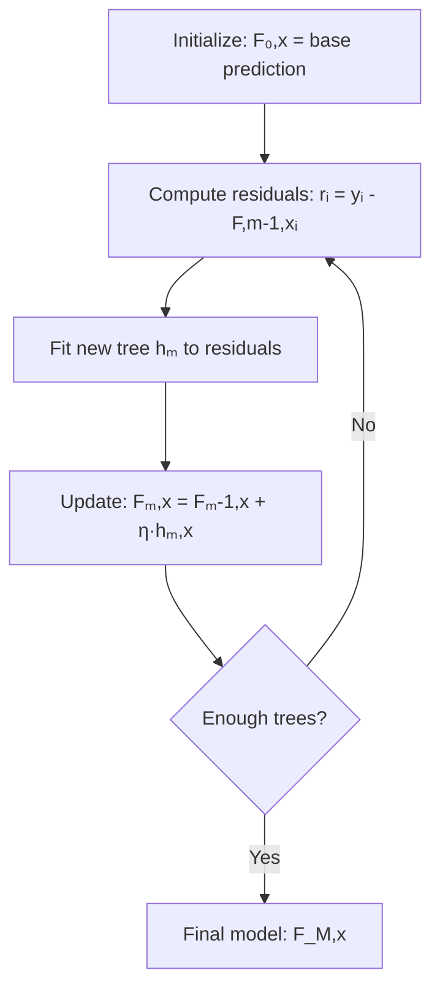
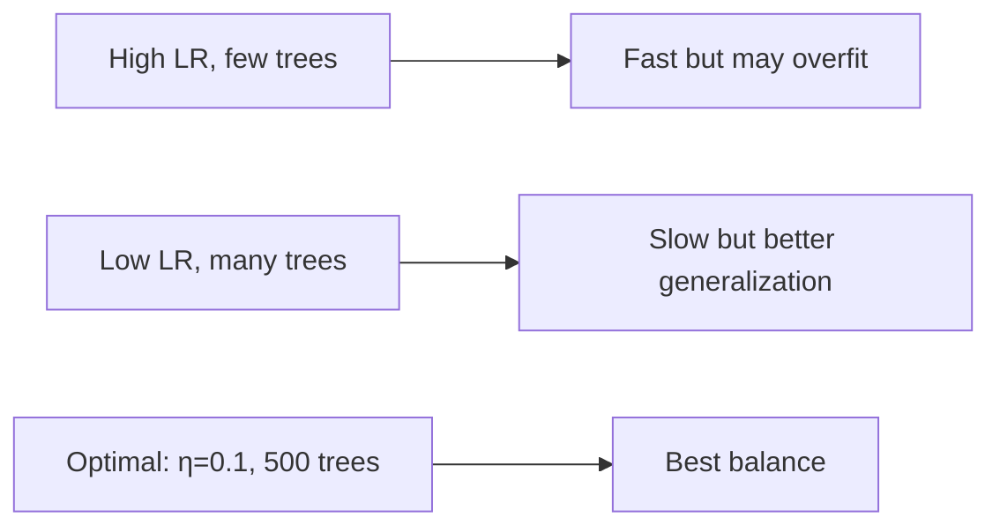

# Gradient Boosting

## Overview

Gradient Boosting is a **sequential ensemble method** that builds models iteratively, with each new model correcting the errors of the previous ensemble. Unlike bagging (parallel, reduces variance), boosting **reduces bias** by focusing on hard-to-predict examples. It is one of the most powerful techniques for tabular data and has won countless Kaggle competitions.

## Core Idea



### The Algorithm

1. Start with an initial prediction (e.g., mean for regression)
2. Compute the **negative gradient** (residuals for MSE)
3. Fit a new tree to these residuals
4. Add the new tree to the ensemble (with learning rate)
5. Repeat

```python
import numpy as np
from sklearn.tree import DecisionTreeRegressor

class GradientBoostingRegressor:
    def __init__(self, n_estimators=100, learning_rate=0.1, max_depth=3):
        self.n_estimators = n_estimators
        self.learning_rate = learning_rate
        self.max_depth = max_depth
        self.trees = []
        self.initial_prediction = None
    
    def fit(self, X, y):
        # Step 1: Initial prediction (mean)
        self.initial_prediction = np.mean(y)
        F = np.full(len(y), self.initial_prediction)
        
        for m in range(self.n_estimators):
            # Step 2: Compute negative gradient (residuals for MSE)
            residuals = y - F
            
            # Step 3: Fit tree to residuals
            tree = DecisionTreeRegressor(max_depth=self.max_depth)
            tree.fit(X, residuals)
            
            # Step 4: Update ensemble
            F += self.learning_rate * tree.predict(X)
            self.trees.append(tree)
    
    def predict(self, X):
        F = np.full(X.shape[0], self.initial_prediction)
        for tree in self.trees:
            F += self.learning_rate * tree.predict(X)
        return F
```

## Mathematical Intuition: Gradient Descent in Function Space

### The Key Insight

Gradient boosting performs **gradient descent in function space**. Instead of optimizing parameters $\theta$, we optimize the model function $F$ directly.

At iteration $m$, we have the current model $F_{m-1}$. We want to find the update $h_m$ that minimizes the loss:

\\[F_m = F_{m-1} + \eta \cdot h_m\\]

The optimal update direction is the **negative gradient** of the loss with respect to $F$:

\\[h_m(x) \approx -\frac{\partial L(y, F(x))}{\partial F(x)}\bigg|_{F=F_{m-1}}\\]

### Gradient Computation for Different Losses

For a general loss $L(y, F(x))$, the negative gradient (pseudo-residual) is:

\\[r_{im} = -\frac{\partial L(y_i, F(x_i))}{\partial F(x_i)}\bigg|_{F=F_{m-1}}\\]

| Loss Function | $L(y, F)$ | Negative Gradient $r_{im}$ | Interpretation |
|--------------|-----------|---------------------------|----------------|
| MSE | $\frac{1}{2}(y - F)^2$ | $y_i - F_{m-1}(x_i)$ | Raw residual |
| MAE | $|y - F|$ | $\text{sign}(y_i - F_{m-1}(x_i))$ | Direction only |
| Huber | See below | Clipped residual | Robust to outliers |
| Log Loss | $-y\log\sigma(F) - (1-y)\log(1-\sigma(F))$ | $y_i - \sigma(F_{m-1}(x_i))$ | Probability residual |
| Quantile | $\rho_\tau(y-F)$ | $\tau \cdot \mathbb{I}(y>F) - (1-\tau)\cdot\mathbb{I}(y\leq F)$ | Asymmetric |

### Detailed Derivation: MSE Loss

For $L = \frac{1}{2}(y - F)^2$:

\\[\frac{\partial L}{\partial F} = -(y - F) = F - y\\]

\\[r_{im} = -\frac{\partial L}{\partial F}\bigg|_{F=F_{m-1}} = y_i - F_{m-1}(x_i)\\]

This is exactly the **residual** — the difference between the true value and the current prediction. So for MSE, "fitting the negative gradient" is the same as "fitting the residuals."

### Detailed Derivation: Log Loss (Classification)

For binary classification with log loss:

\\[L = -y\log(\sigma(F)) - (1-y)\log(1-\sigma(F))\\]

where $\sigma(F) = \frac{1}{1+e^{-F}}$ is the sigmoid function.

\\[\frac{\partial L}{\partial F} = -(y - \sigma(F))\\]

\\[r_{im} = y_i - \sigma(F_{m-1}(x_i))\\]

This is the **probability residual** — the difference between the true label (0 or 1) and the current predicted probability.

### Second-Order Optimization (Newton's Method)

XGBoost uses **second-order** Taylor expansion for better approximations:

\\[L(y, F + h) \approx L(y, F) + g \cdot h + \frac{1}{2}h \cdot H \cdot h\\]

Where:
- $g = \frac{\partial L}{\partial F}$ — first derivative (gradient)
- $H = \frac{\partial^2 L}{\partial F^2}$ — second derivative (Hessian)

The optimal update is:

\\[h^* = -\frac{g}{H}\\]

For MSE: $g = F - y$, $H = 1$, so $h^* = y - F$ (same as first-order).

For log loss: $g = \sigma(F) - y$, $H = \sigma(F)(1-\sigma(F))$, so:

\\[h^* = \frac{y - \sigma(F)}{\sigma(F)(1-\sigma(F))}\\]

This Newton step converges faster than plain gradient descent.

## Learning Rate (Shrinkage)

The learning rate η controls the contribution of each tree:

```python
# Small learning rate → more trees needed → better generalization
# Large learning rate → fewer trees → faster but may overfit

# Typical: η = 0.1, n_estimators = 100-1000
# Trade-off: η × n_estimators ≈ constant for similar performance
```



**Why shrinkage helps**: Each tree makes a small correction, preventing any single tree from dominating. This is analogous to taking small steps in gradient descent — you're less likely to overshoot the optimum.

## Stochastic Gradient Boosting

Add randomness for better generalization:

```python
class StochasticGBM(GradientBoostingRegressor):
    def __init__(self, subsample=0.8, **kwargs):
        super().__init__(**kwargs)
        self.subsample = subsample
    
    def fit(self, X, y):
        self.initial_prediction = np.mean(y)
        F = np.full(len(y), self.initial_prediction)
        
        for m in range(self.n_estimators):
            # Subsample: use only a fraction of data for each tree
            n = len(y)
            sample_size = int(n * self.subsample)
            indices = np.random.choice(n, sample_size, replace=False)
            
            residuals = y - F
            tree = DecisionTreeRegressor(max_depth=self.max_depth)
            tree.fit(X[indices], residuals[indices])
            
            F += self.learning_rate * tree.predict(X)
            self.trees.append(tree)
```

**Benefits**: Reduces variance, speeds up training, acts as regularization

## Regularization in Gradient Boosting

1. **Learning rate (shrinkage)**: Smaller η → more regularization
2. **Tree complexity**: max_depth, min_samples_split, min_samples_leaf
3. **Subsampling**: Use fraction of data per tree
4. **Column subsampling**: Use fraction of features per tree (like Random Forest)
5. **Early stopping**: Stop before overfitting
6. **L1/L2 regularization on leaf weights** (XGBoost)
7. **Minimum child weight**: Minimum sum of Hessian in a leaf (XGBoost)

## Early Stopping

Stop training when validation error stops improving:

```python
from sklearn.ensemble import GradientBoostingRegressor
from sklearn.model_selection import train_test_split

X_train, X_val, y_train, y_val = train_test_split(X, y, test_size=0.2)

gb = GradientBoostingRegressor(
    n_estimators=1000,
    learning_rate=0.1,
    max_depth=3,
    validation_fraction=0.2,
    n_iter_no_change=20,  # Stop if no improvement for 20 rounds
    tol=0.001
)
gb.fit(X_train, y_train)
print(f"Best number of trees: {gb.n_estimators_}")
```

## Gradient Boosting vs Random Forest

| Aspect | Random Forest | Gradient Boosting |
|--------|--------------|-------------------|
| Training | Parallel (independent trees) | Sequential (each tree depends on previous) |
| Variance reduction | Primary goal | Secondary |
| Bias reduction | Minimal | Primary goal |
| Overfitting | Rare | More prone |
| Hyperparameters | Fewer, less sensitive | Many, very sensitive |
| Training speed | Faster (parallel) | Slower (sequential) |
| Default performance | Good | Often better (with tuning) |
| Base learner | Deep trees (low bias) | Shallow trees (high bias, low variance) |
| Aggregation | Averaging (classification: voting) | Additive (sum of predictions) |
| Outlier handling | Robust (averaging) | Sensitive (sequential fitting) |
| Feature importance | Permutation-based | Split-based (gain) |

### When to Use Which?

**Random Forest**:
- Quick baseline
- Limited tuning budget
- Noisy data with outliers
- When parallelization is important

**Gradient Boosting**:
- Maximum predictive performance needed
- Tabular/structured data
- Willing to invest in hyperparameter tuning
- Kaggle competitions

## Feature Importance in Gradient Boosting

```python
# Split-based importance (how much each feature reduces loss)
from sklearn.ensemble import GradientBoostingRegressor

gb = GradientBoostingRegressor(n_estimators=100)
gb.fit(X_train, y_train)

# Feature importance = total reduction in loss across all trees
importance = gb.feature_importances_

# Permutation importance (more reliable)
from sklearn.inspection import permutation_importance
perm_importance = permutation_importance(gb, X_val, y_val, n_repeats=10)
```

## Interview Questions

### Beginner

**Q: What is the difference between bagging and boosting?**

A: 
- **Bagging**: Trains models in parallel on bootstrap samples, averages predictions. Reduces variance.
- **Boosting**: Trains models sequentially, each correcting previous errors. Reduces bias.
- Random Forest = bagging of trees. Gradient Boosting = boosting with gradient descent.

**Q: Why do we need a learning rate in gradient boosting?**

A: The learning rate (shrinkage) scales each tree's contribution. Without it, the first few trees dominate and the model overfits. With a small learning rate (e.g., 0.1), each tree makes a small correction → the ensemble learns slowly but generalizes better. It's a bias-variance tradeoff.

### Intermediate

**Q: How does gradient boosting handle different loss functions?**

A: By computing the negative gradient of the loss w.r.t. the current predictions. For MSE, the gradient is (y - F(x)), so we fit trees to residuals. For log loss, the gradient is (y - σ(F(x))). This is why it's called "gradient" boosting — it's gradient descent in function space.

**Q: Why is XGBoost better than vanilla gradient boosting?**

A: XGBoost adds:
1. **Regularization** (L1/L2 on leaf weights) — prevents overfitting
2. **Column and row subsampling** — adds randomness
3. **Parallel tree construction** (feature-level parallelism) — faster training
4. **Missing value handling** — learns optimal direction for missing values
5. **Second-order optimization** (Newton's method) — faster convergence
6. **Cache-aware access patterns** — hardware optimization
7. **Approximate split finding** (histograms) — scales to large data

**Q: Explain the concept of "gradient descent in function space."**

A: In traditional gradient descent, we update parameters: $\theta \leftarrow \theta - \eta \nabla_\theta L$. In gradient boosting, we update the model function: $F_m \leftarrow F_{m-1} + \eta \cdot h_m$, where $h_m$ is fit to the negative gradient $\nabla_F L$. Each tree is a step in function space, not parameter space. The function space is infinite-dimensional, but we approximate it with a finite set of trees.

### FAANG-Level

**Q: You're training a gradient boosting model and it overfits after 500 trees. What do you do?**

A: Multi-pronged approach:
1. **Reduce learning rate** (e.g., 0.1 → 0.01) and increase n_estimators proportionally
2. **Increase regularization**: max_depth 3→2, min_samples_leaf 1→5
3. **Add subsampling**: subsample=0.8, colsample_bytree=0.8
4. **Early stopping**: Monitor validation loss, stop at best iteration
5. **Reduce model complexity**: Fewer leaves per tree
6. **Feature selection**: Remove noisy features that trees memorize
7. **Data augmentation**: More training data if possible

**Q: How would you explain why gradient boosting often outperforms random forests on tabular data?**

A: Gradient boosting's sequential nature allows it to focus on the hardest examples — the ones the current ensemble gets wrong. This iterative error correction is particularly effective for tabular data where:
1. Features have varying importance (boosting focuses on the right ones)
2. Decision boundaries are axis-aligned (trees handle this naturally)
3. There are complex feature interactions (boosting builds them incrementally)
4. Data has mixed types (trees handle categorical + numerical natively)

Random forests, by contrast, treat all examples equally and reduce variance through averaging — great for stability but less effective at reducing bias.

**Q: Design a production gradient boosting pipeline for a recommendation system.**

A: Architecture:
1. **Feature engineering**: User features, item features, interaction features, temporal features
2. **Training**: LightGBM with Optuna for hyperparameter tuning
3. **Validation**: Time-based split (not random!) — train on past, validate on future
4. **Monitoring**: Track feature distribution drift, prediction distribution drift
5. **Retraining**: Daily/weekly with fresh data
6. **Serving**: ONNX export for fast inference, feature store for real-time features
7. **A/B testing**: Compare against baseline model, track business metrics (CTR, revenue)

## Common Mistakes

1. **Not using early stopping**: Always monitor validation loss
2. **Too high learning rate**: η > 0.3 often leads to overfitting
3. **Too deep trees**: max_depth > 6 usually overfits for boosting
4. **Not subsampling**: Missing out on regularization and speed benefits
5. **Using too few trees**: With small learning rate, you need more trees
6. **Random validation split for time series**: Use temporal splits!
7. **Ignoring feature engineering**: GBMs are only as good as your features

## Summary

| Component | Purpose |
|-----------|---------|
| Sequential training | Each tree corrects previous errors |
| Gradient descent | Optimize any differentiable loss |
| Learning rate | Controls contribution per tree |
| Subsampling | Adds randomness, reduces overfitting |
| Early stopping | Prevents over-training |
| Second-order optimization | Faster convergence (XGBoost) |

## References

1. Friedman, J. H. (2001). Greedy Function Approximation: A Gradient Boosting Machine. *Annals of Statistics*.
2. Friedman, J. H. (2002). Stochastic Gradient Boosting. *Computational Statistics & Data Analysis*.
3. Chen, T., & Guestrin, C. (2016). XGBoost: A Scalable Tree Boosting System. *KDD*.
4. Ke, G., et al. (2017). LightGBM: A Highly Efficient Gradient Boosting Decision Tree. *NeurIPS*.
5. Prokhorenkova, L., et al. (2018). CatBoost: Unbiased Boosting with Categorical Features. *NeurIPS*.
6. Hastie, T., Tibshirani, R., & Friedman, J. (2009). *The Elements of Statistical Learning*. Springer.

## Cross-References

- [Decision Trees](decision-trees.md) — The base learner
- [Random Forest](random-forest.md) — The parallel alternative
- [XGBoost](xgboost.md) — Regularized gradient boosting
- [LightGBM](lightgbm.md) — Faster gradient boosting
- [CatBoost](catboost.md) — Categorical-friendly boosting
- [Feature Engineering](../foundations/feature-engineering.md)
- [Loss Functions](../foundations/loss-functions.md) — Differentiable losses for boosting
