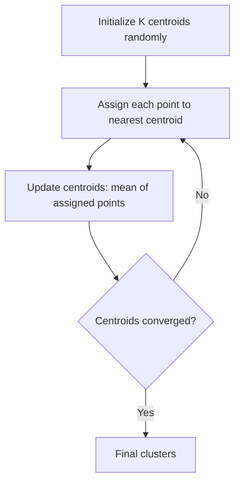
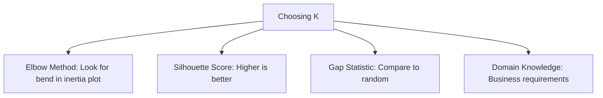
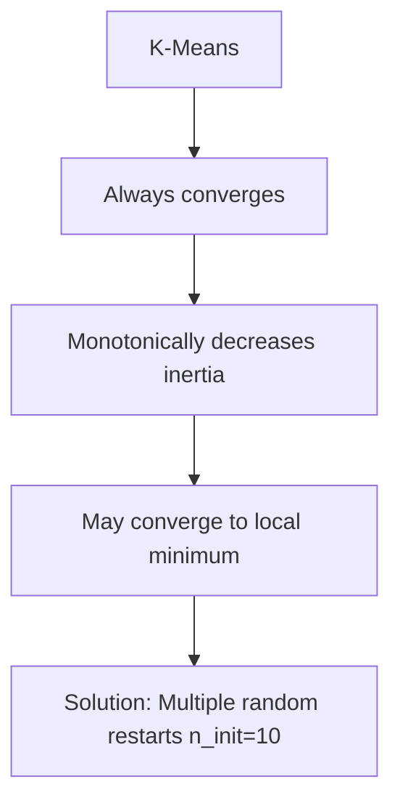

# K-Means Clustering

## Overview

K-Means is the most popular **unsupervised clustering** algorithm. It partitions data into K clusters by iteratively assigning points to the nearest centroid and updating centroids to be the mean of assigned points.

## The Algorithm



```python
import numpy as np

class KMeans:
    def __init__(self, k=3, max_iters=100, tol=1e-4):
        self.k = k
        self.max_iters = max_iters
        self.tol = tol
    
    def fit(self, X):
        n_samples, n_features = X.shape
        
        # Initialize centroids (K-Means++ initialization)
        self.centroids = self._kmeans_pp_init(X)
        
        for _ in range(self.max_iters):
            # Assign clusters
            distances = self._compute_distances(X)
            self.labels = np.argmin(distances, axis=1)
            
            # Update centroids
            new_centroids = np.array([
                X[self.labels == i].mean(axis=0) 
                for i in range(self.k)
            ])
            
            # Check convergence
            if np.all(np.abs(new_centroids - self.centroids) < self.tol):
                break
            
            self.centroids = new_centroids
        
        # Compute inertia (within-cluster sum of squares)
        self.inertia_ = sum(
            np.sum((X[self.labels == i] - self.centroids[i])**2)
            for i in range(self.k)
        )
        return self
    
    def _compute_distances(self, X):
        distances = np.zeros((len(X), self.k))
        for i, centroid in enumerate(self.centroids):
            distances[:, i] = np.sqrt(np.sum((X - centroid)**2, axis=1))
        return distances
    
    def predict(self, X):
        distances = self._compute_distances(X)
        return np.argmin(distances, axis=1)
    
    def _kmeans_pp_init(self, X):
        """K-Means++ initialization"""
        centroids = [X[np.random.randint(len(X))]]
        
        for _ in range(1, self.k):
            distances = np.min([np.sum((X - c)**2, axis=1) for c in centroids], axis=0)
            probs = distances / distances.sum()
            next_centroid = X[np.random.choice(len(X), p=probs)]
            centroids.append(next_centroid)
        
        return np.array(centroids)
```

## K-Means++ Initialization

Random initialization can lead to poor convergence. K-Means++ selects initial centroids that are far apart:

1. Choose first centroid randomly
2. For each subsequent centroid, choose with probability proportional to distance² from nearest existing centroid
3. This gives better starting points → faster convergence, better results

```python
from sklearn.cluster import KMeans

# K-Means++ is the default in sklearn
kmeans = KMeans(n_clusters=3, init='k-means++', n_init=10, random_state=42)
kmeans.fit(X)
```

## Choosing K

### Elbow Method

Plot inertia (within-cluster sum of squares) vs K:

```python
import matplotlib.pyplot as plt

inertias = []
K_range = range(2, 11)

for k in K_range:
    kmeans = KMeans(n_clusters=k, random_state=42)
    kmeans.fit(X)
    inertias.append(kmeans.inertia_)

plt.plot(K_range, inertias, 'bo-')
plt.xlabel('Number of Clusters (K)')
plt.ylabel('Inertia')
plt.title('Elbow Method')
# Look for the "elbow" — where inertia stops decreasing rapidly
```

### Silhouette Score

Measures how similar a point is to its own cluster vs other clusters:

$$s(i) = \frac{b(i) - a(i)}{\max(a(i), b(i))}$$

Where:
- a(i): Average distance to other points in same cluster
- b(i): Average distance to points in nearest other cluster

```python
from sklearn.metrics import silhouette_score

scores = []
for k in range(2, 11):
    kmeans = KMeans(n_clusters=k, random_state=42)
    labels = kmeans.fit_predict(X)
    scores.append(silhouette_score(X, labels))

optimal_k = range(2, 11)[np.argmax(scores)]
print(f"Optimal K: {optimal_k}")
```

### Gap Statistic

Compares within-cluster dispersion to a null reference distribution:

```python
def gap_statistic(X, k_max=10, n_refs=10):
    gaps = []
    for k in range(1, k_max + 1):
        # Actual clustering
        kmeans = KMeans(n_clusters=k, random_state=42)
        kmeans.fit(X)
        wk = kmeans.inertia_
        
        # Reference (uniform random) dispersions
        ref_wks = []
        for _ in range(n_refs):
            X_ref = np.random.uniform(X.min(axis=0), X.max(axis=0), X.shape)
            kmeans_ref = KMeans(n_clusters=k, random_state=42)
            kmeans_ref.fit(X_ref)
            ref_wks.append(kmeans_ref.inertia_)
        
        gap = np.mean(np.log(ref_wks)) - np.log(wk)
        gaps.append(gap)
    
    return gaps
```



## Mini-Batch K-Means

For large datasets, use mini-batch updates:

```python
from sklearn.cluster import MiniBatchKMeans

mbk = MiniBatchKMeans(n_clusters=3, batch_size=1000, random_state=42)
mbk.fit(X)
# Much faster than K-Means for large datasets
```

## K-Means Properties

### Convergence



### Limitations

1. **Assumes spherical clusters**: K-Means uses Euclidean distance → finds round clusters
2. **Sensitive to outliers**: Outliers pull centroids
3. **Fixed K**: Must specify number of clusters
4. **Sensitive to initialization**: K-Means++ helps but doesn't guarantee global optimum
5. **Only works with Euclidean distance**: Not suitable for categorical data

```python
# K-Means fails on non-spherical data
from sklearn.datasets import make_moons

X, y = make_moons(n_samples=300, noise=0.1)
kmeans = KMeans(n_clusters=2)
labels = kmeans.fit_predict(X)
# Poor clustering — K-Means can't handle crescent shapes
```

## Variants

### K-Medoids

Uses actual data points as centers (more robust to outliers):

```python
# K-Medoids: Centers must be actual data points
# More robust to outliers than K-Means
# Slower: O(n²) per iteration
```

### K-Modes

For categorical data:

```python
# Uses Hamming distance instead of Euclidean
# Modes instead of means
# Appropriate for categorical features
```

### Bisecting K-Means

Hierarchical approach:

```python
from sklearn.cluster import BisectingKMeans

bkm = BisectingKMeans(n_clusters=3, random_state=42)
labels = bkm.fit_predict(X)
```

## Interview Questions

### Beginner

**Q: What is the objective function of K-Means?**

A: K-Means minimizes the **within-cluster sum of squares** (WCSS), also called inertia:

$$\min \sum_{k=1}^K \sum_{x \in C_k} ||x - \mu_k||^2$$

Where μ_k is the centroid of cluster C_k. This is equivalent to minimizing the total squared distance from each point to its cluster center.

**Q: Why might K-Means converge to a local minimum?**

A: K-Means alternates between two steps (assignment and update), each of which decreases inertia. However, the initial centroids determine which local minimum is reached. Different initializations can lead to different solutions. Use `n_init=10` (default in sklearn) to run multiple times and keep the best.

### Intermediate

**Q: How does K-Means++ improve over random initialization?**

A: K-Means++ selects initial centroids that are spread out:
1. First centroid: random point
2. Next centroids: chosen with probability ∝ distance² from nearest existing centroid
3. This ensures centroids start in different clusters
4. Results: O(log K) competitive guarantee vs optimal clustering
5. In practice: faster convergence, better final solutions

**Q: When would you use K-Means vs DBSCAN?**

A: 
**K-Means**:
- Known number of clusters
- Spherical, similar-sized clusters
- Need fast, scalable algorithm
- All points must be assigned to a cluster

**DBSCAN**:
- Unknown number of clusters
- Arbitrary-shaped clusters
- Need to identify outliers/noise
- Density-based clusters

### FAANG-Level

**Q: You need to cluster 1 billion user embeddings (128-dim) into 1000 clusters for a recommendation system. How?**

A: 
1. **Mini-Batch K-Means**: Process data in batches of 10K-100K
2. **Dimensionality reduction**: PCA to 32-64 dimensions first
3. **Distributed training**: Use Dask or Spark MLlib for multi-node K-Means
4. **Initialization**: K-Means++ with sampling (compute on 1% sample, then refine)
5. **Approximate nearest neighbors**: For assignment step, use FAISS for fast nearest centroid
6. **Hierarchical approach**: First cluster into 100, then sub-cluster each into 10
7. **Update frequency**: Re-cluster periodically (weekly) as user behavior changes
8. **Evaluation**: Use silhouette score on a sample, plus business metrics (click-through rate)

## Common Mistakes

1. **Not scaling features**: K-Means uses Euclidean distance — scale-sensitive
2. **Using wrong K**: Always validate with elbow method, silhouette, or domain knowledge
3. **Not using K-Means++**: Default in sklearn, but always ensure it's enabled
4. **Assuming K-Means works for all shapes**: It finds spherical clusters only
5. **Not running multiple restarts**: Use n_init=10 or more

## Summary

| Property | Description |
|----------|-------------|
| Objective | Minimize within-cluster sum of squares |
| Algorithm | Alternate assignment and update |
| Complexity | O(n·K·d·iterations) |
| Initialization | K-Means++ (default) |
| Limitations | Spherical clusters, fixed K, sensitive to outliers |

## Cross-References

- [PCA](pca.md) — Dimensionality reduction before clustering
- [Linear Algebra](../foundations/linear-algebra.md) — Distance metrics
- [Feature Engineering](../foundations/feature-engineering.md) — Scaling is critical
- [Evaluation](../foundations/evaluation.md) — Silhouette score
