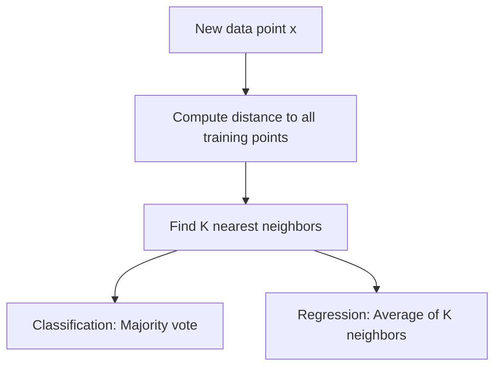
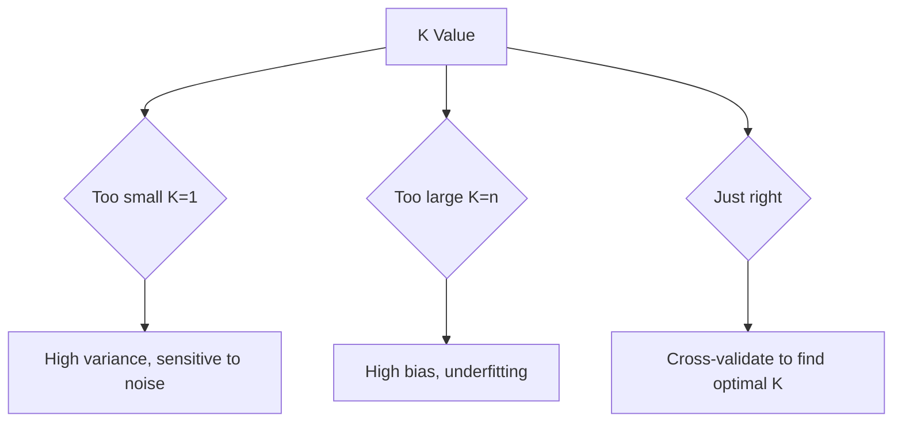
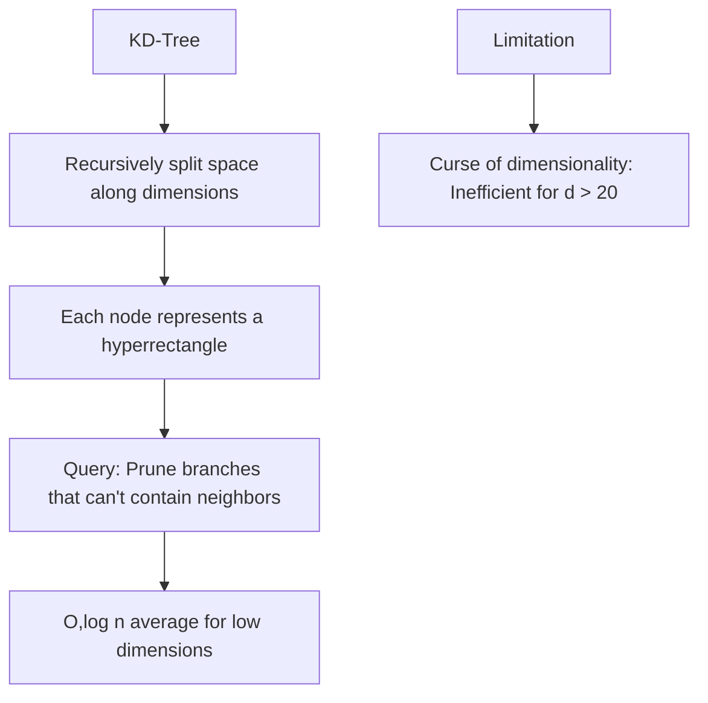

# K-Nearest Neighbors (KNN)

## Overview

KNN is a **non-parametric, instance-based** learning algorithm that classifies new data points based on the majority vote of their K nearest neighbors. It's one of the simplest ML algorithms — there's no training phase, just storing the data.

## How KNN Works



```python
import numpy as np
from collections import Counter

class KNN:
    def __init__(self, k=5, task='classification'):
        self.k = k
        self.task = task
    
    def fit(self, X, y):
        """KNN just stores the training data"""
        self.X_train = X
        self.y_train = y
    
    def predict(self, X):
        return np.array([self._predict_one(x) for x in X])
    
    def _predict_one(self, x):
        # Compute distances to all training points
        distances = np.sqrt(np.sum((self.X_train - x)**2, axis=1))
        
        # Find K nearest neighbors
        k_indices = np.argsort(distances)[:self.k]
        k_labels = self.y_train[k_indices]
        
        if self.task == 'classification':
            # Majority vote
            return Counter(k_labels).most_common(1)[0][0]
        else:
            # Average for regression
            return np.mean(k_labels)
```

## Distance Metrics

### Euclidean Distance (L2)

\\[d(x, y) = \sqrt{\sum_{i=1}^n (x_i - y_i)^2}\\]

```python
def euclidean(x, y):
    return np.sqrt(np.sum((x - y)**2))
```

### Manhattan Distance (L1)

\\[d(x, y) = \sum_{i=1}^n |x_i - y_i|\\]

```python
def manhattan(x, y):
    return np.sum(np.abs(x - y))
```

### Minkowski Distance

\\[d(x, y) = \left(\sum_{i=1}^n |x_i - y_i|^p\right)^{1/p}\\]

- p=1: Manhattan
- p=2: Euclidean
- p→∞: Chebyshev distance

### Cosine Distance

\\[d(x, y) = 1 - \frac{x \cdot y}{||x|| \cdot ||y||}\\]

Best for text/high-dimensional sparse data.

| Distance | Best For | Properties |
|----------|----------|-----------|
| Euclidean | Continuous features | Assumes isotropic |
| Manhattan | Sparse data | More robust to outliers |
| Cosine | Text, high-dim | Direction-based, ignores magnitude |
| Hamming | Categorical | Count of differing features |

## Choosing K



```python
from sklearn.model_selection import cross_val_score
from sklearn.neighbors import KNeighborsClassifier

# Find optimal K
k_values = range(1, 31)
cv_scores = []

for k in k_values:
    knn = KNeighborsClassifier(n_neighbors=k)
    scores = cross_val_score(knn, X_train, y_train, cv=5, scoring='accuracy')
    cv_scores.append(scores.mean())

optimal_k = k_values[np.argmax(cv_scores)]
print(f"Optimal K: {optimal_k}")
```

**Rules of thumb**:
- K = √n (square root of training samples) as starting point
- Use odd K for binary classification (avoid ties)
- Cross-validate to find the best K

## Efficient Search: KD-Tree and Ball Tree

Naive KNN is O(n·d) per prediction. Data structures can speed this up:

### KD-Tree

```python
from sklearn.neighbors import KDTree

# Build KD-tree
tree = KDTree(X_train, leaf_size=40)

# Query K nearest neighbors
distances, indices = tree.query(X_test, k=5)
```



### Ball Tree

```python
from sklearn.neighbors import BallTree

# Better for higher dimensions
tree = BallTree(X_train, leaf_size=40)
distances, indices = tree.query(X_test, k=5)
```

**Comparison**:
- **KD-Tree**: Best for low dimensions (d < 20), O(log n) average query
- **Ball Tree**: Better for higher dimensions, uses hyperspheres
- **Brute force**: O(n·d) but often fastest for very high dimensions

## Weighted KNN

Closer neighbors get higher weight:

```python
from sklearn.neighbors import KNeighborsClassifier

# Uniform weights: all K neighbors equal
knn_uniform = KNeighborsClassifier(n_neighbors=5, weights='uniform')

# Distance weights: closer neighbors have more influence
knn_distance = KNeighborsClassifier(n_neighbors=5, weights='distance')
# Weight = 1/distance
```

## Feature Scaling

**Critical for KNN** — features with larger scales dominate distance calculations:

```python
from sklearn.preprocessing import StandardScaler
from sklearn.pipeline import Pipeline

pipeline = Pipeline([
    ('scaler', StandardScaler()),
    ('knn', KNeighborsClassifier(n_neighbors=5))
])
pipeline.fit(X_train, y_train)
```

## KNN for Regression

```python
from sklearn.neighbors import KNeighborsRegressor

knn_reg = KNeighborsRegressor(n_neighbors=5, weights='distance')
knn_reg.fit(X_train, y_train)
y_pred = knn_reg.predict(X_test)
```

## Interview Questions

### Beginner

**Q: What are the pros and cons of KNN?**

A: 
**Pros**:
- Simple, intuitive
- No training phase
- Naturally handles multi-class
- Non-parametric (no assumptions about data distribution)

**Cons**:
- Slow prediction (O(n·d) per point)
- Sensitive to irrelevant features
- Requires feature scaling
- Memory-intensive (stores all data)
- Struggles with high dimensions

**Q: Why does KNN struggle with high dimensions?**

A: The **curse of dimensionality** — in high dimensions, all points become approximately equidistant. The concept of "nearest" neighbor breaks down because the ratio of nearest to farthest distance approaches 1. This makes KNN no better than random guessing.

### Intermediate

**Q: How do you handle categorical features in KNN?**

A: Several approaches:
1. **One-hot encoding**: Creates many dimensions → curse of dimensionality
2. **Hamming distance**: Count mismatches for categorical features
3. **Mixed distance**: Weighted combination of Euclidean (continuous) and Hamming (categorical)
4. **Gower distance**: Handles mixed types natively
5. **Learned distance**: Use a metric learning algorithm (LMNN, NCA)

**Q: When would you use KNN over logistic regression?**

A: KNN when:
- Decision boundary is highly non-linear
- You have lots of data and low dimensions
- No training time budget
- You want a simple baseline quickly

Logistic regression when:
- Interpretability matters
- You need probabilities
- High dimensions
- Fast prediction needed

### FAANG-Level

**Q: You need to deploy KNN for 100M data points with 10ms latency. How?**

A:
1. **Approximate Nearest Neighbors (ANN)**: Use FAISS, Annoy, or ScaNN
   - Trade exact for approximate (95-99% recall)
   - O(log n) instead of O(n)
2. **Dimensionality reduction**: PCA to 50-100 dimensions
3. **Product quantization**: Compress vectors, fast distance computation
4. **Inverted index**: Cluster data, search only relevant clusters
5. **GPU acceleration**: FAISS-GPU for batch queries
6. **Caching**: Cache frequent queries
7. **HNSW (Hierarchical Navigable Small World)**: Graph-based ANN, excellent recall-latency tradeoff

## Common Mistakes

1. **Not scaling features**: Dominant features bias distance calculations
2. **Using brute force for large datasets**: Use KD-tree, Ball tree, or ANN
3. **Not handling the curse of dimensionality**: Reduce dimensions first
4. **Using even K for binary classification**: Can lead to ties
5. **Ignoring distance weighting**: Uniform weights often suboptimal

## Summary

| Component | Description |
|-----------|-------------|
| Training | Store data (O(1)) |
| Prediction | Find K nearest (O(n·d) brute force) |
| Hyperparameter | K (number of neighbors) |
| Distance | Euclidean, Manhattan, Cosine |
| Scaling | Required for good performance |
| Speedup | KD-tree, Ball tree, ANN |

## Cross-References

- [SVM](svm.md) — Another distance-based method
- [PCA](pca.md) — Dimensionality reduction before KNN
- [Feature Engineering](../foundations/feature-engineering.md) — Scaling is critical
- [Linear Algebra](../foundations/linear-algebra.md) — Distance metrics
