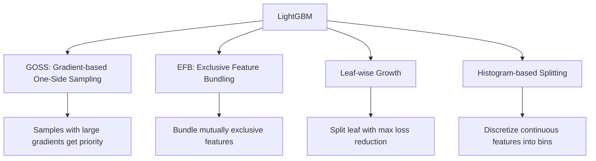
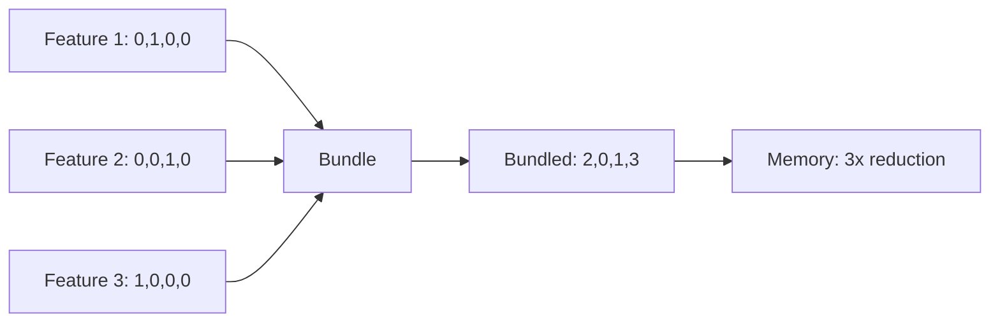
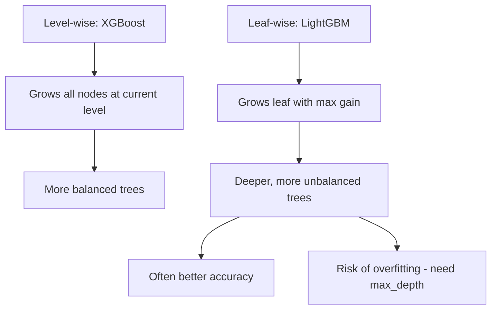

# LightGBM

## Overview

LightGBM (Light Gradient Boosting Machine) is a **fast, distributed, high-performance** gradient boosting framework developed by Microsoft. It's designed for efficiency and scalability, often training 10-20x faster than XGBoost while maintaining comparable accuracy.

## Key Innovations



## GOSS (Gradient-based One-Side Sampling)

Traditional methods sample data uniformly. GOSS keeps all **large-gradient** samples (hard examples) and randomly samples **small-gradient** samples (easy examples):

```python
# Pseudocode for GOSS
def GOSS(gradients, top_rate=0.2, other_rate=0.1):
    n = len(gradients)
    
    # Sort by absolute gradient
    sorted_indices = np.argsort(np.abs(gradients))[::-1]
    
    # Keep top a% (large gradients)
    top_n = int(n * top_rate)
    top_indices = sorted_indices[:top_n]
    
    # Randomly sample b% from rest (small gradients)
    other_n = int(n * other_rate)
    other_indices = np.random.choice(sorted_indices[top_n:], other_n, replace=False)
    
    # Weight the small-gradient samples to compensate for undersampling
    # weight = (1-a)/b for sampled small-gradient instances
    return top_indices, other_indices
```

**Why it works**: Large-gradient samples contribute more to the loss. Keeping all of them preserves the most important information. Small-gradient samples are already well-predicted, so we can sample fewer.

## EFB (Exclusive Feature Bundling)

Many features are **sparse and mutually exclusive** (e.g., one-hot encoded features). EFB bundles them into a single feature:

```python
# Example: One-hot encoded features
# color_red:  [1, 0, 0, 0, 1, 0]
# color_blue: [0, 1, 0, 0, 0, 1]
# color_green:[0, 0, 1, 0, 0, 0]
# → Bundle into one feature with offset
# bundled:    [0, 1, 2, -, 0, 1]  (using offset to distinguish)
```



## Leaf-wise Tree Growth

Unlike XGBoost's **level-wise** growth, LightGBM grows **leaf-wise** — splitting the leaf with the highest loss reduction:



```python
# Leaf-wise pseudocode
def leaf_wise_growth(tree, max_leaves):
    while tree.num_leaves < max_leaves:
        # Find leaf with maximum gain
        best_leaf = max(tree.leaves, key=lambda leaf: leaf.split_gain)
        
        if best_leaf.split_gain < min_gain_to_split:
            break
        
        # Split the best leaf
        tree.split(best_leaf)
```

## Histogram-based Splitting

Instead of sorting features, LightGBM discretizes them into **histograms** (bins):

```python
# Instead of trying all unique values (O(n)):
# 1. Discretize feature into 256 bins
# 2. Build histogram of gradient sums per bin
# 3. Find best split by scanning bins

# Complexity: O(n) for histogram, O(256) for split finding
# vs O(n log n) for exact split finding
```

```python
import lightgbm as lgb

# Create dataset
train_data = lgb.Dataset(X_train, label=y_train, categorical_feature=cat_cols)
val_data = lgb.Dataset(X_val, label=y_val)

# Parameters
params = {
    'objective': 'binary',
    'metric': 'binary_logloss',
    'num_leaves': 31,           # Key: controls complexity (2^max_depth - 1)
    'max_depth': -1,            # -1 means no limit (controlled by num_leaves)
    'learning_rate': 0.05,
    'feature_fraction': 0.8,    # Column sampling
    'bagging_fraction': 0.8,    # Row sampling (GOSS)
    'bagging_freq': 5,
    'min_child_samples': 20,    # Min samples in a leaf
    'lambda_l1': 0.1,
    'lambda_l2': 1.0,
    'min_gain_to_split': 0.01,
    'verbose': -1
}

# Train with early stopping
model = lgb.train(
    params, train_data,
    num_boost_round=1000,
    valid_sets=[val_data],
    callbacks=[lgb.early_stopping(50), lgb.log_evaluation(100)]
)
```

## LightGBM vs XGBoost

| Feature | XGBoost | LightGBM |
|---------|---------|----------|
| Tree growth | Level-wise | Leaf-wise |
| Split finding | Exact/Approximate | Histogram |
| Data sampling | Random | GOSS |
| Feature sampling | Random | EFB |
| Categorical features | One-hot needed | Native support |
| Speed | Fast | Faster (10-20x) |
| Memory | Moderate | Lower |
| Accuracy | Excellent | Excellent (often better) |
| Overfitting risk | Lower | Higher (leaf-wise) |

## Hyperparameter Tuning

```python
# LightGBM key parameters
params = {
    # Core
    'num_leaves': 31,           # Most important! 2^max_depth - 1
    'max_depth': -1,            # Usually leave at -1
    'learning_rate': 0.05,
    'n_estimators': 1000,
    
    # Regularization
    'min_child_samples': 20,    # Larger = less overfitting
    'min_child_weight': 1e-3,
    'lambda_l1': 0.1,
    'lambda_l2': 1.0,
    'min_gain_to_split': 0.01,
    
    # Sampling
    'feature_fraction': 0.8,    # Column sampling
    'bagging_fraction': 0.8,    # Row sampling
    'bagging_freq': 5,
    
    # Speed
    'num_threads': -1,
    'histogram_pool_size': -1,
}
```

## Interview Questions

### Beginner

**Q: Why is LightGBM faster than XGBoost?**

A: Three main reasons:
1. **Histogram-based splitting**: Discretizes features into bins → O(256) instead of O(n log n)
2. **GOSS**: Uses only a subset of data (keeps hard examples, samples easy ones)
3. **EFB**: Bundles sparse features → fewer features to process

**Q: What is the key hyperparameter in LightGBM?**

A: `num_leaves` — it controls model complexity. Unlike XGBoost where `max_depth` is primary, LightGBM's leaf-wise growth means `num_leaves` directly controls the number of splits. Set it to 2^max_depth - 1 as a starting point (e.g., 31 for depth 5).

### Intermediate

**Q: How does GOSS prevent bias in gradient estimation?**

A: GOSS keeps all large-gradient samples (important for learning) and randomly samples small-gradient samples. To compensate for the undersampling, small-gradient samples are given a weight of (1-a)/b where a is the fraction of large-gradient samples kept and b is the sampling rate for small gradients. This ensures the gradient estimate remains unbiased.

**Q: When would you choose LightGBM over XGBoost?**

A: Choose LightGBM when:
1. **Large dataset**: LightGBM's speed advantage is most pronounced with millions of rows
2. **Many features**: EFB handles sparse features efficiently
3. **Categorical features**: Native support without one-hot encoding
4. **Limited memory**: LightGBM uses less memory
5. **Fast prototyping**: LightGBM trains faster for iteration

Choose XGBoost when:
1. **Small-medium dataset**: Speed difference is minimal
2. **Need exact split finding**: XGBoost's exact algorithm is more precise
3. **Overfitting is a concern**: Level-wise growth is more conservative

### FAANG-Level

**Q: You have a dataset with 10M rows and 1000 features, many categorical. How do you configure LightGBM?**

A:
1. **Categorical features**: Specify `categorical_feature` parameter — LightGBM uses optimal split finding for categoricals
2. **num_leaves**: Start with 127, tune down if overfitting
3. **learning_rate**: 0.05 with 2000+ rounds and early stopping
4. **GOSS**: `bagging_fraction=0.8, bagging_freq=5`
5. **EFB**: Automatically applied for sparse features
6. **Regularization**: `min_child_samples=100` (large dataset), `lambda_l2=10`
7. **Feature fraction**: `feature_fraction=0.7` for decorrelation
8. **GPU**: Use `device='gpu'` for 5-10x speedup
9. **Distributed**: Use `dask` integration for multi-node training

## Common Mistakes

1. **Setting num_leaves too high**: Causes overfitting. Start with 31-127.
2. **Using max_depth instead of num_leaves**: LightGBM is controlled by num_leaves, not max_depth
3. **Not specifying categorical features**: Let LightGBM handle them natively
4. **Using too small min_child_samples**: Causes overfitting on small datasets
5. **Ignoring early stopping**: Always use validation set for early stopping

## Summary

| Innovation | Purpose | Benefit |
|-----------|---------|---------|
| GOSS | Smart data sampling | Faster training, preserves hard examples |
| EFB | Feature bundling | Fewer features, less memory |
| Leaf-wise growth | Best-first splitting | Better accuracy |
| Histogram | Discretized features | O(256) split finding |

## Cross-References

- [Gradient Boosting](gradient-boosting.md) — The foundation
- [XGBoost](xgboost.md) — The main competitor
- [CatBoost](catboost.md) — Alternative with ordered boosting
- [Feature Engineering](../foundations/feature-engineering.md) — Handling categorical features
