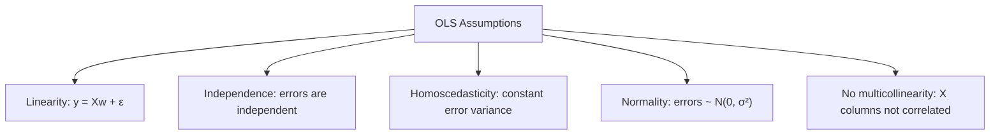
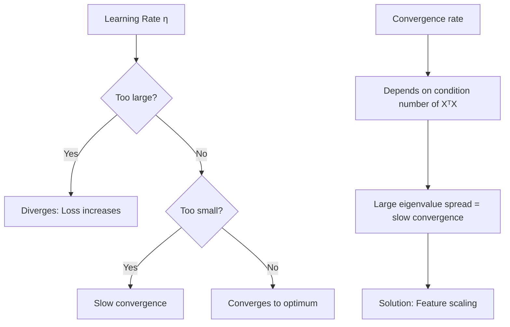
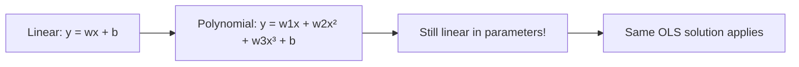

# Linear Regression

## Overview

Linear regression is the **foundation of statistical modeling**. It models the relationship between a dependent variable and independent variables as a linear function. Despite its simplicity, it's widely used and forms the basis for understanding more complex models.

## The Model

\\[\hat{y} = Xw + b = \sum_{j=1}^{d} x_j w_j + b\\]

Where:
- `X`: Input features (n × d matrix)
- `w`: Weights (d-dimensional vector)
- `b`: Bias (intercept)
- `ŷ`: Prediction

```python
import numpy as np

# Simple linear regression: y = wx + b
def predict(X, w, b):
    return X @ w + b
```

## Training: Ordinary Least Squares (OLS)

Minimize the sum of squared residuals:

\\[\min_w ||Xw - y||^2\\]

### Closed-Form Solution (Normal Equation)

\\[w^* = (X^T X)^{-1} X^T y\\]

```python
import numpy as np

class LinearRegressionOLS:
    def fit(self, X, y):
        # Add bias term
        X_b = np.c_[np.ones((X.shape[0], 1)), X]
        # Normal equation
        self.theta = np.linalg.inv(X_b.T @ X_b) @ X_b.T @ y
    
    def predict(self, X):
        X_b = np.c_[np.ones((X.shape[0], 1)), X]
        return X_b @ self.theta

# Example
X = np.random.randn(100, 3)
y = 3*X[:, 0] + 2*X[:, 1] - X[:, 2] + np.random.randn(100)*0.1

model = LinearRegressionOLS()
model.fit(X, y)
print(f"Coefficients: {model.theta}")
```

### Properties of OLS



### When OLS Fails

1. **Multicollinearity**: `XᵀX` is singular → solution is unstable
2. **High dimensions**: d > n → infinite solutions
3. **Outliers**: Squared error is sensitive to outliers

## Training: Gradient Descent

Iteratively update weights to minimize MSE:

\\[w_{t+1} = w_t - \eta \nabla L(w_t)\\]

Where $\nabla L = \frac{2}{n} X^T(Xw - y)$

```python
class LinearRegressionGD:
    def __init__(self, lr=0.01, epochs=1000):
        self.lr = lr
        self.epochs = epochs
    
    def fit(self, X, y):
        n, d = X.shape
        self.w = np.zeros(d)
        self.b = 0
        self.losses = []
        
        for epoch in range(self.epochs):
            y_pred = X @ self.w + self.b
            error = y_pred - y
            
            # Gradients
            dw = (2/n) * X.T @ error
            db = (2/n) * np.sum(error)
            
            # Update
            self.w -= self.lr * dw
            self.b -= self.lr * db
            
            # Track loss
            loss = np.mean(error**2)
            self.losses.append(loss)
    
    def predict(self, X):
        return X @ self.w + self.b
```

### Convergence Analysis



## Regularized Linear Regression

### Ridge Regression (L2)

\\[\min_w ||Xw - y||^2 + \lambda ||w||^2\\]

Closed-form: $w^* = (X^TX + \lambda I)^{-1}X^Ty$

```python
from sklearn.linear_model import Ridge

ridge = Ridge(alpha=1.0)  # alpha = λ
ridge.fit(X, y)
```

**Benefits**: Handles multicollinearity, prevents overfitting, always has a unique solution.

### Lasso Regression (L1)

\\[\min_w ||Xw - y||^2 + \lambda ||w||_1\\]

```python
from sklearn.linear_model import Lasso

lasso = Lasso(alpha=0.1)
lasso.fit(X, y)
print(f"Non-zero coefficients: {np.sum(lasso.coef_ != 0)}")
```

**Benefits**: Feature selection (sparse solutions), automatic variable selection.

### Elastic Net

\\[\min_w ||Xw - y||^2 + \lambda_1 ||w||_1 + \lambda_2 ||w||^2\\]

```python
from sklearn.linear_model import ElasticNet

enet = ElasticNet(alpha=0.1, l1_ratio=0.5)
enet.fit(X, y)
```

## Assumption Checking

```python
import matplotlib.pyplot as plt

def check_assumptions(model, X, y, y_pred):
    residuals = y - y_pred
    
    # 1. Linearity: Residuals vs Predicted
    plt.scatter(y_pred, residuals)
    plt.axhline(y=0, color='r', linestyle='--')
    plt.xlabel('Predicted')
    plt.ylabel('Residuals')
    plt.title('Residuals vs Predicted (should show no pattern)')
    
    # 2. Normality of residuals
    from scipy import stats
    stats.probplot(residuals, plot=plt)
    
    # 3. Homoscedasticity: Residuals should have constant variance
    # 4. Multicollinearity: VIF (Variance Inflation Factor)
    from statsmodels.stats.outliers_influence import variance_inflation_factor
    vif = [variance_inflation_factor(X, i) for i in range(X.shape[1])]
    # VIF > 10 suggests multicollinearity
```

## Polynomial Regression

Extend linear regression to nonlinear relationships:

```python
from sklearn.preprocessing import PolynomialFeatures
from sklearn.pipeline import Pipeline

# y = w1*x + w2*x² + w3*x³ + b
poly_model = Pipeline([
    ('poly', PolynomialFeatures(degree=3)),
    ('linear', LinearRegression())
])
poly_model.fit(X, y)
```



## Interview Questions

### Beginner

**Q: What does R² score tell us?**

A: R² measures the proportion of variance in y explained by the model. R²=1 means perfect predictions; R²=0 means the model is as good as predicting the mean; R²<0 means the model is worse than predicting the mean. It's calculated as 1 - (SS_res / SS_tot).

**Q: When would you use Ridge vs Lasso?**

A: 
- **Ridge**: When many features contribute slightly (all features relevant), multicollinearity present
- **Lasso**: When you suspect only a few features are truly relevant (sparse solution desired)
- **Elastic Net**: When you want both effects, or when features are correlated and you want some selection

### Intermediate

**Q: Why does OLS fail with multicollinearity?**

A: When features are highly correlated, `XᵀX` becomes near-singular (ill-conditioned). The inverse ` (XᵀX)⁻¹` amplifies small changes in data → coefficients become unstable with huge magnitudes and sign flips. Ridge regression adds λI to the diagonal, making the matrix invertible and stable.

**Q: What's the bias-variance tradeoff in Ridge regression?**

A: Increasing λ:
- **Increases bias**: Coefficients shrink toward zero, model becomes simpler
- **Decreases variance**: Less sensitive to training data fluctuations
- **Sweet spot**: Optimal λ minimizes total error (bias² + variance), found via cross-validation

### FAANG-Level

**Q: You have 10,000 features but only 100 samples. Which approach and why?**

A: Use **Lasso or Elastic Net**:
1. OLS is impossible (d >> n, infinite solutions)
2. Lasso performs automatic feature selection, reducing effective dimensionality
3. The true model is likely sparse (few features actually matter)
4. Cross-validate λ to find optimal regularization strength
5. If features are correlated, Elastic Net is better (groups correlated features)
6. Consider stability selection: run Lasso on bootstrap samples, keep features selected in >50% of runs

Alternatively, use PCA first to reduce to ~50 components, then fit linear regression.

## Common Mistakes

1. **Not checking assumptions**: Linear regression assumes linearity, independence, homoscedasticity, normality
2. **Not scaling features**: Regularization penalizes all weights equally — if features have different scales, the penalty is unfair
3. **Using R² to compare models with different numbers of features**: Use adjusted R² instead
4. **Ignoring outliers**: MSE is sensitive to outliers. Use MAE or Huber loss for robust regression
5. **Extrapolating beyond training range**: Linear regression assumes the relationship continues — dangerous for extrapolation

## Summary

| Method | Formula | Pros | Cons |
|--------|---------|------|------|
| OLS | (XᵀX)⁻¹Xᵀy | Closed-form, unbiased | Sensitive to outliers, multicollinearity |
| Ridge | +λ\|\|w\|\|² | Handles multicollinearity | No feature selection |
| Lasso | +λ\|\|w\|\|₁ | Feature selection | Unstable with correlated features |
| Elastic Net | +λ₁\|\|w\|\|₁+λ₂\|\|w\|\|² | Best of both | Two hyperparameters |

## Cross-References

- [Loss Functions](../foundations/loss-functions.md) — MSE derivation
- [Regularization](../foundations/regularization.md) — L1/L2 penalties
- [Logistic Regression](logistic-regression.md) — Classification extension
- [PCA](pca.md) — Dimensionality reduction before regression
