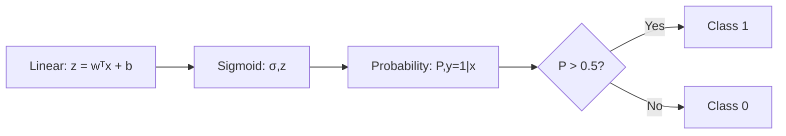
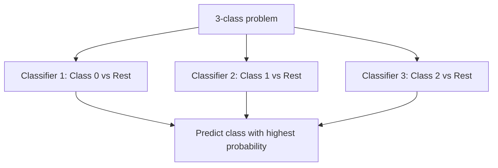
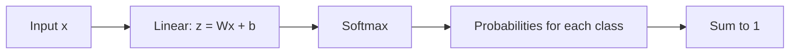

# Logistic Regression

## Overview

Despite its name, logistic regression is a **classification algorithm**. It models the probability that an instance belongs to a particular class using the logistic (sigmoid) function. It's the go-to baseline for binary classification and extends naturally to multi-class problems.

## The Model

### Binary Logistic Regression

\\[P(y=1|x) = \sigma(w^Tx + b) = \frac{1}{1 + e^{-(w^Tx + b)}}\\]

Where σ is the sigmoid function:

```python
import numpy as np

def sigmoid(z):
    """Numerically stable sigmoid"""
    z = np.clip(z, -500, 500)
    return np.where(z >= 0, 
                    1 / (1 + np.exp(-z)),
                    np.exp(z) / (1 + np.exp(z)))

# The sigmoid maps any real number to (0, 1)
# σ(0) = 0.5
# σ(∞) → 1
# σ(-∞) → 0
```



### Decision Boundary

The decision boundary is where P(y=1|x) = 0.5, i.e., where wᵀx + b = 0. This is a **linear boundary** in the feature space.

```python
# Decision boundary: w1*x1 + w2*x2 + b = 0
# x2 = -(w1*x1 + b) / w2  (a line in 2D)
```

## Training: Maximum Likelihood Estimation

The loss function is **binary cross-entropy** (negative log-likelihood):

\\[L(w) = -\frac{1}{n}\sum_{i=1}^n [y_i \log(\hat{y}_i) + (1-y_i)\log(1-\hat{y}_i)]\\]

### Gradient Derivation

For a single sample with sigmoid output ŷ = σ(z):

\\[\frac{\partial L}{\partial z} = \hat{y} - y\\]

This elegant result comes from the derivative of log(sigmoid):

```python
# The gradient of cross-entropy + sigmoid is simply (ŷ - y)
# This is why sigmoid + cross-entropy is preferred over sigmoid + MSE

# For the weight gradient:
# ∂L/∂w = (1/n) * Xᵀ(ŷ - y)

class LogisticRegression:
    def __init__(self, lr=0.01, epochs=1000, reg_lambda=0.01):
        self.lr = lr
        self.epochs = epochs
        self.reg_lambda = reg_lambda
    
    def fit(self, X, y):
        n, d = X.shape
        self.w = np.zeros(d)
        self.b = 0
        self.losses = []
        
        for epoch in range(self.epochs):
            # Forward pass
            z = X @ self.w + self.b
            y_hat = sigmoid(z)
            
            # Loss (with L2 regularization)
            loss = -np.mean(y * np.log(y_hat + 1e-15) + 
                          (1-y) * np.log(1-y_hat + 1e-15))
            loss += (self.reg_lambda / 2) * np.sum(self.w**2)
            self.losses.append(loss)
            
            # Gradients
            error = y_hat - y
            dw = (1/n) * X.T @ error + self.reg_lambda * self.w
            db = (1/n) * np.sum(error)
            
            # Update
            self.w -= self.lr * dw
            self.b -= self.lr * db
    
    def predict_proba(self, X):
        return sigmoid(X @ self.w + self.b)
    
    def predict(self, X, threshold=0.5):
        return (self.predict_proba(X) >= threshold).astype(int)
```

## Multi-Class Extensions

### One-vs-Rest (OvR)

Train K binary classifiers, one per class:

```python
from sklearn.linear_model import LogisticRegression

# sklearn uses OvR by default for multi-class
model = LogisticRegression(multi_class='ovr')
model.fit(X, y)
```



### Softmax Regression (Multinomial)

Generalizes logistic regression to K classes:

\\[P(y=k|x) = \frac{e^{w_k^Tx + b_k}}{\sum_{j=1}^K e^{w_j^Tx + b_j}}\\]

```python
def softmax(z):
    """Numerically stable softmax"""
    exp_z = np.exp(z - np.max(z, axis=1, keepdims=True))
    return exp_z / exp_z.sum(axis=1, keepdims=True)

# Cross-entropy loss for softmax
def softmax_loss(X, y_onehot, W, b):
    z = X @ W + b
    probs = softmax(z)
    return -np.mean(np.sum(y_onehot * np.log(probs + 1e-15), axis=1))
```



## Regularization in Logistic Regression

```python
# L2 regularization (default in sklearn)
model = LogisticRegression(penalty='l2', C=1.0)  # C = 1/λ

# L1 regularization (feature selection)
model = LogisticRegression(penalty='l1', solver='saga')

# Elastic Net
model = LogisticRegression(penalty='elasticnet', l1_ratio=0.5, solver='saga')
```

**Note**: In sklearn, `C` is the inverse of regularization strength. Small C = more regularization.

## Logistic vs Linear Regression

| Aspect | Linear Regression | Logistic Regression |
|--------|------------------|-------------------|
| Output | Continuous value | Probability [0, 1] |
| Loss | MSE | Cross-entropy |
| Link function | Identity | Sigmoid |
| Task | Regression | Classification |
| Gradient | 2(ŷ-y)X | (ŷ-y)X |

## Interview Questions

### Beginner

**Q: Why is it called "regression" if it's used for classification?**

A: Historical naming. The logistic function *regresses* the input to a probability. The model performs regression on the log-odds (logit): log(P/(1-P)) = wᵀx + b. The classification comes from thresholding the probability.

**Q: Why not use MSE as the loss for logistic regression?**

A: MSE with sigmoid creates a non-convex loss landscape with local minima. Cross-entropy is convex and has a clean gradient (ŷ - y). Also, MSE gradients vanish when predictions are very wrong (sigmoid saturated), while cross-entropy gradients remain proportional to the error.

### Intermediate

**Q: How do you interpret the coefficients in logistic regression?**

A: The coefficient wⱼ represents the change in **log-odds** for a one-unit increase in xⱼ:
- **Odds ratio**: e^(wⱼ) is the factor by which odds change
- If wⱼ = 0.5, then e^0.5 ≈ 1.65 → 65% increase in odds per unit increase in xⱼ
- Positive coefficient → feature increases probability of class 1
- Negative coefficient → feature decreases probability of class 1

**Q: What's the relationship between logistic regression and neural networks?**

A: Logistic regression IS a single-layer neural network with sigmoid activation. A multi-layer neural network adds hidden layers with nonlinear activations, allowing it to learn nonlinear decision boundaries. The training algorithm (gradient descent + backprop) is a generalization of logistic regression's optimization.

### FAANG-Level

**Q: You need a model that provides well-calibrated probabilities for a credit scoring system. How do you ensure logistic regression is well-calibrated?**

A: Steps for calibration:
1. **Start with logistic regression** — it's naturally well-calibrated when assumptions hold
2. **Check calibration curve** (reliability diagram): Plot predicted probability vs actual frequency
3. **Platt scaling**: Fit a logistic regression on model outputs if not calibrated
4. **Isotonic regression**: Non-parametric calibration mapping
5. **Feature engineering**: Ensure features are meaningful; polynomial features can help
6. **Regularization**: Too much regularization biases probabilities toward 0.5
7. **Evaluation**: Use Brier score (mean squared error of probabilities) and calibration plots, not just AUC
8. **Monitoring**: Recalibrate periodically as data distribution shifts

## Common Mistakes

1. **Not scaling features**: Regularization penalizes all weights equally; unscaled features make this unfair
2. **Using accuracy with imbalanced data**: A model predicting all negatives might have 99% accuracy
3. **Ignoring multicollinearity**: Correlated features make coefficients unstable and uninterpretable
4. **Not checking linearity assumption**: Logistic regression assumes linear relationship in log-odds space
5. **Using sklearn's default C=1.0 without tuning**: Always cross-validate the regularization parameter

## Summary

| Aspect | Detail |
|--------|--------|
| Model | σ(wᵀx + b) |
| Loss | Binary cross-entropy |
| Optimization | Gradient descent, Newton's method |
| Regularization | L1, L2, Elastic Net |
| Multi-class | OvR, Softmax |
| Strengths | Interpretable, probabilistic, fast |
| Weaknesses | Linear boundary, assumes linearity in log-odds |

## Cross-References

- [Linear Regression](linear-regression.md) — The regression counterpart
- [Loss Functions](../foundations/loss-functions.md) — Cross-entropy derivation
- [SVM](svm.md) — Another linear classifier with different loss
- [Neural Network Basics](../deep-learning/nn-basics.md) — Logistic regression as a neural network
