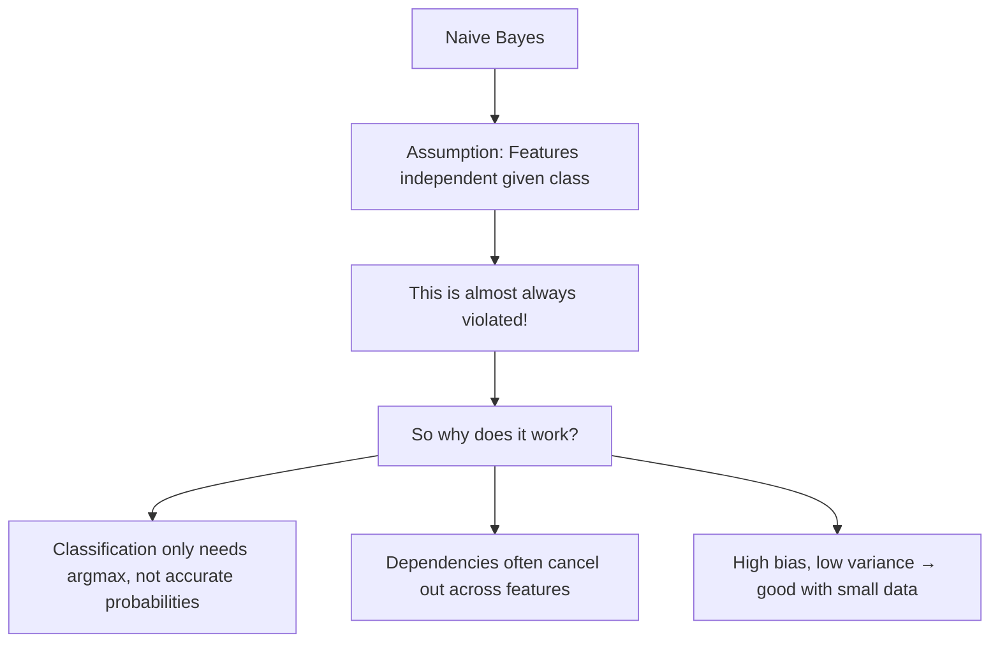

# Naive Bayes

## Overview

Naive Bayes is a **probabilistic classifier** based on Bayes' theorem with the "naive" assumption that features are **conditionally independent** given the class. Despite this unrealistic assumption, it works surprisingly well in practice, especially for text classification.

## Bayes' Theorem Review

\\[P(y|X) = \frac{P(X|y) \cdot P(y)}{P(X)}\\]

Where:
- P(y|X): **Posterior** — probability of class y given features X
- P(X|y): **Likelihood** — probability of features X given class y
- P(y): **Prior** — probability of class y
- P(X): **Evidence** — probability of features X (constant for all classes)

## The "Naive" Assumption

Features are conditionally independent given the class:

\\[P(x_1, x_2, ..., x_d | y) = \prod_{i=1}^d P(x_i | y)\\]

This simplifies the likelihood computation enormously:

```python
import numpy as np

class NaiveBayes:
    def fit(self, X, y):
        self.classes = np.unique(y)
        self.priors = {}
        self.likelihoods = {}
        
        for c in self.classes:
            X_c = X[y == c]
            self.priors[c] = len(X_c) / len(X)
            self.likelihoods[c] = {
                'mean': X_c.mean(axis=0),
                'var': X_c.var(axis=0) + 1e-9  # Smoothing
            }
    
    def predict(self, X):
        return np.array([self._predict_one(x) for x in X])
    
    def _predict_one(self, x):
        posteriors = {}
        for c in self.classes:
            # Log prior
            log_prior = np.log(self.priors[c])
            # Log likelihood (Gaussian)
            mean = self.likelihoods[c]['mean']
            var = self.likelihoods[c]['var']
            log_likelihood = -0.5 * np.sum(np.log(2*np.pi*var) + (x-mean)**2/var)
            posteriors[c] = log_prior + log_likelihood
        
        return max(posteriors, key=posteriors.get)
```

## Types of Naive Bayes

### Gaussian Naive Bayes

Assumes features follow a Gaussian distribution:

\\[P(x_i|y) = \frac{1}{\sqrt{2\pi\sigma_y^2}} \exp\left(-\frac{(x_i - \mu_y)^2}{2\sigma_y^2}\right)\\]

```python
from sklearn.naive_bayes import GaussianNB

gnb = GaussianNB()
gnb.fit(X_train, y_train)
y_pred = gnb.predict(X_test)
```

**Best for**: Continuous features, general-purpose classification

### Multinomial Naive Bayes

For count data (word frequencies, TF-IDF):

\\[P(x_i|y) = \frac{N_{yi} + \alpha}{N_y + \alpha d}\\]

Where N_yi is the count of feature i in class y, and α is Laplace smoothing.

```python
from sklearn.naive_bayes import MultinomialNB

mnb = MultinomialNB(alpha=1.0)  # Laplace smoothing
mnb.fit(X_train_counts, y_train)
```

**Best for**: Text classification with bag-of-words, document classification

### Bernoulli Naive Bayes

For binary features (presence/absence):

\\[P(x_i|y) = P(x_i=1|y)^{x_i} \cdot (1 - P(x_i=1|y))^{1-x_i}\\]

```python
from sklearn.naive_bayes import BernoulliNB

bnb = BernoulliNB(alpha=1.0)
bnb.fit(X_binary, y_train)
```

**Best for**: Binary features, short text classification

### Comparison

| Type | Feature Type | Distribution | Use Case |
|------|-------------|-------------|----------|
| Gaussian | Continuous | Normal | General classification |
| Multinomial | Counts | Multinomial | Text (word counts) |
| Bernoulli | Binary | Bernoulli | Text (presence/absence) |

## Laplace Smoothing

Prevents zero probabilities for unseen features:

\\[P(x_i|y) = \frac{count(x_i, y) + \alpha}{count(y) + \alpha \cdot d}\\]

Where α=1 for Laplace smoothing, α<1 for Lidstone smoothing.

```python
# Without smoothing: P(word="unseen"|spam) = 0 → entire posterior = 0!
# With smoothing: P(word="unseen"|spam) = 1 / (total_spam_words + vocabulary_size)
```

## Text Classification Example

```python
from sklearn.feature_extraction.text import CountVectorizer, TfidfVectorizer
from sklearn.naive_bayes import MultinomialNB
from sklearn.pipeline import Pipeline

# Pipeline: Text → Features → Classifier
pipeline = Pipeline([
    ('vectorizer', TfidfVectorizer(max_features=10000, ngram_range=(1, 2))),
    ('classifier', MultinomialNB(alpha=0.1))
])

pipeline.fit(X_train_text, y_train)
y_pred = pipeline.predict(X_test_text)

# Common use case: Spam detection, sentiment analysis, document classification
```

## Why Naive Bayes Works Despite Independence Assumption



Key insights:
1. **Classification ≠ Probability estimation**: NB only needs to get the ranking right (argmax), not accurate probabilities
2. **Dependencies cancel**: If features are correlated, the errors in likelihood estimation often cancel out
3. **Bias-variance tradeoff**: The strong independence assumption gives high bias but low variance — good for small datasets

## Interview Questions

### Beginner

**Q: Why is it called "naive"?**

A: Because it makes the unrealistic assumption that features are conditionally independent given the class. For example, in spam detection, it assumes the words "free" and "money" are independent given the email is spam — which is clearly not true.

**Q: When would you choose Naive Bayes over logistic regression?**

A: Naive Bayes when:
- Very small training data (NB needs fewer samples)
- High-dimensional data (text with 10K+ features)
- You need a fast baseline
- Features are approximately independent

Logistic regression when:
- You need well-calibrated probabilities
- Features are correlated
- You want to regularize

### Intermediate

**Q: How does Laplace smoothing help?**

A: Without smoothing, if a feature value never appears with a certain class in training, P(feature|class) = 0, making the entire posterior 0 regardless of other evidence. Laplace smoothing adds a small count (α=1) to every feature-class combination, ensuring no probability is exactly zero. This is crucial for generalization.

**Q: Why does Naive Bayes work well for text classification?**

A: 
1. **High dimensionality**: Text has 10K-100K features; NB handles this gracefully
2. **Sparse features**: Most words don't appear in most documents; NB handles zeros naturally
3. **Small training data**: NB needs fewer samples than complex models
4. **Speed**: Training is O(n·d), prediction is O(d)
5. **The independence assumption is less harmful**: Word occurrences are somewhat independent given the topic

### FAANG-Level

**Q: You're building a real-time spam filter processing 10K emails/second. Why might Naive Bayes be preferred over a transformer model?**

A: Practical considerations:
1. **Latency**: NB prediction is O(d) — microseconds vs. milliseconds for transformers
2. **Throughput**: NB handles 10K emails/second easily on a single CPU
3. **Memory**: NB model is tiny (just means/variances per class)
4. **Training**: NB trains in seconds, transformers need hours
5. **Interpretability**: Easy to see which words drive spam classification
6. **Maintenance**: Simple to retrain with new data
7. **Edge deployment**: Runs on any hardware

For spam filtering, the feature independence assumption isn't terrible (word presence is somewhat independent), and the speed advantage is decisive at scale.

## Common Mistakes

1. **Using Gaussian NB for count data**: Use MultinomialNB for word counts
2. **Not smoothing**: Zero probabilities will kill predictions
3. **Expecting accurate probabilities**: NB is known to produce poorly calibrated probabilities
4. **Ignoring feature correlations**: If features are highly correlated, consider decorrelation or use a different model
5. **Using NB for complex decision boundaries**: It can only learn linear boundaries in log-space

## Summary

| Property | Description |
|----------|-------------|
| Model | P(y\|X) ∝ P(y) ∏ P(xᵢ\|y) |
| Assumption | Feature independence given class |
| Training | O(n·d) — very fast |
| Prediction | O(d) — very fast |
| Strengths | Fast, works with small data, high dimensions |
| Weaknesses | Poor probabilities, independence assumption |

## Cross-References

- [Probability](../foundations/probability.md) — Bayes' theorem
- [Logistic Regression](logistic-regression.md) — Another linear classifier
- [Feature Engineering](../foundations/feature-engineering.md) — TF-IDF for text
