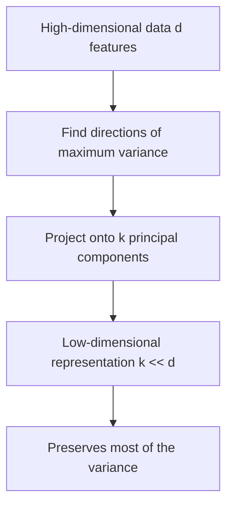
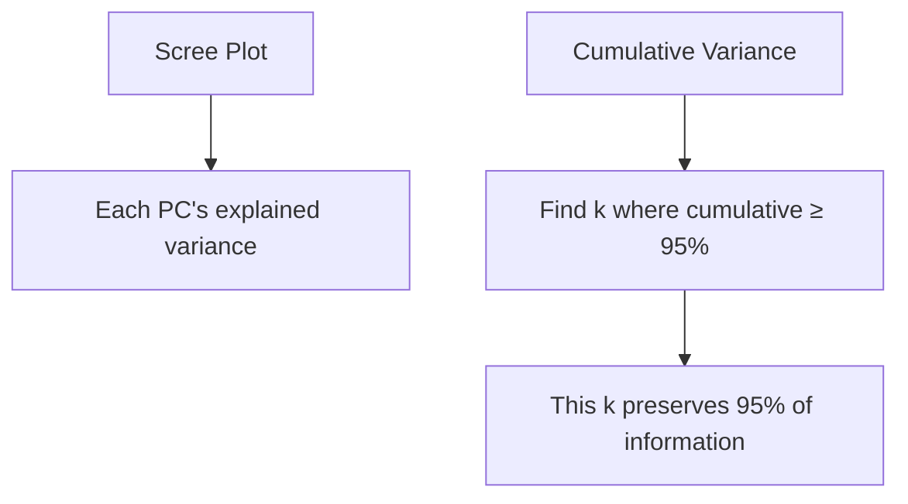
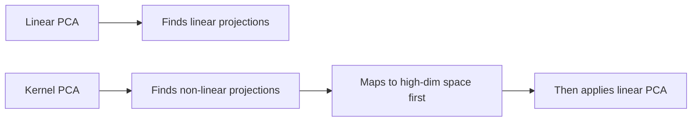
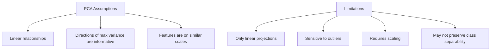

# Principal Component Analysis (PCA)

## Overview

PCA is a **dimensionality reduction** technique that finds the directions of maximum variance in high-dimensional data and projects it onto a lower-dimensional subspace. It's one of the most widely used unsupervised learning algorithms.

## The Goal



## Mathematical Foundation

### Step 1: Center the Data

$$X_{centered} = X - \bar{X}$$

### Step 2: Compute Covariance Matrix

$$C = \frac{1}{n-1} X_{centered}^T X_{centered}$$

### Step 3: Eigendecomposition

$$C = V \Lambda V^T$$

Where:
- V: Matrix of eigenvectors (principal components)
- Λ: Diagonal matrix of eigenvalues (variance explained)

### Step 4: Select Top K Components

Sort eigenvalues in descending order, keep top K eigenvectors.

### Step 5: Project

$$X_{reduced} = X_{centered} \cdot V_k$$

```python
import numpy as np

class PCA:
    def __init__(self, n_components=2):
        self.n_components = n_components
        self.components = None
        self.mean = None
        self.explained_variance = None
        self.explained_variance_ratio = None
    
    def fit(self, X):
        # Center data
        self.mean = np.mean(X, axis=0)
        X_centered = X - self.mean
        
        # Compute covariance matrix
        cov_matrix = np.cov(X_centered.T)
        
        # Eigendecomposition
        eigenvalues, eigenvectors = np.linalg.eigh(cov_matrix)
        
        # Sort by eigenvalue (descending)
        idx = np.argsort(eigenvalues)[::-1]
        eigenvalues = eigenvalues[idx]
        eigenvectors = eigenvectors[:, idx]
        
        # Store top K components
        self.components = eigenvectors[:, :self.n_components].T
        self.explained_variance = eigenvalues[:self.n_components]
        self.explained_variance_ratio = self.explained_variance / np.sum(eigenvalues)
        
        return self
    
    def transform(self, X):
        X_centered = X - self.mean
        return X_centered @ self.components.T
    
    def fit_transform(self, X):
        return self.fit(X).transform(X)
```

## PCA via SVD

More numerically stable than eigendecomposition:

$$X_{centered} = U \Sigma V^T$$

The principal components are the columns of V (right singular vectors).

```python
class PCA_SVD:
    def fit(self, X):
        self.mean = np.mean(X, axis=0)
        X_centered = X - self.mean
        
        # SVD
        U, S, Vt = np.linalg.svd(X_centered, full_matrices=False)
        
        self.components = Vt[:self.n_components]
        self.explained_variance = (S**2) / (len(X) - 1)
        self.explained_variance_ratio = self.explained_variance / np.sum(self.explained_variance)
        
        return self
```

**Why SVD?** 
- More numerically stable (avoids computing XᵀX)
- More efficient when n < d
- Used by sklearn's PCA implementation

## Explained Variance

```python
from sklearn.decomposition import PCA
import matplotlib.pyplot as plt

pca = PCA()
pca.fit(X)

# Scree plot
plt.plot(range(1, len(pca.explained_variance_ratio_) + 1),
         pca.explained_variance_ratio_, 'bo-')
plt.xlabel('Principal Component')
plt.ylabel('Explained Variance Ratio')
plt.title('Scree Plot')

# Cumulative explained variance
cumsum = np.cumsum(pca.explained_variance_ratio_)
n_components_95 = np.argmax(cumsum >= 0.95) + 1
print(f"Components for 95% variance: {n_components_95}")
```



## Kernel PCA

For **non-linear** dimensionality reduction:

$$K_{centered} = K - 1_n K - K 1_n + 1_n K 1_n$$

Where K is the kernel matrix (e.g., RBF).

```python
from sklearn.decomposition import KernelPCA

kpca = KernelPCA(n_components=2, kernel='rbf', gamma=1.0)
X_kpca = kpca.fit_transform(X)
```



## PCA Applications

### 1. Dimensionality Reduction

```python
from sklearn.decomposition import PCA

# Reduce from 100 features to 10
pca = PCA(n_components=10)
X_reduced = pca.fit_transform(X)
print(f"Original shape: {X.shape}")
print(f"Reduced shape: {X_reduced.shape}")
```

### 2. Visualization

```python
# Project to 2D for visualization
pca_2d = PCA(n_components=2)
X_2d = pca_2d.fit_transform(X)

plt.scatter(X_2d[:, 0], X_2d[:, 1], c=y, cmap='viridis')
plt.xlabel('PC1')
plt.ylabel('PC2')
plt.title('PCA Visualization')
```

### 3. Noise Reduction

```python
# Keep only top K components (signal), discard rest (noise)
pca = PCA(n_components=50)
X_reduced = pca.fit_transform(X)
X_denoised = pca.inverse_transform(X_reduced)
```

### 4. Feature Decorrelation

```python
# PCA produces uncorrelated features
# Useful before models that assume independence
```

## PCA Assumptions and Limitations



## Interview Questions

### Beginner

**Q: What does PCA do?**

A: PCA finds the directions (principal components) along which the data varies the most. It projects high-dimensional data onto these directions, reducing the number of features while preserving as much information (variance) as possible.

**Q: Why do we center the data before PCA?**

A: Without centering, the first principal component might point toward the mean of the data rather than the direction of maximum variance. Centering ensures PCA captures variance, not the mean.

### Intermediate

**Q: What's the difference between PCA and feature selection?**

A: 
- **Feature selection**: Picks a subset of original features (preserves interpretability)
- **Feature extraction (PCA)**: Creates new features as linear combinations of originals (better variance capture but less interpretable)

**Q: When would PCA fail?**

A: PCA fails when:
1. **Non-linear relationships**: PCA only finds linear projections. Use Kernel PCA, t-SNE, or UMAP.
2. **Class label matters**: PCA is unsupervised — max variance directions may not be discriminative. Use LDA instead.
3. **Sparse data**: PCA creates dense projections. Use TruncatedSVD.
4. **Outliers dominate**: Outliers can skew the principal components. Use Robust PCA.

### FAANG-Level

**Q: You have 10,000 features and 100 samples. How do you apply PCA safely?**

A: This is the "small n, large p" problem:
1. **Use SVD directly**: Compute SVD of X (n×d) instead of eigendecomposition of XᵀX (d×d). More efficient and stable.
2. **Limit components**: Maximum n_components = min(n, d) = 100. But even 100 components might overfit.
3. **Cross-validate**: Use CV to find optimal number of components
4. **Consider TruncatedSVD**: More efficient for sparse data
5. **Alternative**: Use L1 regularization (Lasso) for built-in feature selection
6. **Stability**: Run PCA on bootstrap samples to check if components are stable

## Common Mistakes

1. **Not scaling features**: Features with larger variance dominate PCA
2. **Using PCA for classification**: PCA is unsupervised — use LDA if you have labels
3. **Choosing components by eigenvalue > 1 rule**: This "Kaiser rule" is arbitrary; use cumulative variance or CV
4. **Interpreting PCA loadings carefully**: Loadings show correlations, not causation
5. **Applying PCA to test data separately**: Always use `transform()` (not `fit_transform()`) on test data

## Summary

| Aspect | Description |
|--------|-------------|
| Goal | Find directions of maximum variance |
| Method | Eigendecomposition of covariance matrix |
| Alternative | SVD (more stable) |
| Output | Orthogonal, uncorrelated features |
| Applications | Dimensionality reduction, visualization, denoising |
| Limitations | Linear only, sensitive to scale and outliers |

## Cross-References

- [Linear Algebra](../foundations/linear-algebra.md) — Eigendecomposition, SVD
- [KNN](knn.md) — Use PCA before KNN to avoid curse of dimensionality
- [SVM](svm.md) — PCA for dimensionality reduction before SVM
- [Feature Engineering](../foundations/feature-engineering.md) — Scaling before PCA
