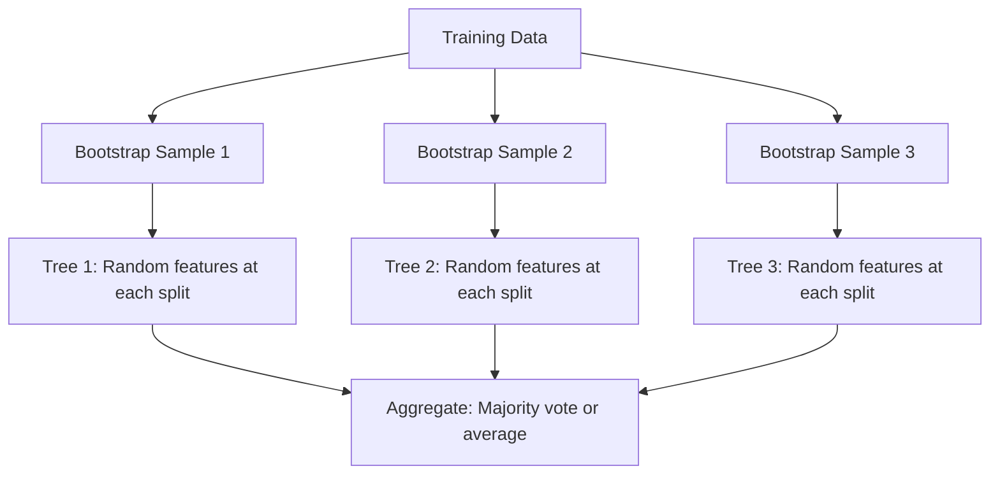

# Random Forest

## Overview

Random Forest is an **ensemble of decision trees** trained using bagging (Bootstrap Aggregating) and random feature selection. It's one of the most reliable "out-of-the-box" ML algorithms — it rarely overfits, handles various data types, and provides feature importance.

## Key Ideas



### Bagging (Bootstrap Aggregating)

1. Draw B bootstrap samples (sampling with replacement)
2. Train a tree on each bootstrap sample
3. Average predictions (regression) or majority vote (classification)

```python
import numpy as np
from sklearn.tree import DecisionTreeClassifier

class RandomForest:
    def __init__(self, n_estimators=100, max_depth=None, max_features='sqrt'):
        self.n_estimators = n_estimators
        self.max_depth = max_depth
        self.max_features = max_features
        self.trees = []
        self.feature_indices = []
    
    def fit(self, X, y):
        n_samples, n_features = X.shape
        
        # Determine number of features per split
        if self.max_features == 'sqrt':
            max_feats = int(np.sqrt(n_features))
        elif self.max_features == 'log2':
            max_feats = int(np.log2(n_features))
        else:
            max_feats = n_features
        
        for _ in range(self.n_estimators):
            # Bootstrap sample
            indices = np.random.choice(n_samples, n_samples, replace=True)
            X_boot = X[indices]
            y_boot = y[indices]
            
            # Random feature selection
            feat_indices = np.random.choice(n_features, max_feats, replace=False)
            X_subset = X_boot[:, feat_indices]
            
            # Train tree
            tree = DecisionTreeClassifier(max_depth=self.max_depth)
            tree.fit(X_subset, y_boot)
            
            self.trees.append(tree)
            self.feature_indices.append(feat_indices)
    
    def predict(self, X):
        predictions = []
        for tree, feat_idx in zip(self.trees, self.feature_indices):
            predictions.append(tree.predict(X[:, feat_idx]))
        
        # Majority vote
        predictions = np.array(predictions)
        return np.apply_along_axis(lambda x: np.bincount(x).argmax(), 0, predictions)
    
    def predict_proba(self, X):
        predictions = []
        for tree, feat_idx in zip(self.trees, self.feature_indices):
            predictions.append(tree.predict_proba(X[:, feat_idx]))
        return np.mean(predictions, axis=0)
```

### Why Random Feature Selection?

Without random features, all trees trained on bootstrap samples would be **highly correlated** (especially at the top splits). Random feature selection **decorrelates** the trees, making the ensemble more effective.

\\[\text{Var}(\bar{X}) = \rho \sigma^2 + \frac{1-\rho}{B}\sigma^2\\]

Where ρ is correlation between trees. Reducing ρ reduces ensemble variance.

## Out-of-Bag (OOB) Evaluation

Each bootstrap sample misses ~37% of training data. These "out-of-bag" samples can serve as a built-in validation set:

```python
from sklearn.ensemble import RandomForestClassifier

rf = RandomForestClassifier(n_estimators=100, oob_score=True)
rf.fit(X_train, y_train)
print(f"OOB Score: {rf.oob_score_:.3f}")
# No need for separate validation set!
```

## Feature Importance

### Mean Decrease in Impurity (MDI)

```python
rf = RandomForestClassifier(n_estimators=100)
rf.fit(X_train, y_train)

# Built-in importance (MDI)
importances = rf.feature_importances_
indices = np.argsort(importances)[::-1]
for i in range(10):
    print(f"{i+1}. Feature {indices[i]}: {importances[indices[i]]:.4f}")
```

### Permutation Importance (More Reliable)

```python
from sklearn.inspection import permutation_importance

result = permutation_importance(rf, X_test, y_test, n_repeats=10, random_state=42)
importances = result.importances_mean
```

**MDI vs Permutation**: MDI can be biased toward high-cardinality features. Permutation importance measures actual performance drop when a feature is shuffled.

## Hyperparameters

```python
from sklearn.ensemble import RandomForestClassifier

rf = RandomForestClassifier(
    n_estimators=100,      # Number of trees (more = better, diminishing returns)
    max_depth=None,        # None = fully grown trees
    max_features='sqrt',   # Features per split ('sqrt', 'log2', int, float)
    min_samples_split=2,   # Minimum samples to split a node
    min_samples_leaf=1,    # Minimum samples in a leaf
    bootstrap=True,        # Use bootstrap sampling
    oob_score=True,        # Compute OOB score
    n_jobs=-1,             # Parallel training
    random_state=42
)
```

| Hyperparameter | Effect | Typical Values |
|---------------|--------|---------------|
| n_estimators | More trees → better (diminishing) | 100-1000 |
| max_depth | Controls tree complexity | None, 10-30 |
| max_features | Randomness per split | sqrt (class), n/3 (reg) |
| min_samples_split | Prevents overfitting | 2-10 |
| min_samples_leaf | Smooth predictions | 1-5 |

## Random Forest vs Single Decision Tree

| Aspect | Single Tree | Random Forest |
|--------|------------|---------------|
| Variance | High | Low (averaging) |
| Bias | Low | Slightly higher |
| Overfitting | Prone | Resistant |
| Interpretability | High | Lower |
| Training speed | Fast | Slower (many trees) |
| Feature importance | Unstable | Stable |

## Interview Questions

### Beginner

**Q: Why is it called "Random" Forest?**

A: Two sources of randomness:
1. **Bootstrap sampling**: Each tree sees a random subset of training data
2. **Random feature selection**: Each split considers a random subset of features

This randomness decorrelates the trees, making the ensemble more effective.

**Q: How many trees should you use?**

A: More trees generally improve performance (diminishing returns). Beyond ~100-500 trees, gains are minimal. More trees = more computation but won't overfit (unlike boosting). In practice, use 100-500 and increase if you have time.

### Intermediate

**Q: Why does Random Forest rarely overfit?**

A: 
1. **Bagging** reduces variance by averaging
2. **Random features** decorrelate trees
3. **OOB evaluation** provides internal validation
4. Fully grown trees have low bias; averaging reduces their high variance

However, RF CAN overfit if:
- Trees are too deep on very small datasets
- Noise features dominate signal

**Q: How does max_features affect the model?**

A: Lower max_features:
- More randomness → more decorrelation → lower variance
- But each tree is weaker → slightly higher bias
- Good for datasets with many correlated features

Higher max_features:
- Less randomness → trees are more similar
- Each tree is stronger but more correlated
- Good when few features are truly informative

Rule of thumb: sqrt(n_features) for classification, n_features/3 for regression.

### FAANG-Level

**Q: You have a dataset with 1000 features, many correlated. How do you configure Random Forest and why?**

A: 
1. **max_features='sqrt'** (≈32): Forces trees to use different feature subsets, decorrelating them
2. **n_estimators=500**: Enough trees for stable importance estimates
3. **max_depth=20-30**: Prevents fully grown trees from memorizing noise
4. **min_samples_leaf=5**: Smooths predictions, reduces overfitting
5. **Use permutation importance** instead of MDI to avoid bias toward correlated features
6. **Consider feature grouping**: Cluster correlated features, sample from clusters to ensure diversity
7. **Monitor OOB score**: If OOB score plateaus, stop adding trees

## Common Mistakes

1. **Using too few trees**: Performance degrades; use enough for convergence
2. **Not using OOB score**: Free validation — always enable it
3. **Using MDI importance with correlated features**: Permutation importance is more reliable
4. **Scaling features**: Trees don't need scaling — wasted computation
5. **Not using n_jobs=-1**: Trees are independent → embarrassingly parallel

## Summary

| Property | Value |
|----------|-------|
| Base learner | Decision tree |
| Ensemble method | Bagging |
| Randomness | Bootstrap + feature selection |
| Overfitting | Resistant (but possible) |
| Feature importance | Yes (MDI, permutation) |
| OOB evaluation | Built-in |
| Parallelizable | Yes (fully) |

## Cross-References

- [Decision Trees](decision-trees.md) — The base learner
- [Ensemble Methods](ensemble.md) — Bagging and boosting theory
- [Gradient Boosting](gradient-boosting.md) — Sequential alternative
- [XGBoost](xgboost.md) — Often outperforms RF
- [Bias-Variance](../foundations/bias-variance.md) — Why averaging helps
