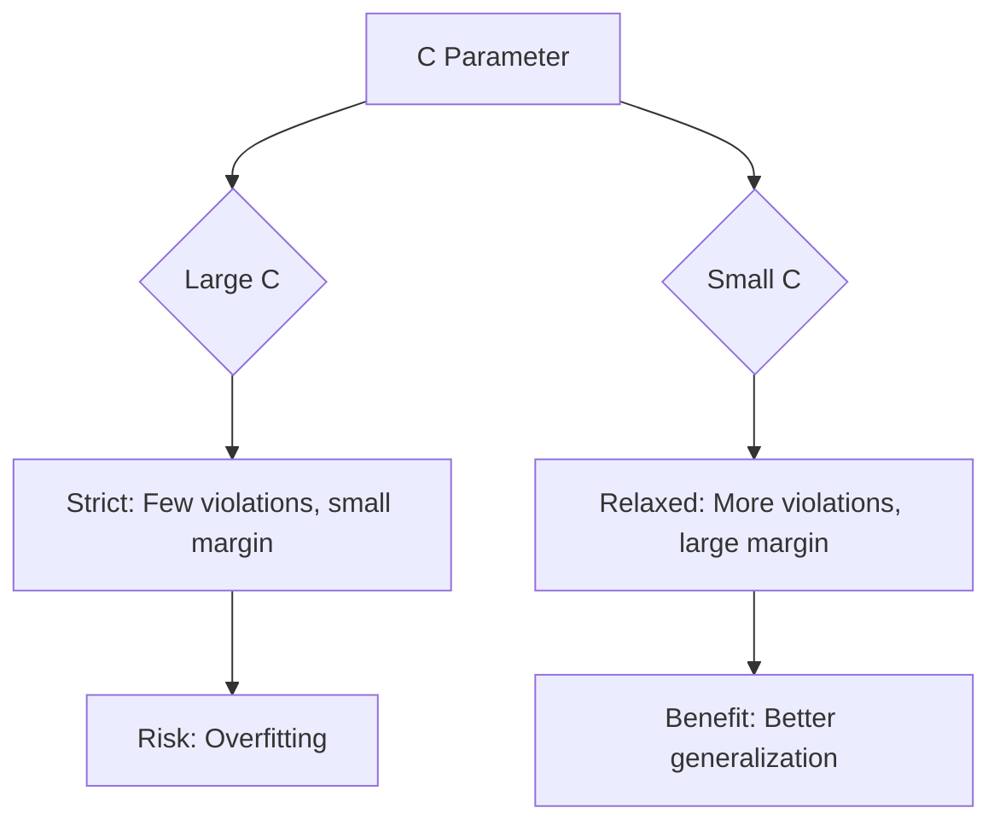
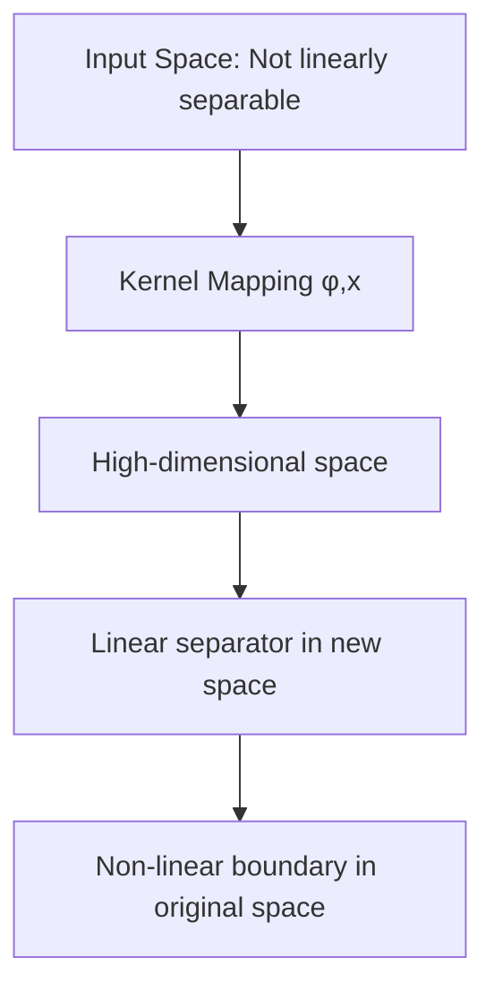
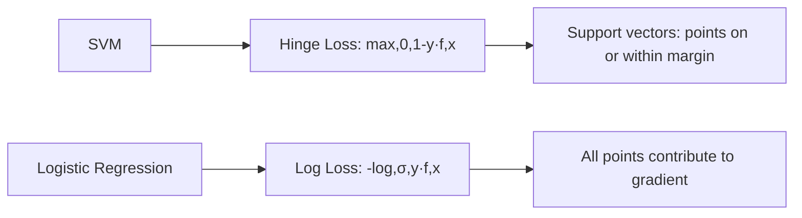

# Support Vector Machines (SVM)

## Overview

SVM finds the **optimal hyperplane** that maximizes the margin between classes. It's a powerful classifier that works well in high-dimensional spaces and can handle non-linear boundaries using the kernel trick.

## Maximum Margin Classifier

```mermaid
graph LR
    A[Class -1: o] --> C[Margin]
    B[Class +1: x] --> C
    C --> D[Hyperplane: wᵀx + b = 0]
    D --> E[Support Vectors: closest points to boundary]
    E --> F[Maximize margin: 2/||w||]
```

### The Optimization Problem

$$\min_{w,b} \frac{1}{2}||w||^2$$
$$\text{subject to: } y_i(w^Tx_i + b) \geq 1, \forall i$$

The margin is $\frac{2}{||w||}$ — maximizing the margin means minimizing $||w||^2$.

```python
import numpy as np
from cvxopt import matrix, solvers

def linear_svm(X, y, C=1.0):
    """Hard margin SVM using quadratic programming"""
    n, d = X.shape
    
    # Convert labels to {-1, +1}
    y = np.where(y == 0, -1, 1)
    
    # Kernel matrix
    K = X @ X.T
    
    # QP formulation
    P = matrix(np.outer(y, y) * K)
    q = matrix(-np.ones(n))
    G = matrix(-np.eye(n))
    h = matrix(np.zeros(n))
    A = matrix(y.reshape(1, -1).astype(float))
    b = matrix(np.zeros(1))
    
    # Solve
    solvers.options['show_progress'] = False
    solution = solvers.qp(P, q, G, h, A, b)
    alphas = np.array(solution['x']).flatten()
    
    # Support vectors (alphas > threshold)
    sv_mask = alphas > 1e-5
    sv_X = X[sv_mask]
    sv_y = y[sv_mask]
    sv_alphas = alphas[sv_mask]
    
    # Weight vector
    w = np.sum(sv_alphas * sv_y * sv_X.T, axis=1)
    
    # Bias
    b = np.mean(sv_y - sv_X @ w)
    
    return w, b
```

## Soft Margin SVM

Real-world data is rarely linearly separable. Soft margin allows some misclassifications:

$$\min_{w,b,\xi} \frac{1}{2}||w||^2 + C\sum_{i=1}^n \xi_i$$
$$\text{subject to: } y_i(w^Tx_i + b) \geq 1 - \xi_i, \xi_i \geq 0$$

Where:
- ξᵢ: Slack variables (how much each point violates the margin)
- C: Regularization parameter (trade-off between margin and misclassification)

```python
from sklearn.svm import SVC

# C controls the trade-off
# Large C: Fewer misclassifications, smaller margin (overfitting risk)
# Small C: More misclassifications, larger margin (better generalization)

svm = SVC(C=1.0, kernel='linear')
svm.fit(X_train, y_train)
```



## The Kernel Trick

The kernel trick allows SVM to learn **non-linear boundaries** without explicitly computing high-dimensional feature mappings.

### The Idea

Instead of computing φ(x) explicitly, compute the **kernel function** K(xᵢ, xⱼ) = φ(xᵢ)ᵀφ(xⱼ):

```python
def linear_kernel(x1, x2):
    return np.dot(x1, x2)

def polynomial_kernel(x1, x2, degree=3, coef0=1):
    return (np.dot(x1, x2) + coef0) ** degree

def rbf_kernel(x1, x2, gamma=1.0):
    return np.exp(-gamma * np.linalg.norm(x1 - x2) ** 2)
```

### Common Kernels

| Kernel | Formula | Use Case |
|--------|---------|----------|
| Linear | K(x,y) = xᵀy | Linearly separable, high-dim |
| Polynomial | K(x,y) = (xᵀy + c)ᵈ | Non-linear, known degree |
| RBF (Gaussian) | K(x,y) = exp(-γ\|\|x-y\|\|²) | General purpose, most common |
| Sigmoid | K(x,y) = tanh(αxᵀy + c) | Neural network-like |

### RBF Kernel

The most popular kernel — maps to infinite-dimensional space:

```python
from sklearn.svm import SVC

# RBF kernel SVM
svm_rbf = SVC(kernel='rbf', C=1.0, gamma='scale')
svm_rbf.fit(X_train, y_train)

# gamma controls the influence of each training example
# Large gamma: Each point has small influence, complex boundary
# Small gamma: Each point has large influence, smooth boundary
```



### The Kernel Matrix

```python
def compute_kernel_matrix(X, kernel_func, **kwargs):
    """Compute the n×n kernel matrix"""
    n = len(X)
    K = np.zeros((n, n))
    for i in range(n):
        for j in range(i, n):
            K[i,j] = kernel_func(X[i], X[j], **kwargs)
            K[j,i] = K[i,j]
    return K

# For RBF: K[i,j] = exp(-gamma * ||x_i - x_j||^2)
# This is a positive semi-definite matrix (Mercer's condition)
```

## SVM as Loss + Regularization

SVM can be viewed through the lens of loss functions:

$$\min_w \lambda||w||^2 + \frac{1}{n}\sum_{i=1}^n \max(0, 1 - y_i(w^Tx_i + b))$$

The second term is the **hinge loss**:

```python
def hinge_loss(y_true, y_pred):
    """Hinge loss for SVM"""
    return np.mean(np.maximum(0, 1 - y_true * y_pred))
```



## Multi-Class SVM

SVM is inherently binary. Extensions:

```python
# One-vs-One (OvO): C(n,2) classifiers
from sklearn.svm import SVC
svm = SVC(decision_function_shape='ovo')

# One-vs-Rest (OvR): n classifiers
svm = SVC(decision_function_shape='ovr')
```

## SVM Regression (SVR)

SVM can also do regression — find a function that deviates from targets by at most ε:

$$\min_{w,b} \frac{1}{2}||w||^2 + C\sum_{i=1}^n (\xi_i + \xi_i^*)$$
$$\text{subject to: } y_i - w^Tx_i - b \leq \epsilon + \xi_i$$

```python
from sklearn.svm import SVR

svr = SVR(kernel='rbf', C=1.0, epsilon=0.1)
svr.fit(X_train, y_train)
```

## Interview Questions

### Beginner

**Q: What are support vectors?**

A: Support vectors are the training samples that lie closest to the decision boundary — they are on or within the margin. Only these points determine the hyperplane; removing all other points doesn't change the solution. This makes SVM memory-efficient for prediction.

**Q: What does the C parameter do?**

A: C controls the trade-off between maximizing the margin and minimizing misclassification:
- **Large C**: Strict — penalizes misclassifications heavily, smaller margin
- **Small C**: Relaxed — allows more misclassifications, larger margin
- It's the inverse of regularization strength

### Intermediate

**Q: Why is the RBF kernel so popular?**

A: RBF maps to infinite-dimensional space, making it extremely flexible. Key properties:
1. **Universal approximator**: Can learn any smooth boundary with enough data
2. **Only one hyperparameter** (γ) to tune (plus C)
3. **Local influence**: Each point only affects nearby predictions
4. **Always positive semi-definite**: Valid kernel guaranteed

**Q: How do you choose between linear and RBF kernel?**

A: 
- **Linear kernel**: When d >> n (more features than samples), text classification, high-dimensional data
- **RBF kernel**: When n >> d, complex non-linear boundaries, general purpose
- Start with RBF; if training is too slow or linear seems sufficient, try linear

### FAANG-Level

**Q: When would SVM outperform gradient boosting on tabular data?**

A: SVM with RBF kernel excels when:
1. **Small dataset** (< 10K samples): SVM's margin maximization is more data-efficient
2. **High-dimensional** relative to samples: SVM handles this naturally
3. **Clear margin exists**: When classes are well-separated
4. **No missing values**: SVM doesn't handle missing data natively

Gradient boosting usually wins when:
1. **Large dataset**: Trees scale better
2. **Mixed feature types**: Trees handle categoricals natively
3. **Feature interactions are complex**: Trees capture these automatically
4. **Missing values present**: XGBoost/LightGBM handle them

## Common Mistakes

1. **Not scaling features**: SVM is sensitive to feature scales (distance-based)
2. **Using linear kernel for non-linear data**: Always try RBF first
3. **Not tuning C and gamma**: Both are critical hyperparameters
4. **Using SVM for large datasets**: Training is O(n²) to O(n³) — too slow for > 100K samples
5. **Ignoring support vectors**: They define the model — inspect them for insights

## Summary

| Component | Description |
|-----------|-------------|
| Goal | Maximize margin between classes |
| Optimization | Quadratic programming |
| Kernel trick | Non-linear boundaries without explicit mapping |
| Soft margin | Allow misclassifications via slack variables |
| Support vectors | Only boundary points matter |

## Cross-References

- [Loss Functions](../foundations/loss-functions.md) — Hinge loss
- [Logistic Regression](logistic-regression.md) — Comparison with log loss
- [KNN](knn.md) — Another distance-based method
- [Feature Engineering](../foundations/feature-engineering.md) — Scaling is critical for SVM
