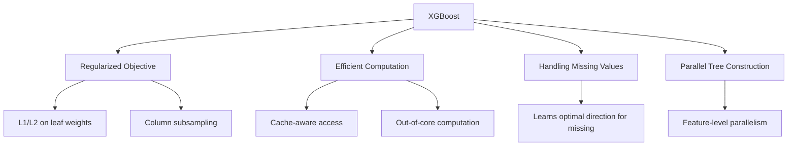
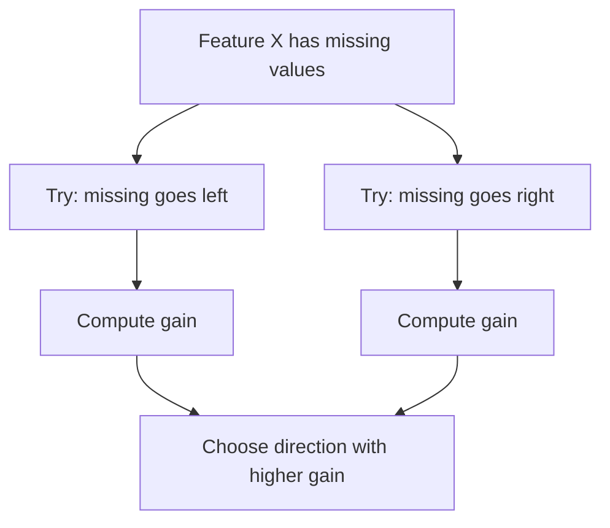

# XGBoost

## Overview

XGBoost (eXtreme Gradient Boosting) is the **dominant algorithm for tabular data** competitions and widely used in industry. It extends gradient boosting with regularization, efficient computation, and practical optimizations.

## Key Innovations



## Regularized Objective

Unlike vanilla gradient boosting, XGBoost adds regularization:

$$\text{Obj} = \sum_{i=1}^n L(y_i, \hat{y}_i) + \sum_{k=1}^K \Omega(f_k)$$

Where the regularization term:

$$\Omega(f) = \gamma T + \frac{1}{2}\lambda \sum_{j=1}^T w_j^2$$

- T: Number of leaves
- wⱼ: Leaf weights
- γ: Complexity penalty per leaf
- λ: L2 regularization on leaf weights

```python
import xgboost as xgb

# XGBoost parameters
params = {
    'objective': 'binary:logistic',
    'eval_metric': 'logloss',
    'max_depth': 6,
    'learning_rate': 0.1,
    'subsample': 0.8,
    'colsample_bytree': 0.8,
    'reg_alpha': 0.1,      # L1 regularization
    'reg_lambda': 1.0,      # L2 regularization
    'gamma': 0.1,           # Minimum loss reduction for split
    'min_child_weight': 1,  # Minimum sum of hessian in child
}

# Training with early stopping
dtrain = xgb.DMatrix(X_train, label=y_train)
dval = xgb.DMatrix(X_val, label=y_val)

model = xgb.train(
    params, dtrain,
    num_boost_round=1000,
    evals=[(dval, 'val')],
    early_stopping_rounds=50,
    verbose_eval=100
)
```

## How XGBoost Finds Splits

### Exact Greedy Algorithm

For each feature, sort values and try all possible thresholds. O(n log n) per feature.

### Approximate Algorithm (Histogram-based)

For large datasets, use quantile sketches to propose candidate splits:

```python
# XGBoost uses weighted quantile sketch
# Approximates the distribution of gradients
# Proposes candidate split points
```

### Sparsity-Aware Split Finding

XGBoost learns the **optimal default direction** for missing values:

```python
# For each split, XGBoost tries:
# 1. Missing values go left
# 2. Missing values go right
# Picks the direction that improves the split most
```



## XGBoost Hyperparameters

### Tree Parameters

| Parameter | Description | Typical Range |
|-----------|-------------|---------------|
| max_depth | Maximum tree depth | 3-10 |
| min_child_weight | Minimum sum of hessian | 1-10 |
| gamma | Min loss reduction for split | 0-5 |
| max_leaves | Maximum number of leaves | 31-127 |

### Boosting Parameters

| Parameter | Description | Typical Range |
|-----------|-------------|---------------|
| learning_rate | Step size shrinkage | 0.01-0.3 |
| n_estimators | Number of trees | 100-10000 |
| subsample | Row sampling ratio | 0.5-1.0 |
| colsample_bytree | Column sampling per tree | 0.5-1.0 |
| colsample_bylevel | Column sampling per level | 0.5-1.0 |

### Regularization Parameters

| Parameter | Description | Typical Range |
|-----------|-------------|---------------|
| reg_alpha (α) | L1 regularization | 0-10 |
| reg_lambda (λ) | L2 regularization | 1-10 |
| scale_pos_weight | Balance positive/negative weights | sum(neg)/sum(pos) |

## Practical Usage

```python
from sklearn.model_selection import GridSearchCV
import xgboost as xgb

# Sklearn API
model = xgb.XGBClassifier(
    n_estimators=1000,
    max_depth=6,
    learning_rate=0.1,
    subsample=0.8,
    colsample_bytree=0.8,
    reg_alpha=0.1,
    reg_lambda=1.0,
    early_stopping_rounds=50,
    eval_metric='logloss',
    random_state=42
)

model.fit(X_train, y_train, eval_set=[(X_val, y_val)], verbose=False)

# Feature importance
importance = model.feature_importances_
# Types: 'weight' (split count), 'gain' (avg gain), 'cover' (avg samples)
```

### Hyperparameter Tuning

```python
from sklearn.model_selection import RandomizedSearchCV

param_dist = {
    'max_depth': [3, 4, 5, 6, 7, 8],
    'learning_rate': [0.01, 0.05, 0.1, 0.2],
    'subsample': [0.6, 0.7, 0.8, 0.9, 1.0],
    'colsample_bytree': [0.6, 0.7, 0.8, 0.9, 1.0],
    'reg_alpha': [0, 0.1, 1, 10],
    'reg_lambda': [0.1, 1, 5, 10],
    'min_child_weight': [1, 3, 5, 7],
    'gamma': [0, 0.1, 0.2, 0.5]
}

search = RandomizedSearchCV(
    xgb.XGBClassifier(n_estimators=500, early_stopping_rounds=30),
    param_dist, n_iter=100, cv=5, scoring='neg_log_loss', random_state=42
)
search.fit(X_train, y_train, eval_set=[(X_val, y_val)], verbose=False)
```

## XGBoost vs Vanilla Gradient Boosting

| Feature | Vanilla GBM | XGBoost |
|---------|------------|---------|
| Regularization | None | L1, L2 on leaf weights |
| Split finding | Exact greedy | Exact + approximate + histogram |
| Missing values | Imputation needed | Native handling |
| Parallelism | None | Feature-level |
| Out-of-core | No | Yes |
| Custom objectives | Limited | Full support |
| Column sampling | No | Yes |

## Interview Questions

### Beginner

**Q: What makes XGBoost so popular?**

A: XGBoost is popular because it:
1. Wins most tabular data competitions
2. Handles missing values natively
3. Has built-in regularization
4. Is fast (parallel, cache-aware)
5. Provides feature importance
6. Supports custom objectives and evaluation metrics
7. Works well with default parameters

**Q: What is the difference between XGBoost's L1 and L2 regularization?**

A: 
- **L1 (reg_alpha)**: Adds |w| penalty → produces sparse leaf weights (some leaves become zero)
- **L2 (reg_lambda)**: Adds w² penalty → shrinks leaf weights toward zero but not exactly zero
- Both prevent overfitting by limiting leaf weight magnitudes

### Intermediate

**Q: How does XGBoost handle missing values?**

A: XGBoost learns the optimal direction for missing values at each split. During training, it tries both directions (missing → left, missing → right) and picks whichever maximizes the gain. This is better than imputation because the optimal direction may differ at different splits.

**Q: Explain the weighted quantile sketch in XGBoost.**

A: For large datasets, trying all possible split points is expensive. XGBoost uses a weighted quantile sketch that:
1. Weights each data point by the hessian (second-order gradient)
2. Proposes candidate split points based on quantiles of the weighted distribution
3. This ensures splits are meaningful for the current loss function
4. Reduces complexity from O(n) to O(n log n) for finding candidates

### FAANG-Level

**Q: You're deploying XGBoost in a latency-sensitive production system (1ms per prediction). How do you optimize?**

A:
1. **Model compression**: Reduce n_estimators, use lower max_depth
2. **Tree pruning**: Set gamma higher to prune unnecessary branches
3. **Quantization**: Use `predictor='gpu_predictor'` or quantize model
4. **ONNX export**: Convert to ONNX format for optimized inference
5. **Cache optimization**: Smaller model fits in CPU cache
6. **Feature reduction**: Remove unused features (feature importance)
7. **Approximate prediction**: Use only top-K important features
8. **Batch prediction**: If possible, batch predictions for vectorized computation

## Common Mistakes

1. **Not using early stopping**: Always use validation set for early stopping
2. **Too high learning rate**: Start with 0.1, reduce if overfitting
3. **Not tuning regularization**: Default λ=1 is often too low
4. **Ignoring feature importance**: Use 'gain' importance, not 'weight'
5. **Using too many trees without early stopping**: Wastes computation, may overfit

## Summary

| Component | XGBoost Innovation |
|-----------|-------------------|
| Objective | Regularized: Loss + Ω(f) |
| Split finding | Exact, approximate, histogram |
| Missing values | Learns optimal direction |
| Parallelism | Feature-level |
| Regularization | L1, L2, gamma, column sampling |

## Cross-References

- [Gradient Boosting](gradient-boosting.md) — The foundation
- [LightGBM](lightgbm.md) — Faster alternative
- [CatBoost](catboost.md) — Better categorical handling
- [Regularization](../foundations/regularization.md) — L1/L2 theory
- [Decision Trees](decision-trees.md) — The base learner
