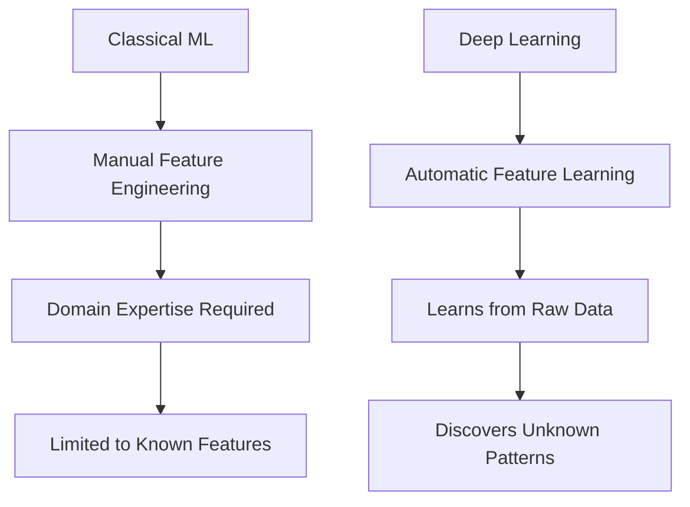
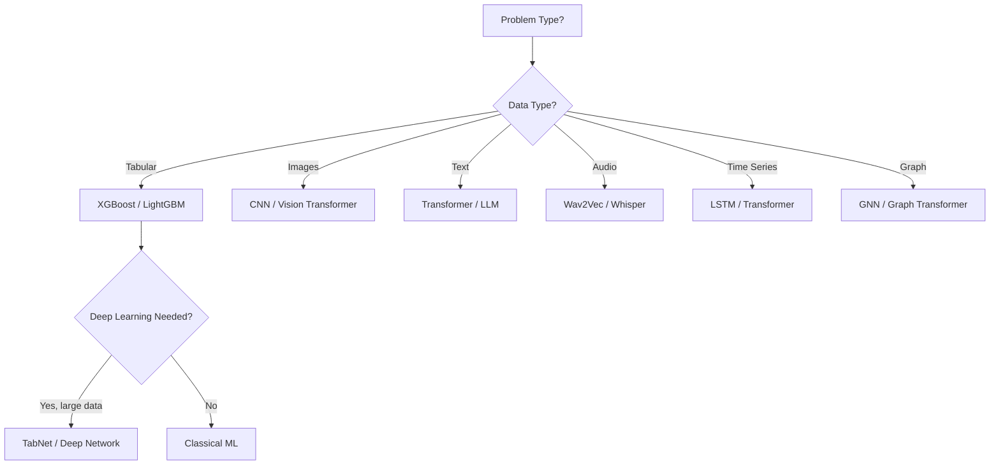
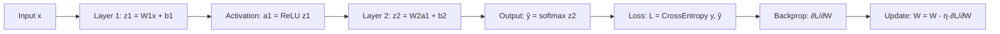
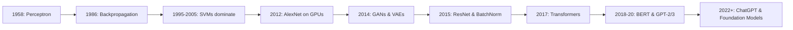
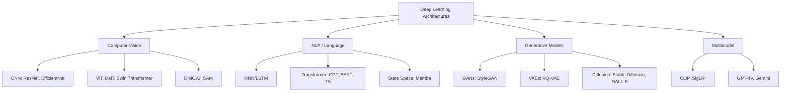

# Deep Learning

## Overview

Deep learning uses **artificial neural networks with multiple layers** to learn hierarchical representations of data. Unlike classical ML where features are hand-engineered, deep learning **automatically discovers** the representations needed for detection or classification.

## Why Deep Learning?

| Aspect | Classical ML | Deep Learning |
|--------|-------------|---------------|
| Features | Manual engineering | Automatic learning |
| Data requirements | Small to medium | Large (thousands+) |
| Compute | CPU | GPU/TPU |
| Interpretability | High | Low (black box) |
| Performance on unstructured data | Limited | State-of-the-art |
| Training time | Minutes | Hours to days |

## When to Use Deep Learning

**Use deep learning when:**
- You have large amounts of labeled data (>10K samples)
- The task involves unstructured data (images, text, audio, video)
- Manual feature engineering is difficult or impossible
- State-of-the-art accuracy is required
- You have sufficient compute resources (GPUs)

**Don't use deep learning when:**
- You have small tabular data (<1K samples) — try XGBoost/LightGBM first
- Interpretability is critical (medical, legal, finance)
- Compute budget is very limited
- The problem is well-served by simpler models

## How Neural Networks Learn

A neural network learns by:
1. **Forward pass**: Input flows through layers, producing a prediction
2. **Loss computation**: Compare prediction to ground truth
3. **Backward pass (backpropagation)**: Compute gradients of loss w.r.t. each parameter
4. **Parameter update**: Adjust weights using an optimizer (SGD, Adam)

## Key Concepts Deep Dive

### Activation Functions

| Function | Formula | Range | Pros | Cons |
|----------|---------|-------|------|------|
| Sigmoid | 1/(1+e^(-x)) | (0,1) | Good for probabilities | Vanishing gradient |
| Tanh | (e^x - e^(-x))/(e^x + e^(-x)) | (-1,1) | Zero-centered | Vanishing gradient |
| ReLU | max(0, x) | [0,∞) | No vanishing gradient, fast | Dead neurons |
| Leaky ReLU | max(0.01x, x) | (-∞,∞) | Fixes dead neurons | Extra hyperparameter |
| GELU | x·Φ(x) | (-∞,∞) | Smooth, used in Transformers | Computationally heavier |
| Swish | x·σ(x) | (-∞,∞) | Self-gated, smooth | Computationally heavier |
| SiLU | x·σ(x) | (-∞,∞) | Same as Swish, used in LLMs | Same as Swish |

**Interview tip:** ReLU is the default for hidden layers. Sigmoid/softmax for output layers. GELU/Swish are standard in Transformers.

### Weight Initialization

| Method | Formula | Best For |
|--------|---------|----------|
| Xavier/Glorot | W ~ N(0, 1/n_in) | Sigmoid/Tanh activations |
| He/Kaiming | W ~ N(0, 2/n_in) | ReLU activations |
| Orthogonal | W is orthogonal matrix | RNNs |

**Why it matters:** Bad initialization → vanishing/exploding gradients → training fails.

### Batch Normalization vs Layer Normalization

| Aspect | Batch Norm | Layer Norm |
|--------|-----------|-----------|
| Normalizes across | Batch dimension | Feature dimension |
| Works with | CNNs, large batches | Transformers, RNNs, small batches |
| Batch dependency | Yes (different train/test) | No |
| Used in | ResNet, EfficientNet | GPT, BERT, Llama |

## Topics in This Section

| Topic | Key Concepts | Interview Frequency |
|-------|-------------|-------------------|
| [Neural Network Basics](nn-basics.md) | Perceptron, MLP, universal approximation | ⭐⭐⭐⭐⭐ |
| [Backpropagation](backpropagation.md) | Chain rule, computational graphs | ⭐⭐⭐⭐⭐ |
| [Activation Functions](activation.md) | ReLU, sigmoid, GELU, Swish | ⭐⭐⭐⭐ |
| [CNNs](cnn.md) | Convolution, pooling, ResNet | ⭐⭐⭐⭐⭐ |
| [RNNs & LSTMs](rnn-lstm.md) | Vanilla RNN, LSTM, GRU | ⭐⭐⭐⭐ |
| [Batch Normalization](batch-norm.md) | Layer norm, group norm | ⭐⭐⭐⭐ |
| [Dropout](dropout.md) | Training vs inference | ⭐⭐⭐⭐ |
| [Optimizers](optimizers.md) | Adam, AdamW, learning rate schedules | ⭐⭐⭐⭐⭐ |
| [Transfer Learning](transfer-learning.md) | Fine-tuning, feature extraction | ⭐⭐⭐⭐ |
| [Attention Mechanism](attention.md) | Self-attention, multi-head attention | ⭐⭐⭐⭐⭐ |

## The Deep Learning Revolution

### Key Breakthroughs

| Year | Breakthrough | Impact |
|------|-------------|--------|
| 2012 | AlexNet wins ImageNet | GPU training, ReLU, dropout — DL revolution begins |
| 2014 | GANs | Generative models, image synthesis |
| 2015 | ResNet (skip connections) | Train very deep networks (100+ layers) |
| 2015 | Batch Normalization | Faster, more stable training |
| 2017 | Transformers | Self-attention replaces recurrence for sequences |
| 2018 | BERT | Pre-training + fine-tuning paradigm for NLP |
| 2020 | GPT-3 | Scaling laws, few-shot learning, in-context learning |
| 2022 | ChatGPT | LLMs as general-purpose AI assistants |
| 2023-25 | Multimodal models | Vision + language + audio in one model |

## Common Interview Questions

### Architecture Questions

1. **Explain the vanishing gradient problem.**
   In deep networks with sigmoid/tanh activations, gradients shrink exponentially as they propagate backward through layers. Early layers learn extremely slowly. Solutions: ReLU activation, skip connections (ResNet), proper initialization (He), batch/layer normalization.

2. **Why do skip connections (ResNets) work?**
   Skip connections create an "identity shortcut" that allows gradients to flow directly through the network. Instead of learning H(x), the layer learns the residual F(x) = H(x) - x. If the identity is sufficient, F(x) = 0 is easy to learn. This enables training networks with hundreds or thousands of layers.

3. **What is the universal approximation theorem?**
   A feedforward network with a single hidden layer containing a finite number of neurons can approximate any continuous function on a compact subset of R^n, given appropriate weights. *However*, it doesn't say how many neurons are needed or how to find the weights — deeper networks are more parameter-efficient in practice.

4. **Compare CNNs and Transformers for vision.**
   CNNs: local receptive fields, translation invariance, parameter-efficient, good with small data. Vision Transformers (ViT): global attention, better with large data, capture long-range dependencies. Hybrid approaches (ConvNeXt) combine both.

### Training Questions

5. **How do you choose a learning rate?**
   Start with learning rate finder (increase LR until loss diverges, pick 10x less). Use schedulers: cosine annealing, step decay, warmup + decay. Adam default: 1e-3. Fine-tuning: 1e-5 to 1e-4. Too high → loss explodes. Too low → slow convergence, stuck in local minima.

6. **What is gradient clipping and when do you use it?**
   Limiting gradient magnitude to prevent exploding gradients. Clip by value (max ±1.0) or by norm (scale if norm > threshold). Essential for RNNs and Transformers during training.

7. **How do you handle overfitting in deep learning?**
   (1) More data / data augmentation. (2) Regularization: dropout, weight decay. (3) Early stopping on validation loss. (4) Reduce model complexity. (5) Batch/layer normalization. (6) Transfer learning (pre-trained features).

### Practical Questions

8. **Your training loss is decreasing but validation loss is increasing. What's happening?**
   Overfitting. The model is memorizing training data instead of generalizing. Solutions: add dropout/regularization, get more data, use data augmentation, simplify the model, or use early stopping.

9. **Your model's loss is NaN. What do you check?**
   (1) Learning rate too high. (2) Bad data (NaN/Inf values). (3) Exploding gradients (add gradient clipping). (4) Numerical instability (log of 0, division by 0). (5) Bad initialization.

10. **How do you debug a deep learning model?**
    (1) Overfit a single batch first (verify learning is possible). (2) Check data pipeline (visualize inputs/labels). (3) Start simple (small model, known architecture). (4) Monitor gradients (vanishing/exploding). (5) Compare to a baseline.

## Modern DL Architecture Landscape

## Cross-References

- [Neural Network Basics](./nn-basics.md)
- [Transformers](../transformers/README.md)
- [Classical ML](../classical/README.md)
- [Optimizers](./optimizers.md)
- [GPU Architecture](../../cloud/virtualization/README.md)
- [ML Foundations](../foundations/README.md)

## References

- Goodfellow, I., Bengio, Y., & Courville, A. (2016). *Deep Learning* (deeplearningbook.org)
- Bishop, C. (2024). *Deep Learning: Foundations and Concepts* — Latest comprehensive text
- He, K. et al. (2015). "Deep Residual Learning for Image Recognition" — ResNet paper
- Vaswani, A. et al. (2017). "Attention Is All You Need" — Transformer paper
- Karpathy, A. (2022). *Neural Networks: Zero to Hero* (YouTube) — Best practical DL course
