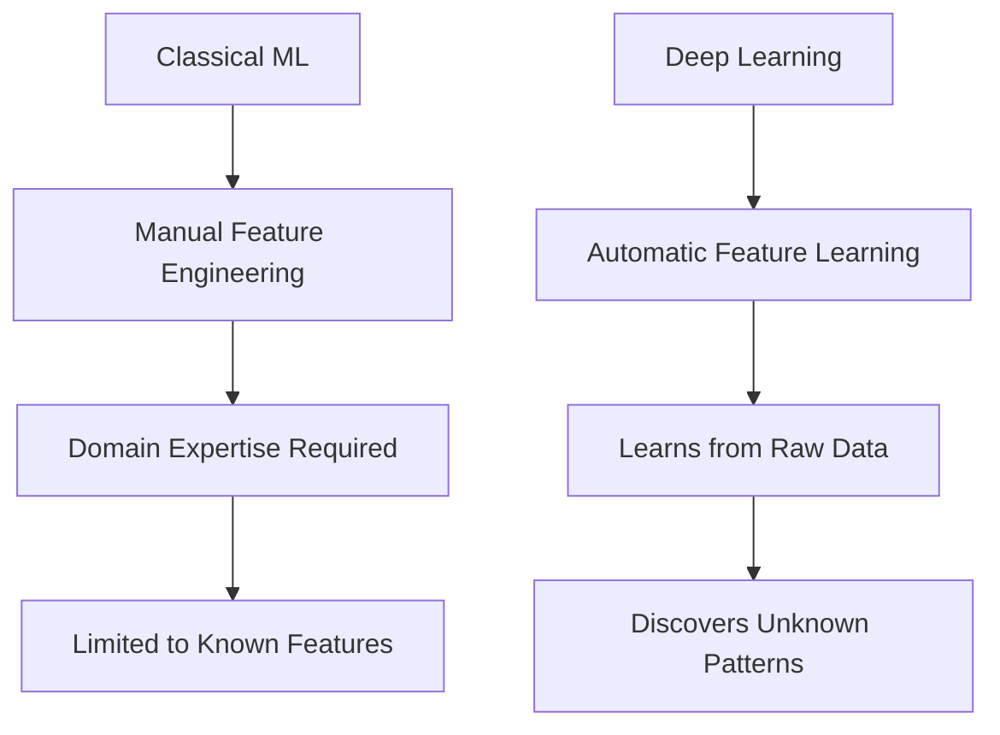
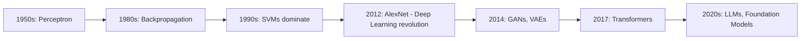

# Deep Learning

## Overview

Deep learning uses **artificial neural networks with multiple layers** to learn hierarchical representations of data. Unlike classical ML where features are hand-engineered, deep learning **automatically discovers** the representations needed for detection or classification.

## Why Deep Learning?

| Aspect | Classical ML | Deep Learning |
|--------|-------------|---------------|
| Features | Manual engineering | Automatic learning |
| Data requirements | Small to medium | Large |
| Compute | CPU | GPU/TPU |
| Interpretability | High | Low |
| Performance on unstructured data | Limited | State-of-the-art |

## Topics in This Section

| Topic | Key Concepts | Interview Frequency |
|-------|-------------|-------------------|
| [Neural Network Basics](nn-basics.md) | Perceptron, MLP, universal approximation | ⭐⭐⭐⭐⭐ |
| [Backpropagation](backpropagation.md) | Chain rule, computational graphs | ⭐⭐⭐⭐⭐ |
| [Activation Functions](activation.md) | ReLU, sigmoid, GELU, Swish | ⭐⭐⭐⭐ |
| [CNNs](cnn.md) | Convolution, pooling, ResNet | ⭐⭐⭐⭐⭐ |
| [RNNs & LSTMs](rnn-lstm.md) | Vanilla RNN, LSTM, GRU | ⭐⭐⭐⭐ |
| [Batch Normalization](batch-norm.md) | Layer norm, group norm | ⭐⭐⭐⭐ |
| [Dropout](dropout.md) | Training vs inference | ⭐⭐⭐⭐ |
| [Optimizers](optimizers.md) | Adam, AdamW, learning rate schedules | ⭐⭐⭐⭐⭐ |
| [Transfer Learning](transfer-learning.md) | Fine-tuning, feature extraction | ⭐⭐⭐⭐ |
| [Attention Mechanism](attention.md) | Self-attention, multi-head attention | ⭐⭐⭐⭐⭐ |

## The Deep Learning Revolution

Key breakthroughs:
- **2012**: AlexNet wins ImageNet (GPU training, ReLU, dropout)
- **2014**: GANs (generative models), VAEs
- **2015**: ResNet (skip connections), Batch Normalization
- **2017**: Transformers ("Attention is All You Need")
- **2018-2020**: BERT, GPT-2/3 (pre-training revolution)
- **2022+**: ChatGPT, GPT-4 (LLMs as general-purpose AI)

## Cross-References

- [Neural Network Basics](./nn-basics.md)
- [Transformers](../transformers/README.md)
- [Classical ML](../classical/README.md)
- [Optimizers](./optimizers.md)
- [GPU Architecture](../../cloud/virtualization/README.md)

