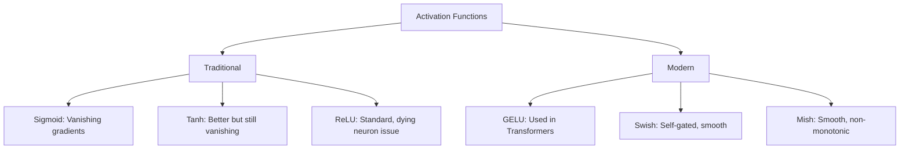
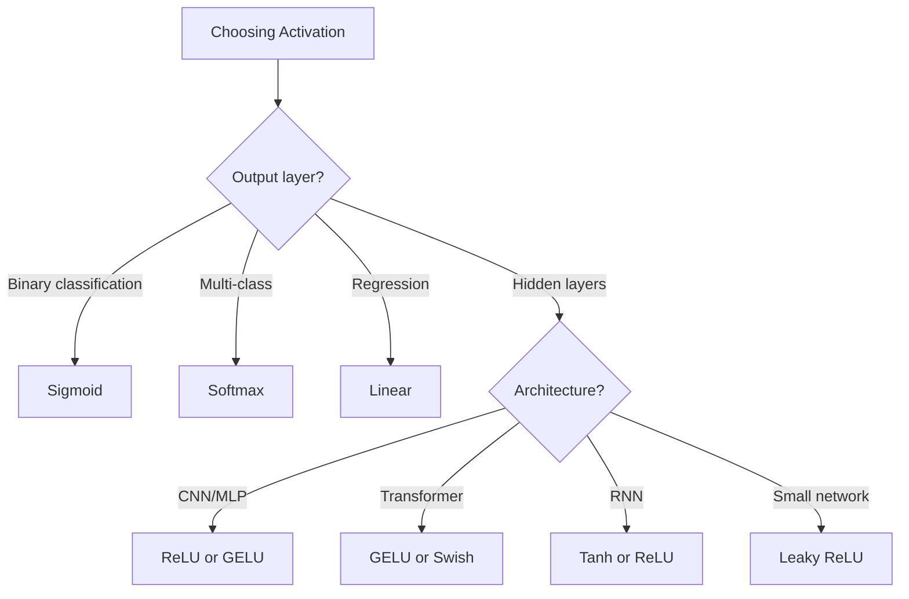

# Activation Functions

## Overview

Activation functions introduce **non-linearity** into neural networks, enabling them to learn complex patterns. Without them, a multi-layer network would be equivalent to a single linear layer.

## Why Non-Linearity?

```python
# Without activation: y = W₂(W₁x + b₁) + b₂ = W'x + b'
# This is just a linear transformation — no matter how many layers!
# With activation: y = σ(W₂σ(W₁x + b₁) + b₂)
# Now the network can learn non-linear functions
```

## Common Activation Functions

### Sigmoid

\\[\sigma(z) = \frac{1}{1 + e^{-z}}\\]

```python
def sigmoid(z):
    return 1 / (1 + np.exp(-z))

def sigmoid_derivative(z):
    s = sigmoid(z)
    return s * (1 - s)
```

**Properties**:
- Output range: (0, 1)
- Smooth, differentiable everywhere
- **Problems**: Vanishing gradients (derivative ≤ 0.25), not zero-centered, expensive to compute

**Use case**: Output layer for binary classification

### Tanh

\\[\tanh(z) = \frac{e^z - e^{-z}}{e^z + e^{-z}}\\]

```python
def tanh(z):
    return np.tanh(z)

def tanh_derivative(z):
    return 1 - np.tanh(z)**2
```

**Properties**:
- Output range: (-1, 1)
- Zero-centered (better than sigmoid)
- **Problem**: Still has vanishing gradients (derivative ≤ 1)

**Use case**: Hidden layers in RNNs (historically)

### ReLU (Rectified Linear Unit)

\\[\text{ReLU}(z) = \max(0, z)\\]

```python
def relu(z):
    return np.maximum(0, z)

def relu_derivative(z):
    return (z > 0).astype(float)
```

**Properties**:
- Output range: [0, ∞)
- No vanishing gradient for positive values
- Fast to compute
- **Problems**: Not zero-centered, "dying ReLU" (neurons stuck at 0)

**Use case**: Default for hidden layers in CNNs and MLPs

### Leaky ReLU

\\[\text{LeakyReLU}(z) = \begin{cases} z & \text{if } z > 0 \\ \alpha z & \text{if } z \leq 0 \end{cases}\\]

```python
def leaky_relu(z, alpha=0.01):
    return np.where(z > 0, z, alpha * z)
```

**Benefit**: Prevents dying ReLU — small gradient for negative values

### Parametric ReLU (PReLU)

\\[\text{PReLU}(z) = \begin{cases} z & \text{if } z > 0 \\ a z & \text{if } z \leq 0 \end{cases}\\]

Where `a` is a learnable parameter.

### ELU (Exponential Linear Unit)

\\[\text{ELU}(z) = \begin{cases} z & \text{if } z > 0 \\ \alpha(e^z - 1) & \text{if } z \leq 0 \end{cases}\\]

```python
def elu(z, alpha=1.0):
    return np.where(z > 0, z, alpha * (np.exp(z) - 1))
```

**Benefit**: Smooth, mean activations closer to zero

### GELU (Gaussian Error Linear Unit)

Used in **Transformers** (BERT, GPT):

\\[\text{GELU}(z) = z \cdot \Phi(z) \approx 0.5z\left(1 + \tanh\left[\sqrt{2/\pi}(z + 0.044715z^3)\right]\right)\\]

Where Φ is the CDF of standard normal.

```python
def gelu(z):
    return 0.5 * z * (1 + np.tanh(np.sqrt(2/np.pi) * (z + 0.044715 * z**3)))

# PyTorch
import torch.nn as nn
activation = nn.GELU()
```

**Why GELU?**: Smooth approximation of ReLU, accounts for input magnitude. Used in BERT, GPT, Vision Transformers.

### Swish / SiLU

\\[\text{Swish}(z) = z \cdot \sigma(z) = \frac{z}{1 + e^{-z}}\\]

```python
def swish(z):
    return z * sigmoid(z)
```

**Properties**:
- Smooth, non-monotonic
- Self-gated (input times sigmoid of input)
- Used in EfficientNet, some modern architectures

### Mish

\\[\text{Mish}(z) = z \cdot \tanh(\text{softplus}(z)) = z \cdot \tanh(\ln(1 + e^z))\\]

```python
def mish(z):
    return z * np.tanh(np.log(1 + np.exp(z)))
```

**Properties**: Smooth, non-monotonic. Used in YOLOv4.

## Activation Function Comparison



| Function | Range | Zero-centered | Vanishing Gradient | Used In |
|----------|-------|--------------|-------------------|---------|
| Sigmoid | (0,1) | No | Yes | Output layer |
| Tanh | (-1,1) | Yes | Yes | RNNs |
| ReLU | [0,∞) | No | No (positive) | CNNs, MLPs |
| Leaky ReLU | (-∞,∞) | No | No | General |
| GELU | (-0.17,∞) | No | No | Transformers |
| Swish | (-0.28,∞) | No | No | EfficientNet |

## Choosing Activation Functions



## Interview Questions

### Beginner

**Q: Why can't we use linear activation functions?**

A: A composition of linear functions is still linear: f(g(x)) = ax + b. Multiple linear layers collapse into a single linear layer. Non-linear activations allow the network to learn complex, non-linear patterns.

**Q: What is the dying ReLU problem?**

A: If a ReLU neuron's input is always negative, its output is always 0 and its gradient is always 0. The neuron "dies" and stops learning entirely. This can happen with large learning rates or poor initialization.

### Intermediate

**Q: Why is ReLU preferred over sigmoid for hidden layers?**

A: 
1. **No vanishing gradient**: ReLU's gradient is 1 for positive inputs (sigmoid is ≤ 0.25)
2. **Computational efficiency**: Just a max operation vs. expensive exponential
3. **Sparse activation**: Only ~50% of neurons activate → efficient representation
4. **Convergence**: ReLU networks converge faster in practice

**Q: When would you use GELU over ReLU?**

A: GELU is preferred in Transformers because:
1. **Smooth**: Differentiable everywhere (ReLU has a kink at 0)
2. **Non-monotonic**: Can decrease for negative inputs, allowing "forgetting"
3. **Probabilistic interpretation**: Gates inputs by their magnitude under a Gaussian
4. **Empirical success**: BERT, GPT, ViT all use GELU

### FAANG-Level

**Q: You're designing a new activation function. What properties should it have?**

A: Ideal properties:
1. **Non-linear**: Essential for learning complex patterns
2. **Differentiable everywhere**: Smooth optimization landscape
3. **Non-saturating**: No vanishing gradients (unlike sigmoid/tanh)
4. **Zero-centered**: Mean activation ≈ 0 for faster convergence
5. **Computationally cheap**: Fast forward and backward pass
6. **Monotonic or mildly non-monotonic**: Stable gradients
7. **Bounded below, unbounded above**: Prevents dead neurons while allowing large outputs
8. **Parameter-free or learnable**: No hyperparameter tuning needed

GELU, Swish, and Mish are good approximations of this ideal. The trend is toward smooth, self-gated activations.

## Common Mistakes

1. **Using sigmoid in hidden layers**: Causes vanishing gradients; use ReLU
2. **Not using activation between layers**: Network becomes linear
3. **Using softmax for multi-label**: Use sigmoid with BCE for multi-label
4. **Forgetting activation on output layer**: Linear for regression, sigmoid/softmax for classification
5. **Using ReLU with large learning rates**: Can cause dead neurons; use LeakyReLU or smaller LR

## Summary

| Activation | Formula | Best For |
|-----------|---------|----------|
| Sigmoid | 1/(1+e⁻ᶻ) | Binary output |
| Tanh | (eᶻ-e⁻ᶻ)/(eᶻ+e⁻ᶻ) | RNN hidden states |
| ReLU | max(0,z) | Default hidden layer |
| GELU | z·Φ(z) | Transformers |
| Swish | z·σ(z) | Modern architectures |

## Cross-References

- [Backpropagation](backpropagation.md) — How activation derivatives affect gradients
- [CNNs](cnn.md) — ReLU is standard for CNNs
- [Transformers](../transformers/architecture.md) — GELU in transformers
- [Batch Normalization](batch-norm.md) — Normalization interacts with activations
