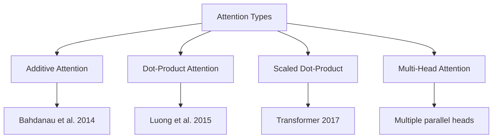
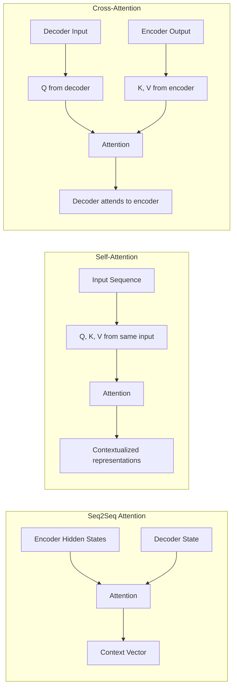

# Attention Mechanism

## Overview

The attention mechanism allows neural networks to **focus on relevant parts** of the input when producing output. Originally introduced for machine translation (Bahdanau et al., 2014), attention has become the cornerstone of modern deep learning, replacing recurrence in the Transformer architecture. It computes a weighted sum of values, where the weights are determined by the compatibility between queries and keys.

## Types of Attention



## 1. Additive Attention (Bahdanau)

$$\text{score}(s_{t-1}, h_j) = v^T \tanh(W_1 s_{t-1} + W_2 h_j)$$

$$\alpha_{tj} = \frac{\exp(\text{score}(s_{t-1}, h_j))}{\sum_{k=1}^{n} \exp(\text{score}(s_{t-1}, h_k))}$$

$$c_t = \sum_{j=1}^{n} \alpha_{tj} h_j$$

- Uses a small feed-forward network to compute alignment
- More flexible but slower than dot-product

## 2. Scaled Dot-Product Attention

$$\text{Attention}(Q, K, V) = \text{softmax}\left(\frac{QK^T}{\sqrt{d_k}}\right)V$$

```python
import torch
import torch.nn.functional as F
import math

def attention(Q, K, V, mask=None):
    """
    Q: (batch, seq_q, d_k)
    K: (batch, seq_k, d_k)  
    V: (batch, seq_k, d_v)
    """
    d_k = Q.size(-1)
    scores = torch.matmul(Q, K.transpose(-2, -1)) / math.sqrt(d_k)
    
    if mask is not None:
        scores = scores.masked_fill(mask == 0, -1e9)
    
    weights = F.softmax(scores, dim=-1)
    return torch.matmul(weights, V), weights
```

## 3. Multi-Head Attention

```python
class MultiHeadAttention(nn.Module):
    def __init__(self, d_model, n_heads):
        super().__init__()
        self.d_k = d_model // n_heads
        self.n_heads = n_heads
        self.W_q = nn.Linear(d_model, d_model)
        self.W_k = nn.Linear(d_model, d_model)
        self.W_v = nn.Linear(d_model, d_model)
        self.W_o = nn.Linear(d_model, d_model)
    
    def forward(self, Q, K, V, mask=None):
        batch_size = Q.size(0)
        
        Q = self.W_q(Q).view(batch_size, -1, self.n_heads, self.d_k).transpose(1, 2)
        K = self.W_k(K).view(batch_size, -1, self.n_heads, self.d_k).transpose(1, 2)
        V = self.W_v(V).view(batch_size, -1, self.n_heads, self.d_k).transpose(1, 2)
        
        attn_output, weights = attention(Q, K, V, mask)
        attn_output = attn_output.transpose(1, 2).contiguous().view(batch_size, -1, self.n_heads * self.d_k)
        
        return self.W_o(attn_output)
```

## Attention in Different Contexts



| Type | Q from | K, V from | Used In |
|------|--------|-----------|---------|
| Self-attention | Same sequence | Same sequence | BERT, GPT |
| Cross-attention | Decoder | Encoder | T5, translation |
| Seq2Seq attention | Decoder step | All encoder states | Original NMT |

## Interview Questions

### Q1: What is the attention mechanism and why is it important?
**Answer:** Attention computes a weighted sum of values, where weights are determined by the compatibility between queries and keys. It allows the model to focus on relevant parts of the input. It's important because it: 1) captures long-range dependencies directly, 2) enables parallel computation (unlike RNNs), 3) provides interpretability through attention weights.

### Q2: Why scale by $\sqrt{d_k}$?
**Answer:** The dot product $q \cdot k$ has variance proportional to $d_k$. For large dimensions, this pushes softmax into saturation (gradients near zero). Scaling by $\sqrt{d_k}$ keeps variance at 1, ensuring useful gradients during training.

### Q3: What's the difference between self-attention and cross-attention?
**Answer:** Self-attention: Q, K, V all come from the same sequence (the sequence attends to itself). Cross-attention: Q comes from one sequence (e.g., decoder), while K and V come from another (e.g., encoder). Cross-attention is used in encoder-decoder models to let the decoder attend to the encoder's output.

## Summary

The attention mechanism computes weighted sums based on query-key compatibility. Scaled dot-product attention is the efficient core of Transformers. Multi-head attention enables learning different relationship patterns in parallel. Self-attention processes a single sequence; cross-attention connects two sequences.

## Cross-References

- [Self-Attention →](../transformers/self-attention.md) Detailed Transformer attention
- [Multi-Head Attention →](../transformers/self-attention.md) Multi-head mechanism
- [RNNs & LSTMs →](rnn-lstm.md) Pre-attention sequence models
- [Transformers →](../transformers/README.md) Full Transformer architecture
