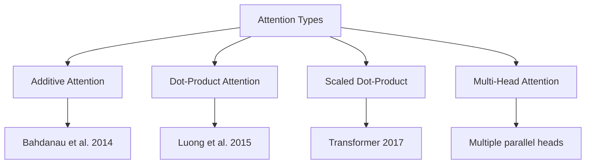
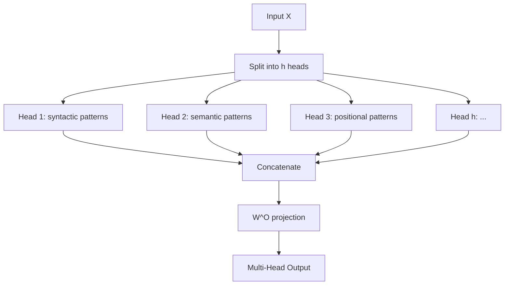
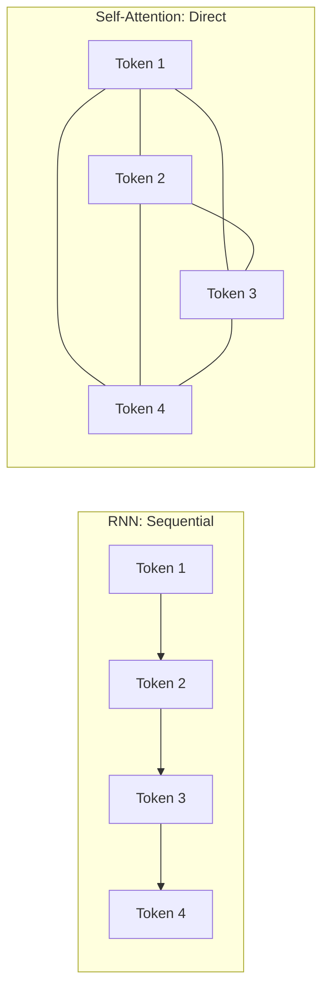
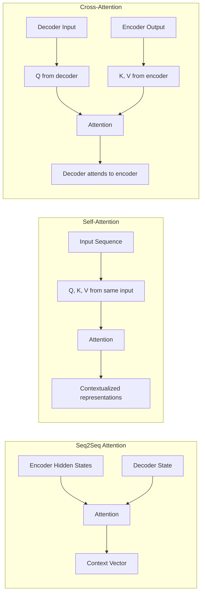
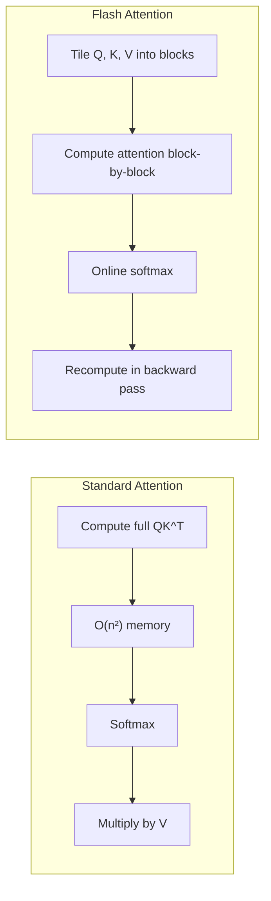

# Attention Mechanism

## Overview

The attention mechanism allows neural networks to **focus on relevant parts** of the input when producing output. Originally introduced for machine translation (Bahdanau et al., 2014), attention has become the cornerstone of modern deep learning, replacing recurrence in the Transformer architecture. It computes a weighted sum of values, where the weights are determined by the compatibility between queries and keys.

## Types of Attention



## 1. Additive Attention (Bahdanau)

The original attention mechanism uses a small feed-forward network to compute alignment scores:

\\[\text{score}(s_{t-1}, h_j) = v^T \tanh(W_1 s_{t-1} + W_2 h_j)\\]

\\[\alpha_{tj} = \frac{\exp(\text{score}(s_{t-1}, h_j))}{\sum_{k=1}^{n} \exp(\text{score}(s_{t-1}, h_k))}\\]

\\[c_t = \sum_{j=1}^{n} \alpha_{tj} h_j\\]

**Intuition**: The alignment model learns which source words are most relevant for predicting the next target word. The vector $v$ and matrices $W_1, W_2$ are learned jointly with the rest of the model.

```python
import torch
import torch.nn as nn

class AdditiveAttention(nn.Module):
    def __init__(self, encoder_dim, decoder_dim, attention_dim):
        super().__init__()
        self.W_enc = nn.Linear(encoder_dim, attention_dim, bias=False)
        self.W_dec = nn.Linear(decoder_dim, attention_dim, bias=False)
        self.v = nn.Linear(attention_dim, 1, bias=False)
    
    def forward(self, encoder_outputs, decoder_hidden):
        # encoder_outputs: (batch, src_len, encoder_dim)
        # decoder_hidden: (batch, decoder_dim)
        
        # Project encoder and decoder
        enc_proj = self.W_enc(encoder_outputs)   # (batch, src_len, attn_dim)
        dec_proj = self.W_dec(decoder_hidden).unsqueeze(1)  # (batch, 1, attn_dim)
        
        # Compute alignment scores
        scores = self.v(torch.tanh(enc_proj + dec_proj)).squeeze(-1)  # (batch, src_len)
        
        # Normalize with softmax
        weights = torch.softmax(scores, dim=-1)
        
        # Weighted sum of encoder outputs
        context = torch.bmm(weights.unsqueeze(1), encoder_outputs).squeeze(1)
        return context, weights
```

**Pros**: More flexible, can model complex alignment patterns.
**Cons**: Requires an extra feed-forward layer, slower than dot-product.

## 2. Dot-Product Attention (Luong)

Simpler — uses the dot product directly as the compatibility function:

\\[\text{score}(s_t, h_j) = s_t^T h_j\\]

This is much faster to compute (just a matrix multiplication) but assumes the query and key have the same dimensionality.

## 3. Scaled Dot-Product Attention

The core attention operation used in Transformers:

\\[\text{Attention}(Q, K, V) = \text{softmax}\left(\frac{QK^T}{\sqrt{d_k}}\right)V\\]

### Why Scale by $\sqrt{d_k}$?

If $q$ and $k$ are independent random vectors with mean 0 and variance 1, their dot product $q \cdot k = \sum_{i=1}^{d_k} q_i k_i$ has:

- **Mean**: $E[q \cdot k] = 0$
- **Variance**: $\text{Var}[q \cdot k] = d_k$

For large $d_k$ (e.g., 64 or 128), the dot products become very large in magnitude. This pushes the softmax function into regions where gradients are extremely small (saturation). Scaling by $\sqrt{d_k}$ normalizes the variance back to 1, keeping the softmax in a regime with useful gradients.

```python
import torch
import torch.nn.functional as F
import math

def scaled_dot_product_attention(Q, K, V, mask=None):
    """
    Q: (batch, heads, seq_q, d_k)
    K: (batch, heads, seq_k, d_k)
    V: (batch, heads, seq_k, d_v)
    mask: (batch, 1, 1, seq_k) or (batch, 1, seq_q, seq_k)
    """
    d_k = Q.size(-1)
    scores = torch.matmul(Q, K.transpose(-2, -1)) / math.sqrt(d_k)
    
    if mask is not None:
        scores = scores.masked_fill(mask == 0, -1e9)
    
    weights = F.softmax(scores, dim=-1)
    return torch.matmul(weights, V), weights
```

### Step-by-Step Numerical Example

```python
import torch

# Single head, single batch, sequence length 3, d_k = 4
Q = torch.tensor([[[1.0, 0.0, 1.0, 0.0],
                    [0.0, 1.0, 0.0, 1.0],
                    [1.0, 1.0, 0.0, 0.0]]])  # (1, 3, 4)

K = torch.tensor([[[1.0, 0.0, 1.0, 0.0],
                    [0.0, 1.0, 0.0, 1.0],
                    [1.0, 1.0, 0.0, 0.0]]])  # (1, 3, 4)

V = torch.tensor([[[1.0, 2.0],
                    [3.0, 4.0],
                    [5.0, 6.0]]])  # (1, 3, 2)

# Step 1: Compute QK^T
scores = torch.matmul(Q, K.transpose(-2, -1))
# scores[0] = [[2, 0, 1],
#               [0, 2, 1],
#               [1, 1, 2]]

# Step 2: Scale by sqrt(d_k) = sqrt(4) = 2
d_k = Q.size(-1)
scaled_scores = scores / (d_k ** 0.5)
# scaled_scores[0] = [[1.0, 0.0, 0.5],
#                      [0.0, 1.0, 0.5],
#                      [0.5, 0.5, 1.0]]

# Step 3: Softmax
weights = torch.softmax(scaled_scores, dim=-1)
# Row 0: softmax([1.0, 0.0, 0.5]) ≈ [0.441, 0.163, 0.396]

# Step 4: Multiply by V
output = torch.matmul(weights, V)
# output[0, 0] ≈ 0.441*[1,2] + 0.163*[3,4] + 0.396*[5,6] ≈ [2.91, 3.80]
```

## 4. Multi-Head Attention

A single attention head can only attend to one type of relationship at a time. Multi-head attention runs $h$ attention operations in parallel, each learning different patterns:

\\[\text{MultiHead}(Q, K, V) = \text{Concat}(\text{head}_1, \dots, \text{head}_h)W^O\\]

\\[\text{head}_i = \text{Attention}(QW_i^Q, KW_i^K, VW_i^V)\\]

```python
class MultiHeadAttention(nn.Module):
    def __init__(self, d_model, n_heads):
        super().__init__()
        assert d_model % n_heads == 0, "d_model must be divisible by n_heads"
        self.d_k = d_model // n_heads
        self.n_heads = n_heads
        self.W_q = nn.Linear(d_model, d_model)
        self.W_k = nn.Linear(d_model, d_model)
        self.W_v = nn.Linear(d_model, d_model)
        self.W_o = nn.Linear(d_model, d_model)
    
    def forward(self, Q, K, V, mask=None):
        batch_size = Q.size(0)
        
        # Linear projections and reshape to (batch, heads, seq, d_k)
        Q = self.W_q(Q).view(batch_size, -1, self.n_heads, self.d_k).transpose(1, 2)
        K = self.W_k(K).view(batch_size, -1, self.n_heads, self.d_k).transpose(1, 2)
        V = self.W_v(V).view(batch_size, -1, self.n_heads, self.d_k).transpose(1, 2)
        
        # Scaled dot-product attention
        attn_output, weights = scaled_dot_product_attention(Q, K, V, mask)
        
        # Concatenate heads and project
        attn_output = attn_output.transpose(1, 2).contiguous().view(
            batch_size, -1, self.n_heads * self.d_k
        )
        return self.W_o(attn_output)
```



### What Different Heads Learn

Research (Voita et al., 2019; Clark et al., 2019) shows different heads specialize:

| Head Type | What It Attends To | Example |
|-----------|-------------------|---------|
| Syntactic | Subject-verb pairs, dependencies | "The cat **sat**" → cat→sat |
| Positional | Adjacent tokens, previous word | Token $i$ → Token $i-1$ |
| Semantic | Coreference, related words | "it" → "cat" |
| Rare tokens | Unusual or important words | Named entities |
| Delimiter | Separator tokens (SEP, CLS) | BERT's SEP token |

## 5. Self-Attention

Self-attention is when Q, K, V all come from the **same sequence**. Each token computes how much to attend to every other token in the sequence.

\\[Q = XW^Q, \quad K = XW^K, \quad V = XW^V\\]

```python
# Self-attention: query, key, value all from the same input
def self_attention(x, W_q, W_k, W_v, mask=None):
    Q = x @ W_q  # (batch, seq_len, d_k)
    K = x @ W_k  # (batch, seq_len, d_k)
    V = x @ W_v  # (batch, seq_len, d_v)
    return scaled_dot_product_attention(Q, K, V, mask)
```

**Key insight**: Self-attention creates a fully connected graph over the sequence — every token can directly interact with every other token, regardless of distance. This is fundamentally different from RNNs, which must propagate information through intermediate steps.



## 6. Cross-Attention

Cross-attention connects **two different sequences**. Q comes from one sequence (e.g., decoder), while K and V come from another (e.g., encoder).

\\[Q = YW^Q, \quad K = XW^K, \quad V = XW^V\\]

Where $Y$ is the decoder state and $X$ is the encoder output.

```python
def cross_attention(decoder_state, encoder_output, W_q, W_k, W_v):
    """
    decoder_state: (batch, tgt_len, d_model) — the query source
    encoder_output: (batch, src_len, d_model) — the key/value source
    """
    Q = decoder_state @ W_q  # From decoder
    K = encoder_output @ W_k  # From encoder
    V = encoder_output @ W_v  # From encoder
    return scaled_dot_product_attention(Q, K, V)
```

**Use cases**:
- Machine translation: decoder attends to encoder output
- Image captioning: text decoder attends to image features
- Retrieval-augmented generation: query attends to retrieved documents

## 7. Causal (Masked) Self-Attention

For autoregressive models (GPT), each token can only attend to **previous tokens** (and itself). A causal mask enforces this:

\\[\text{mask}_{ij} = \begin{cases} 1 & \text{if } j \leq i \\ 0 & \text{if } j > i \end{cases}\\]

```python
def create_causal_mask(seq_len):
    """Creates a lower-triangular mask for causal attention."""
    mask = torch.tril(torch.ones(seq_len, seq_len))
    return mask.unsqueeze(0).unsqueeze(0)  # (1, 1, seq_len, seq_len)

# Example: seq_len = 4
# mask = [[1, 0, 0, 0],
#         [1, 1, 0, 0],
#         [1, 1, 1, 0],
#         [1, 1, 1, 1]]
```

## 8. Attention Visualization

Understanding what attention heads learn is crucial for debugging and interpretability.

### Attention Heatmap

```python
import matplotlib.pyplot as plt
import numpy as np

def plot_attention_heatmap(attention_weights, source_tokens, target_tokens):
    """
    attention_weights: (tgt_len, src_len) numpy array
    """
    fig, ax = plt.subplots(figsize=(8, 6))
    cax = ax.matshow(attention_weights, cmap='viridis')
    fig.colorbar(cax)
    
    ax.set_xticks(range(len(source_tokens)))
    ax.set_yticks(range(len(target_tokens)))
    ax.set_xticklabels(source_tokens, rotation=45, ha='left')
    ax.set_yticklabels(target_tokens)
    
    ax.set_xlabel('Source')
    ax.set_ylabel('Target')
    ax.set_title('Attention Weights')
    plt.tight_layout()
    plt.show()
```

### BertViz: Interactive Attention Visualization

```python
# Using the bertviz library for transformer attention visualization
from bertviz import model_view, head_view
from transformers import AutoModel, AutoTokenizer

model = AutoModel.from_pretrained("bert-base-uncased", output_attentions=True)
tokenizer = AutoTokenizer.from_pretrained("bert-base-uncased")

inputs = tokenizer("The cat sat on the mat", return_tensors="pt")
outputs = model(**inputs)
attention = outputs.attentions  # Tuple of (layer, batch, head, seq, seq)

# Interactive visualization in Jupyter
head_view(attention, tokenizer.convert_ids_to_tokens(inputs["input_ids"][0]))
```

### Common Attention Patterns

| Pattern | Description | Interpretation |
|---------|-------------|----------------|
| Diagonal | Token attends to itself | Identity mapping |
| Vertical | Many tokens attend to one token | Important/focus token (e.g., CLS) |
| Horizontal | One token attends to many | Broad contextual gathering |
| Block-diagonal | Attends within local windows | Local context (common in early layers) |
| Stripe | Attends to specific positions | Positional patterns |

## Attention in Different Contexts



| Type | Q from | K, V from | Used In |
|------|--------|-----------|---------|
| Self-attention | Same sequence | Same sequence | BERT, GPT |
| Cross-attention | Decoder | Encoder | T5, translation |
| Seq2Seq attention | Decoder step | All encoder states | Original NMT |

## 9. Advanced Attention Variants

### Multi-Query Attention (MQA)

All attention heads share the same K and V projections:

\\[\text{head}_i = \text{Attention}(QW_i^Q, KW^K, VW^V)\\]

**Benefit**: Reduces KV cache size by $h\times$ during inference. Used in Falcon, PaLM.

### Grouped-Query Attention (GQA)

Groups of heads share KV projections. E.g., 32 Q heads with 8 KV groups.

**Benefit**: Balances quality and efficiency. Used in LLaMA 2, Mistral.

### Flash Attention

IO-aware exact attention with $O(n)$ memory by tiling computation to exploit GPU memory hierarchy (Dao et al., 2022).



## Interview Questions

### Q1: What is the attention mechanism and why is it important?
**Answer:** Attention computes a weighted sum of values, where weights are determined by query-key compatibility. It's important because: (1) captures long-range dependencies directly in O(1) hops, (2) enables parallel computation (unlike RNNs), (3) provides interpretability through attention weights, (4) is the core building block of Transformers.

### Q2: Why scale by $\sqrt{d_k}$?
**Answer:** The dot product $q \cdot k$ has variance $d_k$. For large dimensions, this pushes softmax into saturation (gradients near zero). Scaling by $\sqrt{d_k}$ keeps variance at 1, ensuring useful gradients during training. Without it, training becomes unstable for large model dimensions.

### Q3: What's the difference between self-attention and cross-attention?
**Answer:** Self-attention: Q, K, V all come from the same sequence (the sequence attends to itself). Cross-attention: Q comes from one sequence (e.g., decoder), while K and V come from another (e.g., encoder). Cross-attention is used in encoder-decoder models to let the decoder attend to the encoder's output.

### Q4: Why does multi-head attention help over single-head?
**Answer:** A single attention head can only learn one type of relationship at a time. Multiple heads allow the model to attend to information from different representation subspaces simultaneously — one head might capture syntax, another semantics, another positional patterns. The concatenation combines these diverse signals.

### Q5: How do you interpret attention weights?
**Answer:** Attention weights show which input tokens the model focuses on when producing each output token. However, they are **not always reliable** as explanations — Jain & Wallace (2019) showed that adversarial attention distributions can produce similar outputs. Use attention as a debugging tool, not a definitive explanation.

### Q6: What is the computational complexity of attention?
**Answer:** $O(n^2 \cdot d)$ for time and $O(n^2)$ for memory, where $n$ is sequence length and $d$ is the model dimension. The quadratic scaling is the bottleneck for long sequences. Solutions: Flash Attention ($O(n)$ memory), sparse attention, linear attention, sliding window attention.

## Summary

The attention mechanism computes weighted sums based on query-key compatibility. Scaled dot-product attention is the efficient core of Transformers. Multi-head attention enables learning different relationship patterns in parallel. Self-attention processes a single sequence; cross-attention connects two sequences. The scaling factor $\sqrt{d_k}$ prevents gradient saturation.

## References

1. Bahdanau, D., Cho, K., & Bengio, Y. (2014). Neural Machine Translation by Jointly Learning to Align and Translate. *arXiv:1409.0473*.
2. Luong, M. T., Pham, H., & Manning, C. D. (2015). Effective Approaches to Attention-based Neural Machine Translation. *arXiv:1508.04025*.
3. Vaswani, A., et al. (2017). Attention Is All You Need. *NeurIPS*. *arXiv:1706.03762*.
4. Voita, E., et al. (2019). Analyzing Multi-Head Self-Attention. *ACL*.
5. Clark, K., et al. (2019). What Does BERT Look At? *ACL Workshop*.
6. Jain, S., & Wallace, B. C. (2019). Attention is not Explanation. *NAACL*.
7. Shazeer, N. (2019). Fast Transformer Decoding: One Write-Head is All You Need. *arXiv:1911.02150*.
8. Ainslie, J., et al. (2023). GQA: Training Generalized Multi-Query Transformer Models. *arXiv:2305.13245*.
9. Dao, T., et al. (2022). FlashAttention: Fast and Memory-Efficient Exact Attention. *NeurIPS*.

## Cross-References

- [Self-Attention →](../transformers/self-attention.md) Detailed Transformer attention
- [RNNs & LSTMs →](rnn-lstm.md) Pre-attention sequence models
- [Transformers →](../transformers/README.md) Full Transformer architecture
- [Vision Transformers →](../transformers/vit.md) Attention for images
