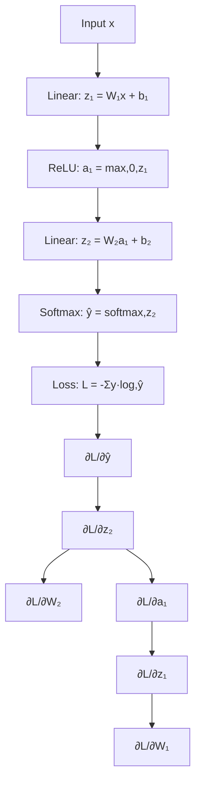
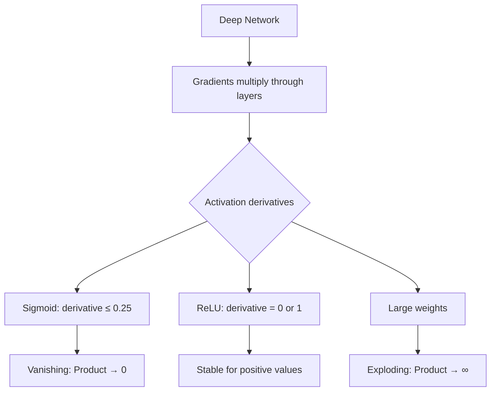

# Backpropagation

## Overview

Backpropagation is the **algorithm that makes deep learning possible**. It efficiently computes gradients of the loss function with respect to every weight in the network using the chain rule of calculus. Without it, training deep networks would be computationally infeasible.

## The Chain Rule

For composite functions: if y = f(g(x)), then:

$$\frac{dy}{dx} = \frac{dy}{dg} \cdot \frac{dg}{dx}$$

For a neural network with layers: L = loss(f₃(f₂(f₁(x)))):

$$\frac{\partial L}{\partial w_1} = \frac{\partial L}{\partial f_3} \cdot \frac{\partial f_3}{\partial f_2} \cdot \frac{\partial f_2}{\partial f_1} \cdot \frac{\partial f_1}{\partial w_1}$$

## Forward Pass

Compute the output by propagating input through each layer:

```python
import numpy as np

def forward_pass(X, weights, biases):
    """Compute forward pass through network"""
    activations = [X]
    z_values = []
    
    current = X
    for i, (W, b) in enumerate(zip(weights, biases)):
        z = current @ W + b
        z_values.append(z)
        
        if i < len(weights) - 1:
            current = np.maximum(0, z)  # ReLU
        else:
            # Softmax for output layer
            exp_z = np.exp(z - np.max(z, axis=1, keepdims=True))
            current = exp_z / exp_z.sum(axis=1, keepdims=True)
        
        activations.append(current)
    
    return activations, z_values
```

## Backward Pass

Compute gradients by propagating error backward:

```python
def backward_pass(activations, z_values, weights, y_true):
    """Compute gradients using backpropagation"""
    n = len(y_true)
    gradients = {'W': [], 'b': []}
    
    # Output layer gradient (softmax + cross-entropy)
    delta = activations[-1] - y_onehot  # (n, output_dim)
    
    for i in range(len(weights) - 1, -1, -1):
        # Gradient for weights
        dW = activations[i].T @ delta / n
        db = np.mean(delta, axis=0)
        
        gradients['W'].insert(0, dW)
        gradients['b'].insert(0, db)
        
        if i > 0:
            # Propagate error to previous layer
            delta = delta @ weights[i].T
            # Apply ReLU derivative
            delta *= (z_values[i-1] > 0).astype(float)
    
    return gradients
```

## Computational Graph



## Full Backpropagation Implementation

```python
import numpy as np

class NeuralNetwork:
    def __init__(self, layer_sizes):
        self.weights = []
        self.biases = []
        
        for i in range(len(layer_sizes) - 1):
            w = np.random.randn(layer_sizes[i], layer_sizes[i+1]) * np.sqrt(2.0 / layer_sizes[i])
            b = np.zeros(layer_sizes[i+1])
            self.weights.append(w)
            self.biases.append(b)
    
    def relu(self, z):
        return np.maximum(0, z)
    
    def relu_derivative(self, z):
        return (z > 0).astype(float)
    
    def softmax(self, z):
        exp_z = np.exp(z - np.max(z, axis=1, keepdims=True))
        return exp_z / exp_z.sum(axis=1, keepdims=True)
    
    def forward(self, X):
        self.activations = [X]
        self.z_values = []
        
        current = X
        for i, (W, b) in enumerate(zip(self.weights, self.biases)):
            z = current @ W + b
            self.z_values.append(z)
            
            if i < len(self.weights) - 1:
                current = self.relu(z)
            else:
                current = self.softmax(z)
            
            self.activations.append(current)
        
        return current
    
    def backward(self, y_true):
        n = len(y_true)
        y_onehot = np.zeros_like(self.activations[-1])
        y_onehot[np.arange(n), y_true] = 1
        
        self.dW = []
        self.db = []
        
        # Output layer (softmax + cross-entropy)
        delta = self.activations[-1] - y_onehot
        
        for i in range(len(self.weights) - 1, -1, -1):
            dW = self.activations[i].T @ delta / n
            db = np.mean(delta, axis=0)
            
            self.dW.insert(0, dW)
            self.db.insert(0, db)
            
            if i > 0:
                delta = delta @ self.weights[i].T
                delta *= self.relu_derivative(self.z_values[i-1])
    
    def update(self, lr=0.01):
        for i in range(len(self.weights)):
            self.weights[i] -= lr * self.dW[i]
            self.biases[i] -= lr * self.db[i]
    
    def train(self, X, y, epochs=100, lr=0.01, batch_size=32):
        for epoch in range(epochs):
            # Mini-batch SGD
            indices = np.random.permutation(len(X))
            for start in range(0, len(X), batch_size):
                batch_idx = indices[start:start+batch_size]
                X_batch = X[batch_idx]
                y_batch = y[batch_idx]
                
                self.forward(X_batch)
                self.backward(y_batch)
                self.update(lr)
```

## Vanishing and Exploding Gradients

### The Problem



### Vanishing Gradients

With sigmoid/tanh: derivatives are < 1 → product of many small numbers → gradients vanish in early layers.

$$\frac{\partial L}{\partial W_1} = \prod_{i=2}^{L} \sigma'(z_i) \cdot W_i \cdot \frac{\partial z_1}{\partial W_1}$$

If σ'(z) ≤ 0.25 (sigmoid), the product shrinks exponentially.

### Exploding Gradients

With large weights: product of many large numbers → gradients explode.

### Solutions

| Problem | Solution |
|---------|----------|
| Vanishing | ReLU activation, residual connections, batch normalization |
| Exploding | Gradient clipping, proper initialization, batch normalization |
| Both | Skip connections (ResNet), LSTM/GRU gates |

## Gradient Checking

Verify backpropagation implementation:

```python
def gradient_check(model, X, y, epsilon=1e-7):
    """Numerical gradient check"""
    model.forward(X)
    model.backward(y)
    
    for i, (W, dW) in enumerate(zip(model.weights, model.dW)):
        numerical_grad = np.zeros_like(W)
        
        for idx in np.ndindex(W.shape):
            # Loss with W[idx] + epsilon
            W[idx] += epsilon
            loss_plus = cross_entropy(model.forward(X), y)
            
            # Loss with W[idx] - epsilon
            W[idx] -= 2 * epsilon
            loss_minus = cross_entropy(model.forward(X), y)
            
            # Restore
            W[idx] += epsilon
            
            # Numerical gradient
            numerical_grad[idx] = (loss_plus - loss_minus) / (2 * epsilon)
        
        # Compare
        diff = np.linalg.norm(dW - numerical_grad) / (np.linalg.norm(dW) + np.linalg.norm(numerical_grad))
        print(f"Layer {i}: Relative difference = {diff}")
        assert diff < 1e-5, "Gradient check failed!"
```

## PyTorch Autograd

PyTorch handles backpropagation automatically:

```python
import torch
import torch.nn as nn

# Create tensors with requires_grad=True
x = torch.randn(32, 784, requires_grad=True)
W = torch.randn(784, 10, requires_grad=True)

# Forward pass
z = x @ W
loss = torch.nn.functional.cross_entropy(z, labels)

# Backward pass (automatic!)
loss.backward()

# Gradients are now available
print(W.grad)  # ∂loss/∂W

# Update weights
with torch.no_grad():
    W -= 0.01 * W.grad
    W.grad.zero_()  # Clear gradients
```

## Interview Questions

### Beginner

**Q: What is backpropagation?**

A: Backpropagation is an algorithm for computing gradients in neural networks. It applies the chain rule of calculus to efficiently compute how much each weight contributed to the error. "Backward" because gradients flow from the output layer back to the input layer.

**Q: Why do we need gradients?**

A: Gradients tell us how to adjust each weight to reduce the loss. Gradient descent uses gradients to update weights: w_new = w_old - lr * gradient. Without gradients, we'd have to try random weight changes — extremely inefficient.

### Intermediate

**Q: Explain the vanishing gradient problem and solutions.**

A: Vanishing gradients occur when derivatives are < 1 (sigmoid/tanh) — repeated multiplication causes gradients to shrink exponentially, making early layers learn extremely slowly.

Solutions:
1. **ReLU activation**: Derivative is 1 for positive values (no shrinking)
2. **Residual connections**: Skip connections allow gradients to flow directly
3. **Batch normalization**: Keeps activations in a good range
4. **LSTM/GRU**: Gating mechanisms for RNNs
5. **Proper initialization**: He initialization for ReLU

**Q: How does PyTorch's autograd work?**

A: PyTorch builds a **computational graph** during the forward pass. Each operation creates a node that stores:
1. The operation type
2. Inputs used
3. How to compute the gradient

During `loss.backward()`, it traverses this graph in reverse order, applying the chain rule at each node to compute gradients for all parameters with `requires_grad=True`.

### FAANG-Level

**Q: You're training a 100-layer network and loss doesn't decrease. Diagnose and fix.**

A: Systematic debugging:
1. **Check gradient flow**: Print gradient norms per layer. If they vanish → use ReLU, add residual connections
2. **Check activations**: If all activations are 0 (dead ReLU) → use LeakyReLU or check initialization
3. **Gradient clipping**: If gradients explode → clip by norm (max_norm=1.0)
4. **Initialization**: Use He initialization for ReLU, Xavier for sigmoid
5. **Batch/Layer normalization**: Add normalization layers
6. **Skip connections**: Add residual connections every 2-3 layers
7. **Learning rate**: Too high → loss oscillates; too low → slow progress. Try lr finder
8. **Overfit a single batch**: If model can't overfit 10 samples, there's a bug

## Common Mistakes

1. **Not zeroing gradients**: `optimizer.zero_grad()` before each step in PyTorch
2. **In-place operations**: Can break the computational graph in PyTorch
3. **Not using `torch.no_grad()`**: For inference, saves memory
4. **Vanishing gradients with sigmoid**: Use ReLU for hidden layers
5. **Not checking gradients**: Always gradient-check custom implementations

## Summary

| Concept | Description |
|---------|-------------|
| Chain rule | Derivative of composition = product of derivatives |
| Forward pass | Compute output from input |
| Backward pass | Compute gradients from output to input |
| Vanishing gradients | Derivatives < 1 shrink gradients |
| Exploding gradients | Large weights amplify gradients |
| Autograd | Automatic gradient computation (PyTorch) |

## Cross-References

- [Neural Network Basics](nn-basics.md) — The forward pass
- [Activation Functions](activation.md) — ReLU helps with vanishing gradients
- [Batch Normalization](batch-norm.md) — Stabilizes gradients
- [Optimizers](optimizers.md) — How gradients are used to update weights
- [Optimizers](./optimizers.md)
- [Neural Network Basics](./nn-basics.md)
- [GPU Training](../../cloud/virtualization/README.md)
- [Loss Functions](../foundations/loss-functions.md)

