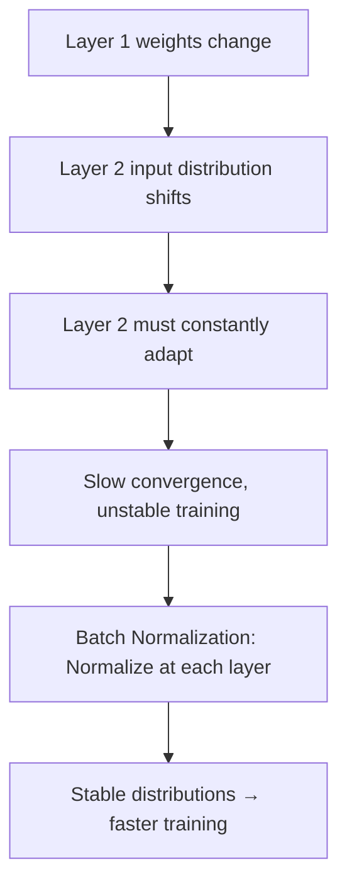
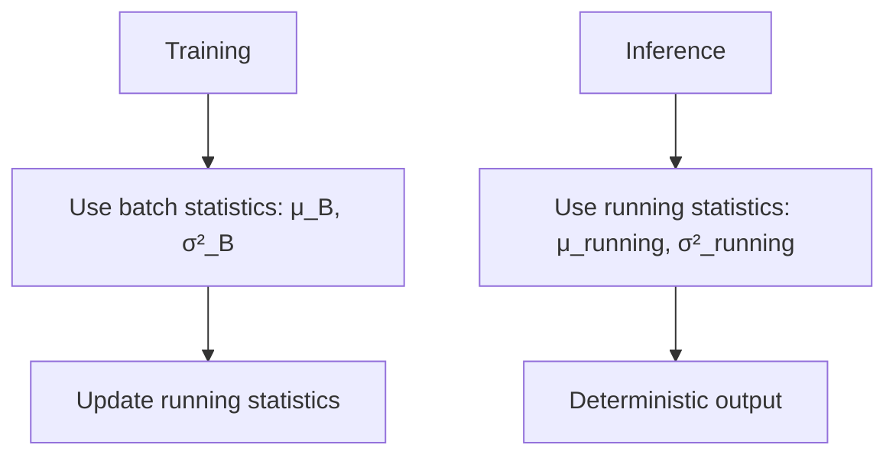

# Batch Normalization

## Overview

Batch Normalization (BN) normalizes layer activations to have **zero mean and unit variance** within each mini-batch. It stabilizes training, allows higher learning rates, and acts as a mild regularizer.

## The Problem: Internal Covariate Shift

As training progresses, the distribution of each layer's inputs changes because the previous layer's weights are updated. This phenomenon, called **internal covariate shift**, makes training unstable and slow.



## How Batch Normalization Works

For a mini-batch B = {x₁, ..., xₘ}:

$$\mu_B = \frac{1}{m}\sum_{i=1}^m x_i \quad \text{(Batch mean)}$$

$$\sigma_B^2 = \frac{1}{m}\sum_{i=1}^m (x_i - \mu_B)^2 \quad \text{(Batch variance)}$$

$$\hat{x}_i = \frac{x_i - \mu_B}{\sqrt{\sigma_B^2 + \epsilon}} \quad \text{(Normalize)}$$

$$y_i = \gamma \hat{x}_i + \beta \quad \text{(Scale and shift)}$$

Where γ (scale) and β (shift) are **learnable parameters**.

```python
import numpy as np

class BatchNorm:
    def __init__(self, num_features, momentum=0.1, eps=1e-5):
        self.gamma = np.ones(num_features)
        self.beta = np.zeros(num_features)
        self.eps = eps
        self.momentum = momentum
        
        # Running statistics for inference
        self.running_mean = np.zeros(num_features)
        self.running_var = np.ones(num_features)
    
    def forward(self, x, training=True):
        if training:
            mean = x.mean(axis=0)
            var = x.var(axis=0)
            
            # Update running statistics
            self.running_mean = (1 - self.momentum) * self.running_mean + self.momentum * mean
            self.running_var = (1 - self.momentum) * self.running_var + self.momentum * var
        else:
            mean = self.running_mean
            var = self.running_var
        
        # Normalize
        x_norm = (x - mean) / np.sqrt(var + self.eps)
        
        # Scale and shift
        return self.gamma * x_norm + self.beta
```

## Why γ and β?

Without them, BN would limit the network's expressive power (forced to zero mean, unit variance). With learnable γ and β, the network can **undo** the normalization if needed.

If γ = σ and β = μ, the layer learns to output the original values — BN becomes an identity function.

## PyTorch Usage

```python
import torch.nn as nn

class ConvBlock(nn.Module):
    def __init__(self, in_channels, out_channels):
        super().__init__()
        self.block = nn.Sequential(
            nn.Conv2d(in_channels, out_channels, 3, padding=1, bias=False),
            nn.BatchNorm2d(out_channels),
            nn.ReLU()
        )
    
    def forward(self, x):
        return self.block(x)

# Note: When using BN, bias in Conv is unnecessary (BN has its own β)
```

## Training vs Inference



**Critical**: Always set model to eval mode during inference!

```python
model.eval()  # Switches BN to use running statistics
with torch.no_grad():
    output = model(test_data)
model.train()  # Switch back for training
```

## Variants of Normalization

### Layer Normalization

Normalizes across **features** (not batch):

```python
class LayerNorm:
    def __init__(self, num_features, eps=1e-5):
        self.gamma = np.ones(num_features)
        self.beta = np.zeros(num_features)
        self.eps = eps
    
    def forward(self, x):
        mean = x.mean(axis=-1, keepdims=True)
        var = x.var(axis=-1, keepdims=True)
        x_norm = (x - mean) / np.sqrt(var + self.eps)
        return self.gamma * x_norm + self.beta
```

**Key difference from BN**: Independent of batch size → works with batch size 1. Preferred in **Transformers** and **RNNs**.

### Group Normalization

Normalizes within **groups of channels**:

```python
group_norm = nn.GroupNorm(num_groups=32, num_channels=256)
```

**Use case**: Small batch sizes (detection, segmentation), alternative to BN when batch statistics are unreliable.

### Instance Normalization

Normalizes each **sample independently**:

```python
instance_norm = nn.InstanceNorm2d(256)
```

**Use case**: Style transfer (removes style information).

### RMSNorm

Used in **LLaMA** and modern LLMs — simpler than LayerNorm:

$$\text{RMSNorm}(x) = \frac{x}{\sqrt{\frac{1}{d}\sum_{i=1}^d x_i^2 + \epsilon}} \cdot \gamma$$

```python
class RMSNorm(nn.Module):
    def __init__(self, dim, eps=1e-6):
        super().__init__()
        self.eps = eps
        self.weight = nn.Parameter(torch.ones(dim))
    
    def forward(self, x):
        rms = torch.sqrt(torch.mean(x ** 2, dim=-1, keepdim=True) + self.eps)
        return x / rms * self.weight
```

## Comparison

| Method | Normalizes Over | Batch Size 1? | Use Case |
|--------|----------------|--------------|----------|
| Batch Norm | Batch dimension | No | CNNs |
| Layer Norm | Feature dimension | Yes | Transformers, RNNs |
| Group Norm | Groups of channels | Yes | Small batch, detection |
| Instance Norm | Each sample | Yes | Style transfer |
| RMSNorm | Feature (simplified) | Yes | Modern LLMs |

## Interview Questions

### Beginner

**Q: Why does batch normalization help training?**

A: BN helps by:
1. **Stabilizing activations**: Keeps values in a reasonable range
2. **Reducing internal covariate shift**: Each layer sees stable input distributions
3. **Allowing higher learning rates**: Gradients are more well-behaved
4. **Mild regularization**: Batch statistics add noise similar to dropout
5. **Reducing sensitivity to initialization**: Less dependent on careful weight init

**Q: What happens if you forget to switch to eval mode?**

A: During inference, BN would use the current batch's statistics instead of running statistics. This means:
1. Predictions depend on the batch composition → non-deterministic
2. Single-sample prediction is impossible (batch mean/var undefined)
3. Results vary between runs → unreliable

### Intermediate

**Q: Why is LayerNorm preferred over BatchNorm in Transformers?**

A: 
1. **Sequence length varies**: Different samples have different lengths → batch statistics are meaningless
2. **Batch size 1**: At inference, Transformers often process one sequence at a time
3. **Self-attention**: Attention weights are computed per position; normalizing across the batch doesn't make sense
4. **Consistent behavior**: LayerNorm gives same result regardless of batch composition

**Q: How does batch normalization act as a regularizer?**

A: Each sample's normalization depends on other samples in the batch → noise. Different mini-batches give slightly different normalizations → each training step sees a slightly different model. This is similar to dropout's effect, providing an ensemble-like regularization.

### FAANG-Level

**Q: You're training with batch size 1 (online learning). Which normalization should you use and why?**

A: With batch size 1, BatchNorm is impossible (mean and variance are undefined for a single sample). Options:
1. **LayerNorm**: Normalizes across features for each sample independently. Best for Transformers/RNNs.
2. **GroupNorm**: Normalizes within groups of channels. Works well for CNNs.
3. **InstanceNorm**: Per-sample, per-channel normalization. Good for style-related tasks.
4. **RMSNorm**: Simplified LayerNorm used in modern LLMs.

For a Transformer: LayerNorm or RMSNorm. For a CNN: GroupNorm with 32 groups.

## Common Mistakes

1. **Forgetting model.eval()**: Non-deterministic inference results
2. **Using BN with small batches**: Unstable statistics → poor performance. Use GroupNorm or LayerNorm.
3. **Using bias with BN**: Conv bias is redundant when followed by BN (BN has β)
4. **BN in RNNs**: Doesn't work well across time steps. Use LayerNorm.
5. **Not tracking running statistics**: Must update during training, use during inference

## Summary

| Property | BatchNorm | LayerNorm |
|----------|-----------|-----------|
| Normalizes over | Batch | Features |
| Batch size dependency | Yes | No |
| Best for | CNNs | Transformers, RNNs |
| Training behavior | Stochastic (batch stats) | Deterministic |
| Inference behavior | Running stats | Same as training |

## Cross-References

- [Backpropagation](backpropagation.md) — BN affects gradient flow
- [Dropout](dropout.md) — Both are regularizers
- [Transformers](../transformers/architecture.md) — LayerNorm in transformers
- [CNNs](cnn.md) — BN is standard in CNNs
