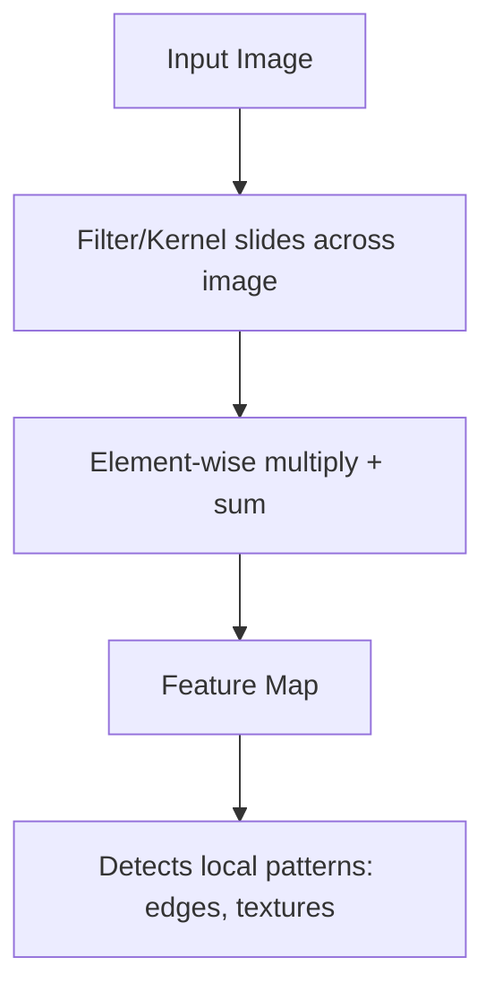
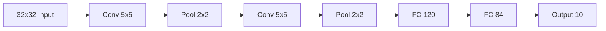
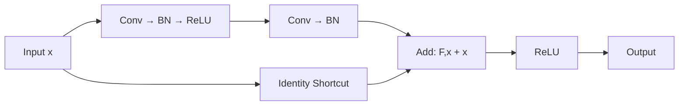

# Convolutional Neural Networks (CNNs)

## Overview

CNNs are specialized neural networks for **processing grid-like data** (images, audio, time series). They use convolution operations to detect local patterns, making them translation-invariant and parameter-efficient compared to fully connected networks.

## The Convolution Operation



```python
import numpy as np

def conv2d(image, kernel, stride=1, padding=0):
    """Simple 2D convolution"""
    if padding > 0:
        image = np.pad(image, padding, mode='constant')
    
    h, w = image.shape
    kh, kw = kernel.shape
    out_h = (h - kh) // stride + 1
    out_w = (w - kw) // stride + 1
    
    output = np.zeros((out_h, out_w))
    for i in range(out_h):
        for j in range(out_w):
            patch = image[i*stride:i*stride+kh, j*stride:j*stride+kw]
            output[i, j] = np.sum(patch * kernel)
    
    return output

# Edge detection kernel
edge_kernel = np.array([[-1, -1, -1],
                        [-1,  8, -1],
                        [-1, -1, -1]])
```

## Key CNN Components

### Convolutional Layer

```python
import torch.nn as nn

# Conv2d: in_channels, out_channels, kernel_size
conv = nn.Conv2d(in_channels=3, out_channels=64, kernel_size=3, stride=1, padding=1)
# Input: (batch, 3, H, W)
# Output: (batch, 64, H, W)  # With padding=1, spatial dims preserved
```

**Key parameters**:
- **Kernel size**: 3×3 (most common), 5×5, 1×1
- **Stride**: How far the filter moves (1 or 2)
- **Padding**: zeros added to borders ('same' = preserve size)
- **Number of filters**: Number of output channels

### Pooling Layer

Reduces spatial dimensions:

```python
# Max pooling: Takes maximum in each window
max_pool = nn.MaxPool2d(kernel_size=2, stride=2)
# (batch, 64, H, W) → (batch, 64, H/2, W/2)

# Average pooling: Takes mean in each window
avg_pool = nn.AvgPool2d(kernel_size=2, stride=2)

# Global average pooling: Average over entire spatial dimensions
gap = nn.AdaptiveAvgPool2d(1)
# (batch, 64, H, W) → (batch, 64, 1, 1)
```

### Fully Connected Layer

```python
# Flatten and connect to output
fc = nn.Linear(64 * 7 * 7, 10)  # 10 classes
```

## Building a CNN

```python
import torch
import torch.nn as nn

class SimpleCNN(nn.Module):
    def __init__(self, num_classes=10):
        super().__init__()
        
        self.features = nn.Sequential(
            # Block 1: 3 → 32 channels
            nn.Conv2d(3, 32, kernel_size=3, padding=1),
            nn.BatchNorm2d(32),
            nn.ReLU(),
            nn.MaxPool2d(2),  # 32x32 → 16x16
            
            # Block 2: 32 → 64 channels
            nn.Conv2d(32, 64, kernel_size=3, padding=1),
            nn.BatchNorm2d(64),
            nn.ReLU(),
            nn.MaxPool2d(2),  # 16x16 → 8x8
            
            # Block 3: 64 → 128 channels
            nn.Conv2d(64, 128, kernel_size=3, padding=1),
            nn.BatchNorm2d(128),
            nn.ReLU(),
            nn.AdaptiveAvgPool2d(1)  # 8x8 → 1x1
        )
        
        self.classifier = nn.Linear(128, num_classes)
    
    def forward(self, x):
        x = self.features(x)
        x = x.view(x.size(0), -1)  # Flatten
        x = self.classifier(x)
        return x
```

## Classic CNN Architectures

### LeNet-5 (1998)



### AlexNet (2012)

- First deep CNN to win ImageNet
- Used ReLU, dropout, data augmentation
- GPU training

### VGGNet (2014)

- Very deep (16-19 layers)
- Only 3×3 convolutions
- Simple, uniform architecture

```python
def vgg_block(num_convs, in_channels, out_channels):
    layers = []
    for _ in range(num_convs):
        layers.extend([
            nn.Conv2d(in_channels, out_channels, kernel_size=3, padding=1),
            nn.ReLU()
        ])
        in_channels = out_channels
    layers.append(nn.MaxPool2d(kernel_size=2, stride=2))
    return nn.Sequential(*layers)
```

### Inception / GoogLeNet (2014)

- Multiple filter sizes in parallel (1×1, 3×3, 5×5)
- 1×1 convolutions for dimensionality reduction

```python
class InceptionBlock(nn.Module):
    def __init__(self, in_channels, out_1x1, out_3x3_reduce, out_3x3, 
                 out_5x5_reduce, out_5x5, out_pool):
        super().__init__()
        
        # Branch 1: 1x1 conv
        self.branch1 = nn.Conv2d(in_channels, out_1x1, 1)
        
        # Branch 2: 1x1 → 3x3
        self.branch2 = nn.Sequential(
            nn.Conv2d(in_channels, out_3x3_reduce, 1),
            nn.Conv2d(out_3x3_reduce, out_3x3, 3, padding=1)
        )
        
        # Branch 3: 1x1 → 5x5
        self.branch3 = nn.Sequential(
            nn.Conv2d(in_channels, out_5x5_reduce, 1),
            nn.Conv2d(out_5x5_reduce, out_5x5, 5, padding=2)
        )
        
        # Branch 4: MaxPool → 1x1
        self.branch4 = nn.Sequential(
            nn.MaxPool2d(3, stride=1, padding=1),
            nn.Conv2d(in_channels, out_pool, 1)
        )
    
    def forward(self, x):
        return torch.cat([
            self.branch1(x), self.branch2(x),
            self.branch3(x), self.branch4(x)
        ], dim=1)
```

### ResNet (2015) — Skip Connections

The most influential CNN architecture — introduces **residual connections**:



```python
class ResidualBlock(nn.Module):
    def __init__(self, in_channels, out_channels, stride=1):
        super().__init__()
        
        self.conv1 = nn.Conv2d(in_channels, out_channels, 3, stride=stride, padding=1)
        self.bn1 = nn.BatchNorm2d(out_channels)
        self.conv2 = nn.Conv2d(out_channels, out_channels, 3, padding=1)
        self.bn2 = nn.BatchNorm2d(out_channels)
        
        # Shortcut connection (adjust dimensions if needed)
        self.shortcut = nn.Sequential()
        if stride != 1 or in_channels != out_channels:
            self.shortcut = nn.Sequential(
                nn.Conv2d(in_channels, out_channels, 1, stride=stride),
                nn.BatchNorm2d(out_channels)
            )
    
    def forward(self, x):
        residual = self.shortcut(x)
        out = torch.relu(self.bn1(self.conv1(x)))
        out = self.bn2(self.conv2(out))
        out += residual  # Skip connection
        return torch.relu(out)
```

**Why ResNet works**:
1. **Gradient highway**: Gradients flow directly through skip connections
2. **Easy identity mapping**: Network only needs to learn the residual F(x) = H(x) - x
3. **Enables very deep networks**: ResNet-152, ResNet-1001

## Interview Questions

### Beginner

**Q: Why are CNNs better than fully connected networks for images?**

A: Three key advantages:
1. **Parameter sharing**: The same filter is applied across the entire image → far fewer parameters
2. **Local connectivity**: Each neuron only sees a small region → captures local patterns
3. **Translation invariance**: A cat is a cat regardless of position → detected by the same filter

**Q: What does a convolutional layer learn?**

A: Early layers learn simple features (edges, colors, textures). Middle layers learn shapes and patterns. Deep layers learn object parts and semantic concepts. This hierarchical feature learning is what makes CNNs powerful.

### Intermediate

**Q: Explain the role of 1×1 convolutions.**

A: 1×1 convolutions are used for:
1. **Dimensionality reduction**: Reduce channels (e.g., 256 → 64) without changing spatial dims
2. **Non-linearity**: Add ReLU after 1×1 conv for non-linear mixing
3. **Cross-channel interaction**: Mix information across channels
4. **Bottleneck design**: In ResNet, reduce → 3×3 → expand (efficient)

**Q: Why do we use 3×3 convolutions instead of larger ones?**

A: Two 3×3 convolutions have the same receptive field as one 5×5 conv but with fewer parameters:
- 5×5: 25 parameters per filter
- Two 3×3: 2 × 9 = 18 parameters per filter

Plus, two non-linearities (ReLU) instead of one → more expressive.

### FAANG-Level

**Q: Design a CNN for real-time object detection on mobile devices.**

A: Architecture considerations:
1. **Backbone**: MobileNetV3 or EfficientNet-Lite (depthwise separable convolutions)
2. **Depthwise separable conv**: Split standard conv into depthwise + pointwise → 8-9× fewer parameters
3. **Inverted residuals**: Expand → depthwise → project (MobileNetV2 design)
4. **Squeeze-and-Excitation**: Channel attention with minimal overhead
5. **Head**: Single-shot detection (SSD) or YOLO-style head
6. **Quantization**: INT8 post-training quantization for 2-4× speedup
7. **Input resolution**: 320×320 or 416×416 (balance accuracy vs speed)
8. **Target**: 30+ FPS on mobile GPU

## Common Mistakes

1. **Not using batch normalization**: Always add BN after convolutions
2. **Too large receptive field early**: Start with small kernels (3×3)
3. **Forgetting to flatten before FC**: Common error in custom architectures
4. **Not using skip connections**: Essential for deep networks (>10 layers)
5. **Ignoring data augmentation**: Critical for CNNs — random crops, flips, color jitter

## Summary

| Component | Purpose |
|-----------|---------|
| Convolution | Detect local patterns |
| Pooling | Reduce spatial dimensions |
| Batch Norm | Stabilize training |
| Skip Connections | Enable deep networks |
| Global Average Pool | Replace FC layers |

## Cross-References

- [Neural Network Basics](nn-basics.md) — Foundation
- [Batch Normalization](batch-norm.md) — Used extensively in CNNs
- [Transfer Learning](transfer-learning.md) — Pre-trained CNNs
- [Vision Transformers](../transformers/vit.md) — Alternative to CNNs
