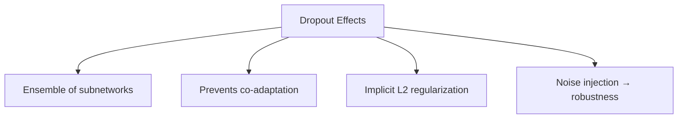

# Dropout

## Overview

Dropout is a **regularization technique** that randomly "drops out" (sets to zero) neurons during training. It prevents co-adaptation of neurons and acts as an implicit ensemble of many subnetworks.

## How Dropout Works

```mermaid
graph TD
    A[Training: Randomly zero neurons with probability p] --> B[Each forward pass uses different subnetwork]
    B --> C[Ensemble of 2^n possible networks]
    D[Inference: Use all neurons, no scaling (inverted dropout scaled at training time)] --> E[Average of all subnetworks]
```

### Training Phase

```python
import numpy as np

def dropout_forward(x, p=0.5, training=True):
    """
    Inverted dropout: scale during training, not inference
    """
    if not training:
        return x
    
    # Generate binary mask
    mask = np.random.binomial(1, 1-p, size=x.shape)
    
    # Apply mask and scale
    return x * mask / (1 - p)  # Scale by 1/(1-p)

def dropout_backward(dout, mask, p=0.5):
    """Gradient only flows through active neurons"""
    return dout * mask / (1 - p)
```

### Why Scale by 1/(1-p)?

With **inverted dropout**, we scale during training so that inference requires no modification:

- **Without scaling**: At inference, expected output = (1-p) * x → need to multiply by 1/(1-p)
- **With inverted dropout**: At training, output = x * mask / (1-p) → expected value = x. At inference, just use x.

```python
# PyTorch usage
import torch.nn as nn

class Model(nn.Module):
    def __init__(self):
        super().__init__()
        self.fc1 = nn.Linear(784, 256)
        self.dropout1 = nn.Dropout(p=0.5)
        self.fc2 = nn.Linear(256, 128)
        self.dropout2 = nn.Dropout(p=0.3)
        self.fc3 = nn.Linear(128, 10)
    
    def forward(self, x):
        x = torch.relu(self.fc1(x))
        x = self.dropout1(x)  # Only active during training!
        x = torch.relu(self.fc2(x))
        x = self.dropout2(x)
        x = self.fc3(x)
        return x

# IMPORTANT: Switch modes!
model.train()   # Dropout active
model.eval()    # Dropout inactive
```

## Why Dropout Prevents Overfitting

### 1. Ensemble Effect

Each training step uses a different subnetwork. With n neurons and dropout rate p, there are 2^n possible subnetworks. At inference, we approximate the average of all these subnetworks.

### 2. Feature Co-adaptation Prevention

Without dropout, neurons can develop complex co-dependencies. Dropout forces each neuron to learn features that are useful in combination with any subset of other neurons → more robust representations.

### 3. Implicit Regularization

Dropout is approximately equivalent to L2 regularization with an adaptive regularization strength that depends on the activation magnitude.



## Dropout Rate Selection

| Layer Type | Typical Dropout Rate |
|-----------|---------------------|
| Input layer | 0.1-0.2 |
| Hidden layers (CNN) | 0.1-0.5 |
| Hidden layers (Transformer) | 0.1-0.3 |
| Before output | 0.3-0.5 |

```python
# Common patterns
# Light dropout for Transformers
nn.Dropout(0.1)

# Medium dropout for CNNs
nn.Dropout(0.25)

# Heavy dropout for small datasets
nn.Dropout(0.5)
```

## Monte Carlo Dropout

Use dropout at **inference time** for uncertainty estimation:

```python
import torch

def mc_dropout_predict(model, x, n_samples=100):
    """
    Use dropout at inference to estimate uncertainty
    """
    model.train()  # Keep dropout active!
    
    predictions = []
    with torch.no_grad():
        for _ in range(n_samples):
            predictions.append(model(x))
    
    predictions = torch.stack(predictions)
    
    mean = predictions.mean(dim=0)          # Point prediction
    variance = predictions.var(dim=0)       # Uncertainty
    std = predictions.std(dim=0)            # Standard deviation
    
    return mean, variance, std

# Higher variance → model is uncertain about this prediction
# Useful for: active learning, safety-critical applications
```

## Dropout Variants

### Spatial Dropout

Drops entire channels (feature maps) in CNNs:

```python
# PyTorch
nn.Dropout2d(p=0.2)  # Drops entire channels
```

### DropConnect

Drops individual weights instead of neurons:

```python
# Each weight has probability p of being zeroed
# More fine-grained than dropout
```

### DropPath / Stochastic Depth

Drops entire layers (used in Transformers and deep CNNs):

```python
def drop_path(x, drop_prob=0.1, training=True):
    """Randomly drop entire residual branches"""
    if not training or drop_prob == 0:
        return x
    
    keep_prob = 1 - drop_prob
    shape = (x.shape[0],) + (1,) * (x.ndim - 1)
    mask = torch.bernoulli(torch.full(shape, keep_prob, device=x.device))
    
    return x * mask / keep_prob
```

## Interview Questions

### Beginner

**Q: Why does dropout help prevent overfitting?**

A: Dropout prevents overfitting by:
1. **Ensemble effect**: Each training step uses a different subnetwork → averaging at inference
2. **Reducing co-adaptation**: Neurons can't rely on specific other neurons → must learn robust features
3. **Adding noise**: Random perturbation acts like data augmentation for hidden representations

**Q: Why don't we use dropout at inference time?**

A: At inference, we want deterministic, stable predictions. Dropout adds randomness that would make predictions vary between runs. Instead, we use all neurons and rely on the training-time scaling (inverted dropout) to produce the correct expected values.

### Intermediate

**Q: How does dropout interact with batch normalization?**

A: This is a subtle and important interaction:
1. **Dropout changes BN statistics**: Dropped neurons change the mean/variance of activations
2. **BN after dropout**: Can amplify the noise from dropout
3. **Recommendation**: Use dropout after BN, or use lighter dropout (0.1-0.2) with BN
4. **Modern practice**: Many architectures use BN + light dropout, or BN only, or dropout only

**Q: When would you use Monte Carlo dropout?**

A: MC dropout is useful when:
1. **Uncertainty estimation needed**: Medical diagnosis, autonomous driving
2. **Active learning**: Select most uncertain samples for labeling
3. **Out-of-distribution detection**: High uncertainty for unfamiliar inputs
4. **Bayesian approximation**: MC dropout approximates Bayesian inference

### FAANG-Level

**Q: You have a 100M parameter model overfitting on 50K training examples. Design a dropout strategy.**

A: Multi-layered approach:
1. **Standard dropout**: p=0.1-0.3 on hidden layers (not too aggressive with BN)
2. **Attention dropout**: p=0.1 on attention weights in Transformers
3. **DropPath**: Stochastic depth p=0.1 for residual branches
4. **Embedding dropout**: p=0.1 on token/position embeddings
5. **Combine with other regularization**: Weight decay (AdamW), label smoothing, data augmentation
6. **Monitor**: Track the gap between train and validation loss to assess if dropout is sufficient
7. **Adjust per layer**: Earlier layers can have lower dropout (preserve input info); later layers can have higher

## Common Mistakes

1. **Forgetting model.eval()**: Dropout active during inference → non-deterministic results
2. **Using too high dropout with BN**: Can conflict; use lighter dropout
3. **Dropout on output layer**: Usually don't apply dropout right before the final output
4. **Not scaling (standard dropout)**: Must multiply by 1/(1-p) during training or inference
5. **Using dropout with very small models**: May underfit; dropout is for large models

## Summary

| Property | Description |
|----------|-------------|
| Training | Randomly zero neurons with prob p |
| Inference | Use all neurons (inverted dropout) |
| Effect | Ensemble, prevents co-adaptation |
| Typical p | 0.1-0.5 |
| MC Dropout | Use at inference for uncertainty |

## Cross-References

- [Regularization](../foundations/regularization.md) — Dropout as regularization
- [Batch Normalization](batch-norm.md) — Interaction with dropout
- [Transformers](../transformers/architecture.md) — Attention dropout
- [Neural Network Basics](nn-basics.md) — Where to place dropout
