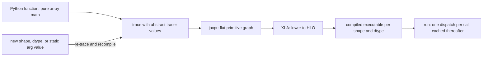
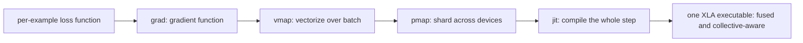

# JAX & Functional ML

## Overview

JAX is the research stack counterpart to PyTorch: a NumPy-compatible array library whose real contribution is **tracing-based program transformation** — the same Python function can be automatically differentiated, vectorized, sharded across devices, and compiled to fused kernels, because the framework transforms *functions*, not objects. This page treats JAX at the framework-comparison level an ML interview expects: the functional programming model and what it buys in reproducibility, the four core transformations and their composition, tracing pitfalls that break newcomers, XLA as the compilation backend, and an honest wins/loses assessment against PyTorch. It complements the autodiff background in [Backpropagation](./backpropagation.md) and the optimizer landscape in [Optimizers](./optimizers.md); kernel-level detail for the attention path JAX feeds is in [Attention Kernel Variants](../../llm/advanced/attention-kernel-variants.md). The interview-worthy idea is not "another deep learning library" — it is that explicit state and function transforms make ML programs more like compiler inputs.

## The Functional Programming Model

In PyTorch, a model is an object: `nn.Module` holds parameters as attributes, mutates them in-place, carries a `training` flag, and hides RNG state behind a global seed. JAX deletes all of that. A model is a pure function from `(parameters, inputs)` to outputs; parameters are ordinary data (pytrees of arrays) that the caller owns, passes in, and updates by returning new values. There is no hidden state anywhere in the core library — even randomness is explicit (see the PRNG section below). The container abstraction is the **pytree**: JAX generalizes operations over arbitrary nested containers (dicts, lists, tuples, dataclasses registered with `jax.tree_util`), treating leaves as arrays and structure as metadata, so `jax.grad` can return gradients shaped exactly like the parameter tree they describe. Flax and Equinox modules are themselves pytrees, which is why no "model.save()" API is needed — the model is data already.

```python
leaves, treedef = jax.tree_util.tree_flatten(params)  # list of arrays + structure
flat_grads = jax.tree_util.tree_map(lambda g: -0.01 * g, grads)  # per-leaf update
params = jax.tree_util.tree_unflatten(treedef, new_leaves)       # structure rebuilt
# Sharding, serialization, and gradient stats all key off this flatten/unflatten pair.
```

```python
import jax, jax.numpy as jnp

def loss(params, batch):                 # pure: params and data in, scalar out
    logits = model.apply(params, batch["x"])
    return jnp.mean((logits - batch["y"]) ** 2)

grads = jax.grad(loss)(params, batch)    # grads is a pytree shaped like params
params  = jax.tree_util.tree_map(lambda p, g: p - 0.01 * g, params, grads)
```

What the object-orientation of PyTorch buys in ergonomics, the explicit style buys in system properties:

| Concern | PyTorch (`nn.Module`) | JAX (pure functions + pytrees) |
|---------|----------------------|-------------------------------|
| Reproducibility | global RNG + in-place mutation; replay depends on call order | explicit keys + stateless functions; same inputs give same outputs by construction |
| Serialization | pickle the module (code and weights entangled) | checkpoint = the parameter pytree (plain arrays; code-free) |
| Distribution | wrap the module, hope it is state-safe | pass sharded parameter trees to compiled functions; state is data, data can be sharded |
| Debugging | step through methods, state changes along the way | functions are referentially transparent; a loss value is a pure function of inputs |
| Composability | transforms must be framework-aware subclasses (DataParallel, DDP) | transforms are functions over functions, combinable in any order |

The consequence that interviews probe most: **reproducibility becomes structural, not disciplinary**. You do not train a team to "seed everything correctly"; you make the training step a pure function of `(params, data, key)` and reproducibility is a property of the type signature.

A second consequence is subtler and shows up in system design discussions: because state is ordinary data, **every piece of the training loop can be shipped, sharded, and restored independently**. An optimizer state is a pytree alongside the parameter pytree; a checkpoint is the pair; a sharded run is the pair with sharding annotations. Nothing about the loop knows or cares whether parameters live on one GPU or 4,096 TPU chips — which is exactly the property the scaling section below exploits.

## The Four Core Transformations

Each transformation is a program transformation with a well-defined semantics — understanding them as compilers' passes (trace, rewrite, lower) rather than library calls is the mental model interviewers want.

**`grad` — reverse-mode autodiff as a function.** JAX traces the function with a special tracer that records primitive ops, builds the computation graph, and returns a function computing gradients via reverse-mode differentiation — the math in [Backpropagation](./backpropagation.md), exposed as a higher-order function:

```python
loss_val, grad_tree = jax.value_and_grad(loss)(params, batch)
# argnums selects which argument differentiates; has_aux returns auxiliary values
```

**`jit` — XLA compilation.** `jit` traces the function, lowers the trace to XLA (below), and returns a function backed by a compiled executable; subsequent calls with the same shapes and dtypes skip Python entirely:

```python
train_step = jax.jit(loss)        # first call compiles, later calls run compiled code
loss_val = train_step(params, batch)
```

**`vmap` — vectorizing map via batching rules.** `vmap` transforms a per-example function into a batched one by adding a batch axis to every operation (each NumPy primitive has a batching rule), instead of writing a Python loop:

```python
per_example = jax.vmap(loss_one, in_axes=(None, 0))   # params shared, data batched
batched_loss = per_example(params, batch["x"])        # one op per primitive, not one loop iteration
```

**`pmap` — SPMD across devices.** `pmap` replicates the function across devices and compiles a collective-aware program (all-reduce via `lax.psum`); it predates and is now superseded by `jit` with explicit sharding (below), but remains the clearest single-expression statement of "same code, many devices":

```python
grads = jax.pmap(jax.grad(loss_one), axis_name="devices")(sharded_params, sharded_data)
grads = jax.lax.pmean(grads, axis_name="devices")     # average across the replica axis
```

The superpower is **composition**. Because every transform is a function over functions, they nest: `grad(vmap(f))` gives per-example gradients, `jit(pmap(vmap(grad(f))))` compiles a sharded, batched gradient step into one executable. There is no code change between "train on my laptop" and "train on a TPU pod" beyond which transforms wrap the loss — the distributed-training plumbing (gradient sync, data sharding, kernel fusion) is derived from the same source function, which is exactly the property large labs exploited (GSPMD, below).

| Transform | Input | Output | Typical interview use |
|-----------|-------|--------|------------------------|
| `grad` / `value_and_grad` | function of array inputs | function returning gradients (and value) | autodiff questions, per-argument differentiation via `argnums` |
| `hessian` / `jacrev`, `jacfwd` | function | Jacobian/Hessian functions | "compute a Hessian without writing one" — composition of reverse and forward mode |
| `vmap` | per-example function | batched function | eliminating loops; per-sample gradients with `grad(vmap(grad(f)))` |
| `pmap` / sharded `jit` | function | replicated/sharded SPMD program | data parallelism; collective ops via `axis_name` |
| `jit` | traced function | compiled executable per signature | startup/fusion questions; retrace pitfalls |
| `scan` / `cond` / `while_loop` | control flow | traced, compilable control flow | RNN/scan training loops; why Python loops break under `jit` |





The first diagram is the whole JAX execution model in six lines, and it is worth internalizing as a pipeline with a cache keyed by signature: Python runs once per shape, XLA output runs forever after. The second is the composition story: four wrappers, one compiled artifact.

## jit and Tracing Pitfalls

`jax.jit` works by **tracing**: the wrapped function runs once with abstract `Tracer` objects that know shape and dtype but not values, and the sequence of operations they drive becomes the compiled program. Nearly every JAX newcomer bug is a tracer violation, and the failure modes are consistent:

- **Python control flow on traced values fails.** `if x > 0:` on a tracer raises `TracerBoolConversionError` because the truthiness of an abstract value is unknown. The fix is to move control flow into JAX: `jax.lax.cond`, `jax.lax.scan` for loops (which also make loops compilable as single ops rather than unrolled traces), or `jax.lax.fori_loop`.
- **`static_argnums` trades tracing for recompilation.** Arguments marked static become compile-time constants, so changing their *value* triggers a full retrace and recompile; marking a hyperparameter static is a cache-explosion decision, not a convenience.
- **Re-tracing costs are shape-shaped.** Every new shape or dtype signature compiles a new executable — batching by ragged sequence lengths multiplies compile time; padding to buckets is the standard mitigation. First-call latency is seconds-to-minutes for large models, and compilation caches (in-memory per shape, persistent on disk via JAX's persistent-cache options) are load-bearing in serving.
- **The shape-polymorphism gap, honestly:** `jit` specializes to static shapes; dynamic shapes are *not* supported in general — JAX has a research effort on shape polymorphism and `export`-based deployment has its own shape rules, but if your workload requires truly dynamic shapes per step, PyTorch's eager mode handles it today without ceremony. This is the single most common honest answer to "why did you leave JAX?" for serving-heavy teams.

The right framing in an interview: these are the costs of treating Python as a metaprogramming language for a compiler. The tracer model is the same idea as a tracing JIT recording one path — the difference is that JAX records *tensor programs*, where every operation is a primitive with known shape algebra, so the recording is complete rather than speculative.

A minimal reproduction of the two most common failures, with their fixes inline:

```python
# BREAKS: Python bool on a Tracer
# def step(x):
#     if x.sum() > 0:          # TracerBoolConversionError under jit
#         return x * 2
#     return x

# FIXED: branch becomes a traced primitive
def step(x):
    return jax.lax.cond(x.sum() > 0, lambda a: a * 2, lambda a: a, x)

# BREAKS: static hyperparameter -> recompile per value
# step = jax.jit(loss, static_argnums=2)   # called with n=1, 2, 3... each recompiles

# FIXED: pad shapes to buckets so one executable serves many inputs
# shapes {16, 32, 64} -> compile 3 executables, never per-batch-size
```

## XLA as the Compilation Backend

`jit`'s output is an **XLA** (Accelerated Linear Algebra) program: JAX lowers its internal jaxpr IR to XLA's **HLO** (High-Level Optimizer IR), and XLA schedules it for CPU/GPU/TPU. Three properties matter for framework comparison:

- **Fusion is the memory-bandwidth argument.** XLA aggressively fuses elementwise chains (and reduction-adjacent patterns) into single kernels so intermediates are never materialized in HBM: a chain of ten elementwise ops over an N-element tensor costs one read and one write instead of twenty HBM passes. For the bandwidth-bound regimes that dominate inference decode (see [Attention Kernel Variants](../../llm/advanced/attention-kernel-variants.md)), fusion plus layout choice is most of the achievable performance for standard ops.
- **Compile-then-cache per signature.** First call traces, lowers, compiles, and caches an executable keyed by shapes/dtypes/device; later calls dispatch with one host-to-device command. The persistent cache makes cold-start a one-time cost per cluster.
- **Positioning against Triton and CUDA.** XLA generates respectable kernels for standard algebra from HLO automatically; you reach for custom kernels (Triton, CUDA) when the operation has structure the HLO fusion cannot see — fused attention with online softmax, paged KV-cache gather, quantized matmul epilogues. The JAX stack accepts this cleanly: write the custom kernel, bind it via `custom_call`, and it composes with `jit`/`vmap` like a primitive. The [XLA documentation](https://openxla.org/xla) is the reference for what the backend actually sees, and the [OpenXLA repository](https://github.com/openxla/xla) carries the compiler sources.

## PRNG Done Functionally

JAX has no global random seed because global state would break the pure-function contract (and would be ambiguous under parallel transforms). Instead, randomness is **explicit and splittable**: a key is a pair of unsigned integers; `jax.random.split` derives independent child keys deterministically, and each random draw consumes exactly one key. The PRNG is a counter-based generator (Threefry) chosen because it parallelizes — any key can generate any slice of the stream independently, on any device, in any order.

```python
key = jax.random.PRNGKey(0)
key, init_key, drop_key = jax.random.split(key, 3)
params  = init_net(init_key)
mask    = jax.random.bernoulli(drop_key, p=0.5, shape=x.shape)
```

The reproducibility payoff is concrete: a training run whose step is `step(params, batch, key)` with a recorded key stream replays bit-identically on any machine, any device count (keys partition cleanly under `pmap`/`vmap`), and any execution order — there is no "the dropout mask depended on how many RNG calls happened before it" failure mode, which is a real and common class of PyTorch debugging pain. The cost is ergonomic: forgetting to split keys and reusing one for initialization and dropout silently correlates randomness, a JAX-specific bug class interviews like to ask about.

## The Ecosystem Map

JAX deliberately ships a small core, so the stack is layered third-party libraries:

- **[Flax](https://flax.readthedocs.io/)** — the most widely used neural-network library ([github.com/google/flax](https://github.com/google/flax)): `nn.Module`s that are themselves pytrees, with parameters passed explicitly; the `linen` → `nnx` API transition is representative of the ecosystem's churn.
- **Equinox and Haiku** — the two main alternatives: Equinox makes *everything* a pytree (models, optimizers, even Python control structures), and Haiku (DeepMind) is the stateful-looking thin layer over pure functions. Same core, different ergonomics — and the need to choose between them is the fragmentation critique in miniature.
- **[Optax](https://optax.readthedocs.io/)** — composable gradient transformations ([github.com/google-deepmind/optax](https://github.com/google-deepmind/optax)): an optimizer is a pure function from gradients and optimizer state to updates, so SGD, Adam, gradient clipping, and learning-rate schedules compose as pipelines. Reading [Optax](https://optax.readthedocs.io/) is the clearest way to understand what an optimizer actually is; the optimizers themselves are catalogued in [Optimizers](./optimizers.md).
- **[Diffusers](https://huggingface.co/docs/diffusers/index)** — diffusion pipelines exist for JAX (TPU-era Stable Diffusion serving), but the library's gravity is PyTorch; treat JAX coverage as secondary when planning work.
- **[XLA](https://openxla.org/xla)** — the backend every layer above compiles into.

The **fragmentation critique** is fair and should be stated honestly in interviews: because the core is small, the nn-library layer splintered (Flax/Haiku/Equinox/Objax and successors), APIs churned, and no single ecosystem module reached PyTorch's default status — there is no JAX equivalent of the de facto PyTorch training stack. JAX's culture is "build the 200 lines you need," which researchers love and product teams find a tax. Documentation also historically lagged Google-internal usage, though the [current docs](https://docs.jax.dev/en/latest/) have closed much of the gap.

## Scaling: pmap to GSPMD to jax.sharding

JAX's scaling story evolved from per-device replication to global sharding:

1. **`pmap` era:** replicate data and parameters across devices, compute local gradients, all-reduce — data parallelism as one transform, ideal for models that fit on one device.
2. **GSPMD:** Google's generalization ("GSPMD: General and Scalable Parallelization for ML Computation Graphs," arXiv 2021 / ASPLOS 2023) — annotate each tensor in the jaxpr with how it shards across a device mesh, and the compiler infers the rest, inserting collectives; data, tensor, and pipeline parallelism become different annotation choices over one program. This is the machinery behind multi-thousand-chip training runs such as PaLM on TPU v4 pods.
3. **`jax.sharding` era:** GSPMD's ideas became first-class API — declare a `Mesh` of devices, wrap arrays in `NamedSharding`/`PartitionSpec`, and `jit` compiles functions whose *inputs are already sharded*; pmap-style SPMD is now expressible as sharded `jit` with collectives via `shard_map`.

The TPU-first heritage explains the design: JAX was built where the unit of scale was a homogeneous TPU pod with a fast interconnect, so "the program is one global computation over a mesh" was the natural model. PyTorch grew GPU-first (per-device eager execution, then DDP, FSDP, and tensor-parallel libraries layered on later), which is why PyTorch scaling code historically reads as orchestration while JAX scaling code reads as annotations. When an interviewer asks about multi-node training infrastructure, the JAX answer is "sharding is a type-level property of arrays" — and the operational side of that story (topology, collectives, utilization) lives in [ML Infrastructure](../mlops/infrastructure.md).

## Where JAX Wins and Where It Loses

| Dimension | JAX | PyTorch | Verdict |
|-----------|-----|---------|---------|
| Autodiff clarity and composability | transforms compose (`grad(vmap(f))`) | autograd is object-coupled; vector-map exists (`torch.func`) but less central | JAX wins for research code that reasons about gradients of gradients |
| Large-scale TPU training | native mesh sharding, XLA/TPU co-design | supported via PyTorch/XLA, second-class | JAX wins where TPUs are the platform |
| Reproducibility | structural (pure functions, explicit keys) | discipline-based (seeds, flags) | JAX wins by construction |
| Kernel fusion for standard ops | XLA does it automatically | needs `torch.compile` (which adopted a similar trace-then-lower design) | parity trend; JAX earlier and more battle-tested on TPU |
| Dynamic shapes / eager debugging | tracer-based; dynamic shapes unsupported; `jax.debug` helps but async execution complicates | eager by default, dynamic shapes native | PyTorch wins decisively |
| Ecosystem gravity | splintered nn-libraries, smaller tooling pool | default for new models, HF tooling, hiring pool | PyTorch wins decisively |
| Numerical rigor of the mental model | pure math: functions over arrays, no hidden buffers | convenient but stateful | JAX wins for correctness-critical simulation (and it descends from the Autograd/SciPy lineage) |

The honest summary: JAX wins wherever ML programs are treated as **compilation problems** — research iteration on gradient computations, TPU-pod training, simulation and scientific computing. PyTorch wins wherever **iteration speed, ecosystem, and debuggability** dominate — product prototyping, fine-tuning off-the-shelf models, hiring at scale. Many large labs run both: JAX for the training infrastructure where sharding and reproducibility pay, PyTorch for serving and experimentation where ecosystem gravity pays.

The trend line to cite when asked "will this stay true?" — PyTorch 2.x adopted the JAX-shaped execution model (`torch.compile` traces and lowers to its own IR, then to kernels), and JAX keeps chipping at its gaps (debuggability via `jax.debug`, dynamic-shape research, richer export tooling). The frameworks are converging on the same trace-lower-execute architecture from opposite starting points; what will not converge quickly is the ecosystem gravity and the TPU-native sharding story, because those are network effects, not engineering problems.

## A Reading Path

Sized for interview preparation (a weekend, not a semester):

1. The official docs' **Key Concepts** and **The Sharp Bits** pages ([docs.jax.dev](https://docs.jax.dev/en/latest/)) — the tracing model and its failure modes, in the maintainers' words. The Sharp Bits page is essentially a list of interview questions with answers.
2. The **Autodiff Cookbook** in the same docs — `grad`, `vmap`, and `jacrev`/`jacfwd` compositions, which is where "transformations are functions over functions" becomes muscle memory.
3. Clone [github.com/jax-ml/jax](https://github.com/jax-ml/jax) and read `jax/_src/lax/control_flow.py` for how `scan`/`cond` desugar, plus one Flax example end to end ([github.com/google/flax](https://github.com/google/flax)) — a small train loop is the whole functional-model story in ~100 lines.
4. For the scaling layer, read the GSPMD paper's annotation examples against the current [jax.sharding](https://docs.jax.dev/en/latest/) API pages — the mapping from paper annotations to `NamedSharding` is the interview-worthy translation exercise.
5. For the backend, skim the [XLA](https://openxla.org/xla) operation semantics page; when a kernel question appears, follow it into [Attention Kernel Variants](../../llm/advanced/attention-kernel-variants.md).

## Interview Questions

1. **Why does JAX's functional model improve reproducibility, when PyTorch can also be seeded?**
Because reproducibility is structural rather than disciplinary. In JAX, a training step is a pure function of `(params, batch, key)`: parameters are explicit pytrees, randomness is explicit split keys, and there is no global state that call order could perturb. Seeding PyTorch works but depends on the *number and order* of RNG draws, in-place module mutation, and global flags — replay requires replicating the exact call sequence. In JAX the same inputs deterministically produce the same outputs across devices and device counts (keys partition cleanly under `vmap`/`pmap`), so reproducibility survives refactoring, parallelization, and reordering.

2. **Explain what `jax.jit` does internally, and name two failure modes with fixes.**
`jit` traces the function with abstract tracers carrying only shape/dtype, records the primitive ops as a jaxpr, lowers it to XLA HLO, compiles a per-signature executable, and caches it. Failure mode one: Python control flow on traced values (`if x > 0:`) raises `TracerBoolConversionError` because tracer truthiness is unknown — fix by moving branching into `lax.cond`/`lax.scan`. Failure mode two: new shapes or `static_argnums` values trigger re-tracing and recompilation, so ragged batches explode compile time — fix by padding to shape buckets and reserving `static_argnums` for true compile-time constants. The framing to state: Python is the metaprogramming layer; the traced program is what runs.

3. **Why does XLA's fusion matter more than raw op speed for inference?**
Because decode and most elementwise pipelines are memory-bandwidth-bound: the cost is moving intermediates between HBM and compute, not the arithmetic. XLA fuses chains of elementwise (and adjacent reduction) ops into single kernels so intermediate tensors are never materialized in HBM — ten elementwise ops become one read and one write instead of twenty HBM round trips. This is why the same model shows different step times under eager versus `jit`, and why custom kernels only beat XLA where they expose structure fusion cannot see (online-softmax attention, paged KV gathers — see [Attention Kernel Variants](../../llm/advanced/attention-kernel-variants.md)).

4. **How did JAX scaling evolve from pmap to jax.sharding, and what is the conceptual difference from PyTorch's approach?**
`pmap` replicated computation over devices with explicit collectives (`psum`/`pmean`) — good for data parallelism on fit-on-one-device models. GSPMD generalized it: annotate how each tensor shards over a device mesh and let the compiler infer collectives, making data/tensor/pipeline parallelism annotation choices over one program; those ideas are now the first-class `jax.sharding` API (mesh, `NamedSharding`, `shard_map`) that `jit` compiles against. Conceptual difference: in JAX, sharding is a property of the *array* that the compiler consumes; in PyTorch, scaling is orchestration code (DDP/FSDP wrappers) around eager per-device execution. That is why JAX training configs read like layout annotations while PyTorch scaling reads like systems programming.

5. **Your team needs to fine-tune a Hugging Face model this month and train a custom architecture at pod scale next quarter. Which stack where, and why?**
Use PyTorch for the fine-tuning: the model exists in the PyTorch ecosystem, the tooling (trainers, adapters, eval harnesses) is PyTorch-first, and dynamic shapes plus eager debugging dominate at this stage. Use JAX for the pod-scale custom training: sharding is declarative (`NamedSharding` over a mesh), XLA/TPU co-design and GSPMD-lineage compilation handle the collectives, and the pure-function model makes a multi-week run reproducible and resumable from explicit state. The interview point is not loyalty to either framework — it is matching each workload to the property that dominates it: ecosystem gravity versus compiled, annotated scale.

6. **What is a pytree and why is it load-bearing rather than syntactic sugar?**
A pytree is JAX's generalization of "container": any nested structure of registered container types whose leaves are arrays, with `jax.tree_util` providing flatten/unflatten and tree-map. It is load-bearing because every transform must handle user structure without knowing it: `grad` returns gradients shaped like the parameter tree, `vmap` broadcasts over batch axes wherever they appear in the tree, serialization is tree-shaped checkpointing of plain arrays, and sharding annotations attach per-leaf. Equinox builds entire models out of the pytree protocol, and Flax modules are pytrees. Without pytrees, the pure-function model would force flat argument lists; with them, structure stays user-defined while transforms stay structure-agnostic.

## Key Takeaways

- JAX's core idea is **program transformation over pure functions**: `grad`, `jit`, `vmap`, and `pmap` are higher-order functions that trace, rewrite, and compile the same source function — composition of transforms is the superpower.
- The functional model makes reproducibility and serialization structural: explicit parameters, pytree state, and split-key PRNG remove global seed and in-place mutation failure modes by construction.
- `jit` is a tracer: Python control flow on traced values fails, `static_argnums` and shape changes force recompiles, and dynamic shapes remain an honest gap versus eager frameworks.
- XLA lowers jaxpr to HLO and wins through fusion — eliminating HBM round trips for bandwidth-bound workloads; custom kernels (Triton/CUDA) fill the cases fusion cannot see.
- PRNG keys are splittable, explicit, and counter-based: reproducibility holds across order, devices, and device counts; the JAX-specific bug is key reuse, not seed order.
- The ecosystem (Flax/Equinox/Haiku, [Optax](https://optax.readthedocs.io/)) is powerful but fragmented; PyTorch keeps default-tooling gravity — match stack to workload, not fashion.
- Scaling evolved pmap → GSPMD → `jax.sharding`: from replicated SPMD to compiler-inferred sharding of annotated arrays, with TPU-pod-first design explaining the declarative style.
- Interview framing: JAX treats ML programs as compiler inputs (explicit state, transform pipelines, per-signature executables); PyTorch treats them as objects with convenient methods — most "which is better" answers reduce to which view the workload needs.

## References

- JAX documentation (Key Concepts, Sharp Bits, Autodiff Cookbook, sharding): https://docs.jax.dev/en/latest/
- JAX source repository: https://github.com/jax-ml/jax
- Flax documentation: https://flax.readthedocs.io/
- Flax repository: https://github.com/google/flax
- Optax documentation: https://optax.readthedocs.io/
- Optax repository: https://github.com/google-deepmind/optax
- OpenXLA / XLA documentation (HLO, operation semantics): https://openxla.org/xla
- OpenXLA repository: https://github.com/openxla/xla
- Diffusers (diffusion pipelines; PyTorch-first with JAX coverage): https://huggingface.co/docs/diffusers/index
- Bradbury et al., *JAX: Composable Transformations of Python+NumPy Programs* (the JAX system description)
- Xu et al., *GSPMD: General and Scalable Parallelization for ML Computation Graphs* — arXiv 2021, ASPLOS 2023
