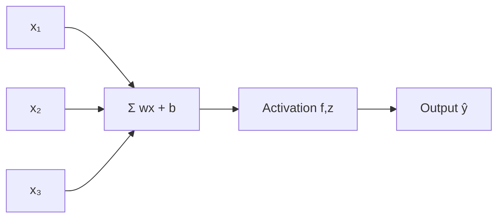
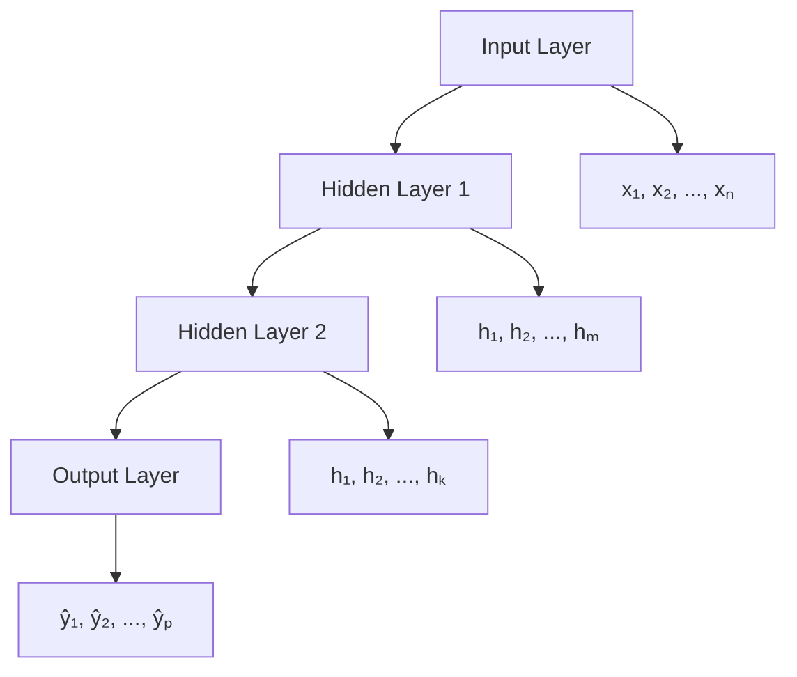
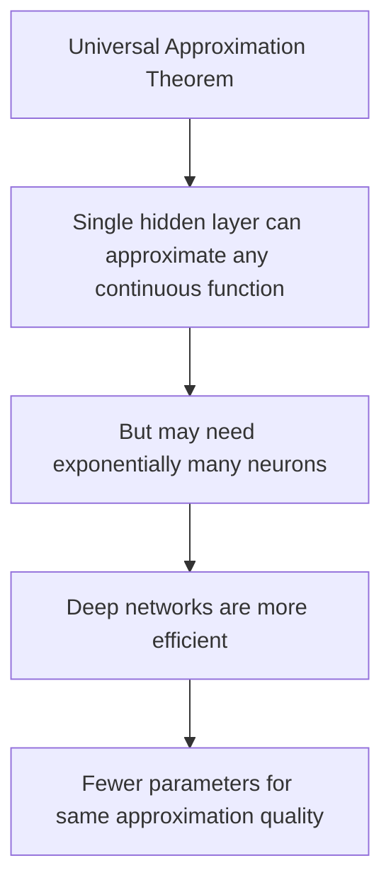

# Neural Network Basics

## Overview

Neural networks are **universal function approximators** — they can learn to map any input to any output given enough neurons and data. Understanding the building blocks (perceptron, MLP, layers) is essential before diving into complex architectures.

## The Perceptron

The simplest neural network — a single neuron:



$$\hat{y} = f\left(\sum_{i=1}^d w_i x_i + b\right) = f(w^Tx + b)$$

```python
import numpy as np

class Perceptron:
    def __init__(self, n_features, lr=0.01):
        self.w = np.zeros(n_features)
        self.b = 0
        self.lr = lr
    
    def predict(self, x):
        z = np.dot(self.w, x) + self.b
        return 1 if z >= 0 else 0
    
    def fit(self, X, y, epochs=100):
        for _ in range(epochs):
            for xi, yi in zip(X, y):
                pred = self.predict(xi)
                error = yi - pred
                self.w += self.lr * error * xi
                self.b += self.lr * error
```

**Limitation**: Can only learn linearly separable functions (XOR problem).

## Multi-Layer Perceptron (MLP)

Adding hidden layers overcomes the linear separability limitation:



### Forward Pass

```python
import numpy as np

class MLP:
    def __init__(self, layer_sizes):
        self.weights = []
        self.biases = []
        
        # Initialize weights (He initialization)
        for i in range(len(layer_sizes) - 1):
            w = np.random.randn(layer_sizes[i], layer_sizes[i+1]) * np.sqrt(2.0 / layer_sizes[i])
            b = np.zeros(layer_sizes[i+1])
            self.weights.append(w)
            self.biases.append(b)
    
    def relu(self, z):
        return np.maximum(0, z)
    
    def relu_derivative(self, z):
        return (z > 0).astype(float)
    
    def softmax(self, z):
        exp_z = np.exp(z - np.max(z, axis=1, keepdims=True))
        return exp_z / exp_z.sum(axis=1, keepdims=True)
    
    def forward(self, X):
        self.activations = [X]
        self.z_values = []
        
        current = X
        for i, (w, b) in enumerate(zip(self.weights, self.biases)):
            z = current @ w + b
            self.z_values.append(z)
            
            if i < len(self.weights) - 1:
                current = self.relu(z)  # Hidden layers: ReLU
            else:
                current = self.softmax(z)  # Output layer: Softmax
            
            self.activations.append(current)
        
        return current
    
    def cross_entropy_loss(self, y_pred, y_true):
        return -np.mean(np.sum(y_true * np.log(y_pred + 1e-10), axis=1))
```

### Network Architecture

| Component | Purpose |
|-----------|---------|
| Input layer | Receives features |
| Hidden layers | Learn representations |
| Output layer | Produces predictions |
| Weights (W) | Learnable parameters |
| Biases (b) | Learnable offsets |
| Activation | Non-linear functions |

## Universal Approximation Theorem

A single hidden layer with enough neurons can approximate **any continuous function** to arbitrary precision:

$$f(x) \approx \sum_{i=1}^N \alpha_i \sigma(w_i^T x + b_i)$$

Where σ is a non-linear activation function.



**Key insight**: While a single layer CAN approximate any function, **deep networks** do so much more efficiently. Depth allows hierarchical feature learning — each layer builds on the previous.

## Weight Initialization

### Why Initialization Matters

```python
# Bad: All zeros → all neurons learn the same thing
W = np.zeros((n, m))

# Bad: Too large → exploding activations
W = np.random.randn(n, m) * 10

# Bad: Too small → vanishing activations
W = np.random.randn(n, m) * 0.001
```

### Xavier/Glorot Initialization

Designed for sigmoid/tanh activations:

$$W \sim N\left(0, \frac{2}{n_{in} + n_{out}}\right)$$

```python
def xavier_init(fan_in, fan_out):
    return np.random.randn(fan_in, fan_out) * np.sqrt(2.0 / (fan_in + fan_out))
```

### He Initialization

Designed for ReLU activations:

$$W \sim N\left(0, \frac{2}{n_{in}}\right)$$

```python
def he_init(fan_in, fan_out):
    return np.random.randn(fan_in, fan_out) * np.sqrt(2.0 / fan_in)
```

```python
# PyTorch
import torch.nn as nn

layer = nn.Linear(256, 128)
nn.init.kaiming_normal_(layer.weight, mode='fan_in', nonlinearity='relu')
```

## Loss Functions for Different Tasks

| Task | Loss Function | Output Activation |
|------|--------------|-------------------|
| Binary classification | Binary cross-entropy | Sigmoid |
| Multi-class classification | Categorical cross-entropy | Softmax |
| Regression | MSE | Linear |
| Multi-label classification | Binary cross-entropy | Sigmoid |

## Building Neural Networks in PyTorch

```python
import torch
import torch.nn as nn
import torch.optim as optim

class SimpleMLP(nn.Module):
    def __init__(self, input_dim, hidden_dim, output_dim):
        super().__init__()
        self.layers = nn.Sequential(
            nn.Linear(input_dim, hidden_dim),
            nn.ReLU(),
            nn.Dropout(0.2),
            nn.Linear(hidden_dim, hidden_dim),
            nn.ReLU(),
            nn.Dropout(0.2),
            nn.Linear(hidden_dim, output_dim)
        )
    
    def forward(self, x):
        return self.layers(x)

# Training loop
model = SimpleMLP(784, 256, 10)
optimizer = optim.Adam(model.parameters(), lr=0.001)
criterion = nn.CrossEntropyLoss()

for epoch in range(100):
    for batch_X, batch_y in dataloader:
        # Forward pass
        outputs = model(batch_X)
        loss = criterion(outputs, batch_y)
        
        # Backward pass
        optimizer.zero_grad()
        loss.backward()
        optimizer.step()
```

## Interview Questions

### Beginner

**Q: Why do we need non-linear activation functions?**

A: Without non-linearities, a multi-layer network is equivalent to a single linear transformation: W₂(W₁x + b₁) + b₂ = W'x + b'. Non-linear activations allow the network to learn complex, non-linear patterns.

**Q: What is the difference between a parameter and a hyperparameter?**

A: 
- **Parameters**: Learned during training (weights, biases)
- **Hyperparameters**: Set before training (learning rate, number of layers, hidden size, activation function)

### Intermediate

**Q: Why is He initialization better than Xavier for ReLU networks?**

A: ReLU zeros out half the neurons (negative values). Xavier initialization doesn't account for this, leading to vanishing variance in deeper layers. He initialization scales by √(2/n_in) instead of √(2/(n_in+n_out)), compensating for the ReLU's variance reduction. This keeps activations at a stable scale across layers.

**Q: How does depth help compared to width?**

A: Depth enables **hierarchical feature learning**:
- Layer 1: Edges, simple patterns
- Layer 2: Textures, shapes
- Layer 3: Object parts
- Layer 4: Whole objects

A wide single layer would need to learn all combinations of features simultaneously — exponentially more parameters. Depth allows composition, which is much more parameter-efficient.

### FAANG-Level

**Q: Design a neural network for a recommendation system with 100M users and 10M items.**

A: Architecture:
1. **Embedding layers**: User embedding (100M × 128) and item embedding (10M × 128)
2. **Interaction layer**: Concatenate or dot product of user/item embeddings
3. **MLP tower**: 3-4 hidden layers (256, 128, 64) with ReLU and dropout
4. **Output**: Sigmoid for click-through prediction

Training considerations:
- **Negative sampling**: Can't compute softmax over 10M items; sample negatives
- **Embedding tables**: Use mixed-dimension embeddings (popular items get larger embeddings)
- **Feature hashing**: For user/item features to reduce memory
- **Two-tower architecture**: Separate user and item towers for efficient ANN retrieval
- **Online learning**: Update embeddings with recent interactions

## Common Mistakes

1. **Not using non-linear activations**: Network becomes a linear model
2. **Poor weight initialization**: Leads to vanishing/exploding gradients
3. **Too many/too few layers**: Underfitting or overfitting
4. **Not normalizing inputs**: Slow convergence, unstable training
5. **Using softmax for multi-label**: Use sigmoid with binary cross-entropy

## Summary

| Component | Purpose |
|-----------|---------|
| Perceptron | Single neuron, linear boundary |
| MLP | Multiple layers, non-linear boundaries |
| Activation | Non-linearity (ReLU, sigmoid) |
| Weight init | He (ReLU), Xavier (sigmoid/tanh) |
| Loss function | Task-specific objective |
| Backpropagation | Gradient computation |

## Cross-References

- [Backpropagation](backpropagation.md) — How gradients are computed
- [Activation Functions](activation.md) — Different activation choices
- [Optimizers](optimizers.md) — How weights are updated
- [CNNs](cnn.md) — Specialized for images
- [Transformers](../transformers/README.md) — Modern architecture
