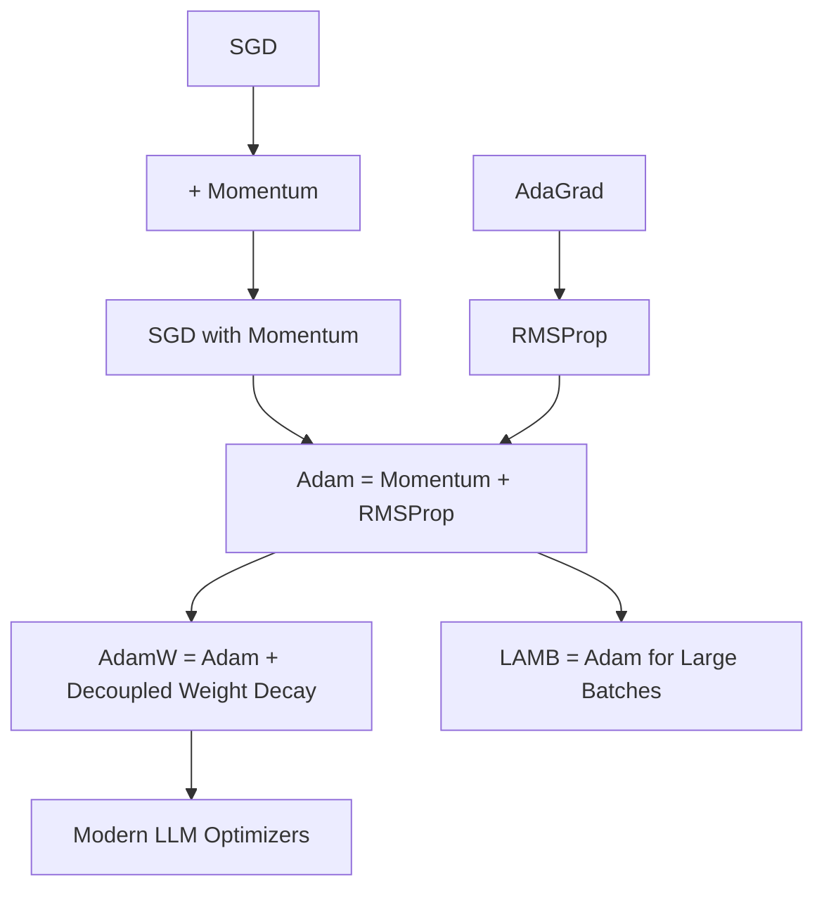
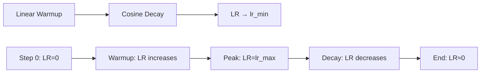

# Optimizers for Deep Learning

## Overview

Optimizers determine **how model weights are updated** based on computed gradients. The choice of optimizer and learning rate schedule can dramatically affect training speed, convergence, and final performance.

## Optimizer Hierarchy



## SGD with Momentum

```python
import numpy as np

class SGDMomentum:
    def __init__(self, lr=0.01, momentum=0.9):
        self.lr = lr
        self.momentum = momentum
        self.velocity = {}
    
    def update(self, params, grads):
        for key, (param, grad) in enumerate(zip(params, grads)):
            if key not in self.velocity:
                self.velocity[key] = np.zeros_like(param)
            
            self.velocity[key] = self.momentum * self.velocity[key] + grad
            param -= self.lr * self.velocity[key]
```

**Why momentum?**: Accelerates convergence in consistent gradient directions, dampens oscillations.

## Adam (Adaptive Moment Estimation)

The default optimizer for most deep learning tasks:

$$m_t = \beta_1 m_{t-1} + (1-\beta_1) g_t \quad \text{(1st moment: mean)}$$
$$v_t = \beta_2 v_{t-1} + (1-\beta_2) g_t^2 \quad \text{(2nd moment: uncentered variance)}$$
$$\hat{m}_t = m_t / (1-\beta_1^t) \quad \text{(bias correction)}$$
$$\hat{v}_t = v_t / (1-\beta_2^t) \quad \text{(bias correction)}$$
$$\theta_t = \theta_{t-1} - \eta \frac{\hat{m}_t}{\sqrt{\hat{v}_t} + \epsilon}$$

```python
class Adam:
    def __init__(self, lr=0.001, beta1=0.9, beta2=0.999, eps=1e-8):
        self.lr = lr
        self.beta1 = beta1
        self.beta2 = beta2
        self.eps = eps
        self.m = {}  # 1st moment
        self.v = {}  # 2nd moment
        self.t = 0
    
    def update(self, params, grads):
        self.t += 1
        
        for i, (param, grad) in enumerate(zip(params, grads)):
            if i not in self.m:
                self.m[i] = np.zeros_like(param)
                self.v[i] = np.zeros_like(param)
            
            # Update moments
            self.m[i] = self.beta1 * self.m[i] + (1 - self.beta1) * grad
            self.v[i] = self.beta2 * self.v[i] + (1 - self.beta2) * grad**2
            
            # Bias correction
            m_hat = self.m[i] / (1 - self.beta1**self.t)
            v_hat = self.v[i] / (1 - self.beta2**self.t)
            
            # Update parameters
            param -= self.lr * m_hat / (np.sqrt(v_hat) + self.eps)
```

## AdamW (Adam with Decoupled Weight Decay)

Fixes L2 regularization in Adam:

```python
# Standard Adam + L2: Adds λθ to gradient → affects adaptive learning rate
# AdamW: Applies weight decay directly to parameters

class AdamW:
    def __init__(self, lr=0.001, beta1=0.9, beta2=0.999, 
                 eps=1e-8, weight_decay=0.01):
        self.lr = lr
        self.beta1 = beta1
        self.beta2 = beta2
        self.eps = eps
        self.weight_decay = weight_decay
        self.m = {}
        self.v = {}
        self.t = 0
    
    def update(self, params, grads):
        self.t += 1
        
        for i, (param, grad) in enumerate(zip(params, grads)):
            if i not in self.m:
                self.m[i] = np.zeros_like(param)
                self.v[i] = np.zeros_like(param)
            
            self.m[i] = self.beta1 * self.m[i] + (1 - self.beta1) * grad
            self.v[i] = self.beta2 * self.v[i] + (1 - self.beta2) * grad**2
            
            m_hat = self.m[i] / (1 - self.beta1**self.t)
            v_hat = self.v[i] / (1 - self.beta2**self.t)
            
            # Decoupled weight decay
            param -= self.lr * (m_hat / (np.sqrt(v_hat) + self.eps) + 
                               self.weight_decay * param)
```

**AdamW is the standard for training Transformers.**

## Learning Rate Schedules

### Warmup

Gradually increase LR at the beginning:

```python
def warmup_schedule(step, warmup_steps, lr_max):
    if step < warmup_steps:
        return lr_max * step / warmup_steps
    return lr_max
```

### Cosine Annealing

Smooth decay following a cosine curve:

```python
def cosine_annealing(step, total_steps, lr_min, lr_max):
    return lr_min + 0.5 * (lr_max - lr_min) * (
        1 + np.cos(np.pi * step / total_steps)
    )
```

### Warmup + Cosine Decay

The standard for Transformers:

```python
def warmup_cosine(step, warmup_steps, total_steps, lr_max, lr_min=0):
    if step < warmup_steps:
        return lr_max * step / warmup_steps
    progress = (step - warmup_steps) / (total_steps - warmup_steps)
    return lr_min + 0.5 * (lr_max - lr_min) * (1 + np.cos(np.pi * progress))
```



### OneCycleLR

Used in fastai — aggressive schedule:

```python
# Increases to max_lr, then decreases
# Often achieves super-convergence
scheduler = torch.optim.lr_scheduler.OneCycleLR(
    optimizer, max_lr=0.01, total_steps=1000
)
```

## Gradient Clipping

Prevents exploding gradients:

```python
def clip_grad_norm(parameters, max_norm=1.0):
    """Clip gradients by global norm"""
    total_norm = 0
    for p in parameters:
        if p.grad is not None:
            total_norm += p.grad.data.norm(2).item() ** 2
    total_norm = total_norm ** 0.5
    
    clip_coef = max_norm / (total_norm + 1e-6)
    if clip_coef < 1:
        for p in parameters:
            if p.grad is not None:
                p.grad.data.mul_(clip_coef)

# PyTorch
torch.nn.utils.clip_grad_norm_(model.parameters(), max_norm=1.0)
```

## PyTorch Training Loop

```python
import torch
import torch.nn as nn
import torch.optim as optim

model = MyModel()
optimizer = optim.AdamW(model.parameters(), lr=1e-3, weight_decay=0.01)
scheduler = optim.lr_scheduler.CosineAnnealingLR(optimizer, T_max=100)
criterion = nn.CrossEntropyLoss()

for epoch in range(100):
    model.train()
    for batch_X, batch_y in dataloader:
        optimizer.zero_grad()
        outputs = model(batch_X)
        loss = criterion(outputs, batch_y)
        loss.backward()
        
        # Gradient clipping
        torch.nn.utils.clip_grad_norm_(model.parameters(), max_norm=1.0)
        
        optimizer.step()
    
    scheduler.step()
```

## Optimizer Selection Guide

| Scenario | Optimizer | LR |
|----------|-----------|-----|
| Starting a new project | Adam | 0.001 |
| Training Transformers | AdamW | 1e-4 to 5e-4 |
| Computer Vision (CNNs) | SGD + Momentum | 0.1 |
| Fine-tuning | Adam | 1e-5 |
| Large batch training | LAMB | Varies |

## Interview Questions

### Beginner

**Q: Why is Adam the default optimizer?**

A: Adam combines the benefits of:
1. **Momentum** (1st moment): Accelerates in consistent gradient directions
2. **RMSProp** (2nd moment): Adapts learning rate per parameter
3. **Bias correction**: Corrects initialization bias

This makes it robust to hyperparameter choices and works well across many problems.

**Q: What is the difference between Adam and AdamW?**

A: Adam + L2 regularization adds weight decay to the gradient before computing moments → the adaptive learning rate interacts with the regularization. AdamW applies weight decay **directly to the parameters** after the Adam update → decoupled from the adaptive learning rate. This is more principled and works better in practice.

### Intermediate

**Q: Why do Transformers need learning rate warmup?**

A: At the start of training:
1. **Random initialization**: Gradients are noisy and large
2. **Adaptive moments are uninformative**: m and v are near zero → biased estimates
3. **Large LR would cause divergence**: The model might make catastrophic updates

Warmup gradually increases LR, allowing the optimizer to accumulate reliable moment estimates before taking large steps.

**Q: When would you use SGD over Adam?**

A: SGD with momentum often generalizes better for:
1. **Computer vision**: CNNs trained with SGD tend to find flatter minima
2. **Final fine-tuning**: After Adam warmup, switching to SGD can improve generalization
3. **When compute is limited**: SGD uses less memory (no m, v states)

### FAANG-Level

**Q: You're training a 10B parameter model. Loss spikes at step 50K. Diagnose and fix.**

A: Systematic approach:
1. **Check gradient norms**: Log gradient norm before clipping. If it spiked → gradient clipping insufficient
2. **Learning rate**: Too high → reduce or add warmup. Check if LR schedule is correct at step 50K
3. **Data quality**: Check if the batch at step 50K has corrupted data, NaN labels
4. **Mixed precision**: If using FP16, loss scale might be too large → check for NaN in gradients
5. **Skip the batch**: Often the model recovers if you skip the bad batch
6. **Reduce LR temporarily**: Drop LR by 10× for a few steps, then restore
7. **Checkpoint recovery**: Load from step 49K and continue with lower LR

## Common Mistakes

1. **Not zeroing gradients**: `optimizer.zero_grad()` before each step
2. **Not clipping gradients**: Essential for RNNs, Transformers
3. **Wrong weight decay**: Use AdamW, not Adam + L2
4. **Not using warmup**: Transformers need warmup (1K-5K steps)
5. **Fixed learning rate**: Almost always use a schedule

## Summary

| Optimizer | Key Feature | Best For |
|-----------|------------|----------|
| SGD + Momentum | Simple, good generalization | CV, final fine-tuning |
| Adam | Adaptive LR, fast convergence | General default |
| AdamW | Decoupled weight decay | Transformers |
| LAMB | Large batch training | Distributed training |

## Cross-References

- [Optimization](../foundations/optimization.md) — Foundational optimization theory
- [Backpropagation](backpropagation.md) — How gradients are computed
- [Batch Normalization](batch-norm.md) — Interacts with learning rate
- [Training Transformers](../transformers/training.md) — AdamW + warmup + cosine
