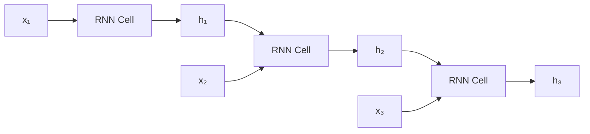
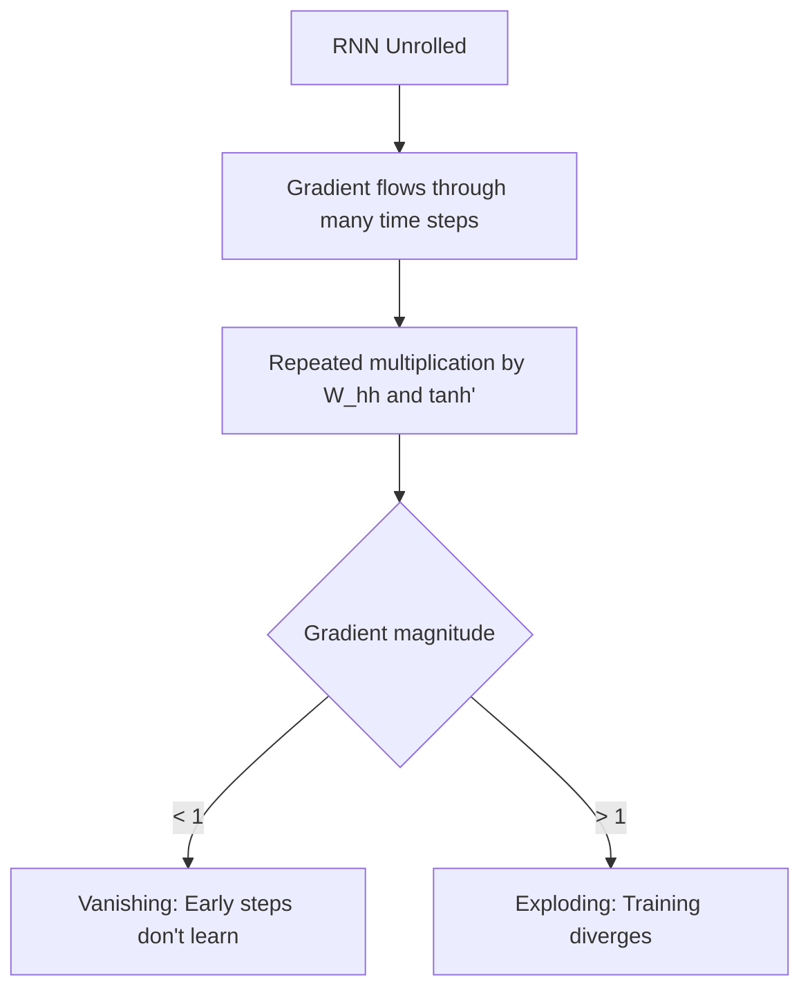
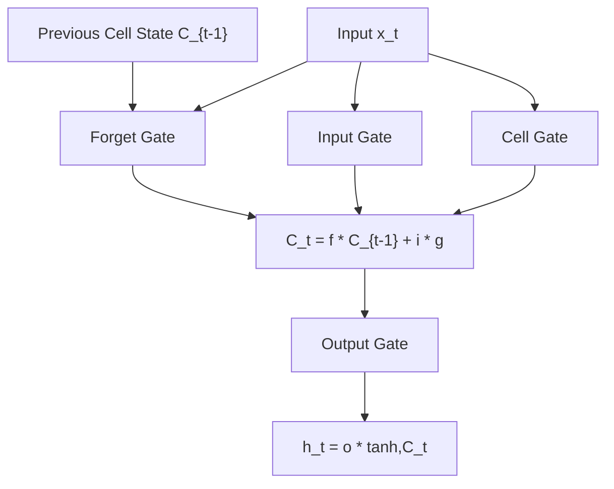
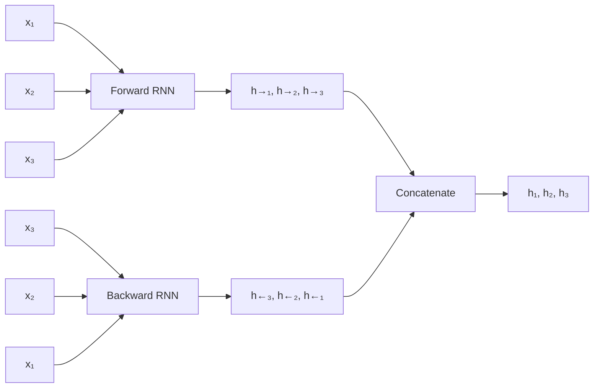

# RNNs & LSTMs

## Overview

Recurrent Neural Networks (RNNs) process **sequential data** by maintaining a hidden state that captures information from previous time steps. LSTMs and GRUs solve the vanishing gradient problem that plagues vanilla RNNs.

## Vanilla RNN



### Forward Pass

$$h_t = \tanh(W_{hh} h_{t-1} + W_{xh} x_t + b_h)$$
$$y_t = W_{hy} h_t + b_y$$

```python
import numpy as np

class VanillaRNN:
    def __init__(self, input_size, hidden_size, output_size):
        self.hidden_size = hidden_size
        
        # Initialize weights
        self.Wxh = np.random.randn(input_size, hidden_size) * 0.01
        self.Whh = np.random.randn(hidden_size, hidden_size) * 0.01
        self.Why = np.random.randn(hidden_size, output_size) * 0.01
        self.bh = np.zeros(hidden_size)
        self.by = np.zeros(output_size)
    
    def forward(self, inputs, h_prev=None):
        """inputs: list of input vectors"""
        if h_prev is None:
            h_prev = np.zeros(self.hidden_size)
        
        self.inputs = inputs
        self.hidden_states = [h_prev]
        outputs = []
        
        for x in inputs:
            h = np.tanh(self.Wxh @ x + self.Whh @ h_prev + self.bh)
            y = self.Why @ h + self.by
            
            self.hidden_states.append(h)
            outputs.append(y)
            h_prev = h
        
        return outputs, h_prev
```

### The Vanishing Gradient Problem in RNNs



For a T-step RNN:

$$\frac{\partial h_T}{\partial h_1} = \prod_{t=2}^{T} \frac{\partial h_t}{\partial h_{t-1}} = \prod_{t=2}^{T} W_{hh}^T \text{diag}(\tanh'(z_t))$$

If the spectral radius of W_hh < 1, the product vanishes exponentially.

## LSTM (Long Short-Term Memory)

LSTMs solve vanishing gradients with **gating mechanisms**:



### LSTM Equations

$$f_t = \sigma(W_f [h_{t-1}, x_t] + b_f) \quad \text{(Forget gate)}$$
$$i_t = \sigma(W_i [h_{t-1}, x_t] + b_i) \quad \text{(Input gate)}$$
$$\tilde{C}_t = \tanh(W_C [h_{t-1}, x_t] + b_C) \quad \text{(Candidate)}$$
$$C_t = f_t \odot C_{t-1} + i_t \odot \tilde{C}_t \quad \text{(Cell state update)}$$
$$o_t = \sigma(W_o [h_{t-1}, x_t] + b_o) \quad \text{(Output gate)}$$
$$h_t = o_t \odot \tanh(C_t) \quad \text{(Hidden state)}$$

```python
import numpy as np

class LSTMCell:
    def __init__(self, input_size, hidden_size):
        self.hidden_size = hidden_size
        
        # Combined weights for all gates
        concat_size = input_size + hidden_size
        self.W = np.random.randn(concat_size, 4 * hidden_size) * 0.01
        self.b = np.zeros(4 * hidden_size)
    
    def sigmoid(self, z):
        return 1 / (1 + np.exp(-np.clip(z, -500, 500)))
    
    def forward(self, x, h_prev, c_prev):
        # Concatenate input and previous hidden state
        concat = np.concatenate([x, h_prev])
        
        # Compute all gates at once
        gates = concat @ self.W + self.b
        
        # Split into four gates
        f, i, g, o = np.split(gates, 4)
        
        forget_gate = self.sigmoid(f)    # What to forget
        input_gate = self.sigmoid(i)     # What to remember
        candidate = np.tanh(g)           # New candidate values
        output_gate = self.sigmoid(o)    # What to output
        
        # Update cell state
        c = forget_gate * c_prev + input_gate * candidate
        
        # Compute hidden state
        h = output_gate * np.tanh(c)
        
        return h, c
```

### Why LSTMs Solve Vanishing Gradients

The **cell state** C_t acts as a "highway" for gradients:

$$C_t = f_t \odot C_{t-1} + i_t \odot \tilde{C}_t$$

When f_t ≈ 1 (forget gate open), the gradient flows directly: ∂C_t/∂C_{t-1} ≈ 1. This is similar to ResNet's skip connections.

## GRU (Gated Recurrent Unit)

A simplified version of LSTM with two gates:

```python
class GRUCell:
    def __init__(self, input_size, hidden_size):
        self.hidden_size = hidden_size
        concat_size = input_size + hidden_size
        
        self.Wz = np.random.randn(concat_size, hidden_size) * 0.01
        self.Wr = np.random.randn(concat_size, hidden_size) * 0.01
        self.Wh = np.random.randn(concat_size, hidden_size) * 0.01
    
    def forward(self, x, h_prev):
        concat = np.concatenate([x, h_prev])
        
        # Update gate: what to forget and remember
        z = self.sigmoid(concat @ self.Wz)
        
        # Reset gate: how much past to forget
        r = self.sigmoid(concat @ self.wr)
        
        # Candidate hidden state
        concat_r = np.concatenate([x, r * h_prev])
        h_tilde = np.tanh(concat_r @ self.Wh)
        
        # Final hidden state
        h = (1 - z) * h_prev + z * h_tilde
        
        return h
```

### LSTM vs GRU

| Property | LSTM | GRU |
|----------|------|-----|
| Gates | 3 (forget, input, output) | 2 (update, reset) |
| Cell state | Yes (separate from hidden) | No |
| Parameters | More | Fewer |
| Training speed | Slower | Faster |
| Performance | Often better on long sequences | Comparable on short sequences |

## Bidirectional RNNs

Process sequences in both directions:



```python
# PyTorch bidirectional LSTM
import torch.nn as nn

lstm = nn.LSTM(input_size=128, hidden_size=256, 
               num_layers=2, bidirectional=True, batch_first=True)

# Output: hidden states from both directions concatenated
# output shape: (batch, seq_len, 2 * hidden_size)
```

## Multi-layer RNNs

Stack RNN layers — output of one layer is input to next:

```python
lstm = nn.LSTM(input_size=128, hidden_size=256, 
               num_layers=3, dropout=0.2, batch_first=True)
```

## Applications

| Task | Architecture | Output |
|------|-------------|--------|
| Text classification | LSTM + final hidden state | Class label |
| Named entity recognition | BiLSTM + CRF | Tag sequence |
| Machine translation | Encoder-decoder LSTM | Translated sequence |
| Speech recognition | BiLSTM/Transformer | Transcription |
| Time series prediction | LSTM + regression head | Future values |

## Interview Questions

### Beginner

**Q: Why can't vanilla RNNs handle long sequences?**

A: Vanilla RNNs suffer from vanishing gradients — when sequences are long, the gradient signal from later time steps diminishes exponentially as it flows backward. This means early time steps can't learn from errors at the end. LSTMs solve this with gating mechanisms and a cell state highway.

**Q: What is the purpose of the forget gate in LSTM?**

A: The forget gate decides what information to **discard** from the cell state. It outputs values between 0 (completely forget) and 1 (completely remember) for each element of the cell state. For example, when the subject of a sentence changes, the forget gate can clear the old subject information.

### Intermediate

**Q: How does the LSTM cell state avoid vanishing gradients?**

A: The cell state update is C_t = f_t * C_{t-1} + i_t * C̃_t. When f_t ≈ 1, this is essentially an identity function: C_t ≈ C_{t-1}. The gradient ∂C_t/∂C_{t-1} = f_t ≈ 1, so gradients flow without vanishing. This is analogous to ResNet's skip connections.

**Q: When would you use GRU over LSTM?**

A: GRU when:
1. **Limited data**: Fewer parameters → less overfitting
2. **Short to medium sequences**: GRU performs comparably
3. **Faster training needed**: Fewer computations per step
4. **Simpler model**: Easier to implement and debug

LSTM when:
1. **Very long sequences**: Separate cell state provides longer memory
2. **Complex dependencies**: More gates → more expressive
3. **Sufficient data**: Can leverage extra parameters

### FAANG-Level

**Q: For a sequence of 10,000 tokens, would you use an LSTM or Transformer? Why?**

A: **Transformer**, for several reasons:
1. **Parallelism**: Transformers process all tokens in parallel; LSTMs are sequential
2. **Long-range dependencies**: Self-attention connects any two positions in O(1) hops; LSTM needs O(n) steps
3. **Gradient flow**: Transformers have direct paths between any positions via attention
4. **Scalability**: Transformers scale better with modern hardware (GPUs/TPUs)

However, LSTMs might still be preferred for:
1. **Streaming/online processing**: Can process one token at a time
2. **Very long sequences**: O(n²) attention is expensive; linear attention or LSTM might be better
3. **Limited compute**: LSTMs are more parameter-efficient for small models

## Common Mistakes

1. **Not handling variable-length sequences**: Use `pack_padded_sequence` in PyTorch
2. **Using tanh on very long sequences**: Can still saturate; consider layer normalization
3. **Not initializing hidden state**: Usually zero-init; learnable init can help
4. **Ignoring bidirectional**: For non-autoregressive tasks, bi-directional is usually better
5. **Using RNN when Transformer is better**: For most NLP tasks, Transformers are superior

## Summary

| Architecture | Key Feature | Problem Solved |
|-------------|-------------|---------------|
| Vanilla RNN | Hidden state | Sequential processing |
| LSTM | 3 gates + cell state | Vanishing gradients |
| GRU | 2 gates | Simpler alternative to LSTM |
| Bidirectional | Both directions | Full context |

## Cross-References

- [Backpropagation](backpropagation.md) — Through time (BPTT)
- [Attention Mechanism](attention.md) — Attention overcomes RNN limitations
- [Transformers](../transformers/README.md) — Replaced RNNs for most tasks
- [Batch Normalization](batch-norm.md) — Layer normalization for RNNs
