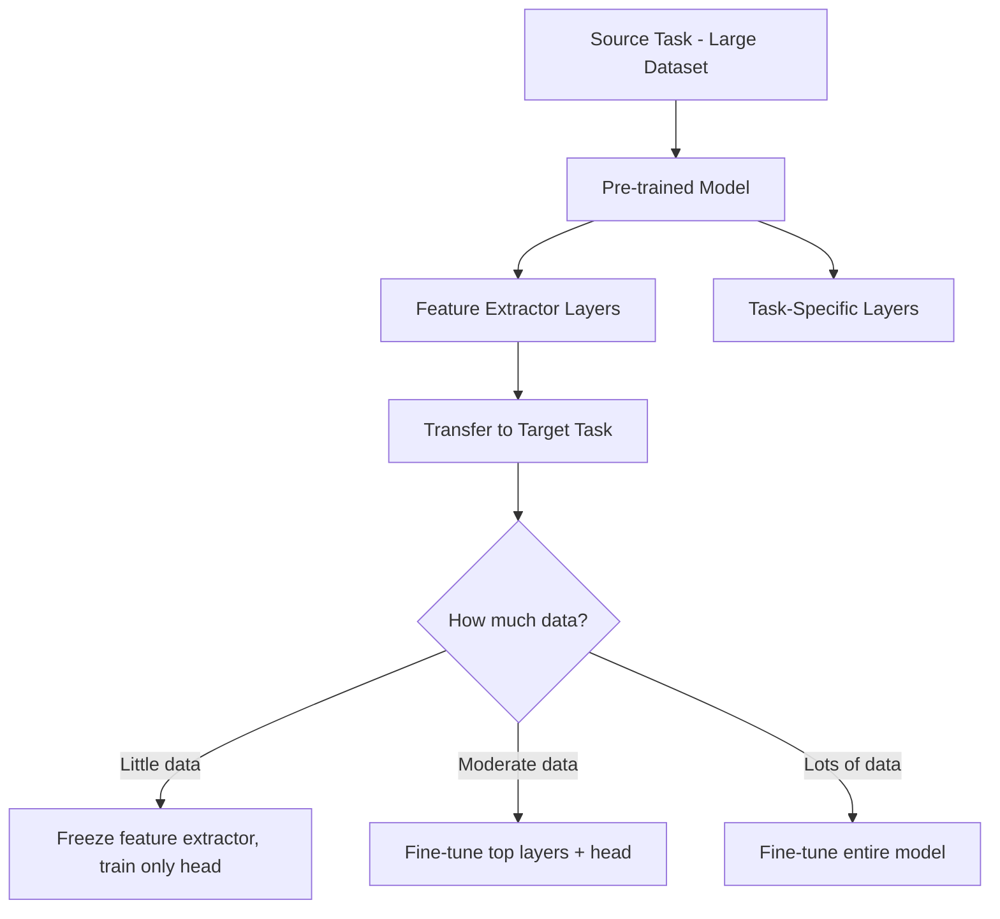
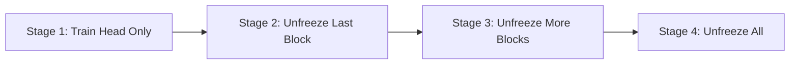
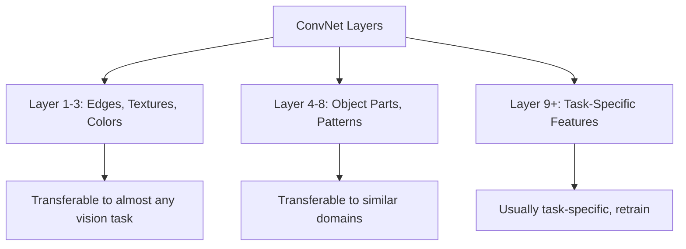
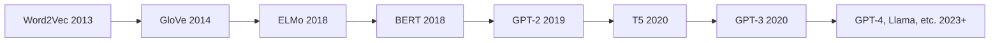
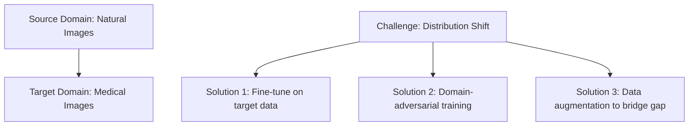

# Transfer Learning

## Overview

Transfer Learning leverages knowledge gained from one task (source) and applies it to a different but related task (target). Instead of training from scratch, we start with a **pre-trained model** and adapt it — dramatically reducing data requirements and training time.

## Why Transfer Learning?

| Scenario | Without Transfer Learning | With Transfer Learning |
|----------|--------------------------|----------------------|
| **Data needed** | Millions of samples | Thousands or hundreds |
| **Training time** | Days/weeks | Hours/days |
| **Compute cost** | Very high | Moderate |
| **Performance** | May overfit on small data | Strong baseline |

## How Transfer Learning Works



### Three Strategies

#### 1. Feature Extraction (Freeze & Train Head)
- Freeze all pre-trained layers
- Replace and train only the final classification head
- Best when: very little target data (< 1000 samples)

```python
# PyTorch example
model = pretrained_model
for param in model.parameters():
    param.requires_grad = False  # Freeze
model.fc = nn.Linear(512, num_classes)  # New head
# Only model.fc parameters are trained
```

#### 2. Fine-Tuning (Unfreeze & Train All/Some)
- Unfreeze some or all pre-trained layers
- Train with a **small learning rate** to avoid catastrophic forgetting
- Best when: moderate target data (1K-100K samples)

#### 3. Gradual Unfreezing
- Start by training only the head
- Progressively unfreeze layers from top to bottom
- Each stage uses a lower learning rate
- Popularized by ULMFiT (Howard & Ruder, 2018)



## Transfer Learning in Computer Vision

### Pre-trained Models

| Model | Pre-trained On | Architecture | Parameters |
|-------|---------------|-------------|------------|
| **ResNet-50** | ImageNet (1.2M images) | Residual connections | 25M |
| **VGG-16** | ImageNet | Sequential conv blocks | 138M |
| **EfficientNet** | ImageNet | Compound scaling | 5-66M |
| **ViT** | ImageNet-21K | Vision Transformer | 86M+ |
| **CLIP** | 400M image-text pairs | Dual encoder | 150M+ |

### What Transfers?



Early layers learn **universal features** (edges, textures) that transfer well across domains. Later layers are more task-specific.

## Transfer Learning in NLP

### Evolution of Pre-training



### BERT-style Transfer
- **Pre-training**: Masked language modeling + next sentence prediction
- **Fine-tuning**: Add task-specific head, fine-tune on labeled data
- Works well for: classification, NER, question answering

### GPT-style Transfer
- **Pre-training**: Autoregressive next-token prediction
- **Fine-tuning**: Instruction tuning + RLHF
- Works well for: generation, reasoning, few-shot learning

### Prompt-based Transfer (Modern LLMs)
Instead of fine-tuning, adapt the **prompt**:
- **Zero-shot**: Describe the task in the prompt
- **Few-shot**: Include examples in the prompt
- **Chain-of-thought**: Ask the model to reason step by step

## Domain Adaptation

When source and target domains differ significantly:



### Domain-Adversarial Neural Networks (DANN)
- Feature extractor learns domain-invariant representations
- Domain classifier tries to distinguish source vs target
- Feature extractor is trained to **fool** the domain classifier
- Result: features that work on both domains

## Negative Transfer

**When transfer learning hurts performance:**
- Source and target tasks are too dissimilar
- Pre-trained features are irrelevant to the target domain
- Fine-tuning with too high a learning rate destroys useful features

**How to avoid:**
- Measure similarity between source and target domains
- Use appropriate fine-tuning strategies (gradual unfreezing)
- Consider training from scratch if domains are very different

## Interview Questions

**Q1: When would you use transfer learning vs training from scratch?**
> Transfer learning when: limited target data, target task is related to source, compute budget is limited, need fast iteration. Train from scratch when: abundant target data, target domain is very different from available pre-trained models, need domain-specific architecture, or the pre-trained model introduces bias.

**Q2: How do you choose which layers to freeze vs fine-tune?**
> - Little data: freeze all, train head only
> - Moderate data: fine-tune top layers + head
> - Lots of data: fine-tune everything with small LR
> - Rule of thumb: earlier layers are more general (freeze), later layers are more specific (fine-tune)
> - Use gradual unfreezing for best results

**Q3: What is catastrophic forgetting and how do you prevent it?**
> When fine-tuning on a new task, the model "forgets" pre-trained knowledge. Prevention: (1) Use small learning rate, (2) Freeze early layers, (3) Use gradual unfreezing, (4) Mix source and target data during fine-tuning, (5) Use regularization like EWC (Elastic Weight Consolidation) to protect important weights.

**Q4: How does transfer learning work differently in NLP vs CV?**
> CV: Pre-trained on ImageNet, freeze early convolutional layers (universal features), fine-tune later layers. NLP: Pre-trained on large text corpus, fine-tune with task-specific head. Modern NLP (LLMs) uses prompt engineering or LoRA instead of full fine-tuning. Both benefit from the same principle — early layers capture universal patterns.

**Q5: Explain LoRA in the context of transfer learning.**
> LoRA (Low-Rank Adaptation) is a parameter-efficient transfer learning method. Instead of fine-tuning all weights, it freezes the pre-trained model and adds small trainable low-rank matrices (A and B) to each layer. The pre-trained weights W become W + BA, where B and A are much smaller. This reduces trainable parameters by 1000× while matching full fine-tuning performance.

**Q6: What is the difference between multi-task learning and transfer learning?**
> Transfer learning: train on source task, then adapt to target task (sequential). Multi-task learning: train on multiple tasks simultaneously (parallel). Transfer learning is one-directional; MTL shares knowledge bidirectionally. MTL requires all task data simultaneously; TL can be applied independently.

## Common Mistakes

1. **Using too high a learning rate** — Destroys pre-trained features; use 10×-100× smaller LR
2. **Freezing too many layers with lots of data** — Underutilizes the target data
3. **Not adapting the architecture** — Pre-trained head may not match target classes
4. **Ignoring domain gap** — Medical images ≠ natural images; may need domain adaptation
5. **Using outdated pre-trained models** — Newer models (ViT, CLIP) often transfer better
6. **Not evaluating on the right metrics** — Pre-trained model may be biased toward source distribution

## Summary

| Aspect | Detail |
|--------|--------|
| **Core Idea** | Reuse knowledge from source task for target task |
| **Strategies** | Feature extraction, fine-tuning, gradual unfreezing |
| **CV** | ImageNet pre-trained models → freeze early layers |
| **NLP** | BERT/GPT pre-training → fine-tune or prompt |
| **Modern** | LoRA for parameter-efficient fine-tuning of LLMs |
| **Key Risk** | Negative transfer when domains are too different |

Transfer learning is the foundation of modern deep learning practice — virtually every production model starts from a pre-trained checkpoint.

## Cross-References

- [Fine-Tuning (LLM)](../../llm/llm-serving/sft.md)
- [Transformers](../transformers/README.md)
- [Vision Transformers](../transformers/vit.md)
- [Knowledge Distillation](../advanced/distillation.md)
- [MLOps Deployment](../mlops/deployment.md)

