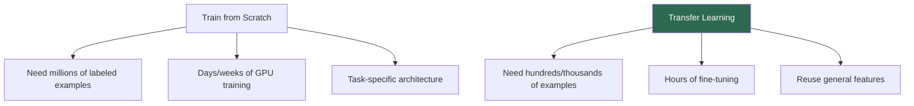
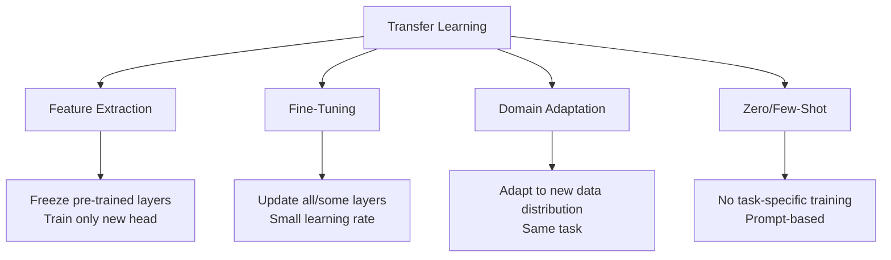
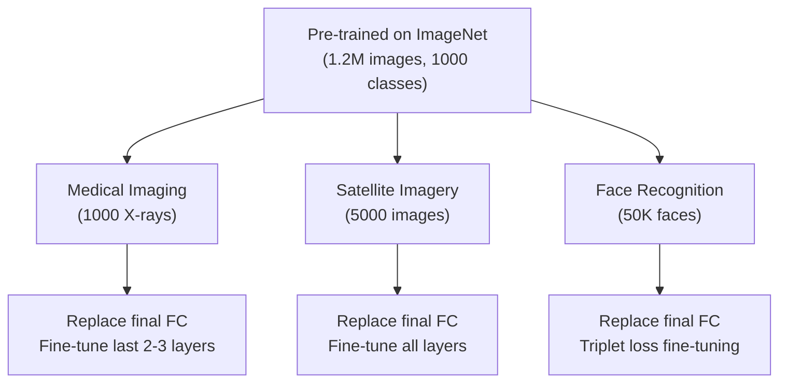
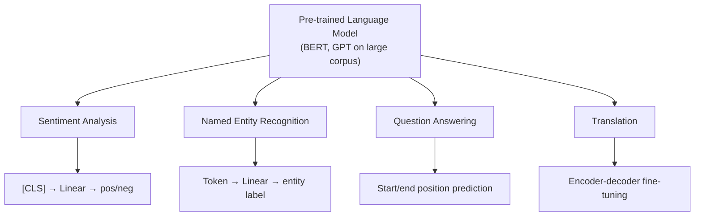

# Transfer Learning

## Overview

Transfer learning uses knowledge gained from one task (source) to improve performance on a different task (target). Instead of training from scratch, we start with a **pre-trained model** and adapt it. This dramatically reduces data requirements, training time, and compute costs. It's the foundation of modern deep learning practice — nearly all state-of-the-art models use transfer learning.

## Why Transfer Learning?



## Types of Transfer Learning



### 1. Feature Extraction

Freeze the pre-trained model and only train a new task-specific head:

$$\mathbf{h} = f_{\text{pretrained}}(\mathbf{x}) \quad \text{(frozen)}$$
$$\hat{y} = g_{\text{new}}(\mathbf{h}) \quad \text{(trainable)}$$

```python
import torchvision.models as models

# Load pre-trained ResNet
model = models.resnet50(pretrained=True)

# Freeze all layers
for param in model.parameters():
    param.requires_grad = False

# Replace classification head
model.fc = nn.Linear(2048, num_classes)

# Only train the new head
optimizer = torch.optim.Adam(model.fc.parameters(), lr=1e-3)
```

### 2. Fine-Tuning

Update pre-trained weights with a small learning rate:

```python
# Unfreeze some/all layers
for param in model.parameters():
    param.requires_grad = True

# Use smaller learning rate for pre-trained layers
optimizer = torch.optim.AdamW([
    {'params': model.layer4.parameters(), 'lr': 1e-5},  # Later layers
    {'params': model.fc.parameters(), 'lr': 1e-3}       # New head
])

# Or use discriminative learning rates
# Earlier layers → smaller LR (more general features)
# Later layers → larger LR (more task-specific)
```

### 3. Fine-Tuning Strategies

| Strategy | Description | When to Use |
|----------|-------------|-------------|
| Full fine-tuning | Update all parameters | Large target dataset |
| Gradual unfreezing | Unfreeze layers one by one | Medium dataset |
| Discriminative LR | Different LR per layer | Any fine-tuning |
| LoRA | Low-rank adapters | Large models, limited compute |
| Adapter layers | Small bottleneck layers | Multi-task |

## Transfer Learning in Computer Vision



**Key insight**: Early CNN layers learn universal features (edges, textures, colors) that transfer well. Later layers learn task-specific features that may not transfer.

## Transfer Learning in NLP



### NLP Transfer Learning Evolution

| Era | Approach | Example |
|-----|----------|---------|
| Pre-2018 | Word2Vec/GloVe + task model | LSTM + GloVe embeddings |
| 2018-2020 | Pre-train + fine-tune | BERT fine-tuning |
| 2020+ | Prompt-based / In-context | GPT-3 few-shot |
| 2023+ | Instruction tuning + RLHF | ChatGPT, Claude |

## Domain Adaptation

When source and target distributions differ:

$$\min_\theta \mathcal{L}_{\text{task}}(\theta) + \lambda \cdot d_{\mathcal{H}}(\mathcal{D}_S, \mathcal{D}_T)$$

Where $d_{\mathcal{H}}$ is a domain divergence measure.

```python
class DomainAdversarialNetwork(nn.Module):
    """DANN: Adversarial domain adaptation."""
    def __init__(self, feature_extractor, task_classifier, domain_classifier):
        super().__init__()
        self.feature_extractor = feature_extractor
        self.task_classifier = task_classifier
        self.domain_classifier = domain_classifier
    
    def forward(self, x, alpha=1.0):
        features = self.feature_extractor(x)
        task_output = self.task_classifier(features)
        # Gradient reversal for domain adaptation
        domain_output = self.domain_classifier(GradientReversal.apply(features, alpha))
        return task_output, domain_output
```

## Interview Questions

### Q1: What is transfer learning and why is it important?
**Answer:** Transfer learning uses a model trained on one task as the starting point for a different task. It's important because: 1) reduces data requirements (hundreds vs. millions of examples), 2) reduces training time (hours vs. days), 3) improves performance (leverages general features), 4) enables applications where labeled data is scarce.

### Q2: When should you freeze vs. fine-tune layers?
**Answer:**
- **Freeze when**: Small target dataset, similar source domain, want to prevent overfitting
- **Fine-tune when**: Larger target dataset, different domain, need task-specific features
- **Rule of thumb**: Freeze early layers (general features), fine-tune later layers (task-specific)

### Q3: What is the difference between feature extraction and fine-tuning?
**Answer:** Feature extraction freezes the pre-trained model and only trains a new output layer. Fine-tuning updates some or all pre-trained weights. Feature extraction is faster but less flexible; fine-tuning adapts features to the target task but risks overfitting with small datasets.

### Q4: How does transfer learning work in NLP?
**Answer:** In NLP, a language model (BERT, GPT) is pre-trained on large text corpora with self-supervised objectives (MLM, next-token prediction). The pre-trained model captures general language understanding. For downstream tasks, you add a task-specific head and fine-tune on labeled data. Modern approaches use prompt-based transfer without any fine-tuning.

### Q5: What is negative transfer?
**Answer:** Negative transfer occurs when transferring from a source task hurts performance on the target task. This happens when source and target are too dissimilar. For example, fine-tuning a model trained on English text for Chinese NLP without proper adaptation. Mitigations: check domain similarity, use domain adaptation techniques, or train from scratch.

## Common Mistakes

- ❌ Using too high learning rate for fine-tuning (destroys pre-trained features)
- ❌ Not freezing batch norm layers during fine-tuning (unstable statistics)
- ❌ Fine-tuning on very small dataset without regularization (overfitting)
- ❌ Assuming pre-trained features always transfer (negative transfer)
- ❌ Not using data augmentation during fine-tuning

## Summary

Transfer learning reuses pre-trained models for new tasks, dramatically reducing data and compute requirements. Feature extraction freezes pre-trained layers; fine-tuning updates them. In CV, ImageNet pre-trained CNNs are standard. In NLP, BERT/GPT pre-training is the foundation. Modern approaches use parameter-efficient methods (LoRA) and prompt-based transfer.

## Cross-References

- [CNN →](cnn.md) Pre-trained CNN architectures
- [BERT →](../transformers/bert.md) NLP pre-training
- [GPT →](../transformers/gpt.md) Generative pre-training
- [Training →](../transformers/training.md) Fine-tuning strategies
- [Batch Norm →](batch-norm.md) Batch norm during transfer
