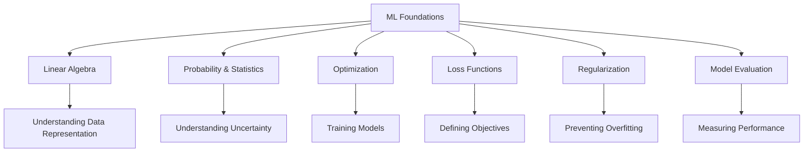
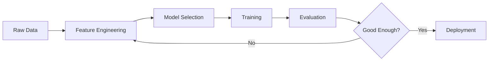

# Machine Learning Foundations

## Overview

Machine Learning (ML) is a subset of artificial intelligence that enables systems to **learn patterns from data** and make predictions or decisions without being explicitly programmed. Before diving into specific algorithms, you must master the foundational concepts that underpin every ML system.

## Why Foundations Matter

## Topics in This Section

| Topic | Key Concepts | Interview Frequency |
|-------|-------------|-------------------|
| [Linear Algebra](linear-algebra.md) | Vectors, matrices, eigenvalues, SVD | ⭐⭐⭐⭐⭐ |
| [Probability](probability.md) | Bayes' theorem, distributions, MLE/MAP | ⭐⭐⭐⭐⭐ |
| [Optimization](optimization.md) | Gradient descent, SGD, Adam | ⭐⭐⭐⭐ |
| [Loss Functions](loss-functions.md) | MSE, cross-entropy, hinge loss | ⭐⭐⭐⭐ |
| [Regularization](regularization.md) | L1, L2, dropout, early stopping | ⭐⭐⭐⭐ |
| [Bias-Variance](bias-variance.md) | Tradeoff, underfitting, overfitting | ⭐⭐⭐⭐⭐ |
| [Cross-Validation](cross-validation.md) | K-fold, stratified, time series | ⭐⭐⭐ |
| [Feature Engineering](feature-engineering.md) | Scaling, encoding, selection | ⭐⭐⭐ |
| [Evaluation](evaluation.md) | Accuracy, precision, recall, AUC-ROC | ⭐⭐⭐⭐⭐ |

## The ML Pipeline

## Key Takeaway

> **"The quality of your ML system is determined by the quality of your understanding of the fundamentals, not by the complexity of your model."**

Every advanced topic — from transformers to reinforcement learning — builds on these foundations. Master them first.

## Cross-References

- [Linear Algebra](./linear-algebra.md)
- [Probability](./probability.md)
- [Loss Functions](./loss-functions.md)
- [Classical ML](../classical/README.md)
- [ML Interview Questions](../../interview/ml-questions.md)
