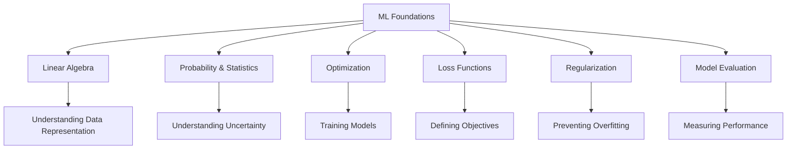
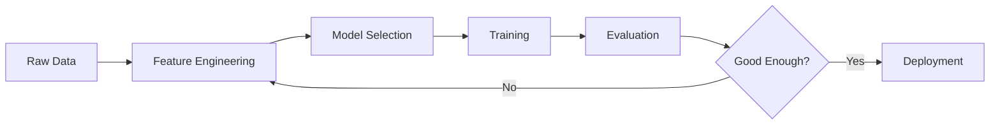
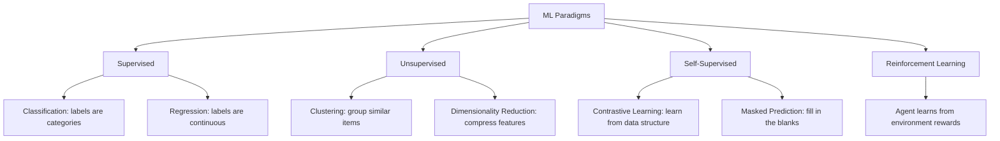
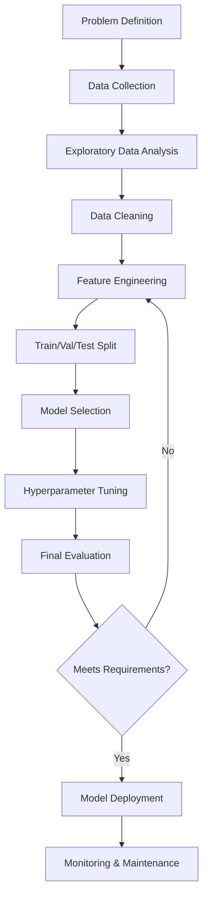

# Machine Learning Foundations

## Overview

Machine Learning (ML) is a subset of artificial intelligence that enables systems to **learn patterns from data** and make predictions or decisions without being explicitly programmed. Before diving into specific algorithms, you must master the foundational concepts that underpin every ML system.

## Why Foundations Matter

In ML interviews, foundations are the **most frequently tested area**. Interviewers expect you to explain not just *what* a technique does, but *why* it works mathematically and *when* to apply it.

## Topics in This Section

| Topic | Key Concepts | Interview Frequency |
|-------|-------------|-------------------|
| [Linear Algebra](linear-algebra.md) | Vectors, matrices, eigenvalues, SVD | ⭐⭐⭐⭐⭐ |
| [Probability](probability.md) | Bayes' theorem, distributions, MLE/MAP | ⭐⭐⭐⭐⭐ |
| [Optimization](optimization.md) | Gradient descent, SGD, Adam | ⭐⭐⭐⭐ |
| [Loss Functions](loss-functions.md) | MSE, cross-entropy, hinge loss | ⭐⭐⭐⭐ |
| [Regularization](regularization.md) | L1, L2, dropout, early stopping | ⭐⭐⭐⭐ |
| [Bias-Variance](bias-variance.md) | Tradeoff, underfitting, overfitting | ⭐⭐⭐⭐⭐ |
| [Cross-Validation](cross-validation.md) | K-fold, stratified, time series | ⭐⭐⭐ |
| [Feature Engineering](feature-engineering.md) | Scaling, encoding, selection | ⭐⭐⭐ |
| [Evaluation](evaluation.md) | Accuracy, precision, recall, AUC-ROC | ⭐⭐⭐⭐⭐ |

## The ML Pipeline

## Prerequisites: The Math You Need

### Linear Algebra (Must-Know)

| Concept | Why It Matters in ML | Example Use |
|---------|---------------------|-------------|
| Vectors | Represent data points and features | A single training sample is a vector |
| Matrices | Represent datasets and transformations | Dataset X is an n×d matrix |
| Dot Product | Measure similarity | Cosine similarity, neural network layers |
| Eigenvalues/Eigenvectors | Dimensionality reduction | PCA finds eigenvectors of covariance matrix |
| SVD | Matrix factorization | Recommendation systems, latent factors |
| Matrix Calculus | Gradient computation | Backpropagation uses Jacobians |

**Key formula — Matrix multiplication in a neural network layer:**

$$
z = Wx + b
$$

Where W is the weight matrix, x is the input vector, and b is the bias vector.

### Probability & Statistics (Must-Know)

| Concept | Why It Matters | Example Use |
|---------|---------------|-------------|
| Bayes' Theorem | Updating beliefs with evidence | Naive Bayes, Bayesian inference |
| Conditional Probability | Dependencies between variables | P(y\|x) is the core prediction |
| Expectation & Variance | Summary statistics | Mean squared error, variance of predictions |
| Common Distributions | Modeling data | Gaussian (continuous), Bernoulli (binary) |
| MLE / MAP | Parameter estimation | Training logistic regression |
| Central Limit Theorem | Why averages work | Confidence intervals for A/B tests |

**Key formula — Bayes' Theorem:**

$$
P(\theta | D) = \frac{P(D | \theta) \cdot P(\theta)}{P(D)}
$$

Posterior = Likelihood × Prior / Evidence

### Calculus & Optimization

| Concept | Why It Matters | Example Use |
|---------|---------------|-------------|
| Derivatives | Finding gradients | Gradient descent updates |
| Chain Rule | Backpropagation | Computing gradients through layers |
| Partial Derivatives | Multi-variable optimization | Loss function w.r.t. each parameter |
| Convexity | Guaranteeing global minimum | Linear regression, logistic regression |

## Core ML Concepts Every Interview Tests

### 1. Supervised vs Unsupervised vs Self-Supervised

### 2. The Bias-Variance Tradeoff

| Model Complexity | Bias | Variance | Risk |
|-----------------|------|----------|------|
| Too simple (linear) | High | Low | Underfitting |
| Just right | Low-Medium | Low-Medium | Good generalization |
| Too complex (deep tree) | Low | High | Overfitting |

**Interview tip:** Always explain that increasing model complexity reduces bias but increases variance. Regularization techniques (L1, L2, dropout) help control this tradeoff.

### 3. Gradient Descent Variants

| Variant | Description | Pros | Cons |
|---------|-------------|------|------|
| Batch GD | Use all data per update | Stable convergence | Slow, memory-heavy |
| SGD | Use one sample per update | Fast, can escape local minima | Noisy updates |
| Mini-batch GD | Use a batch of samples | Balance of speed and stability | Requires batch size tuning |
| Adam | Adaptive learning rates | Fast, handles sparse gradients | Can generalize poorly |

**Key formula — SGD update rule:**

$$
\theta_{t+1} = \theta_t - \eta \cdot \nabla_\theta J(\theta_t)
$$

Where η is the learning rate and J is the loss function.

### 4. Regularization Techniques

| Technique | What It Does | When to Use |
|-----------|-------------|-------------|
| L1 (Lasso) | Adds \|w\| penalty, encourages sparsity | Feature selection |
| L2 (Ridge) | Adds w² penalty, shrinks weights | General overfitting |
| Elastic Net | Combines L1 + L2 | Many correlated features |
| Dropout | Randomly zero activations | Deep neural networks |
| Early Stopping | Stop training when val loss increases | Any iterative model |
| Data Augmentation | Expand training data | Image, text, audio tasks |

### 5. Feature Engineering Essentials

| Technique | Description | Example |
|-----------|-------------|---------|
| Normalization | Scale to [0,1] | Min-max scaling |
| Standardization | Zero mean, unit variance | Z-score |
| One-Hot Encoding | Binary columns for categories | Color → [1,0,0], [0,1,0] |
| Log Transform | Reduce skewness | Income, population data |
| Binning | Convert continuous to categorical | Age groups |
| Feature Interaction | Combine features | a × b, a / b |
| Polynomial Features | Add powers of features | x², x³ |

## Common Interview Questions

### Theory Questions

1. **What is the bias-variance tradeoff?**
   Bias is error from overly simple models (underfitting). Variance is error from overly complex models (overfitting). The goal is to find the sweet spot that minimizes total error = bias² + variance + irreducible noise.

2. **Explain the difference between L1 and L2 regularization.**
   L1 (Lasso) adds the absolute value of weights to the loss, creating sparse solutions (some weights become exactly 0) — useful for feature selection. L2 (Ridge) adds the squared magnitude, shrinking weights toward zero but never exactly zero — better for preventing overfitting when all features matter.

3. **When would you use precision vs recall?**
   Precision: when false positives are costly (spam detection — don't block good emails). Recall: when false negatives are costly (cancer detection — don't miss cases). F1: when you need a balance.

4. **How does cross-validation help?**
   It gives a more reliable estimate of model performance by training and evaluating on multiple data splits. K-fold CV reduces the variance of the performance estimate compared to a single train/test split.

### Practical Questions

5. **You have a dataset with 100 features and 1000 samples. What do you do?**
   This is a high-dimensional, low-sample scenario (curse of dimensionality). Apply feature selection (mutual information, L1 regularization), dimensionality reduction (PCA), or use simpler models. Collect more data if possible.

6. **Your model has 99% accuracy on an imbalanced dataset (99% negative). Is it good?**
   No — this is the accuracy paradox. A model predicting all negative achieves 99%. Use precision, recall, F1, or AUC-ROC instead. Consider oversampling (SMOTE), undersampling, or class-weighted loss.

7. **How do you handle missing data?**
   Options: (1) Delete rows/columns if missing is random and small. (2) Impute with mean/median/mode. (3) Use models that handle missingness (XGBoost). (4) Create a "missing" indicator feature. (5) Use multiple imputation for statistical rigor.

## The ML Pipeline (Detailed)

## Study Roadmap

## Key Takeaway

> **"The quality of your ML system is determined by the quality of your understanding of the fundamentals, not by the complexity of your model."**

Every advanced topic — from transformers to reinforcement learning — builds on these foundations. Master them first.

## References

- Goodfellow, I., Bengio, Y., & Courville, A. (2016). *Deep Learning* — Chapter 4-5 (Numerical Computation, Machine Learning Basics)
- Bishop, C. (2024). *Deep Learning: Foundations and Concepts* — Modern take on fundamentals
- Hastie, T., Tibshirani, R., & Friedman, J. (2009). *The Elements of Statistical Learning* — Comprehensive ML theory
- Ng, A. (2024). *Machine Learning Specialization* (Coursera) — Best intro course
- Shalev-Shwartz, S. & Ben-David, S. (2014). *Understanding Machine Learning* — Free PDF, rigorous treatment

## Cross-References

- [Linear Algebra](./linear-algebra.md)
- [Probability](./probability.md)
- [Loss Functions](./loss-functions.md)
- [Classical ML](../classical/README.md)
- [ML Interview Questions](../../interview/ml-questions.md)
