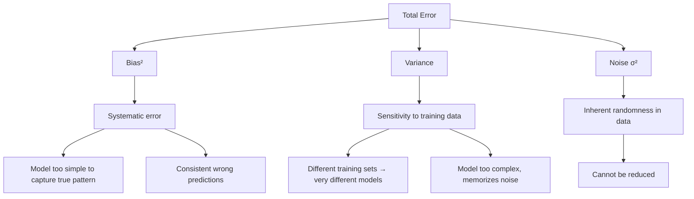
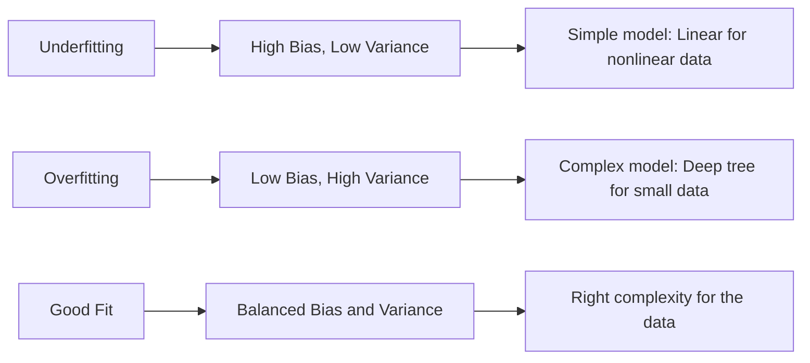
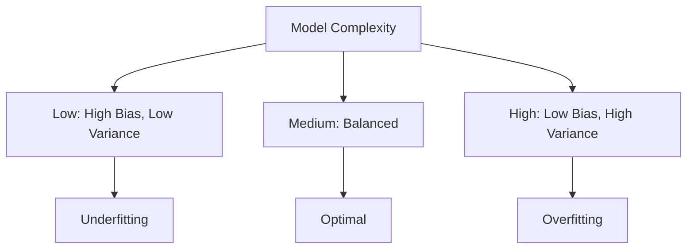
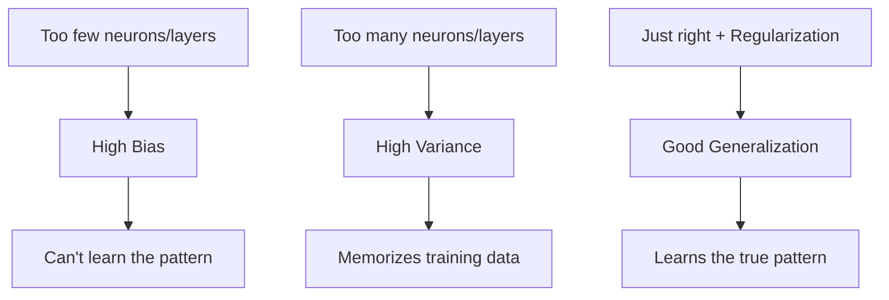
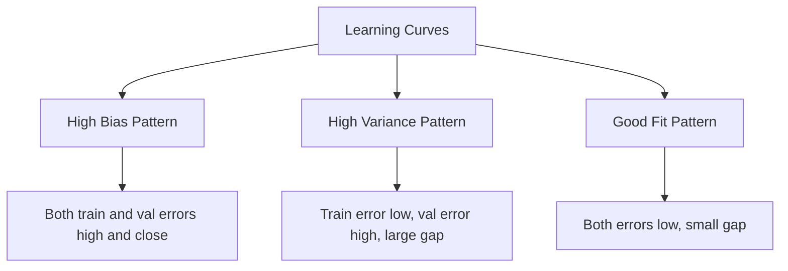
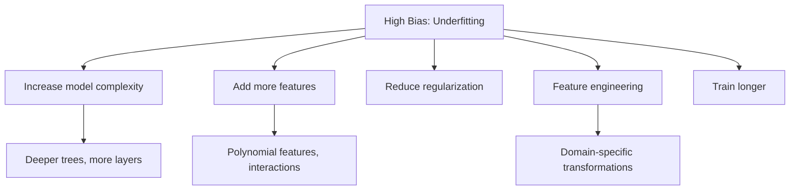
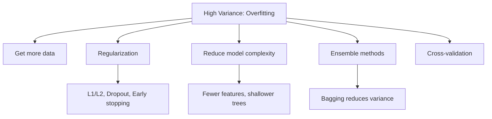
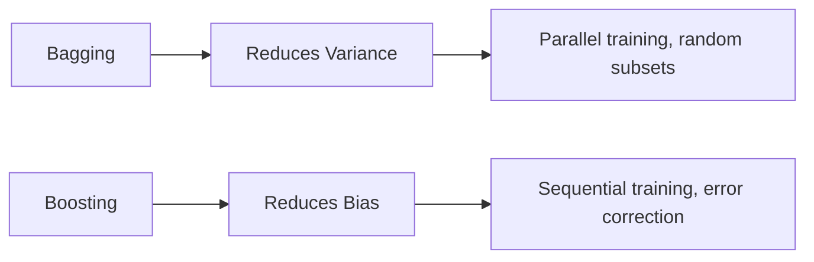
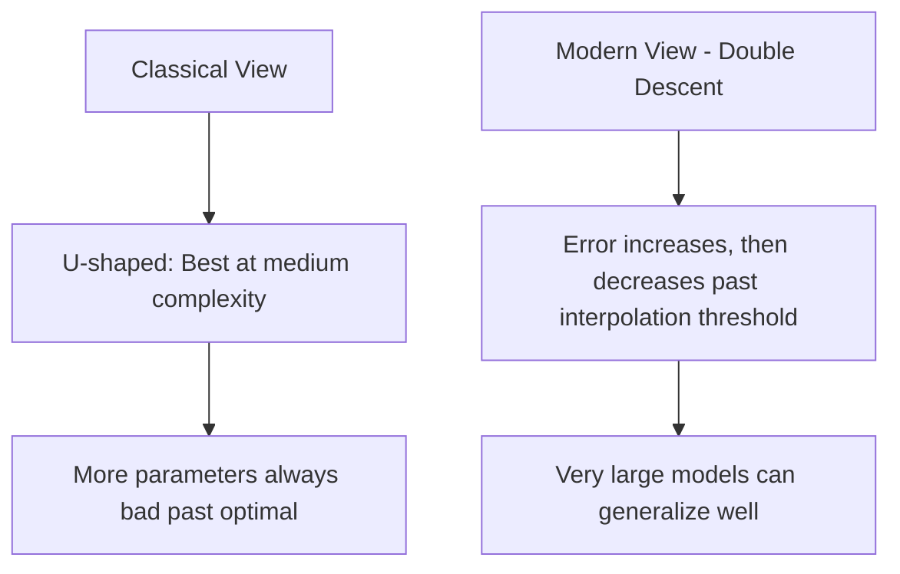

# Bias-Variance Tradeoff

## Overview

The bias-variance tradeoff is the **central tension in machine learning**. It explains why models fail and guides every decision from model selection to hyperparameter tuning. Understanding it is essential for any ML interview.

## The Decomposition

For a model $\hat{f}$ trained on dataset $D$, predicting at point $x$ with true function $f^*(x)$ and noise $\epsilon \sim N(0, \sigma^2)$:

\\[E_D[(y - \hat{f}(x))^2] = \underbrace{(E_D[\hat{f}(x)] - f^*(x))^2}_{\text{Bias}^2} + \underbrace{E_D[(\hat{f}(x) - E_D[\hat{f}(x)])^2]}_{\text{Variance}} + \underbrace{\sigma^2}_{\text{Irreducible Noise}}\\]

### What Each Term Means



| Component | Source | Reduced By |
|-----------|--------|-----------|
| **Bias²** | Wrong assumptions, underfitting | More complex model, better features |
| **Variance** | Sensitivity to data, overfitting | More data, regularization, simpler model |
| **Noise** | Inherent randomness | Cannot be reduced |

## Visual Intuition



### The U-Shaped Curve

```python
import numpy as np
import matplotlib.pyplot as plt

# Simulating bias-variance tradeoff
model_complexity = np.linspace(0.1, 10, 100)
bias_squared = 1.0 / (model_complexity + 0.5)
variance = 0.1 * model_complexity
noise = 0.5
total_error = bias_squared + variance + noise

# Optimal complexity: where total error is minimized
# This is the sweet spot between underfitting and overfitting
```



## Bias-Variance in Different Models

### Decision Trees

```python
from sklearn.tree import DecisionTreeRegressor

# High bias (underfitting): max_depth=1 (decision stump)
tree_shallow = DecisionTreeRegressor(max_depth=1)

# High variance (overfitting): no limit on depth
tree_deep = DecisionTreeRegressor(max_depth=None)

# Balanced: moderate depth with pruning
tree_balanced = DecisionTreeRegressor(max_depth=5, min_samples_leaf=10)
```

**Single decision tree**: High variance (small changes in data → very different tree)
**Solution**: Ensemble methods (Random Forest, Gradient Boosting)

### Linear Regression

```python
# High bias: Simple linear model for nonlinear data
# y = sin(x) + noise, but model is y = wx + b
# The model can't capture the sine wave → systematic error

# Reducing bias: Add polynomial features
from sklearn.preprocessing import PolynomialFeatures
from sklearn.pipeline import make_pipeline

# Degree 1: High bias
# Degree 10: High variance (overfits noise)
# Degree 3-5: Good balance
model = make_pipeline(PolynomialFeatures(degree=3), LinearRegression())
```

### Neural Networks



## Practical Diagnosis

### How to Detect Bias vs Variance

```python
# Training and validation error tell you the story:
train_error = 0.05  # Low
val_error = 0.25    # High
# → High variance (overfitting): train error << val error

train_error = 0.30  # High
val_error = 0.32    # High
# → High bias (underfitting): both errors are high

train_error = 0.08  # Low
val_error = 0.10    # Low
# → Good fit: both errors are low and close
```

### Learning Curves

```python
from sklearn.model_selection import learning_curve

def plot_learning_curves(estimator, X, y):
    train_sizes, train_scores, val_scores = learning_curve(
        estimator, X, y, cv=5,
        train_sizes=np.linspace(0.1, 1.0, 10)
    )
    
    train_mean = train_scores.mean(axis=1)
    train_std = train_scores.std(axis=1)
    val_mean = val_scores.mean(axis=1)
    val_std = val_scores.std(axis=1)
    
    # High bias: Both curves converge to a high error
    # High variance: Large gap between curves
    # Good: Both curves converge to low error with small gap
```



## Strategies to Address Each

### Reducing High Bias



### Reducing High Variance



## Ensemble Methods and Bias-Variance

### Bagging (e.g., Random Forest)

**Reduces variance** by averaging multiple high-variance models:

\\[\text{Var}(\bar{X}) = \rho \sigma^2 + \frac{(1-\rho)\sigma^2}{n}\\]

Where ρ is correlation between models. Random Forest reduces ρ via feature randomness.

```python
from sklearn.ensemble import RandomForestRegressor

# Each tree has high variance
# Averaging many trees → low variance
# Bias stays roughly the same as a single tree
rf = RandomForestRegressor(n_estimators=100, max_depth=10)
```

### Boosting (e.g., XGBoost)

**Reduces bias** by sequentially correcting errors:

```python
import xgboost as xgb

# Each tree focuses on the errors of the previous ensemble
# Sequential learning → reduces bias
# Careful tuning needed to control variance
model = xgb.XGBRegressor(n_estimators=100, max_depth=3, learning_rate=0.1)
```



## The Double Descent Phenomenon

Modern deep learning has revealed that the classical U-shaped curve doesn't always hold:



```python
# Double descent: As model size increases beyond the interpolation threshold
# (where model can perfectly fit training data), test error can decrease again
# This is observed in:
# - Deep neural networks (overparameterized regime)
# - Random features
# - Kernel methods

# Key insight: The classical bias-variance tradeoff still holds,
# but in overparameterized models, implicit regularization 
# (SGD, architecture) controls variance effectively
```

### Why Double Descent Happens

1. **Under-parameterized regime**: Classical bias-variance tradeoff
2. **Interpolation threshold**: Model barely fits training data → maximum variance
3. **Over-parameterized regime**: Model has many solutions that fit data → SGD finds "simple" ones → variance decreases again

## Interview Questions

### Beginner

**Q: Can you have both high bias and high variance?**

A: Yes! This happens when:
- The model makes systematic errors (bias) AND is sensitive to training data (variance)
- Example: A complex model that's misspecified (wrong functional form) and trained on little data
- In practice, one usually dominates, but both can be present

**Q: Why is noise called "irreducible"?**

A: Noise represents randomness inherent in the data-generating process — measurement error, missing variables, true stochasticity. No model, no matter how perfect, can predict random noise. It sets a floor on achievable error.

### Intermediate

**Q: How does the number of training examples affect bias and variance?**

A: 
- **Bias**: Largely unaffected by training set size (it's about model assumptions)
- **Variance**: Decreases with more data (more data → more stable estimates)
- **Learning curves**: If training error is high and stable → bias problem. If there's a large gap between train/val error that narrows with more data → variance problem.

**Q: Why does bagging reduce variance but not bias?**

A: Bagging averages B models trained on bootstrap samples. The average of B estimators has variance reduced by a factor of ~1/B (if independent) or more (with feature decorrelation). But bias is the expected error across all possible training sets — averaging doesn't change the systematic error. Each tree still has the same structural limitations.

### FAANG-Level

**Q: Explain why overparameterized deep neural networks generalize well, despite the classical bias-variance tradeoff suggesting they should overfit.**

A: This is an active research area. Key insights:
1. **Implicit regularization of SGD**: Stochastic gradient descent finds flat minima (low loss curvature) rather than sharp minima. Flat minima generalize better because small perturbations to inputs don't change predictions much.
2. **Architecture inductive bias**: CNNs have translation equivariance; Transformers have attention patterns — these constrain the hypothesis space even with many parameters.
3. **Lottery ticket hypothesis**: Large networks contain smaller subnetworks that can solve the task. SGD finds these "winning tickets."
4. **Neural tangent kernel perspective**: In the infinite-width limit, neural networks behave like kernel methods with a data-dependent kernel.
5. **Practical implication**: More parameters + proper regularization often works better than fewer parameters. The double descent curve shows that very large models can outperform medium-sized ones.

## Common Mistakes

1. **Only looking at training error**: High training error → bias problem. Large train-val gap → variance problem.
2. **Adding complexity without validation**: Always validate — more complexity doesn't always help.
3. **Assuming ensemble always helps**: Bagging a high-bias model doesn't help (averaging biased estimates is still biased).
4. **Ignoring data quality**: Sometimes "high bias" is actually a data problem (missing features, wrong labels).
5. **Confusing model complexity with number of parameters**: A linear model with 1000 features is still "simple" in the bias-variance sense — it's the functional form that matters.

## Summary

| Condition | Training Error | Validation Error | Solution |
|-----------|---------------|-----------------|----------|
| High Bias | High | High (close to train) | More complex model |
| High Variance | Low | High (far from train) | Regularization, more data |
| Good Fit | Low | Low (close to train) | ✓ Optimal |
| High Both | High | Higher | More data + better model |

## Cross-References

- [Regularization](regularization.md) — Techniques to reduce variance
- [Cross-Validation](cross-validation.md) — Estimating generalization error
- [Random Forest](../classical/random-forest.md) — Bagging reduces variance
- [Gradient Boosting](../classical/gradient-boosting.md) — Sequential bias reduction
- [Dropout](../deep-learning/dropout.md) — Variance reduction in neural networks
