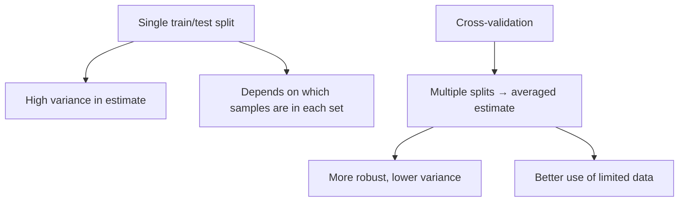
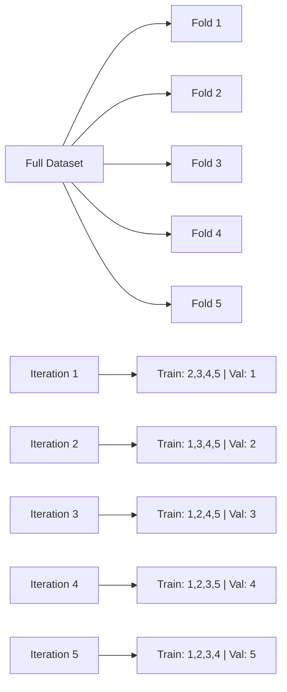
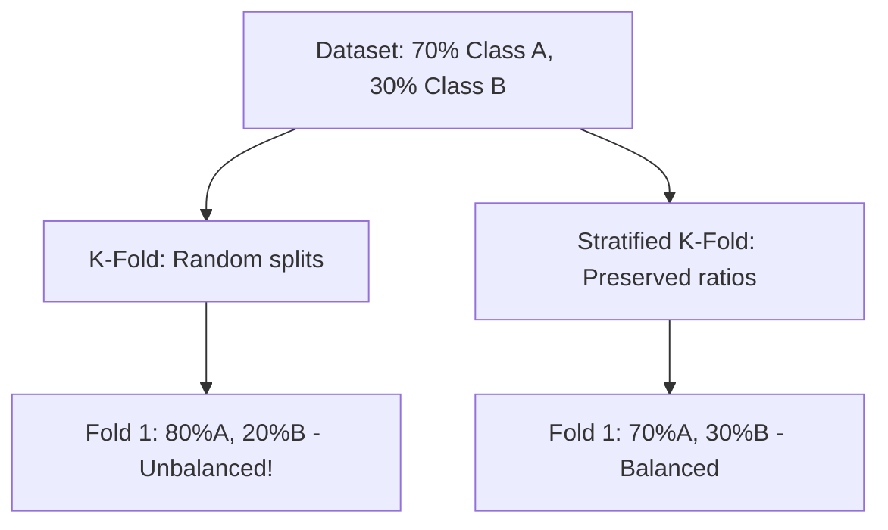
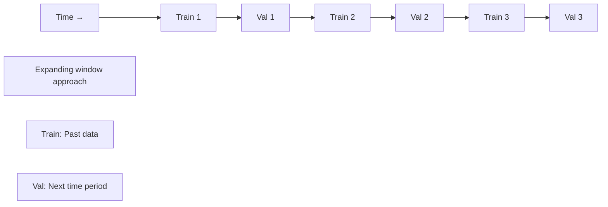
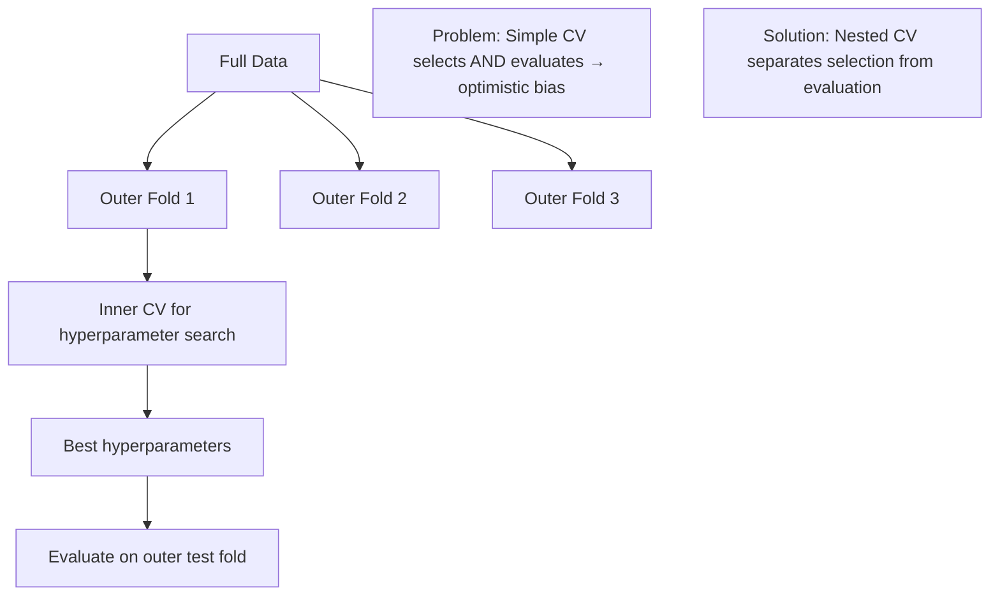

# Cross-Validation

## Overview

Cross-validation is the primary technique for **estimating how well a model generalizes** to unseen data. It systematically splits data into training and validation sets to give a robust estimate of test performance without touching the actual test set.

## Why Cross-Validation?



A single train/test split gives a **noisy** estimate — if you're lucky, the test set is easy; if unlucky, it's hard. Cross-validation averages over multiple splits.
## K-Fold Cross-Validation

The most common approach:

```python
from sklearn.model_selection import KFold, cross_val_score
from sklearn.linear_model import LogisticRegression
import numpy as np

# Split data into k folds
X, y = np.random.randn(100, 10), np.random.randint(0, 2, 100)

kf = KFold(n_splits=5, shuffle=True, random_state=42)
model = LogisticRegression()

scores = []
for train_idx, val_idx in kf.split(X):
    X_train, X_val = X[train_idx], X[val_idx]
    y_train, y_val = y[train_idx], y[val_idx]
    
    model.fit(X_train, y_train)
    scores.append(model.score(X_val, y_val))

print(f"Mean accuracy: {np.mean(scores):.3f} ± {np.std(scores):.3f}")

# Or simply:
scores = cross_val_score(model, X, y, cv=5, scoring='accuracy')
```



### Choosing K

| K | Pros | Cons |
|---|------|------|
| K=5 | Good balance, common default | Moderate computation |
| K=10 | Better estimate, used in papers | More computation |
| K=n (LOO) | Nearly unbiased | High variance, very expensive |

## Stratified K-Fold

Preserves **class distribution** in each fold — essential for imbalanced datasets.

```python
from sklearn.model_selection import StratifiedKFold

# Imbalanced dataset: 90% class 0, 10% class 1
y = np.array([0]*90 + [1]*10)

# Regular K-Fold might put all class 1 in one fold!
kf = KFold(n_splits=5)
for train_idx, val_idx in kf.split(X):
    print(f"Val class distribution: {np.bincount(y[val_idx])}")
    # Could be [18, 2] or [20, 0] — very unstable!

# Stratified K-Fold preserves distribution
skf = StratifiedKFold(n_splits=5, shuffle=True, random_state=42)
for train_idx, val_idx in skf.split(X, y):
    print(f"Val class distribution: {np.bincount(y[val_idx])}")
    # Always [18, 2] — stable!
```



## Time Series Split

For temporal data — **never use future data to predict the past**!

```python
from sklearn.model_selection import TimeSeriesSplit

# Regular K-Fold would leak future information!
tscv = TimeSeriesSplit(n_splits=5)

for train_idx, val_idx in tscv.split(X):
    print(f"Train: {train_idx[0]}-{train_idx[-1]}, Val: {val_idx[0]}-{val_idx[-1]}")

# Iteration 1: Train [0-19], Val [20-39]
# Iteration 2: Train [0-39], Val [40-59]
# Iteration 3: Train [0-59], Val [60-79]
# ...
# Always: train comes before validation in time
```



**Why this matters**: In financial, weather, or any time-dependent data, using future data creates **data leakage** — artificially inflated performance that doesn't generalize.

## Leave-One-Out Cross-Validation (LOOCV)

Each sample is used once as validation:

```python
from sklearn.model_selection import LeaveOneOut

loo = LeaveOneOut()
scores = cross_val_score(model, X, y, cv=loo)
# n_splits = n_samples (very expensive for large datasets)
```

**Properties**:
- Nearly unbiased estimate of test error
- High variance (each training set differs by only 1 sample)
- Computationally expensive: O(n) model fits
- Useful for small datasets (< 100 samples)

## Group K-Fold

When samples are **grouped** (e.g., multiple measurements per patient):

```python
from sklearn.model_selection import GroupKFold

# Groups: Patient IDs
groups = np.array([0,0,0, 1,1,1, 2,2,2, 3,3,3])

gkf = GroupKFold(n_splits=4)
for train_idx, val_idx in gkf.split(X, y, groups):
    print(f"Val groups: {groups[val_idx]}")
    # All samples from one patient go to the same fold
    # Prevents data leakage from correlated samples
```

## Nested Cross-Validation

For **hyperparameter tuning + model evaluation**:

```python
from sklearn.model_selection import GridSearchCV, cross_val_score

# Outer loop: Estimates generalization error
# Inner loop: Selects best hyperparameters

outer_cv = StratifiedKFold(n_splits=5, shuffle=True, random_state=42)
inner_cv = StratifiedKFold(n_splits=3, shuffle=True, random_state=42)

param_grid = {'C': [0.01, 0.1, 1, 10]}
model = LogisticRegression()

outer_scores = []
for train_idx, test_idx in outer_cv.split(X, y):
    X_train, X_test = X[train_idx], X[test_idx]
    y_train, y_test = y[train_idx], y[test_idx]
    
    # Inner CV for hyperparameter tuning
    grid_search = GridSearchCV(model, param_grid, cv=inner_cv, scoring='accuracy')
    grid_search.fit(X_train, y_train)
    
    # Evaluate best model on outer test fold
    outer_scores.append(grid_search.score(X_test, y_test))

print(f"Nested CV accuracy: {np.mean(outer_scores):.3f} ± {np.std(outer_scores):.3f}")
```



## Cross-Validation for Different Tasks

### Regression

```python
from sklearn.model_selection import cross_val_score

# Use appropriate scoring: R², MSE, MAE
scores = cross_val_score(model, X, y, cv=5, scoring='neg_mean_squared_error')
mse_scores = -scores  # sklearn returns negative MSE
```

### Classification

```python
# Accuracy, F1, AUC-ROC, etc.
from sklearn.metrics import make_scorer, f1_score

f1_scorer = make_scorer(f1_score, average='weighted')
scores = cross_val_score(model, X, y, cv=5, scoring=f1_scorer)
```

### Multi-label

```python
from sklearn.model_selection import RepeatedStratifiedKFold

# For multi-label: use RepeatedStratifiedKFold
rskf = RepeatedStratifiedKFold(n_splits=5, n_repeats=3, random_state=42)
```

## Practical Tips

### 1. Shuffle Your Data

```python
# Always shuffle for non-temporal data
kf = KFold(n_splits=5, shuffle=True, random_state=42)
```

### 2. Use Stratification for Classification

```python
# Default for classification in sklearn
from sklearn.model_selection import cross_val_score
scores = cross_val_score(model, X, y, cv=5)  # Uses StratifiedKFold for classifiers
```

### 3. Set Random Seeds

```python
# For reproducibility
kf = KFold(n_splits=5, shuffle=True, random_state=42)
```

### 4. Report Mean AND Standard Deviation

```python
print(f"Accuracy: {np.mean(scores):.3f} ± {np.std(scores):.3f}")
# The std tells you how stable the estimate is
```

## Interview Questions

### Beginner

**Q: Why not just use a single train/test split?**

A: A single split gives a noisy estimate that depends on which samples end up in each set. With small datasets, you might get lucky or unlucky. Cross-validation averages over multiple splits, giving a more reliable estimate of generalization performance.

**Q: When should you use stratified K-fold?**

A: For classification tasks, especially with imbalanced classes. Stratification ensures each fold has approximately the same class distribution as the full dataset. Without it, some folds might have very few (or zero) minority class samples, making the evaluation unreliable.

### Intermediate

**Q: Why is nested cross-validation necessary?**

A: If you use the same CV loop for both hyperparameter selection and performance estimation, you get an **optimistically biased** estimate. The model is selected to perform well on those specific CV folds. Nested CV separates the selection (inner loop) from evaluation (outer loop), giving an unbiased estimate.

**Q: How do you handle data leakage in cross-validation?**

A: Common sources and fixes:
1. **Time series**: Use TimeSeriesSplit, never use future data
2. **Grouped data**: Use GroupKFold to keep correlated samples together
3. **Feature scaling**: Fit scaler on training fold only, transform validation fold
4. **Feature selection**: Select features within each fold, not before CV

```python
# Correct: Pipeline ensures scaling happens within each fold
from sklearn.pipeline import Pipeline
from sklearn.preprocessing import StandardScaler

pipe = Pipeline([
    ('scaler', StandardScaler()),
    ('model', LogisticRegression())
])
scores = cross_val_score(pipe, X, y, cv=5)  # No leakage!
```

### FAANG-Level

**Q: You have a dataset of 1M samples. Is K-fold CV still necessary?**

A: For 1M samples, a single train/validation/test split (e.g., 80/10/10) is usually sufficient because:
1. The validation set is large enough for stable estimates
2. K-fold CV would be computationally expensive (K× training time)
3. The variance of the estimate is already low with large datasets

However, consider K-fold if:
- The problem has rare events (even 1M might have few positive examples)
- You need confidence intervals on your metric
- You're comparing models with small performance differences
- The data distribution is non-stationary

In practice at scale, most teams use a single split with careful stratification and save K-fold for final model validation.

## Common Mistakes

1. **Data leakage**: Scaling/feature selection before splitting → inflated metrics
2. **Not shuffling**: Data might be ordered by class → biased folds
3. **Using K-fold for time series**: Leaks future information → unrealistic performance
4. **Reporting CV score as test score**: CV estimates test performance; you still need a held-out test set
5. **Too few folds with small data**: Use LOO or high K for small datasets

## Summary

| Method | Best For | Key Property |
|--------|----------|-------------|
| K-Fold | General use | Balanced estimate |
| Stratified K-Fold | Classification | Preserves class distribution |
| Time Series Split | Temporal data | Respects temporal order |
| LOOCV | Small datasets | Nearly unbiased |
| Group K-Fold | Grouped data | Prevents leakage |
| Nested CV | Model selection + evaluation | Unbiased estimate |

## Cross-References

- [Bias-Variance](bias-variance.md) — CV estimates the variance component
- [Evaluation](evaluation.md) — Metrics computed during CV
- [Feature Engineering](feature-engineering.md) — Must be done within CV folds
- [Linear Regression](../classical/linear-regression.md) — Model selection with CV
