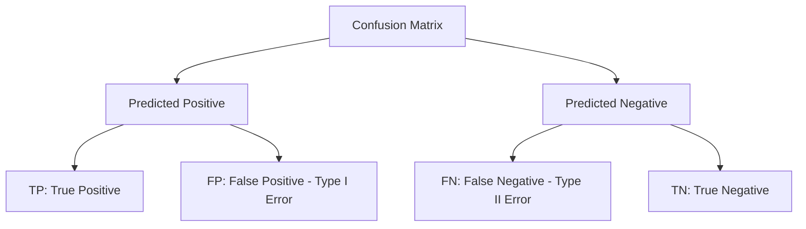
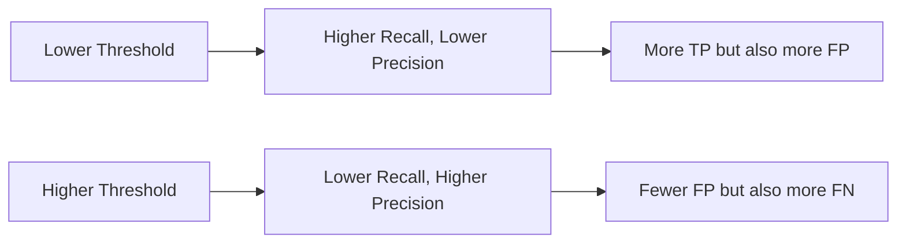
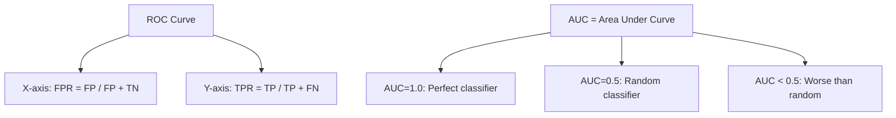
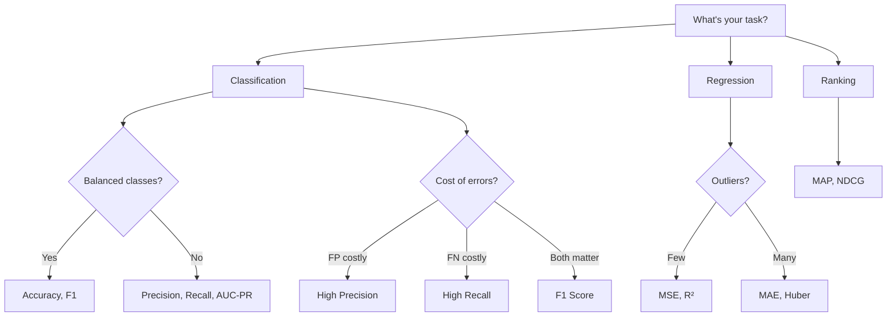

# Evaluation Metrics

## Overview

Choosing the right evaluation metric is **as important as choosing the right model**. The metric defines what "good" means for your problem. A model optimized for accuracy might perform terribly when false negatives are costly (medical diagnosis), and a model optimized for precision might miss too many true positives.

## Classification Metrics

### Confusion Matrix

The foundation of all classification metrics:

```python
from sklearn.metrics import confusion_matrix, ConfusionMatrixDisplay

y_true = [1, 0, 1, 1, 0, 1, 0, 0, 1, 0]
y_pred = [1, 0, 1, 0, 0, 1, 1, 0, 1, 0]

cm = confusion_matrix(y_true, y_pred)
# [[TN, FP],
#  [FN, TP]]
# [[4, 1],
#  [1, 4]]
```



### Accuracy

\\[\text{Accuracy} = \frac{TP + TN}{TP + TN + FP + FN}\\]

```python
from sklearn.metrics import accuracy_score

accuracy = accuracy_score(y_true, y_pred)
# Manual: (4 + 4) / (4 + 1 + 1 + 4) = 0.8
```

**When to use**: Balanced classes, all errors equally costly
**When NOT to use**: Imbalanced datasets (99% accuracy by predicting majority class)

### Precision

\\[\text{Precision} = \frac{TP}{TP + FP}\\]

"Of all predicted positives, how many are actually positive?"

```python
from sklearn.metrics import precision_score

precision = precision_score(y_true, y_pred)
# 4 / (4 + 1) = 0.8
```

**When to use**: When false positives are costly (spam detection, recommendation)

### Recall (Sensitivity, True Positive Rate)

\\[\text{Recall} = \frac{TP}{TP + FN}\\]

"Of all actual positives, how many did we catch?"

```python
from sklearn.metrics import recall_score

recall = recall_score(y_true, y_pred)
# 4 / (4 + 1) = 0.8
```

**When to use**: When false negatives are costly (disease detection, fraud detection)

### F1 Score

Harmonic mean of precision and recall:

\\[F1 = 2 \cdot \frac{\text{Precision} \cdot \text{Recall}}{\text{Precision} + \text{Recall}}\\]

```python
from sklearn.metrics import f1_score

f1 = f1_score(y_true, y_pred)
# 2 * (0.8 * 0.8) / (0.8 + 0.8) = 0.8
```

**Why harmonic mean?** It penalizes extreme imbalance between precision and recall. If either is 0, F1 is 0.

### Precision-Recall Tradeoff



### Specificity (True Negative Rate)

\\[\text{Specificity} = \frac{TN}{TN + FP}\\]

"Of all actual negatives, how many did we correctly identify?"

### Multi-Class Metrics

```python
from sklearn.metrics import classification_report

# For multi-class: average strategies
print(classification_report(y_true, y_pred, target_names=['cat', 'dog', 'bird']))

# Macro average: Unweighted mean of per-class metrics
# Micro average: Global TP, FP, FN counts
# Weighted average: Weighted by class support
```

| Average | Formula | Use When |
|---------|---------|----------|
| Macro | Mean of per-class metrics | All classes equally important |
| Micro | Global TP/(TP+FP) | Dataset-level performance |
| Weighted | Weighted by class count | Account for class imbalance |

### ROC Curve and AUC-ROC

The ROC curve plots TPR vs FPR at different thresholds:

```python
from sklearn.metrics import roc_curve, roc_auc_score

y_scores = [0.9, 0.1, 0.8, 0.3, 0.2, 0.85, 0.6, 0.15, 0.95, 0.05]
fpr, tpr, thresholds = roc_curve(y_true, y_scores)
auc = roc_auc_score(y_true, y_scores)
```



**AUC interpretation**:
- **0.5**: Random guessing (diagonal line)
- **0.7-0.8**: Acceptable
- **0.8-0.9**: Excellent
- **0.9-1.0**: Outstanding
- **< 0.5**: Model is predicting inversely

**AUC is threshold-independent**: It measures the model's ability to rank positive examples higher than negative ones, regardless of the decision threshold.

### Precision-Recall Curve and AUC-PR

Better than ROC for **imbalanced datasets**:

```python
from sklearn.metrics import precision_recall_curve, average_precision_score

precision, recall, thresholds = precision_recall_curve(y_true, y_scores)
ap = average_precision_score(y_true, y_scores)
```

**When to use PR curve over ROC**: When the positive class is rare (< 10%). ROC can be misleadingly optimistic with imbalanced data because TN dominate the FPR denominator.

### Log Loss (Cross-Entropy)

Penalizes confident wrong predictions:

\\[\text{Log Loss} = -\frac{1}{n}\sum_{i=1}^n [y_i \log(\hat{y}_i) + (1-y_i)\log(1-\hat{y}_i)]\\]

```python
from sklearn.metrics import log_loss

loss = log_loss(y_true, y_scores)
```

**Use when**: You care about probability calibration, not just ranking.

## Regression Metrics

### Mean Squared Error (MSE)

\\[\text{MSE} = \frac{1}{n}\sum_{i=1}^n (y_i - \hat{y}_i)^2\\]

```python
from sklearn.metrics import mean_squared_error, root_mean_squared_error

mse = mean_squared_error(y_true, y_pred)
rmse = root_mean_squared_error(y_true, y_pred)  # Root MSE (sklearn >= 1.4)
```

**Properties**: Penalizes large errors heavily (quadratic), same units as target squared

### Mean Absolute Error (MAE)

\\[\text{MAE} = \frac{1}{n}\sum_{i=1}^n |y_i - \hat{y}_i|\\]

```python
from sklearn.metrics import mean_absolute_error

mae = mean_absolute_error(y_true, y_pred)
```

**Properties**: Robust to outliers, same units as target

### R² Score (Coefficient of Determination)

\\[R^2 = 1 - \frac{\sum(y_i - \hat{y}_i)^2}{\sum(y_i - \bar{y})^2} = 1 - \frac{SS_{res}}{SS_{tot}}\\]

```python
from sklearn.metrics import r2_score

r2 = r2_score(y_true, y_pred)
```

**Interpretation**:
- R² = 1: Perfect predictions
- R² = 0: Model predicts the mean
- R² < 0: Model is worse than predicting the mean

### MAPE (Mean Absolute Percentage Error)

\\[\text{MAPE} = \frac{100}{n}\sum_{i=1}^n \left|\frac{y_i - \hat{y}_i}{y_i}\right|\\]

```python
from sklearn.metrics import mean_absolute_percentage_error

mape = mean_absolute_percentage_error(y_true, y_pred)
```

**Caution**: Undefined when y=0, biased toward underestimation

## Ranking Metrics

### NDCG (Normalized Discounted Cumulative Gain)

For recommendation systems:

```python
import numpy as np

def ndcg_at_k(y_true_relevance, y_pred_scores, k=10):
    # Sort by predicted scores
    order = np.argsort(y_pred_scores)[::-1][:k]
    relevance = np.array(y_true_relevance)[order]
    
    # DCG
    dcg = np.sum(relevance / np.log2(np.arange(2, k + 2)))
    
    # Ideal DCG
    ideal_relevance = np.sort(y_true_relevance)[::-1][:k]
    idcg = np.sum(ideal_relevance / np.log2(np.arange(2, k + 2)))
    
    return dcg / idcg if idcg > 0 else 0
```

### MAP (Mean Average Precision)

```python
def average_precision(y_true, y_scores, k=10):
    order = np.argsort(y_scores)[::-1][:k]
    y_true_sorted = np.array(y_true)[order]
    
    precisions = []
    relevant = 0
    for i, label in enumerate(y_true_sorted):
        if label == 1:
            relevant += 1
            precisions.append(relevant / (i + 1))
    
    return np.mean(precisions) if precisions else 0
```

## Metric Selection Guide



| Scenario | Recommended Metric | Why |
|----------|-------------------|-----|
| Balanced classification | Accuracy, F1 | Simple, intuitive |
| Imbalanced classification | AUC-PR, F1 | Handles class skew |
| Medical diagnosis | Recall | Minimize missed cases |
| Spam detection | Precision | Minimize false spam flags |
| Probability calibration | Log Loss | Measures probability quality |
| Regression (normal) | RMSE, R² | Standard, interpretable |
| Regression (outliers) | MAE | Robust to outliers |
| Recommendation | NDCG, MAP | Ranking quality |

## Interview Questions

### Beginner

**Q: When would you prefer precision over recall?**

A: When false positives are more costly than false negatives. Example: Spam detection — marking a legitimate email as spam (FP) is worse than letting spam through (FN). You want high precision: when you say "spam," you're usually right.

**Q: Why use F1 instead of accuracy?**

A: Accuracy doesn't distinguish between types of errors and is misleading with imbalanced data. F1 combines precision and recall, focusing on the positive class performance. For a disease with 1% prevalence, a model that always predicts "healthy" has 99% accuracy but 0 recall.

### Intermediate

**Q: Explain why AUC-ROC can be misleading for imbalanced datasets.**

A: With 1:100 class ratio, even a poor classifier has low FPR because there are many TN to absorb FP. A random classifier still gets AUC=0.5, but a model with 50% recall and 90% precision might look good on ROC while missing half the positives. AUC-PR focuses on the positive class and is more informative when positives are rare.

**Q: When would you use log loss instead of accuracy?**

A: Log loss evaluates probability quality, not just class assignments. Use it when:
1. You need well-calibrated probabilities (risk assessment, medical)
2. Decisions depend on confidence levels, not just binary predictions
3. You're comparing models that output probabilities

A model with 90% accuracy but terrible probabilities (always predicts 0.99) has high log loss.

### FAANG-Level

**Q: Design an evaluation framework for a fraud detection system processing 1M transactions/day with 0.1% fraud rate.**

A: Multi-layered evaluation:

1. **Primary metric**: AUC-PR (handles extreme imbalance better than AUC-ROC)
2. **Business metric**: Dollar amount of fraud caught / total fraud, at acceptable false positive rate
3. **Operational metrics**:
   - Precision @ K (top K most suspicious transactions reviewed by humans)
   - Recall at different dollar thresholds
   - False positive rate (must be < 0.5% to avoid customer friction)
4. **Temporal metrics**: Performance over time (fraud patterns shift)
5. **Latency**: Must score in < 10ms per transaction
6. **Fairness**: Ensure no demographic bias in fraud flags
7. **Alert fatigue**: Track analyst override rate — if > 30%, precision is too low

## Common Mistakes

1. **Using accuracy for imbalanced data**: 99% accuracy by predicting the majority class
2. **Not using stratified CV**: Metrics can vary wildly across folds with imbalanced data
3. **Reporting only one metric**: Always report multiple complementary metrics
4. **Ignoring confidence intervals**: Report mean ± std across CV folds
5. **Optimizing the wrong metric**: Business objective ≠ standard ML metric

## Summary

| Metric | Formula | Range | Best For |
|--------|---------|-------|----------|
| Accuracy | (TP+TN)/N | [0,1] | Balanced classification |
| Precision | TP/(TP+FP) | [0,1] | Minimize FP |
| Recall | TP/(TP+FN) | [0,1] | Minimize FN |
| F1 | 2PR/(P+R) | [0,1] | Balance P and R |
| AUC-ROC | Area under ROC | [0,1] | Threshold-independent |
| AUC-PR | Area under PR | [0,1] | Imbalanced data |
| Log Loss | -Σylog(ŷ) | [0,∞) | Probability quality |
| MSE | Σ(y-ŷ)²/n | [0,∞) | Regression |
| R² | 1-SS_res/SS_tot | (-∞,1] | Explained variance |

## Cross-References

- [Loss Functions](loss-functions.md) — Training losses vs evaluation metrics
- [Bias-Variance](bias-variance.md) — Error decomposition
- [Cross-Validation](cross-validation.md) — Robust metric estimation
- [Logistic Regression](../classical/logistic-regression.md) — Probability calibration
