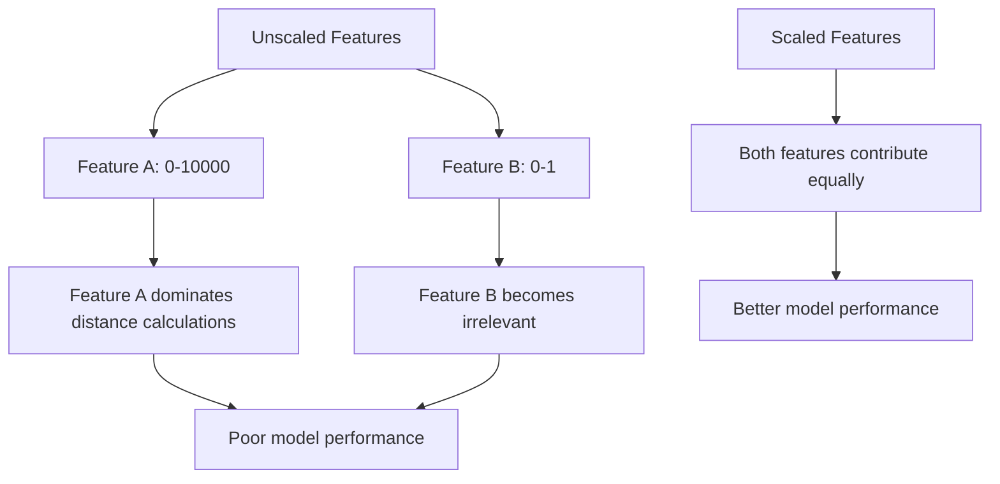
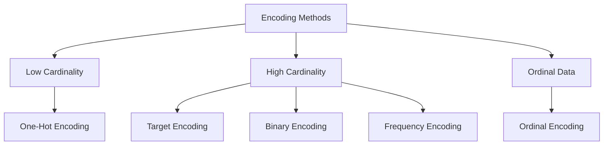
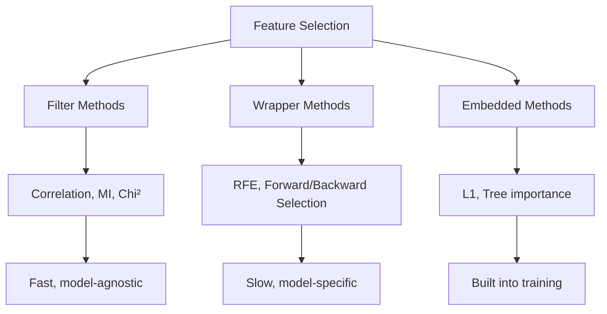

# Feature Engineering

## Overview

Feature engineering is the process of **transforming raw data into features** that better represent the underlying problem. It's often the highest-leverage activity in ML — a simple model with great features often beats a complex model with raw features.

> **"Applied machine learning is basically feature engineering."** — Andrew Ng

## Feature Scaling

### Why Scale?



### Standardization (Z-score)

Transforms features to have mean=0, std=1:

\\[x_{scaled} = \frac{x - \mu}{\sigma}\\]

```python
from sklearn.preprocessing import StandardScaler

scaler = StandardScaler()
X_train_scaled = scaler.fit_transform(X_train)  # Fit on train only!
X_test_scaled = scaler.transform(X_test)  # Transform test with train stats

# Manual implementation
def standardize(X_train, X_test):
    mean = X_train.mean(axis=0)
    std = X_train.std(axis=0)
    return (X_train - mean) / std, (X_test - mean) / std
```

**When to use**: 
- Features are approximately Gaussian
- SVM, logistic regression, neural networks
- When you need features centered at zero

### Min-Max Scaling

Transforms features to [0, 1]:

\\[x_{scaled} = \frac{x - x_{min}}{x_{max} - x_{min}}\\]

```python
from sklearn.preprocessing import MinMaxScaler

scaler = MinMaxScaler(feature_range=(0, 1))
X_scaled = scaler.fit_transform(X)
```

**When to use**:
- Features have known bounds
- Image pixel values (0-255 → 0-1)
- Neural networks with sigmoid/tanh activations

### Robust Scaling

Uses median and IQR — robust to outliers:

\\[x_{scaled} = \frac{x - \text{median}}{\text{IQR}}\\]

```python
from sklearn.preprocessing import RobustScaler

scaler = RobustScaler()  # Uses Q1, Q3
X_scaled = scaler.fit_transform(X)
```

**When to use**: Data has significant outliers

### Scaling Comparison

| Method | Formula | Outlier Robust | Range |
|--------|---------|---------------|-------|
| Standardization | (x-μ)/σ | No | (-∞, +∞) |
| Min-Max | (x-min)/(max-min) | No | [0, 1] |
| Robust | (x-median)/IQR | Yes | Varies |
| MaxAbs | x/|max| | No | [-1, 1] |

## Categorical Encoding

### One-Hot Encoding

Creates binary columns for each category:

```python
from sklearn.preprocessing import OneHotEncoder

# Color: [red, blue, green]
# Becomes: [[1,0,0], [0,1,0], [0,0,1]]

encoder = OneHotEncoder(sparse_output=False, drop='first')  # drop first to avoid multicollinearity
X_encoded = encoder.fit_transform(X_categorical)
```

**Pros**: No ordinal assumption, works with most models
**Cons**: High cardinality → many features (curse of dimensionality)

### Label Encoding

Assigns integer to each category:

```python
from sklearn.preprocessing import LabelEncoder

# Color: [red, blue, green] → [2, 0, 1]
le = LabelEncoder()
y_encoded = le.fit_transform(y)
```

**Use for**: Target variable, tree-based models (can handle ordinal encoding)
**Don't use for**: Linear models (implies ordering that doesn't exist)

### Target Encoding

Replaces category with mean of target:

```python
import pandas as pd

def target_encode(train, test, col, target):
    means = train.groupby(col)[target].mean()
    global_mean = train[target].mean()
    
    train[f'{col}_encoded'] = train[col].map(means)
    test[f'{col}_encoded'] = test[col].map(means).fillna(global_mean)
    
    # Add smoothing to prevent overfitting
    # encoded = (count * mean + m * global_mean) / (count + m)
    return train, test
```

**Pros**: Works with high cardinality, captures target relationship
**Cons**: Risk of data leakage (must use CV or leave-one-out)

### Frequency Encoding

Replaces category with its frequency:

```python
freq = train[col].value_counts(normalize=True)
train[f'{col}_freq'] = train[col].map(freq)
```

### Binary Encoding

Combines label encoding with binary representation:

```python
import category_encoders as ce

encoder = ce.BinaryEncoder(cols=['color'])
X_encoded = encoder.fit_transform(X)
# red=0 → [0, 0, 1]
# blue=1 → [0, 1, 0]
# green=2 → [0, 1, 1]
```



## Feature Transformation

### Log Transform

For right-skewed distributions:

```python
import numpy as np

# Log transform (add 1 to handle zeros)
X_log = np.log1p(X)  # log(1 + x)

# Box-Cox transform (finds optimal lambda)
from scipy.stats import boxcox
X_transformed, lambda_opt = boxcox(X + 1)

# Yeo-Johnson (works with negative values)
from sklearn.preprocessing import PowerTransformer
pt = PowerTransformer(method='yeo-johnson')
X_transformed = pt.fit_transform(X)
```

### Polynomial Features

Create interaction and higher-order terms:

```python
from sklearn.preprocessing import PolynomialFeatures

# degree=2: [a, b] → [1, a, b, a², ab, b²]
poly = PolynomialFeatures(degree=2, interaction_only=False, include_bias=False)
X_poly = poly.fit_transform(X)

# Interaction only: [a, b] → [a, b, ab]
poly_inter = PolynomialFeatures(degree=2, interaction_only=True, include_bias=False)
```

### Binning

Convert continuous features to categorical:

```python
import pandas as pd

# Equal-width bins
pd.cut(X['age'], bins=5, labels=['young', 'adult', 'middle', 'senior', 'elderly'])

# Equal-frequency bins (quantile-based)
pd.qcut(X['income'], q=5, labels=['low', 'med-low', 'medium', 'med-high', 'high'])

# Custom bins
bins = [0, 18, 35, 50, 65, 100]
labels = ['child', 'young_adult', 'adult', 'middle_age', 'senior']
pd.cut(X['age'], bins=bins, labels=labels)
```

## Feature Selection

### Filter Methods

Rank features independently of the model:

```python
# Correlation-based
import numpy as np

# Remove highly correlated features (threshold > 0.95)
corr_matrix = X.corr().abs()
upper = corr_matrix.where(np.triu(np.ones(corr_matrix.shape), k=1).astype(bool))
to_drop = [col for col in upper.columns if any(upper[col] > 0.95)]

# Mutual information
from sklearn.feature_selection import mutual_info_classif
mi_scores = mutual_info_classif(X, y)
top_features = np.argsort(mi_scores)[-10:]  # Top 10

# Chi-squared test (for non-negative features)
from sklearn.feature_selection import chi2, SelectKBest
selector = SelectKBest(chi2, k=10)
X_selected = selector.fit_transform(X, y)

# ANOVA F-test
from sklearn.feature_selection import f_classif, SelectKBest
selector = SelectKBest(f_classif, k=10)
X_selected = selector.fit_transform(X, y)
```

### Wrapper Methods

Use model performance to evaluate feature subsets:

```python
from sklearn.feature_selection import RFE, RFECV
from sklearn.linear_model import LogisticRegression

# Recursive Feature Elimination
model = LogisticRegression(max_iter=1000)
rfe = RFE(model, n_features_to_select=10)
X_selected = rfe.fit_transform(X, y)

# RFE with cross-validation (automatically finds optimal number)
rfecv = RFECV(model, cv=5, scoring='accuracy')
X_selected = rfecv.fit_transform(X, y)
print(f"Optimal number of features: {rfecv.n_features_}")
```

### Embedded Methods

Feature selection as part of model training:

```python
# L1 regularization (Lasso) → sparse solutions
from sklearn.linear_model import LassoCV
lasso = LassoCV(cv=5)
lasso.fit(X, y)
important_features = np.where(lasso.coef_ != 0)[0]

# Tree-based feature importance
from sklearn.ensemble import RandomForestClassifier
rf = RandomForestClassifier(n_estimators=100)
rf.fit(X, y)
importances = rf.feature_importances_
top_features = np.argsort(importances)[-10:]

# XGBoost feature importance
import xgboost as xgb
model = xgb.XGBClassifier()
model.fit(X, y)
importance = model.feature_importances_
```



## Feature Engineering for Different Data Types

### Text Features

```python
from sklearn.feature_extraction.text import TfidfVectorizer, CountVectorizer

# Bag of Words
vectorizer = CountVectorizer(max_features=10000, ngram_range=(1, 2))
X_bow = vectorizer.fit_transform(texts)

# TF-IDF
tfidf = TfidfVectorizer(max_features=10000, ngram_range=(1, 2))
X_tfidf = tfidf.fit_transform(texts)

# Manual features
def text_features(text):
    return {
        'length': len(text),
        'word_count': len(text.split()),
        'avg_word_length': np.mean([len(w) for w in text.split()]),
        'uppercase_ratio': sum(1 for c in text if c.isupper()) / len(text),
        'digit_ratio': sum(1 for c in text if c.isdigit()) / len(text),
        'punctuation_count': sum(1 for c in text if c in '.,!?;:'),
    }
```

### DateTime Features

```python
def extract_datetime_features(df, col):
    df[f'{col}_hour'] = df[col].dt.hour
    df[f'{col}_day'] = df[col].dt.day
    df[f'{col}_month'] = df[col].dt.month
    df[f'{col}_year'] = df[col].dt.year
    df[f'{col}_dayofweek'] = df[col].dt.dayofweek
    df[f'{col}_is_weekend'] = df[col].dt.dayofweek.isin([5, 6]).astype(int)
    
    # Cyclical encoding for periodic features
    df[f'{col}_hour_sin'] = np.sin(2 * np.pi * df[f'{col}_hour'] / 24)
    df[f'{col}_hour_cos'] = np.cos(2 * np.pi * df[f'{col}_hour'] / 24)
    return df
```

### Geospatial Features

```python
def geo_features(lat1, lon1, lat2, lon2):
    # Haversine distance
    R = 6371  # Earth radius in km
    dlat = np.radians(lat2 - lat1)
    dlon = np.radians(lon2 - lon1)
    a = np.sin(dlat/2)**2 + np.cos(np.radians(lat1)) * np.cos(np.radians(lat2)) * np.sin(dlon/2)**2
    c = 2 * np.arcsin(np.sqrt(a))
    return R * c

# Features: distance to city center, nearest POI, density of nearby points
```

## Pipeline: Feature Engineering Best Practices

```python
from sklearn.pipeline import Pipeline
from sklearn.compose import ColumnTransformer
from sklearn.preprocessing import StandardScaler, OneHotEncoder
from sklearn.impute import SimpleImputer

# Define column types
numeric_features = ['age', 'income', 'score']
categorical_features = ['color', 'size', 'type']

# Create transformers
numeric_transformer = Pipeline([
    ('imputer', SimpleImputer(strategy='median')),
    ('scaler', StandardScaler())
])

categorical_transformer = Pipeline([
    ('imputer', SimpleImputer(strategy='most_frequent')),
    ('encoder', OneHotEncoder(handle_unknown='ignore'))
])

# Combine
preprocessor = ColumnTransformer([
    ('num', numeric_transformer, numeric_features),
    ('cat', categorical_transformer, categorical_features)
])

# Full pipeline
pipeline = Pipeline([
    ('preprocessor', preprocessor),
    ('model', LogisticRegression())
])

# Fit and predict
pipeline.fit(X_train, y_train)
y_pred = pipeline.predict(X_test)
```

## Interview Questions

### Beginner

**Q: Why do we need to scale features?**

A: Many algorithms compute distances (KNN, SVM) or use gradient descent (linear/logistic regression, neural networks). Without scaling, features with larger ranges dominate these computations. For example, if age (0-100) and income (0-1000000) are both features, income would dominate distance calculations, making age irrelevant.

**Q: What's the difference between fit_transform and transform?**

A: `fit_transform` learns parameters from data AND transforms it. `transform` only transforms using previously learned parameters. You should only `fit` on training data, then `transform` both train and test. Using `fit_transform` on test data causes data leakage.

### Intermediate

**Q: How do you handle high-cardinality categorical features?**

A: Several approaches:
1. **Target encoding**: Replace with target mean (with regularization to prevent leakage)
2. **Binary encoding**: Compact representation using binary codes
3. **Frequency encoding**: Replace with occurrence frequency
4. **Hashing**: Hash categories to fixed number of bins
5. **Embedding**: Learn dense representations (neural networks)
6. **Group rare categories**: Combine categories with < N occurrences

Avoid one-hot encoding for > 20-50 categories (dimensionality explosion).

**Q: When should you create polynomial features vs use a more complex model?**

A: Polynomial features are good when:
- You know the relationship is polynomial (domain knowledge)
- You need interpretability
- Using linear models

More complex models (trees, neural networks) are better when:
- The relationship is highly nonlinear
- Interactions are complex and unknown
- You have enough data to learn them

### FAANG-Level

**Q: You're building a feature pipeline for a real-time ML system serving 100K predictions/second. What considerations matter?**

A: Critical considerations:
1. **Latency**: Feature computation must be < 10ms. Pre-compute expensive features, use caching.
2. **Consistency**: Features must be computed identically in training and serving (avoid training-serving skew). Use the same pipeline code.
3. **Missing values**: Real-time data is messy. Define fallback strategies (default values, last-known-value).
4. **Feature freshness**: Some features (user activity) need real-time updates; others (user demographics) can be batch-computed.
5. **Monitoring**: Track feature distributions for drift. If features shift, the model's assumptions may be violated.
6. **Versioning**: Feature definitions change over time. Version your feature pipeline alongside the model.
7. **Storage**: Pre-computed features need fast lookup (Redis, feature store like Feast/Tecton).

## Common Mistakes

1. **Scaling before splitting**: Always fit scaler on training data only
2. **One-hot encoding high-cardinality features**: Creates sparse, high-dimensional data
3. **Ignoring missing values**: Many models can't handle NaN. Impute or use models that handle missingness.
4. **Feature leakage**: Including information that wouldn't be available at prediction time
5. **Not creating domain-specific features**: Generic transformations miss important patterns

## Summary

| Technique | Purpose | Example |
|-----------|---------|---------|
| Standardization | Scale to mean=0, std=1 | SVM, LR, NN |
| Min-Max Scaling | Scale to [0, 1] | Image pixels |
| One-Hot Encoding | Categorical → binary | Low cardinality |
| Target Encoding | Categorical → target mean | High cardinality |
| Log Transform | Reduce skewness | Right-skewed data |
| Polynomial Features | Capture interactions | Linear models |
| Feature Selection | Remove irrelevant features | High-dimensional data |

## Cross-References

- [Linear Algebra](linear-algebra.md) — Scaling from matrix perspective
- [PCA](../classical/pca.md) — Dimensionality reduction as feature engineering
- [Decision Trees](../classical/decision-trees.md) — Don't require scaling
- [Neural Networks](../deep-learning/nn-basics.md) — Learned feature representations
