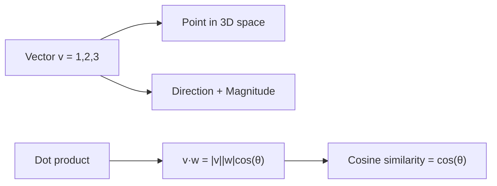
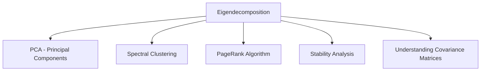
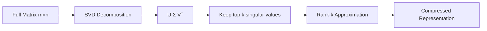

# Linear Algebra for Machine Learning

## Overview

Linear algebra is the **language of machine learning**. Data is represented as vectors and matrices, models perform matrix operations, and understanding the geometry of these operations is crucial for debugging and improving models.

## Vectors

A vector is an ordered list of numbers representing a point in space or a direction with magnitude.

### Vector Operations

```python
import numpy as np

# Vector creation
v = np.array([1, 2, 3])

# Dot product: v · w = Σ(v_i * w_i)
v = np.array([1, 2, 3])
w = np.array([4, 5, 6])
dot = np.dot(v, w)  # 1*4 + 2*5 + 3*6 = 32

# Cross product (3D only)
cross = np.cross(v, w)  # [-3, 6, -3]

# Norm (magnitude)
l2_norm = np.linalg.norm(v)  # √(1² + 2² + 3²) = √14
l1_norm = np.linalg.norm(v, ord=1)  # |1| + |2| + |3| = 6

# Cosine similarity
cos_sim = np.dot(v, w) / (np.linalg.norm(v) * np.linalg.norm(w))
```

### Geometric Interpretation



**Key insight**: The dot product measures **alignment** between vectors. If `v·w > 0`, they point in similar directions; if `v·w = 0`, they're orthogonal.

## Matrices

A matrix is a 2D array of numbers — it represents a **linear transformation**.

### Matrix Operations

```python
import numpy as np

A = np.array([[1, 2], [3, 4]])
B = np.array([[5, 6], [7, 8]])

# Matrix multiplication
C = A @ B  # or np.matmul(A, B)

# Element-wise multiplication (Hadamard product)
D = A * B

# Transpose
A_T = A.T

# Inverse
A_inv = np.linalg.inv(A)

# Determinant
det = np.linalg.det(A)

# Trace (sum of diagonal)
tr = np.trace(A)

# Rank
rank = np.linalg.matrix_rank(A)
```

### Why Matrix Multiplication Order Matters

```python
# Matrix multiplication is NOT commutative
A @ B != B @ A  # Generally true

# But it IS associative
(A @ B) @ C == A @ (B @ C)
```

**In ML**: A weight matrix `W` transforms input `x` via `Wx`. The order of transformations matters when chaining layers.

## Eigenvalues and Eigenvectors

For a square matrix `A`, if `Av = λv` for some scalar `λ` and nonzero vector `v`, then:
- `λ` is an **eigenvalue**
- `v` is the corresponding **eigenvector**

```python
import numpy as np

A = np.array([[4, 2], [1, 3]])

eigenvalues, eigenvectors = np.linalg.eig(A)
print(f"Eigenvalues: {eigenvalues}")   # [5, 2]
print(f"Eigenvectors:\n{eigenvectors}")

# Verification: A @ v = λ * v
v1 = eigenvectors[:, 0]
print(np.allclose(A @ v1, eigenvalues[0] * v1))  # True
```

### Why Eigenvalues Matter in ML



- **PCA**: Eigenvectors of the covariance matrix are the principal components; eigenvalues indicate variance explained
- **Spectral clustering**: Uses eigenvectors of the Laplacian matrix
- **Stability**: Eigenvalues determine if a dynamical system converges or diverges

## Singular Value Decomposition (SVD)

Any `m × n` matrix `A` can be decomposed as:

\\[A = U \Sigma V^T\\]

Where:
- `U` (`m × m`): Left singular vectors (orthogonal)
- `Σ` (`m × n`): Diagonal matrix of singular values (σ₁ ≥ σ₂ ≥ ... ≥ 0)
- `V` (`n × n`): Right singular vectors (orthogonal)

```python
import numpy as np

A = np.array([[1, 2, 3], [4, 5, 6], [7, 8, 9]])

U, S, Vt = np.linalg.svd(A)

# Low-rank approximation (keeping top k singular values)
k = 2
A_approx = U[:, :k] @ np.diag(S[:k]) @ Vt[:k, :]
print(f"Original rank: {np.linalg.matrix_rank(A)}")
print(f"Approximation error: {np.linalg.norm(A - A_approx)}")
```

### SVD Applications

| Application | How SVD is Used |
|------------|----------------|
| **PCA** | SVD of centered data matrix |
| **Recommender systems** | Matrix factorization (Netflix prize) |
| **Image compression** | Low-rank approximation |
| **NLP** | Latent Semantic Analysis (LSA) |
| **Pseudoinverse** | `A⁺ = V Σ⁺ Uᵀ` for least squares |



## Matrix Calculus

Essential for understanding gradients in backpropagation.

### Common Derivatives

```python
# ∂(Ax)/∂x = Aᵀ
# ∂(xᵀAx)/∂x = (A + Aᵀ)x
# ∂(xᵀx)/∂x = 2x
# ∂(aᵀx)/∂x = a

# For f(x) = ||Ax - b||²
# ∇f = 2Aᵀ(Ax - b)
```

### Jacobian and Hessian

```python
# Jacobian: Matrix of all first-order partial derivatives
# J_ij = ∂f_i/∂x_j

# Hessian: Matrix of all second-order partial derivatives
# H_ij = ∂²f/∂x_i ∂x_j
# Used in Newton's method, convexity analysis
```

## Practical Tips

### 1. Broadcasting in NumPy

```python
# Shape rules for broadcasting:
# (3, 4) + (4,) → (3, 4)  # row broadcast
# (3, 4) + (3, 1) → (3, 4)  # column broadcast
# (3, 1) + (1, 4) → (3, 4)  # both broadcast

A = np.array([[1, 2, 3], [4, 5, 6]])  # (2, 3)
b = np.array([10, 20, 30])  # (3,)
result = A + b  # (2, 3) - b is broadcast across rows
```

### 2. Numerical Stability

```python
# Bad: Computing softmax directly
def softmax_bad(x):
    exp_x = np.exp(x)  # Can overflow!
    return exp_x / exp_x.sum()

# Good: Subtract max for numerical stability
def softmax_good(x):
    exp_x = np.exp(x - np.max(x))  # Max is subtracted
    return exp_x / exp_x.sum()

# Similarly for log-sum-exp trick
def logsumexp(x):
    c = np.max(x)
    return c + np.log(np.sum(np.exp(x - c)))
```

## Interview Questions

### Beginner

**Q: What is the difference between element-wise multiplication and matrix multiplication?**

A: Element-wise (Hadamard) multiplies corresponding elements — both matrices must have the same shape. Matrix multiplication computes dot products between rows and columns — the inner dimensions must match (`m×n @ n×p → m×p`).

**Q: Why do we need the transpose in linear regression's normal equation?**

A: The normal equation `θ = (XᵀX)⁻¹Xᵀy` requires `XᵀX` to be a square, invertible matrix. `X` is `n×d`, so `XᵀX` is `d×d` — a square matrix that captures the covariance structure of features.

### Intermediate

**Q: Explain the relationship between eigenvalues and positive definiteness.**

A: A symmetric matrix is:
- **Positive definite** if all eigenvalues > 0
- **Positive semi-definite** if all eigenvalues ≥ 0
- **Negative definite** if all eigenvalues < 0

In ML, covariance matrices are always positive semi-definite. The Hessian of a convex function is positive semi-definite.

**Q: What does SVD tell us about the rank of a matrix?**

A: The rank equals the number of non-zero singular values. This is more numerically stable than row reduction. For low-rank approximation, keeping the top `k` singular values gives the best rank-`k` approximation (Eckart-Young theorem).

### FAANG-Level

**Q: In recommendation systems, why is matrix factorization via SVD preferred over computing the full inverse?**

A: The user-item matrix is sparse (most entries unknown) and huge. Direct inversion is impossible with missing data and O(n³) cost. SVD-based approaches (like FunkSVD) learn latent factors by optimizing only on observed entries via SGD, making it tractable. The low-rank assumption captures the insight that user preferences are driven by a small number of latent factors.

**Q: How does the condition number of a matrix affect gradient descent convergence?**

A: The condition number κ = σ_max/σ_min of the Hessian determines convergence speed. High condition number → elongated contours → gradient descent oscillates and converges slowly. This is why preconditioning (e.g., Adam's per-parameter learning rates) and normalization techniques help — they effectively reduce the condition number.

## Common Mistakes

1. **Ignoring broadcasting rules**: Shape mismatches lead to silent wrong results
2. **Not centering data before PCA**: PCA finds directions of maximum variance — if data isn't centered, the first component points toward the mean, not the direction of maximum spread
3. **Computing `np.linalg.inv()` when you should use `np.linalg.solve()`**: For `Ax = b`, `solve(A, b)` is faster and more numerically stable than `inv(A) @ b`
4. **Confusing correlation with causation**: Correlation matrices show linear relationships, not causal ones

## Summary

| Concept | Key Formula | ML Application |
|---------|------------|----------------|
| Dot product | `v·w = Σvᵢwᵢ` | Similarity, linear layers |
| Matrix multiplication | `C = AB` | Neural network forward pass |
| Eigenvalues | `Av = λv` | PCA, spectral methods |
| SVD | `A = UΣVᵀ` | Dimensionality reduction, recommendations |
| Matrix calculus | `∇f` | Gradient computation for optimization |

## Cross-References

- [Optimization](optimization.md) — Uses matrix calculus for gradient computation
- [PCA](../classical/pca.md) — Direct application of eigendecomposition/SVD
- [Neural Network Basics](../deep-learning/nn-basics.md) — Linear layers are matrix multiplications
- [Self-Attention](../transformers/self-attention.md) — QKV projections are matrix operations
