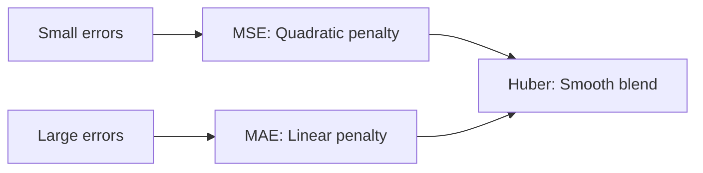
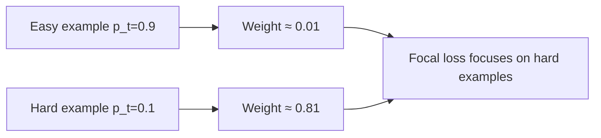
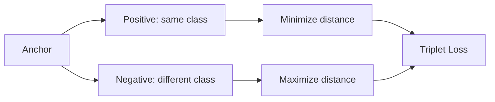
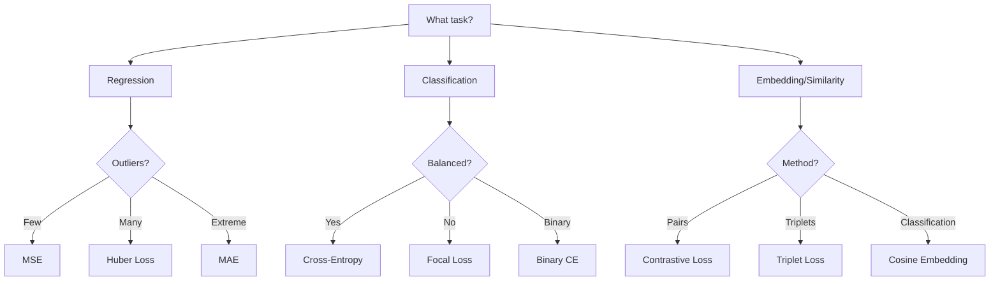

# Loss Functions

## Overview

Loss functions quantify **how wrong** a model's predictions are. The choice of loss function defines what the model optimizes for — it's the mathematical specification of "what does good look like?" Different tasks require different losses, and understanding their properties is crucial for model design.

## Regression Losses

### Mean Squared Error (MSE)

$$\text{MSE} = \frac{1}{n} \sum_{i=1}^{n} (y_i - \hat{y}_i)^2$$

```python
import numpy as np

def mse(y_true, y_pred):
    return np.mean((y_true - y_pred) ** 2)

# Gradient: ∂MSE/∂ŷ = -2(y - ŷ)/n
def mse_gradient(y_true, y_pred):
    return 2 * (y_pred - y_true) / len(y_true)
```

**Properties**:
- Penalizes large errors quadratically (sensitive to outliers)
- Convex, smooth, easy to optimize
- Corresponds to MLE under Gaussian noise assumption
- Always non-negative

### Mean Absolute Error (MAE)

$$\text{MAE} = \frac{1}{n} \sum_{i=1}^{n} |y_i - \hat{y}_i|$$

```python
def mae(y_true, y_pred):
    return np.mean(np.abs(y_true - y_pred))

# Gradient: ∂MAE/∂ŷ = sign(ŷ - y)/n (subgradient at 0)
```

**Properties**:
- Less sensitive to outliers than MSE
- Not differentiable at zero (subgradient needed)
- Corresponds to MLE under Laplace noise assumption

### Huber Loss

Combines MSE (near zero) and MAE (for large errors):

$$L_\delta(a) = \begin{cases} \frac{1}{2}a^2 & \text{if } |a| \leq \delta \\ \delta(|a| - \frac{1}{2}\delta) & \text{otherwise} \end{cases}$$

```python
def huber_loss(y_true, y_pred, delta=1.0):
    a = y_true - y_pred
    is_small = np.abs(a) <= delta
    loss = np.where(is_small, 0.5 * a**2, delta * (np.abs(a) - 0.5 * delta))
    return np.mean(loss)
```

**Use cases**: Robust regression, reinforcement learning (TD errors)



## Classification Losses

### Binary Cross-Entropy (Log Loss)

$$L = -\frac{1}{n}\sum_{i=1}^n [y_i \log(\hat{y}_i) + (1-y_i)\log(1-\hat{y}_i)]$$

```python
def binary_cross_entropy(y_true, y_pred):
    eps = 1e-15  # For numerical stability
    y_pred = np.clip(y_pred, eps, 1 - eps)
    return -np.mean(y_true * np.log(y_pred) + (1 - y_true) * np.log(1 - y_pred))

# For logistic regression: ŷ = σ(wᵀx + b)
# Gradient w.r.t. z (logit): ∂L/∂z = ŷ - y
```

**Properties**:
- The standard loss for binary classification
- Derived from MLE for Bernoulli distribution
- Heavily penalizes confident wrong predictions
- Convex for logistic regression

### Categorical Cross-Entropy

For multi-class problems with softmax output:

$$L = -\sum_{c=1}^{C} y_c \log(\hat{y}_c)$$

Where `y` is one-hot encoded and `ŷ = softmax(z)`.

```python
def categorical_cross_entropy(y_true, y_pred):
    """
    y_true: (n, C) one-hot encoded
    y_pred: (n, C) softmax probabilities
    """
    eps = 1e-15
    y_pred = np.clip(y_pred, eps, 1 - eps)
    return -np.mean(np.sum(y_true * np.log(y_pred), axis=1))

# PyTorch version (more numerically stable):
# loss = F.cross_entropy(logits, labels)  # Takes raw logits!
```

### Sparse Categorical Cross-Entropy

When labels are integers (not one-hot):

```python
# PyTorch
# loss = F.cross_entropy(logits, labels)  # labels are class indices

# Equivalent but less efficient:
# one_hot = F.one_hot(labels, num_classes)
# loss = F.cross_entropy(logits, one_hot.float())
```

### Hinge Loss (SVM Loss)

$$L = \frac{1}{n}\sum_{i=1}^n \max(0, 1 - y_i \cdot \hat{y}_i)$$

Where `y ∈ {-1, +1}` and `ŷ = wᵀx + b` (raw score, not probability).

```python
def hinge_loss(y_true, y_pred):
    """
    y_true: +1 or -1
    y_pred: raw model output (decision function value)
    """
    return np.mean(np.maximum(0, 1 - y_true * y_pred))
```

**Properties**:
- Loss is zero if prediction is correct with margin ≥ 1
- Linear penalty for violations (not quadratic)
- The foundation of SVMs
- Non-differentiable at the hinge point

### Multi-Class Hinge Loss

$$L = \frac{1}{n}\sum_{i=1}^n \sum_{c \neq y_i} \max(0, \hat{y}_c - \hat{y}_{y_i} + \Delta)$$

Where Δ is the margin (typically 1).

## Advanced Loss Functions

### Focal Loss

Addresses **class imbalance** by down-weighting easy examples:

$$FL(p_t) = -\alpha_t (1-p_t)^\gamma \log(p_t)$$

Where:
- `p_t` = probability of correct class
- `γ` (gamma) = focusing parameter (typically 2)
- `α_t` = class weight

```python
def focal_loss(y_true, y_pred, gamma=2.0, alpha=0.25):
    """
    y_true: (n, C) one-hot
    y_pred: (n, C) softmax probabilities
    """
    eps = 1e-15
    y_pred = np.clip(y_pred, eps, 1 - eps)
    ce = -y_true * np.log(y_pred)
    weight = alpha * y_true * (1 - y_pred) ** gamma
    return np.mean(np.sum(weight * ce, axis=1))
```

**Key insight**: When `p_t` is high (easy example), `(1-p_t)^γ` → 0, so easy examples contribute little to loss. When `p_t` is low (hard example), the weight is near 1.



**Used in**: Object detection (RetinaNet), imbalanced classification

### Contrastive Loss

For **siamese networks** — learns embeddings where similar items are close and dissimilar items are far:

$$L = \frac{1}{2N}\sum_{i=1}^N [y_i \cdot d_i^2 + (1-y_i) \cdot \max(0, m - d_i)^2]$$

Where `d = ||f(x_1) - f(x_2)||₂` and `m` is the margin.

```python
def contrastive_loss(embedding1, embedding2, y, margin=1.0):
    """
    y=1: similar pair, y=0: dissimilar pair
    """
    d = np.linalg.norm(embedding1 - embedding2)
    loss = y * d**2 + (1 - y) * max(0, margin - d)**2
    return 0.5 * loss
```

### Triplet Loss

Used in face recognition (FaceNet) — anchors should be closer to positives than negatives:

$$L = \sum_{i} \max(0, ||f(a_i) - f(p_i)||^2 - ||f(a_i) - f(n_i)||^2 + \alpha)$$

```python
def triplet_loss(anchor, positive, negative, margin=1.0):
    d_pos = np.linalg.norm(anchor - positive)**2
    d_neg = np.linalg.norm(anchor - negative)**2
    return max(0, d_pos - d_neg + margin)
```



### KL Divergence Loss

$$D_{KL}(P || Q) = \sum_x P(x) \log \frac{P(x)}{Q(x)}$$

```python
def kl_divergence(p, q):
    eps = 1e-15
    p = np.clip(p, eps, 1)
    q = np.clip(q, eps, 1)
    return np.sum(p * np.log(p / q))
```

**Used in**: Knowledge distillation, VAEs, policy optimization

### Cosine Embedding Loss

For learning similarity:

$$L = \begin{cases} 1 - \cos(x_1, x_2) & \text{if } y = 1 \\ \max(0, \cos(x_1, x_2) - m) & \text{if } y = -1 \end{cases}$$

## Loss Function Selection Guide



| Task | Loss Function | Output Layer |
|------|--------------|--------------|
| Binary classification | Binary cross-entropy | Sigmoid |
| Multi-class classification | Categorical cross-entropy | Softmax |
| Imbalanced classification | Focal loss | Softmax |
| Regression (normal) | MSE | Linear |
| Regression (outliers) | Huber | Linear |
| SVM | Hinge loss | Linear (raw scores) |
| Face recognition | Triplet loss | L2-normalized |
| Knowledge distillation | KL divergence | Softmax (with temperature) |
| Object detection | Focal + L1 | Multi-head |

## Interview Questions

### Beginner

**Q: Why not use accuracy as a loss function?**

A: Accuracy is:
1. **Not differentiable**: It's a step function (0 or 1 per sample) — gradient is zero everywhere except at the decision boundary
2. **Not sensitive to confidence**: A 51% correct prediction scores the same as 99%
3. **Misleading with imbalance**: 99% accuracy by always predicting the majority class

Cross-entropy provides smooth, informative gradients that guide the model toward better predictions.

**Q: What happens if we use MSE for classification?**

A: MSE can work but has problems:
1. MSE with sigmoid output creates **non-convex** optimization landscape
2. Gradients are small when predictions are very wrong (saturation)
3. Cross-entropy's gradient is `(ŷ - y)` — proportional to error, always informative
4. MSE treats misclassification costs symmetrically; cross-entropy doesn't

### Intermediate

**Q: How does focal loss handle class imbalance differently from class weights?**

A: Class weights apply a **fixed** weight per class — all easy and hard examples in the minority class get the same boost. Focal loss applies a **dynamic** weight based on prediction confidence — easy examples (regardless of class) are down-weighted, while hard examples are focused on. This is more nuanced because imbalance affects easy vs. hard examples differently.

**Q: Explain the temperature parameter in knowledge distillation loss.**

A: In distillation, we use `softmax(z/T)` where T is temperature:
- T=1: Standard softmax (peaked distribution)
- T→∞: Uniform distribution (all classes equal)
- T>1: Softer distribution — reveals "dark knowledge" (e.g., a cat image has some similarity to dogs)

The student learns from both the hard labels (ground truth) and soft labels (teacher's knowledge), weighted by α:

$$L = \alpha \cdot T^2 \cdot D_{KL}(\text{softmax}(z_T/T) || \text{softmax}(z_S/T)) + (1-\alpha) \cdot \text{CE}(y, z_S)$$

### FAANG-Level

**Q: You're training an object detection model. The model detects common objects well but misses rare objects. Design a loss function strategy.**

A: Multi-pronged approach:
1. **Focal loss** (γ=2): Automatically down-weights easy (common object) examples
2. **Class-balanced loss**: Use effective number of samples to weight classes: `w_c = (1-β)/(1-β^n_c)`
3. **OHEM (Online Hard Example Mining)**: Select top-k hardest negative proposals per image
4. **Data augmentation**: CutMix, Mosaic augmentation for rare classes
5. **Separate classification and localization losses** with appropriate weighting
6. **Evaluate with per-class AP**: Don't rely on mAP alone — track rare class performance separately

## Common Mistakes

1. **Using MSE for classification**: Non-convex landscape, poor gradients in saturated regions
2. **Ignoring numerical stability**: Always clip predictions before `log()` — use `eps = 1e-15`
3. **Not using `F.cross_entropy(logits, labels)` in PyTorch**: It's more stable than computing softmax then cross-entropy separately
4. **Wrong loss for the output layer**: Sigmoid + BCE for binary, Softmax + CE for multi-class
5. **Forgetting to handle padding in sequence models**: Use `ignore_index` in cross-entropy for padded tokens

## Summary

| Loss | Type | Key Property | Gradient |
|------|------|-------------|----------|
| MSE | Regression | Quadratic penalty | 2(ŷ-y) |
| MAE | Regression | Linear penalty | sign(ŷ-y) |
| Huber | Regression | Quadratic + Linear | Smooth transition |
| Cross-Entropy | Classification | Log penalty | ŷ - y (sigmoid output) |
| Hinge | SVM | Margin-based | 0 or -y |
| Focal | Imbalanced | Dynamic weighting | Modulated CE |
| Contrastive | Embedding | Pair-based | Distance-based |
| Triplet | Embedding | Anchor-based | Margin-based |

## Cross-References

- [Probability](probability.md) — Cross-entropy from information theory perspective
- [Logistic Regression](../classical/logistic-regression.md) — Binary cross-entropy derivation
- [SVM](../classical/svm.md) — Hinge loss and margin maximization
- [Backpropagation](../deep-learning/backpropagation.md) — How loss gradients flow through networks
- [BERT](../transformers/bert.md) — Masked language model loss
