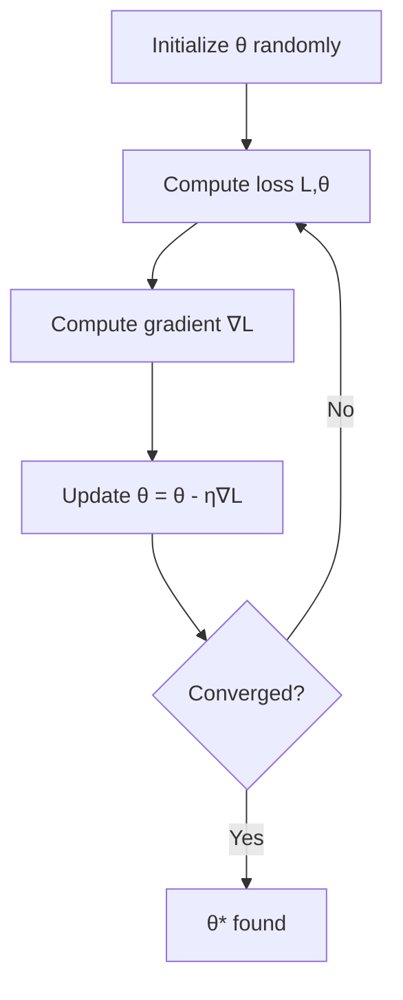
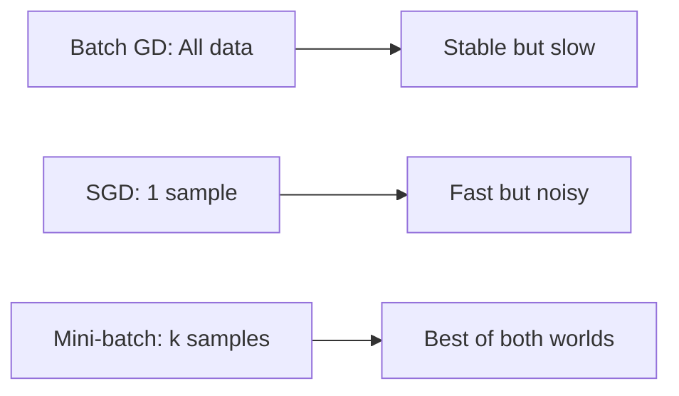
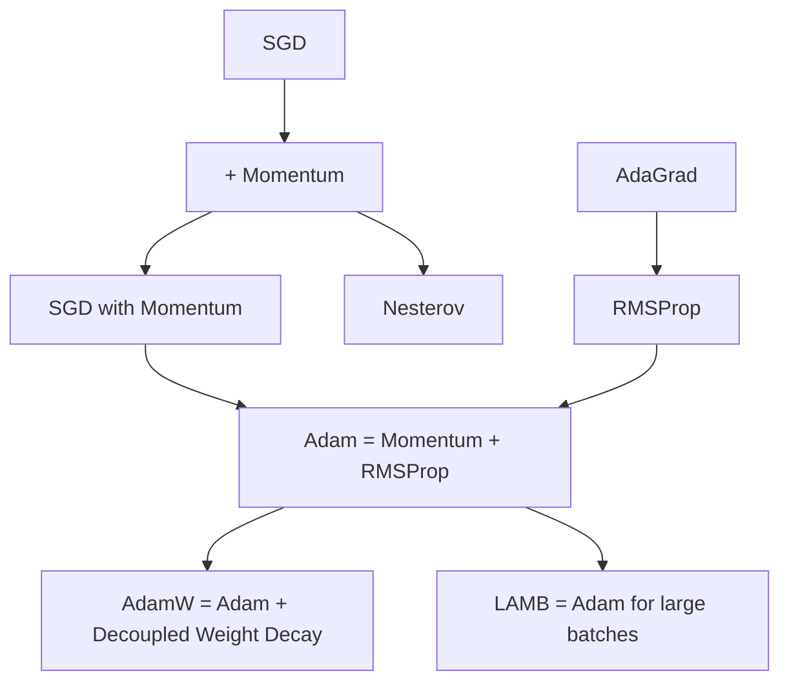
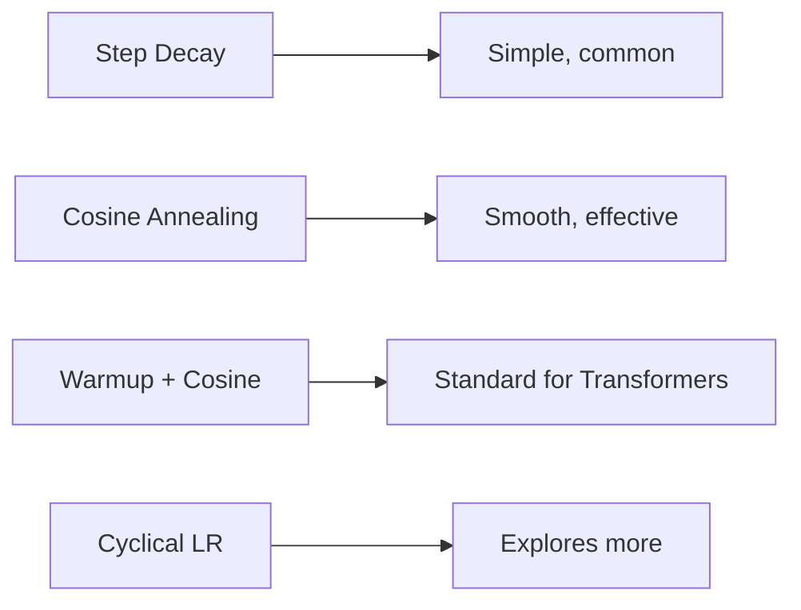

# Optimization in Machine Learning

## Overview

Optimization is **how models learn**. Training a model means finding parameters that minimize a loss function. The choice of optimizer, learning rate, and schedule can mean the difference between a model that converges in hours and one that never converges.

## The Optimization Problem

\\[\theta^* = \arg\min_\theta \mathcal{L}(\theta; D)\\]

Where:
- θ: Model parameters (weights, biases)
- L: Loss function
- D: Training data



## Gradient Descent Variants

### Batch Gradient Descent

Uses the **entire dataset** to compute gradients.

```python
# Full batch gradient descent
def batch_gd(X, y, theta, lr=0.01, epochs=1000):
    n = len(y)
    for epoch in range(epochs):
        gradient = (2/n) * X.T @ (X @ theta - y)
        theta -= lr * gradient
    return theta
```

**Pros**: Stable convergence, guaranteed to converge for convex problems
**Cons**: Slow for large datasets, O(n) per step, can get stuck in local minima

### Stochastic Gradient Descent (SGD)

Uses a **single random sample** to estimate the gradient.

```python
import numpy as np

def sgd(X, y, theta, lr=0.01, epochs=100):
    n = len(y)
    for epoch in range(epochs):
        indices = np.random.permutation(n)
        for i in indices:
            xi = X[i:i+1]
            yi = y[i:i+1]
            gradient = 2 * xi.T @ (xi @ theta - yi)
            theta -= lr * gradient
    return theta
```

**Pros**: Fast updates, can escape local minima (noise helps), online learning
**Cons**: Noisy gradients, may not converge without learning rate decay

### Mini-Batch SGD

The **practical compromise** — uses a small batch (32, 64, 128, etc.).

```python
def mini_batch_sgd(X, y, theta, lr=0.01, epochs=100, batch_size=32):
    n = len(y)
    for epoch in range(epochs):
        indices = np.random.permutation(n)
        for start in range(0, n, batch_size):
            batch_idx = indices[start:start+batch_size]
            X_batch = X[batch_idx]
            y_batch = y[batch_idx]
            gradient = (2/batch_size) * X_batch.T @ (X_batch @ theta - y_batch)
            theta -= lr * gradient
    return theta
```



## Momentum-Based Optimizers

### SGD with Momentum

Accelerates convergence by accumulating a **velocity vector**.

\\[v_t = \beta v_{t-1} + \nabla L(\theta_t)\\]
\\[\theta_{t+1} = \theta_t - \eta v_t\\]

```python
def sgd_momentum(X, y, theta, lr=0.01, beta=0.9, epochs=100, batch_size=32):
    v = np.zeros_like(theta)
    n = len(y)
    for epoch in range(epochs):
        indices = np.random.permutation(n)
        for start in range(0, n, batch_size):
            batch_idx = indices[start:start+batch_size]
            X_batch = X[batch_idx]
            y_batch = y[batch_idx]
            gradient = (2/batch_size) * X_batch.T @ (X_batch @ theta - y_batch)
            v = beta * v + gradient
            theta -= lr * v
    return theta
```

**Why momentum works**: On consistent gradient directions, velocity accumulates → faster. On oscillating directions, velocity cancels → smoother.

### Nesterov Accelerated Gradient (NAG)

"Look ahead" before computing gradient:

\\[v_t = \beta v_{t-1} + \nabla L(\theta_t - \eta \beta v_{t-1})\\]
\\[\theta_{t+1} = \theta_t - \eta v_t\\]

```python
def nesterov_sgd(X, y, theta, lr=0.01, beta=0.9, epochs=100, batch_size=32):
    v = np.zeros_like(theta)
    n = len(y)
    for epoch in range(epochs):
        indices = np.random.permutation(n)
        for start in range(0, n, batch_size):
            batch_idx = indices[start:start+batch_size]
            X_batch = X[batch_idx]
            y_batch = y[batch_idx]
            # Look ahead
            theta_ahead = theta - lr * beta * v
            gradient = (2/batch_size) * X_batch.T @ (X_batch @ theta_ahead - y_batch)
            v = beta * v + gradient
            theta -= lr * v
    return theta
```

## Adaptive Learning Rate Optimizers

### AdaGrad

Adapts learning rate per parameter based on historical gradient magnitudes.

\\[g_t = \nabla L(\theta_t)\\]
\\[G_t = G_{t-1} + g_t^2\\]
\\[\theta_{t+1} = \theta_t - \frac{\eta}{\sqrt{G_t + \epsilon}} g_t\\]

```python
def adagrad(X, y, theta, lr=0.01, eps=1e-8, epochs=100, batch_size=32):
    G = np.zeros_like(theta)  # Sum of squared gradients
    n = len(y)
    for epoch in range(epochs):
        indices = np.random.permutation(n)
        for start in range(0, n, batch_size):
            batch_idx = indices[start:start+batch_size]
            X_batch = X[batch_idx]
            y_batch = y[batch_idx]
            gradient = (2/batch_size) * X_batch.T @ (X_batch @ theta - y_batch)
            G += gradient ** 2
            theta -= (lr / (np.sqrt(G) + eps)) * gradient
    return theta
```

**Problem**: G grows monotonically → learning rate decreases to zero → training stalls.

### RMSProp

Fixes AdaGrad's decaying learning rate by using an **exponential moving average**.

\\[G_t = \rho G_{t-1} + (1-\rho) g_t^2\\]
\\[\theta_{t+1} = \theta_t - \frac{\eta}{\sqrt{G_t + \epsilon}} g_t\\]

```python
def rmsprop(X, y, theta, lr=0.001, rho=0.9, eps=1e-8, epochs=100, batch_size=32):
    G = np.zeros_like(theta)
    n = len(y)
    for epoch in range(epochs):
        indices = np.random.permutation(n)
        for start in range(0, n, batch_size):
            batch_idx = indices[start:start+batch_size]
            X_batch = X[batch_idx]
            y_batch = y[batch_idx]
            gradient = (2/batch_size) * X_batch.T @ (X_batch @ theta - y_batch)
            G = rho * G + (1 - rho) * gradient ** 2
            theta -= (lr / (np.sqrt(G) + eps)) * gradient
    return theta
```

### Adam (Adaptive Moment Estimation)

**The default optimizer for most deep learning tasks.** Combines momentum (1st moment) and RMSProp (2nd moment).

\\[m_t = \beta_1 m_{t-1} + (1-\beta_1) g_t\\]  (1st moment - mean)
\\[v_t = \beta_2 v_{t-1} + (1-\beta_2) g_t^2\\]  (2nd moment - variance)

Bias correction (since m₀=v₀=0):
\\[\hat{m}_t = m_t / (1-\beta_1^t)\\]
\\[\hat{v}_t = v_t / (1-\beta_2^t)\\]

Update:
\\[\theta_{t+1} = \theta_t - \frac{\eta}{\sqrt{\hat{v}_t} + \epsilon} \hat{m}_t\\]

```python
class Adam:
    def __init__(self, lr=0.001, beta1=0.9, beta2=0.999, eps=1e-8):
        self.lr = lr
        self.beta1 = beta1
        self.beta2 = beta2
        self.eps = eps
        self.m = None
        self.v = None
        self.t = 0
    
    def update(self, theta, gradient):
        if self.m is None:
            self.m = np.zeros_like(theta)
            self.v = np.zeros_like(theta)
        
        self.t += 1
        self.m = self.beta1 * self.m + (1 - self.beta1) * gradient
        self.v = self.beta2 * self.v + (1 - self.beta2) * gradient**2
        
        # Bias correction
        m_hat = self.m / (1 - self.beta1**self.t)
        v_hat = self.v / (1 - self.beta2**self.t)
        
        theta -= self.lr * m_hat / (np.sqrt(v_hat) + self.eps)
        return theta
```

### AdamW (Adam with Decoupled Weight Decay)

Fixes L2 regularization in Adam — standard Adam adds weight decay to gradient before computing moments, which interacts poorly with adaptive learning rates.

```python
# Standard Adam + L2: gradient += λ * θ (then compute moments)
# AdamW: θ -= η * (λ * θ) separately from Adam update

def adamw_update(theta, gradient, m, v, t, lr=0.001, beta1=0.9, beta2=0.999, 
                 eps=1e-8, weight_decay=0.01):
    m = beta1 * m + (1 - beta1) * gradient
    v = beta2 * v + (1 - beta2) * gradient**2
    m_hat = m / (1 - beta1**t)
    v_hat = v / (1 - beta2**t)
    # Decoupled weight decay
    theta = theta - lr * (m_hat / (np.sqrt(v_hat) + eps) + weight_decay * theta)
    return theta, m, v
```

**AdamW is the standard for training transformers** (BERT, GPT, etc.)



## Learning Rate Schedules

### Why Schedules Matter

A fixed learning rate is rarely optimal. Large LR early → fast progress. Small LR late → fine-tuning.

### Step Decay

```python
def step_decay(epoch, initial_lr=0.01, drop_rate=0.5, epochs_per_drop=10):
    return initial_lr * (drop_rate ** (epoch // epochs_per_drop))
```

### Cosine Annealing

```python
import math

def cosine_annealing(epoch, max_epochs, lr_min=0, lr_max=0.01):
    return lr_min + 0.5 * (lr_max - lr_min) * (1 + math.cos(math.pi * epoch / max_epochs))
```

### Warmup + Cosine Decay

Used for training transformers:

```python
def warmup_cosine(step, warmup_steps, total_steps, lr_max):
    if step < warmup_steps:
        return lr_max * step / warmup_steps
    progress = (step - warmup_steps) / (total_steps - warmup_steps)
    return lr_max * 0.5 * (1 + math.cos(math.pi * progress))
```

### Cyclical Learning Rates

```python
def cyclical_lr(epoch, lr_min=0.001, lr_max=0.01, step_size=10):
    cycle = math.floor(1 + epoch / (2 * step_size))
    x = abs(epoch / step_size - 2 * cycle + 1)
    return lr_min + (lr_max - lr_min) * max(0, 1 - x)
```



## Practical Tips

### Gradient Clipping

Prevents exploding gradients (critical for RNNs, Transformers):

```python
# Clip by norm (most common)
def clip_grad_by_norm(gradient, max_norm=1.0):
    norm = np.linalg.norm(gradient)
    if norm > max_norm:
        gradient = gradient * (max_norm / norm)
    return gradient

# Clip by value
def clip_grad_by_value(gradient, clip_value=1.0):
    return np.clip(gradient, -clip_value, clip_value)
```

### Choosing an Optimizer

| Scenario | Recommended Optimizer |
|----------|----------------------|
| Starting a new project | Adam (lr=0.001) |
| Training Transformers | AdamW (lr=1e-4 to 5e-4) |
| Computer Vision (CNNs) | SGD + Momentum (lr=0.1) |
| Sparse data (NLP embeddings) | Adagrad or Adam |
| Large batch training | LAMB or LARS |
| Fine-tuning | Adam with small lr (1e-5) |

## Interview Questions

### Beginner

**Q: Why can't we just set a very large learning rate?**

A: A large learning rate causes the optimizer to overshoot the minimum — it may oscillate around it or even diverge to infinity. The loss will increase instead of decrease. Think of it like taking giant steps downhill — you might overshoot and end up higher than where you started.

**Q: What is the difference between SGD and gradient descent?**

A: "Gradient descent" typically refers to **batch** gradient descent (using all data). SGD (Stochastic Gradient Descent) uses a single sample or mini-batch. Despite the name, "SGD" in practice usually means mini-batch SGD. The stochasticity acts as noise that can help escape local minima.

### Intermediate

**Q: Why does Adam sometimes generalize worse than SGD?**

A: Adam's adaptive learning rates can lead to:
1. **Sharp minima**: Adam can converge quickly to sharp minima that generalize poorly
2. **Lack of implicit regularization**: SGD's noise provides implicit regularization; Adam's momentum reduces this
3. **Solution**: AdamW (proper weight decay), or use SGD for final fine-tuning after Adam warmup

**Q: Explain bias correction in Adam and why it's needed.**

A: Since m₀ and v₀ are initialized to zero, early estimates are biased toward zero (especially with large β₁, β₂ close to 1). The correction divides by (1-β^t), which is small early → amplifies estimates, and approaches 1 later → no effect. This ensures unbiased estimates from the start.

### FAANG-Level

**Q: You're training a large language model with 100B parameters. The loss spikes and diverges mid-training. What are your debugging steps?**

A:
1. **Check gradient norms**: If they spike → gradient clipping is needed or insufficient
2. **Learning rate too high**: Reduce LR or add warmup (common cause of spikes)
3. **Data quality**: Bad batches (corrupted data, NaN labels) can cause spikes
4. **Numerical issues**: Check for NaN/Inf in activations (use mixed precision carefully)
5. **Loss scale** (FP16): If using mixed precision, the loss scale may be too large
6. **Architecture issues**: Missing residual connections, incorrect normalization
7. **Recovery**: Often the model recovers if you skip the bad batch and continue

**Q: Compare LAMB and LARS for large-batch training. Why is batch size a challenge?**

A: Large batches reduce gradient noise → SGD converges to sharp minima → poor generalization. LARS/LAMB apply **layer-wise learning rate scaling** based on the ratio of weight norm to gradient norm. This allows larger batch sizes (up to 64K+) without losing generalization. LAMB extends LARS to Adam, making it suitable for transformer training (used to train BERT in 76 minutes).

## Common Mistakes

1. **Not normalizing inputs**: Features at different scales cause elongated loss contours → slow convergence
2. **Using too large a batch size**: Can hurt generalization; 32-512 is usually good
3. **Forgetting to zero gradients in PyTorch**: `optimizer.zero_grad()` before each step
4. **Not using learning rate scheduling**: A fixed LR is almost never optimal
5. **Using Adam for everything**: SGD often generalizes better for vision tasks

## Summary

| Optimizer | Key Feature | Best For |
|-----------|------------|----------|
| SGD | Simple, well-understood | Convex problems, CV |
| SGD + Momentum | Velocity accumulation | Training CNNs |
| AdaGrad | Per-parameter LR | Sparse data |
| RMSProp | Exp moving average of gradients | RNNs |
| Adam | Momentum + RMSProp | General default |
| AdamW | Decoupled weight decay | Transformers |

## Cross-References

- [Backpropagation](../deep-learning/backpropagation.md) — How gradients are computed
- [Optimizers](../deep-learning/optimizers.md) — Deep learning specific optimizer details
- [Training Transformers](../transformers/training.md) — LR warmup, mixed precision
- [Regularization](regularization.md) — Weight decay as regularization
