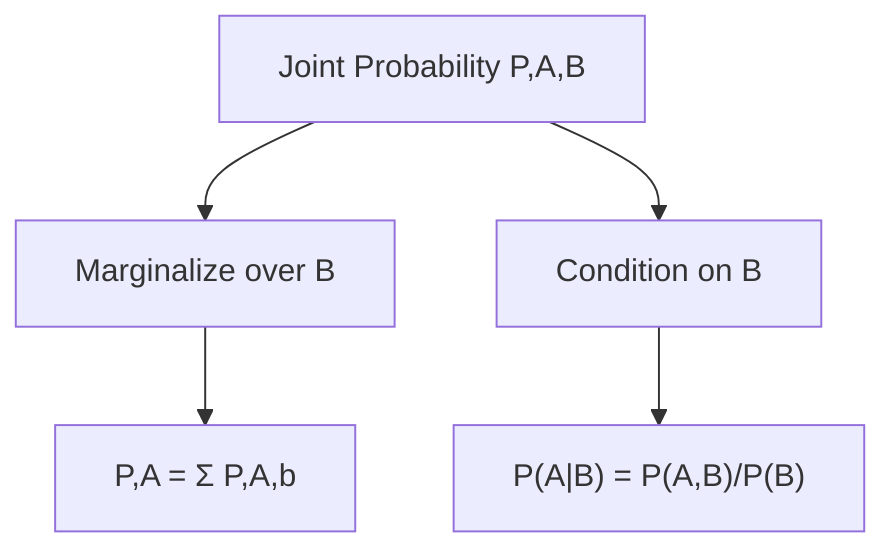
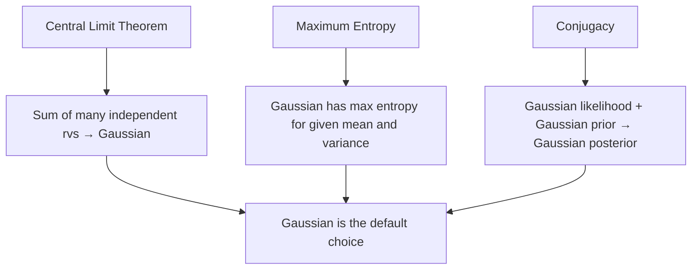

# Probability & Statistics for Machine Learning

## Overview

Probability theory provides the mathematical framework for **reasoning under uncertainty** — the core challenge in ML. Every prediction a model makes is fundamentally a probabilistic statement. Statistics gives us tools to learn from data and quantify our confidence.

## Core Concepts

### Sample Space, Events, and Probability

```python
# Sample space Ω: Set of all possible outcomes
# Event A: Subset of Ω
# P(A): Probability of event A

# Axioms of probability (Kolmogorov):
# 1. P(A) ≥ 0
# 2. P(Ω) = 1
# 3. P(A ∪ B) = P(A) + P(B) for mutually exclusive A, B
```

### Joint, Marginal, and Conditional Probability

```python
# Joint: P(A, B) = P(A ∩ B)
# Marginal: P(A) = Σ_b P(A, B=b)
# Conditional: P(A|B) = P(A, B) / P(B)

# Chain rule: P(A, B, C) = P(A) * P(B|A) * P(C|A,B)
# Independence: P(A, B) = P(A) * P(B) ⟺ A ⊥ B
```



## Bayes' Theorem

The most important theorem in ML — it connects **prior beliefs** with **observed evidence**.

$$P(\theta | D) = \frac{P(D | \theta) \cdot P(\theta)}{P(D)}$$

| Term | Name | Meaning |
|------|------|---------|
| P(θ\|D) | **Posterior** | Updated belief after seeing data |
| P(D\|θ) | **Likelihood** | How well θ explains the data |
| P(θ) | **Prior** | Belief before seeing data |
| P(D) | **Evidence** | Normalizing constant |

```python
# Example: Disease testing
# P(Disease) = 0.01 (prior)
# P(Positive|Disease) = 0.99 (sensitivity)
# P(Positive|No Disease) = 0.05 (false positive rate)

# Bayes' theorem:
# P(Disease|Positive) = P(Pos|Disease) * P(Disease) / P(Pos)
# P(Pos) = P(Pos|Disease)*P(Disease) + P(Pos|No Disease)*P(No Disease)
# P(Pos) = 0.99*0.01 + 0.05*0.99 = 0.0594
# P(Disease|Pos) = 0.99*0.01 / 0.0594 ≈ 0.1667

# Despite 99% sensitivity, only 16.7% chance of actually having the disease!
# This is the "base rate fallacy" — priors matter enormously.
```

```mermaid
graph LR
    A[Prior P,θ] --> D[Bayes Theorem]
    B[Likelihood P,D|θ] --> D
    C[Evidence P,D] --> D
    D --> E[Posterior P,θ|D]
    E -->|New Data| A
```

## Probability Distributions

### Discrete Distributions

```python
import numpy as np
from scipy import stats

# Bernoulli: Single trial, p=probability of success
bern = stats.bernoulli(p=0.3)
print(bern.pmf(1))  # 0.3

# Binomial: n independent Bernoulli trials
binom = stats.binom(n=10, p=0.3)
print(binom.pmf(3))  # P(X=3) in 10 trials

# Poisson: Number of events in fixed interval
poisson = stats.poisson(mu=5)
print(poisson.pmf(3))  # P(X=3) when avg rate is 5
```

### Continuous Distributions

```python
# Normal (Gaussian): The king of distributions
# f(x) = (1/√(2πσ²)) * exp(-(x-μ)²/(2σ²))
norm = stats.norm(loc=0, scale=1)
print(norm.pdf(0))     # Density at 0
print(norm.cdf(1.96))  # P(X ≤ 1.96) ≈ 0.975

# Uniform: All values equally likely in [a, b]
uniform = stats.uniform(loc=0, scale=1)

# Exponential: Time between events
expon = stats.expon(scale=1)

# Beta: Distribution over [0,1], conjugate prior for Bernoulli
beta = stats.beta(a=2, b=5)
```

### The Gaussian Distribution — Why It's Everywhere



## Expected Value, Variance, and Moments

```python
# Expected value: E[X] = Σ x*P(x) or ∫ x*f(x)dx
# Variance: Var(X) = E[(X - μ)²] = E[X²] - (E[X])²
# Standard deviation: σ = √Var(X)
# Covariance: Cov(X,Y) = E[(X-μ_X)(Y-μ_Y)]
# Correlation: ρ = Cov(X,Y) / (σ_X * σ_Y)

# Properties:
# E[aX + b] = aE[X] + b
# Var(aX + b) = a²Var(X)
# If X ⊥ Y: Var(X+Y) = Var(X) + Var(Y)
```

### Covariance Matrix

```python
import numpy as np

# For multivariate data X of shape (n_samples, n_features)
X = np.random.randn(100, 3)
cov_matrix = np.cov(X.T)  # Shape: (3, 3)

# Diagonal: variances of each feature
# Off-diagonal: covariances between features
# Symmetric: Cov(X,Y) = Cov(Y,X)
# Positive semi-definite: eigenvalues ≥ 0
```

## Maximum Likelihood Estimation (MLE)

**Goal**: Find parameters θ that maximize the likelihood of observing the data.

$$\hat{\theta}_{MLE} = \arg\max_\theta P(D|\theta) = \arg\max_\theta \prod_{i=1}^n P(x_i|\theta)$$

In practice, we work with **log-likelihood** (turns products into sums):

$$\hat{\theta}_{MLE} = \arg\max_\theta \sum_{i=1}^n \log P(x_i|\theta)$$

```python
# MLE for Gaussian: Given data x₁,...,xₙ
# μ_MLE = (1/n) Σxᵢ  (sample mean)
# σ²_MLE = (1/n) Σ(xᵢ - μ)²  (sample variance, biased!)

# Derivation:
# log L = -n/2 log(2πσ²) - Σ(xᵢ-μ)²/(2σ²)
# ∂log L/∂μ = Σ(xᵢ-μ)/σ² = 0 → μ = (1/n)Σxᵢ
# ∂log L/∂σ² = -n/(2σ²) + Σ(xᵢ-μ)²/(2σ⁴) = 0 → σ² = (1/n)Σ(xᵢ-μ)²

# Note: MLE variance uses 1/n (biased), not 1/(n-1) (unbiased)
```

## Maximum A Posteriori (MAP)

**Goal**: Find parameters that maximize the posterior (incorporating prior knowledge).

$$\hat{\theta}_{MAP} = \arg\max_\theta P(\theta|D) = \arg\max_\theta P(D|\theta) \cdot P(\theta)$$

```python
# MAP = MLE + Prior
# MAP with Gaussian prior on μ:
# Prior: μ ~ N(μ₀, σ₀²)
# Likelihood: xᵢ ~ N(μ, σ²)
# Posterior: μ|D ~ N(μ_n, σ_n²)

# μ_n = (n/σ² * x̄ + 1/σ₀² * μ₀) / (n/σ² + 1/σ₀²)
# This is a weighted average of MLE estimate and prior!

# Connection to regularization:
# MAP with Gaussian prior ⟺ L2 regularization
# MAP with Laplace prior ⟺ L1 regularization
```

```mermaid
graph LR
    A[MLE: argmax P,D|θ] --> C[No prior knowledge]
    B[MAP: argmax P,θ|D * P,θ] --> D[Includes prior]
    E[Full Bayesian: P,θ|D] --> F[Complete posterior distribution]
    C --> G[Point estimate]
    D --> G
    F --> H[Distribution over parameters]
```

## Information Theory

### Entropy

$$H(X) = -\sum_x P(x) \log P(x)$$

Measures **uncertainty** in a distribution. Uniform distribution has maximum entropy.

### KL Divergence

$$D_{KL}(P || Q) = \sum_x P(x) \log \frac{P(x)}{Q(x)}$$

Measures how different Q is from P. **Not symmetric**. Used in:
- Variational Autoencoders (VAE)
- Knowledge distillation
- Policy gradient methods

### Cross-Entropy

$$H(P, Q) = -\sum_x P(x) \log Q(x) = H(P) + D_{KL}(P || Q)$$

**This is the most common loss function for classification!** Minimizing cross-entropy ≡ minimizing KL divergence (since H(P) is constant).

```python
import numpy as np

# Cross-entropy loss for classification
def cross_entropy(y_true, y_pred):
    return -np.sum(y_true * np.log(y_pred + 1e-10))

# Example: 3-class problem
y_true = np.array([1, 0, 0])  # One-hot: class 0
y_pred = np.array([0.7, 0.2, 0.1])  # Model predictions
loss = cross_entropy(y_true, y_pred)  # -log(0.7) ≈ 0.357
```

## The Bias-Variance Decomposition (Probabilistic View)

For a model trained on dataset D:

$$E_D[(f_D(x) - y)^2] = \text{Bias}^2 + \text{Variance} + \text{Irreducible Noise}$$

Where:
- **Bias²** = $(E_D[f_D(x)] - f^*(x))^2$ — systematic error
- **Variance** = $E_D[(f_D(x) - E_D[f_D(x)])^2]$ — sensitivity to data
- **Noise** = $\sigma^2$ — inherent randomness in data

## Interview Questions

### Beginner

**Q: What's the difference between probability and statistics?**

A: Probability starts with a model and derives predictions (top-down). Statistics starts with data and infers the model (bottom-up). In ML, we use probability to define our models and statistics to learn from data.

**Q: Explain the law of large numbers and the central limit theorem.**

A: 
- **Law of Large Numbers**: As sample size grows, the sample mean converges to the true mean
- **Central Limit Theorem**: The distribution of sample means approaches a Gaussian, regardless of the underlying distribution (given finite variance). This is why Gaussian assumptions work well in practice.

### Intermediate

**Q: When would you use MAP instead of MLE?**

A: MAP is preferred when:
1. **Limited data**: Prior acts as regularizer, preventing overfitting
2. **Domain knowledge**: We have reliable prior information
3. **Regularization**: MAP with specific priors yields L1/L2 regularization
4. **Small sample sizes**: MLE can overfit; MAP provides shrinkage

With large datasets, MAP converges to MLE (data overwhelms prior).

**Q: Why is cross-entropy used as a loss function for classification?**

A: Cross-entropy measures the distance between the true distribution P and predicted distribution Q. Minimizing it:
1. Is equivalent to maximizing likelihood (MLE)
2. Penalizes confident wrong predictions heavily (log penalty)
3. Has nice gradient properties (no vanishing gradient for correct predictions)
4. Is convex for logistic regression, guaranteeing global optimum

### FAANG-Level

**Q: Explain the connection between information theory and ML model training.**

A: Training a classifier minimizes H(P_true, P_model) = H(P_true) + D_KL(P_true || P_model). Since H(P_true) is constant, we're minimizing KL divergence — making the model's distribution match reality. This framework unifies:
- Cross-entropy loss (classification)
- KL divergence loss (VAE, distillation)
- Mutual information maximization (representation learning)

The Information Bottleneck principle suggests that good representations compress input while preserving information about the target — connecting compression and generalization.

**Q: How does the exponential family relate to GLMs and sufficient statistics?**

A: The exponential family (Gaussian, Bernoulli, Poisson, etc.) has the form p(x|θ) = h(x)exp(ηᵀT(x) - A(η)). Key properties:
- T(x) are **sufficient statistics** (capture all info about θ)
- MLE depends on data only through T(x)
- Conjugate priors exist in closed form
- GLMs model E[y|x] = g⁻¹(θᵀx) where g is the link function
- The canonical link function makes the optimization convex

## Common Mistakes

1. **Confusing P(A|B) with P(B|A)**: The prosecutor's fallacy. P(evidence|innocent) ≠ P(innocent|evidence)
2. **Ignoring base rates**: Bayes' theorem shows prior probability dramatically affects posterior
3. **Assuming independence**: Features are often correlated; naive Bayes works despite this violation
4. **Using MLE with small samples**: MLE can overfit; consider MAP or Bayesian approaches
5. **Mixing up variance and standard deviation**: Variance is in squared units; std dev is in original units

## Summary

| Concept | Formula | ML Connection |
|---------|---------|---------------|
| Bayes' Theorem | P(θ\|D) = P(D\|θ)P(θ)/P(D) | Bayesian inference, MAP |
| MLE | argmax P(D\|θ) | Training loss minimization |
| MAP | argmax P(θ\|D) | Regularized training |
| Cross-Entropy | -Σ P(x)log Q(x) | Classification loss |
| KL Divergence | Σ P(x)log(P(x)/Q(x)) | VAE, distillation |
| Entropy | -Σ P(x)log P(x) | Decision trees, information gain |

## Cross-References

- [Loss Functions](loss-functions.md) — Cross-entropy and other probabilistic losses
- [Bias-Variance](bias-variance.md) — Decomposition of generalization error
- [Naive Bayes](../classical/naive-bayes.md) — Direct application of Bayes' theorem
- [Regularization](regularization.md) — MAP interpretation of L1/L2
- [GPT](../transformers/gpt.md) — Language modeling as probability estimation
