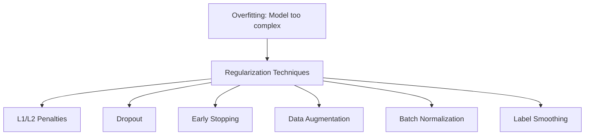
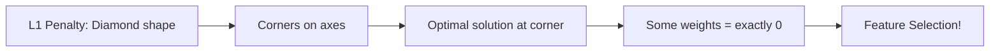
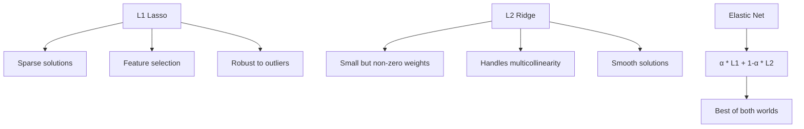
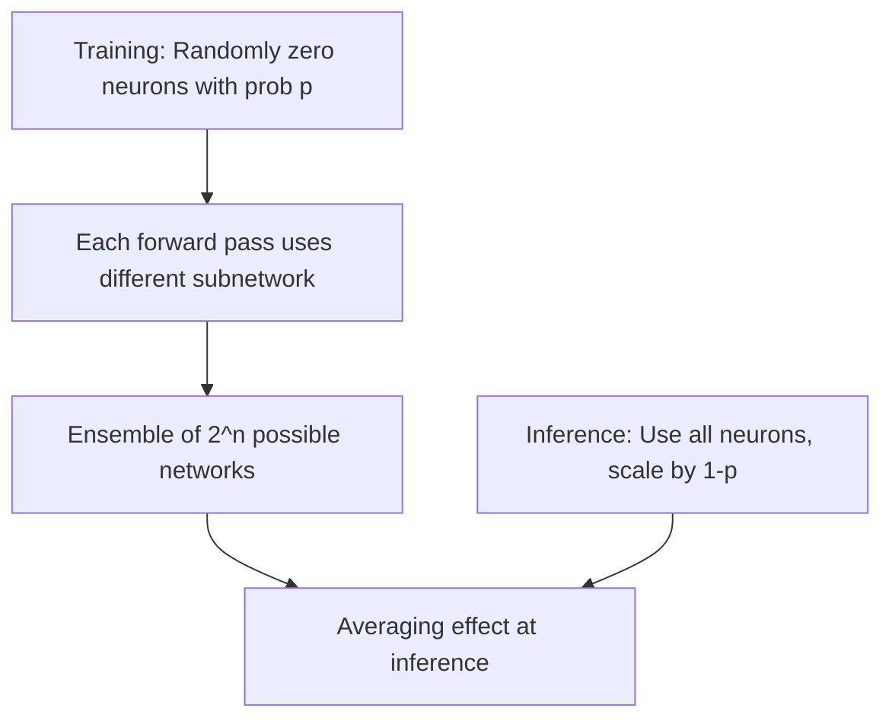
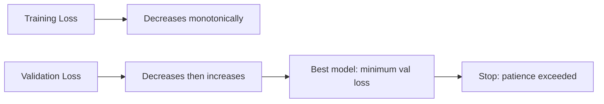

# Regularization

## Overview

Regularization is the set of techniques that **prevent overfitting** — the gap between training performance and test performance. An unregularized model can memorize training data perfectly but fail on new data. Regularization trades a small increase in training error for a large decrease in test error.



## L1 Regularization (Lasso)

Adds the **sum of absolute values** of weights to the loss:

\\[L_{regularized} = L_{original} + \lambda \sum_{i=1}^{n} |w_i|\\]

```python
import numpy as np

def l1_regularization(weights, lambda_reg=0.01):
    return lambda_reg * np.sum(np.abs(weights))

# Gradient: λ * sign(w)
def l1_gradient(weights, lambda_reg=0.01):
    return lambda_reg * np.sign(weights)
```

### Why L1 Produces Sparse Solutions



**Key insight**: The L1 constraint region is a diamond. The loss function's contours are ellipses. The optimal solution often occurs at a corner of the diamond — where one or more weights are exactly zero. This makes L1 a natural **feature selector**.

```python
# Example: L1 drives some weights to exactly zero
from sklearn.linear_model import Lasso

# True weights: [3, 0, 0, 2, 0]
X = np.random.randn(100, 5)
y = 3*X[:, 0] + 2*X[:, 3] + np.random.randn(100)*0.1

lasso = Lasso(alpha=0.1)
lasso.fit(X, y)
print(lasso.coef_)  # [2.98, 0, 0, 1.97, 0] — sparse!
```

## L2 Regularization (Ridge)

Adds the **sum of squared weights** to the loss:

\\[L_{regularized} = L_{original} + \lambda \sum_{i=1}^{n} w_i^2\\]

```python
def l2_regularization(weights, lambda_reg=0.01):
    return lambda_reg * np.sum(weights ** 2)

# Gradient: 2λw
def l2_gradient(weights, lambda_reg=0.01):
    return 2 * lambda_reg * weights
```

### L2 Properties

- Shrinks weights toward zero but **never exactly zero**
- Corresponds to **Gaussian prior** on weights (MAP interpretation)
- The constraint region is a circle — optimal solution rarely on axes
- Prevents any single weight from dominating

### L1 vs L2 Comparison



| Property | L1 (Lasso) | L2 (Ridge) |
|----------|-----------|-----------|
| Penalty | Σ\|wᵢ\| | Σwᵢ² |
| Sparsity | Yes (feature selection) | No |
| Prior | Laplace | Gaussian |
| Constraint shape | Diamond | Circle |
| Differentiable | No (at 0) | Yes |
| Use case | High-dimensional, sparse | Multicollinearity |

## Elastic Net

Combines L1 and L2:

\\[L = L_{original} + \lambda_1 \sum |w_i| + \lambda_2 \sum w_i^2\\]

```python
from sklearn.linear_model import ElasticNet

# l1_ratio = 0.5 means equal mix of L1 and L2
model = ElasticNet(alpha=0.1, l1_ratio=0.5)
model.fit(X, y)
```

## Weight Decay vs L2 Regularization

For SGD, they're equivalent. For Adam, they're **different**:

```python
# SGD: L2 regularization ≡ weight decay
# Adam: L2 regularization ≠ weight decay

# Adam + L2: adds λw to gradient, then computes adaptive moments
# This means the effective weight decay varies per parameter

# AdamW: decoupled weight decay
# θ = θ - lr * (adam_update + λ * θ)
# This is the correct approach for adaptive optimizers
```

## Dropout

Randomly **zero out** neurons during training with probability `p`.

```python
import numpy as np

def dropout_forward(x, p=0.5, training=True):
    if not training:
        return x
    mask = np.random.binomial(1, 1-p, size=x.shape)
    return x * mask / (1 - p)  # Inverted dropout

def dropout_backward(dout, mask, p=0.5):
    return dout * mask / (1 - p)
```

```python
# PyTorch usage
import torch.nn as nn

class Model(nn.Module):
    def __init__(self):
        super().__init__()
        self.fc1 = nn.Linear(784, 256)
        self.dropout = nn.Dropout(p=0.5)
        self.fc2 = nn.Linear(256, 10)
    
    def forward(self, x):
        x = torch.relu(self.fc1(x))
        x = self.dropout(x)  # Only active during training
        x = self.fc2(x)
        return x
```

### How Dropout Works



### Why Dropout Prevents Overfitting

1. **Ensemble effect**: Each training step uses a different subnetwork — averaging over 2ⁿ networks
2. **Feature co-adaptation**: Neurons can't rely on specific other neurons → must learn robust features
3. **Implicit regularization**: Similar to L2 regularization with adaptive λ per layer

### Monte Carlo Dropout

Use dropout at **inference time** for uncertainty estimation:

```python
def mc_dropout_predict(model, x, n_samples=100):
    model.train()  # Keep dropout active
    predictions = []
    for _ in range(n_samples):
        predictions.append(model(x).detach())
    mean = torch.stack(predictions).mean(0)
    variance = torch.stack(predictions).var(0)
    return mean, variance  # Variance = uncertainty
```

## Early Stopping

Stop training when **validation loss stops improving**.

```python
class EarlyStopping:
    def __init__(self, patience=10, min_delta=0.001):
        self.patience = patience
        self.min_delta = min_delta
        self.counter = 0
        self.best_loss = None
        self.best_model = None
    
    def __call__(self, val_loss, model):
        if self.best_loss is None:
            self.best_loss = val_loss
            self.best_model = model.state_dict().copy()
        elif val_loss < self.best_loss - self.min_delta:
            self.best_loss = val_loss
            self.best_model = model.state_dict().copy()
            self.counter = 0
        else:
            self.counter += 1
        
        if self.counter >= self.patience:
            model.load_state_dict(self.best_model)
            return True  # Stop training
        return False
```



### Early Stopping as Regularization

The number of training steps is an implicit complexity parameter. Early stopping limits the effective capacity of the model — equivalent to L2 regularization with λ ∝ 1/t (t = training steps).

## Data Augmentation

Increase effective training set size by applying **transformations** that preserve labels.

### Image Augmentation

```python
from torchvision import transforms

train_transform = transforms.Compose([
    transforms.RandomHorizontalFlip(p=0.5),
    transforms.RandomRotation(degrees=15),
    transforms.ColorJitter(brightness=0.2, contrast=0.2),
    transforms.RandomResizedCrop(224, scale=(0.8, 1.0)),
    transforms.RandomErasing(p=0.5),  # Cutout
    transforms.ToTensor(),
    transforms.Normalize(mean=[0.485, 0.456, 0.406],
                        std=[0.229, 0.224, 0.225])
])
```

### Advanced Augmentation

```python
# Mixup: Blend two images and labels
def mixup(x1, y1, x2, y2, alpha=0.2):
    lam = np.random.beta(alpha, alpha)
    x = lam * x1 + (1 - lam) * x2
    y = lam * y1 + (1 - lam) * y2
    return x, y

# CutMix: Replace a patch with patch from another image
def cutmix(x1, y1, x2, y2, alpha=1.0):
    lam = np.random.beta(alpha, alpha)
    # Random box
    H, W = x1.shape[1:]
    cut_ratio = np.sqrt(1 - lam)
    cut_h, cut_w = int(H * cut_ratio), int(W * cut_ratio)
    cx, cy = np.random.randint(W), np.random.randint(H)
    x1[:, cy:cy+cut_h, cx:cx+cut_w] = x2[:, cy:cy+cut_h, cx:cx+cut_w]
    lam = 1 - (cut_h * cut_w) / (H * W)
    y = lam * y1 + (1 - lam) * y2
    return x1, y
```

### NLP Augmentation

```python
# Synonym replacement
# Random insertion/deletion/swap
# Back-translation (translate to another language and back)
# Text generation with LLMs
```

## Batch Normalization

Normalizes activations within a mini-batch (also acts as regularizer):

\\[\hat{x}_i = \frac{x_i - \mu_B}{\sqrt{\sigma_B^2 + \epsilon}}\\]
\\[y_i = \gamma \hat{x}_i + \beta\\]

```python
class BatchNorm:
    def __init__(self, num_features, momentum=0.1, eps=1e-5):
        self.gamma = np.ones(num_features)
        self.beta = np.zeros(num_features)
        self.eps = eps
        self.momentum = momentum
        self.running_mean = np.zeros(num_features)
        self.running_var = np.ones(num_features)
    
    def forward(self, x, training=True):
        if training:
            mean = x.mean(axis=0)
            var = x.var(axis=0)
            self.running_mean = (1-self.momentum)*self.running_mean + self.momentum*mean
            self.running_var = (1-self.momentum)*self.running_var + self.momentum*var
        else:
            mean = self.running_mean
            var = self.running_var
        
        x_norm = (x - mean) / np.sqrt(var + self.eps)
        return self.gamma * x_norm + self.beta
```

## Label Smoothing

Instead of hard labels (0 or 1), use soft targets:

\\[y_{smooth} = (1 - \epsilon) \cdot y + \epsilon / C\\]

```python
def label_smoothing_loss(y_true, y_pred, epsilon=0.1, num_classes=10):
    y_smooth = y_true * (1 - epsilon) + epsilon / num_classes
    return -np.sum(y_smooth * np.log(y_pred))
```

**Effect**: Prevents the model from becoming overconfident → better calibration and generalization.

## Layer Normalization

Like batch norm but normalizes across features (not batch):

```python
class LayerNorm:
    def __init__(self, num_features, eps=1e-5):
        self.gamma = np.ones(num_features)
        self.beta = np.zeros(num_features)
        self.eps = eps
    
    def forward(self, x):
        mean = x.mean(axis=-1, keepdims=True)
        var = x.var(axis=-1, keepdims=True)
        x_norm = (x - mean) / np.sqrt(var + self.eps)
        return self.gamma * x_norm + self.beta
```

**Key difference from BatchNorm**: Works with batch size 1, doesn't depend on batch statistics → preferred in Transformers and RNNs.

## Regularization Comparison

| Technique | Type | Where Applied | Key Benefit |
|-----------|------|--------------|-------------|
| L1 | Penalty | Loss function | Feature selection |
| L2 | Penalty | Loss function | Weight shrinkage |
| Dropout | Stochastic | Hidden layers | Ensemble effect |
| Early Stopping | Training | Optimization | Limits capacity |
| Data Augmentation | Data | Input | More training data |
| Batch Norm | Normalization | Activations | Faster training, slight regularization |
| Label Smoothing | Loss | Labels | Confidence calibration |
| Layer Norm | Normalization | Activations | Sequence models |

## Interview Questions

### Beginner

**Q: Why does overfitting happen?**

A: Overfitting occurs when a model has too much capacity relative to the training data — it memorizes noise and specific patterns instead of learning general rules. Signs: training loss much lower than validation loss.

**Q: How does L2 regularization prevent overfitting?**

A: L2 adds a penalty for large weights → the model can't rely on any single feature too heavily → it must spread its learning across features → simpler model that generalizes better. Mathematically, it reduces the model's effective capacity.

### Intermediate

**Q: Why is dropout rate usually 0.5 for hidden layers and 0.1-0.2 for input layers?**

A: Hidden layers have redundancy (multiple neurons learn similar features), so dropping 50% still leaves enough capacity. Input layers have no redundancy — each input feature carries unique information. Dropping too much input information would lose signal. For very deep networks, lower dropout rates (0.1-0.3) are often used to prevent underfitting.

**Q: When would you prefer L1 over L2 regularization?**

A: L1 when:
1. You suspect many features are irrelevant (high-dimensional, sparse data)
2. You want an interpretable model (feature selection)
3. The true model is sparse (many zero coefficients)

L2 when:
1. All features might be relevant
2. Features are correlated (multicollinearity)
3. You want smooth solutions

### FAANG-Level

**Q: A transformer model with 1B parameters overfits on a dataset of 100K examples. Propose a regularization strategy.**

A: Multi-layered approach:
1. **Weight decay (AdamW)**: λ=0.01-0.1, decoupled from gradient
2. **Dropout**: 0.1-0.3 on attention weights and FFN layers
3. **Label smoothing**: ε=0.1 for classification, 0.1-0.2 for generation
4. **Data augmentation**: Back-translation, synonym replacement, mixup at embedding level
5. **Stochastic depth**: Randomly drop entire layers during training
6. **Gradient clipping**: Max norm 1.0 to prevent large updates
7. **Pre-training**: Use a pre-trained model and fine-tune — effectively reduces the hypothesis space
8. **Increase data**: The best regularizer is more data — consider synthetic data generation

**Q: Explain why batch normalization has a regularizing effect.**

A: BN computes statistics per mini-batch, not the full dataset. Each sample's normalization depends on other samples in the batch → **noise** similar to dropout. Different batches give slightly different normalizations → each training step sees a slightly different model → ensemble effect. This is why models with BN often don't need dropout. However, this also means BN behaves differently with small batch sizes.

## Common Mistakes

1. **Applying dropout during inference**: Always set `model.eval()` in PyTorch
2. **Not scaling dropout at inference**: Use inverted dropout (scale during training) to avoid inference-time scaling
3. **Too much regularization**: Underfitting — validation loss also increases
4. **Regularizing bias terms**: Usually don't regularize biases (they don't contribute to model complexity in the same way)
5. **Using L2 with Adam without weight decay**: Standard Adam + L2 ≠ proper weight decay. Use AdamW.

## Summary

Regularization is about controlling model complexity. The best approach depends on your model, data, and task. In practice, combine multiple techniques — modern deep learning uses weight decay + dropout + data augmentation + early stopping together.

## Cross-References

- [Bias-Variance](bias-variance.md) — The theory behind why regularization helps
- [Dropout (Deep Learning)](../deep-learning/dropout.md) — Detailed dropout analysis
- [Batch Normalization](../deep-learning/batch-norm.md) — Normalization as regularization
- [AdamW](../deep-learning/optimizers.md) — Decoupled weight decay
- [Training Transformers](../transformers/training.md) — Regularization for large models
