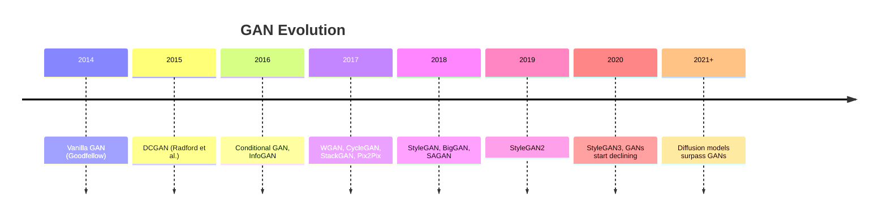

# Generative Adversarial Networks (GANs)

## Overview

Generative Adversarial Networks (GANs) are a class of generative models introduced by Ian Goodfellow in 2014. They consist of two neural networks — a **Generator** and a **Discriminator** — that compete in a minimax game. The generator learns to produce realistic data samples, while the discriminator learns to distinguish real data from generated (fake) data. This adversarial training process drives both networks to improve, ultimately producing a generator capable of creating highly realistic synthetic data.

## Why GANs Matter

GANs revolutionized generative modeling and have applications across:

- **Image synthesis**: Generating photorealistic faces, art, and scenes
- **Data augmentation**: Creating synthetic training data for rare classes
- **Image-to-image translation**: Style transfer, super-resolution, colorization
- **Video generation**: Predicting future frames, deepfakes
- **Drug discovery**: Generating molecular structures
- **Anomaly detection**: Learning normal data distributions

## The GAN Framework

```mermaid
graph LR
    subgraph Generator
        Z[Random Noise z ~ p(z)] --> G[Generator G]
    end
    subgraph Discriminator
        G -->|Fake Data| D[Discriminator D]
        RD[Real Data x ~ p_data] -->|Real Data| D
    end
    D -->|Real/Fake Score| L[Loss Function]
    L -->|Update G| G
    L -->|Update D| D
```

### The Minimax Objective

$$\min_G \max_D V(D, G) = \mathbb{E}_{x \sim p_{data}}[\log D(x)] + \mathbb{E}_{z \sim p_z}[\log(1 - D(G(z)))]$$

- **Discriminator** maximizes: correctly classifying real vs fake
- **Generator** minimizes: fooling the discriminator

## Key Concepts

| Concept | Description |
|---------|-------------|
| Nash Equilibrium | Optimal point where neither player can improve |
| Mode Collapse | Generator produces limited variety |
| Training Instability | Oscillating losses, failure to converge |
| Wasserstein Distance | Alternative metric for stable training |
| Fréchet Inception Distance (FID) | Quality metric for generated images |

## GAN Variants Timeline



## Interview Questions

1. **What is the Nash Equilibrium in GANs?** — When the generator perfectly matches the data distribution and the discriminator outputs 0.5 for all inputs (cannot distinguish real from fake).

2. **Why are GANs hard to train?** — The minimax optimization is non-convex; gradient signals can vanish when the discriminator is too strong; mode collapse is common.

3. **What is mode collapse?** — The generator learns to produce only a few types of outputs that fool the discriminator, failing to capture the full data distribution.

4. **How do WGANs improve training?** — They use the Wasserstein distance (Earth Mover's distance) instead of JS divergence, providing meaningful gradients even when distributions don't overlap.

5. **Compare GANs vs VAEs vs Diffusion Models** — GANs: sharp images, unstable training. VAEs: stable, blurry outputs. Diffusion: best quality, slowest inference.

## Common Mistakes

- Training the discriminator too well (kills generator gradients)
- Not using spectral normalization or gradient penalty
- Using binary cross-entropy with sigmoid in the wrong place
- Ignoring mode collapse signals (low diversity in outputs)
- Not monitoring FID/IS metrics during training

## Summary

GANs are powerful generative models based on adversarial training between two networks. While they achieve impressive results in image generation, they require careful tuning and have largely been superseded by diffusion models for many tasks. Understanding GANs remains essential for ML interviews and for grasping foundational concepts in generative AI.

## Cross-References

- [Deep Learning Basics](../deep-learning/nn-basics.md) — Neural network fundamentals
- [CNNs](../deep-learning/cnn.md) — Convolutional architectures used in DCGAN
- [Loss Functions](../foundations/loss-functions.md) — Understanding adversarial losses
- [Diffusion Models](../../llm/vision/diffusion.md) — Modern alternative to GANs
- [Image Classification](../../llm/vision/classification.md) — Evaluation via Inception Score
