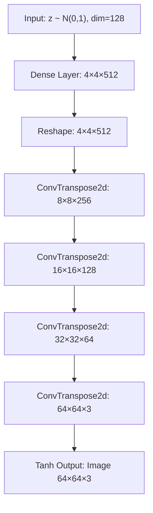
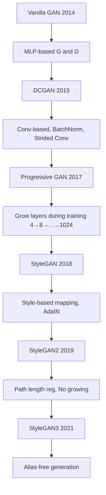

# GAN Architecture

## Overview

The architecture of a GAN consists of two neural networks — the **Generator (G)** and the **Discriminator (D)** — designed with complementary roles. The generator maps random noise to data space, while the discriminator maps data to a probability of being real. The design choices for these networks critically affect training stability, output quality, and mode coverage.

## Generator Architecture

The generator takes a random noise vector $z$ (typically from a uniform or Gaussian distribution) and transforms it into a data sample through a series of learned transformations.

### Key Design Principles



- **No pooling layers** — use strided convolutions (discriminator) and fractional-strided convolutions (generator)
- **Batch normalization** in both G and D (except D's input and G's output layers)
- **ReLU** in generator (except output: Tanh)
- **LeakyReLU** in discriminator

```python
import torch
import torch.nn as nn

class DCGANGenerator(nn.Module):
    def __init__(self, latent_dim=128, channels=3):
        super().__init__()
        self.net = nn.Sequential(
            # z: (batch, 128, 1, 1)
            nn.ConvTranspose2d(latent_dim, 512, 4, 1, 0, bias=False),
            nn.BatchNorm2d(512),
            nn.ReLU(True),
            # (batch, 512, 4, 4)
            nn.ConvTranspose2d(512, 256, 4, 2, 1, bias=False),
            nn.BatchNorm2d(256),
            nn.ReLU(True),
            # (batch, 256, 8, 8)
            nn.ConvTranspose2d(256, 128, 4, 2, 1, bias=False),
            nn.BatchNorm2d(128),
            nn.ReLU(True),
            # (batch, 128, 16, 16)
            nn.ConvTranspose2d(128, 64, 4, 2, 1, bias=False),
            nn.BatchNorm2d(64),
            nn.ReLU(True),
            # (batch, 64, 32, 32)
            nn.ConvTranspose2d(64, channels, 4, 2, 1, bias=False),
            nn.Tanh()
            # (batch, 3, 64, 64)
        )

    def forward(self, z):
        return self.net(z.view(z.size(0), -1, 1, 1))
```

## Discriminator Architecture

The discriminator is essentially a binary classifier that outputs the probability that an input is real.

```python
class DCGANDiscriminator(nn.Module):
    def __init__(self, channels=3):
        super().__init__()
        self.net = nn.Sequential(
            # (batch, 3, 64, 64)
            nn.Conv2d(channels, 64, 4, 2, 1, bias=False),
            nn.LeakyReLU(0.2, inplace=True),
            # (batch, 64, 32, 32)
            nn.Conv2d(64, 128, 4, 2, 1, bias=False),
            nn.BatchNorm2d(128),
            nn.LeakyReLU(0.2, inplace=True),
            # (batch, 128, 16, 16)
            nn.Conv2d(128, 256, 4, 2, 1, bias=False),
            nn.BatchNorm2d(256),
            nn.LeakyReLU(0.2, inplace=True),
            # (batch, 256, 8, 8)
            nn.Conv2d(256, 512, 4, 2, 1, bias=False),
            nn.BatchNorm2d(512),
            nn.LeakyReLU(0.2, inplace=True),
            # (batch, 512, 4, 4)
            nn.Conv2d(512, 1, 4, 1, 0, bias=False),
            nn.Sigmoid()
            # (batch, 1, 1, 1)
        )

    def forward(self, x):
        return self.net(x).view(-1, 1).squeeze(1)
```

## Architectural Evolution



### DCGAN Guidelines (Radford et al., 2015)

1. Replace pooling with strided convolutions (D) and fractional-strided convolutions (G)
2. Use BatchNorm in both G and D
3. Remove fully connected hidden layers
4. Use ReLU in G (except output: Tanh)
5. Use LeakyReLU in D

## Latent Space Design

| Approach | Description | Trade-off |
|----------|-------------|-----------|
| Standard z ~ N(0,1) | Simple, works for basic GANs | Limited control |
| Truncated z | Sample within radius, better quality | Less diversity |
| Learned mapping | StyleGAN's mapping network | More disentangled |
| Class-conditional | Concatenate class label to z | Controllable generation |

## Interview Questions

1. **Why use strided convolutions instead of pooling in GANs?** — Strided convolutions are learnable and allow the network to learn its own spatial downsampling/upsampling, unlike fixed pooling operations.

2. **Why does the generator use Tanh activation at the output?** — Tanh outputs values in [-1, 1], matching the normalized input range. ReLU would restrict outputs to non-negative values.

3. **Why use LeakyReLU in the discriminator?** — Standard ReLU kills gradients for negative inputs, which can cause training instability. LeakyReLU allows small gradients to flow through.

4. **What is the role of BatchNorm in GANs?** — It stabilizes training by normalizing activations, preventing internal covariate shift. However, it should not be applied to D's first layer or G's last layer.

5. **How does StyleGAN differ from DCGAN architecturally?** — StyleGAN uses a mapping network to transform z into an intermediate latent space w, then injects style information at each layer via Adaptive Instance Normalization (AdaIN).

## Common Mistakes

- Using pooling instead of strided convolutions (causes checkerboard artifacts)
- Applying BatchNorm to the discriminator's input layer
- Using ReLU in the discriminator (LeakyReLU is preferred)
- Making the discriminator too powerful relative to the generator
- Not normalizing input images to [-1, 1] when using Tanh output

## Summary

GAN architecture has evolved from simple MLPs (vanilla GAN) to sophisticated convolutional designs (DCGAN) and style-based architectures (StyleGAN). Key principles include using strided convolutions, batch normalization, and appropriate activation functions. Modern GAN architectures like StyleGAN achieve near-photorealistic image synthesis by injecting style information at multiple resolutions.

## Cross-References

- [Training GANs](./training.md) — How these architectures are trained
- [StyleGAN](./stylegan.md) — Advanced style-based architecture
- [CNNs](../deep-learning/cnn.md) — Convolutional building blocks
- [Batch Normalization](../deep-learning/batch-norm.md) — Normalization technique used in GANs
- [Activation Functions](../deep-learning/activation.md) — ReLU, LeakyReLU, Tanh details
