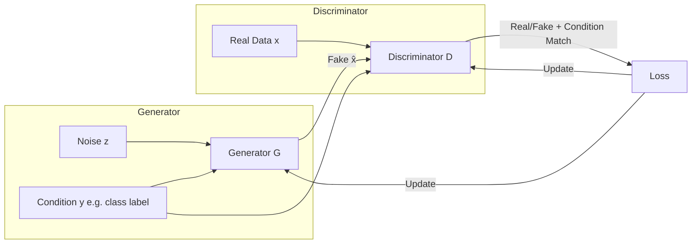
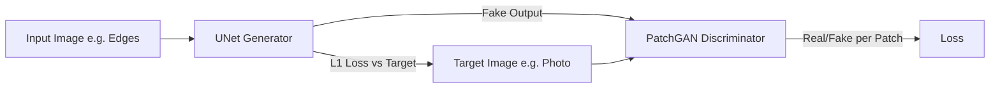
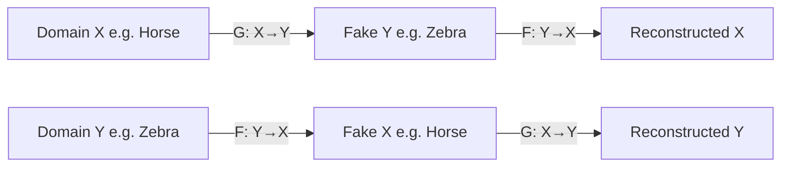

# Conditional GANs (cGANs)

## Overview

Conditional GANs extend the standard GAN framework by conditioning both the generator and discriminator on additional information — class labels, text descriptions, or other images. This enables **controlled generation**: producing outputs that match specific attributes. Conditional GANs form the basis for many practical applications including text-to-image synthesis, image-to-image translation, and super-resolution.

## Conditional GAN Framework



### Objective

\\[\min_G \max_D V(D, G) = \mathbb{E}_{x \sim p_{data}}[\log D(x|y)] + \mathbb{E}_{z \sim p_z}[\log(1 - D(G(z|y)|y))]\\]

The condition $y$ is provided to both networks, so the discriminator checks both realism and condition adherence.

## Conditioning Methods

### 1. Label Conditioning (Class-conditional)

Concatenate or embed the class label with the noise/data:

```python
class ConditionalGenerator(nn.Module):
    def __init__(self, latent_dim, num_classes, embed_dim, img_channels=3):
        super().__init__()
        self.label_embed = nn.Embedding(num_classes, embed_dim)
        self.net = nn.Sequential(
            nn.ConvTranspose2d(latent_dim + embed_dim, 512, 4, 1, 0),
            nn.BatchNorm2d(512), nn.ReLU(),
            nn.ConvTranspose2d(512, 256, 4, 2, 1),
            nn.BatchNorm2d(256), nn.ReLU(),
            nn.ConvTranspose2d(256, 128, 4, 2, 1),
            nn.BatchNorm2d(128), nn.ReLU(),
            nn.ConvTranspose2d(128, img_channels, 4, 2, 1),
            nn.Tanh()
        )

    def forward(self, z, label):
        label_emb = self.label_embed(label).unsqueeze(-1).unsqueeze(-1)
        z = z.unsqueeze(-1).unsqueeze(-1)
        input = torch.cat([z, label_emb], dim=1)
        return self.net(input)
```

### 2. FiLM Conditioning (Feature-wise Linear Modulation)

Scale and shift feature maps based on the condition:

\\[\text{FiLM}(F) = \gamma(y) \cdot F + \beta(y)\\]

```python
class FiLMLayer(nn.Module):
    def __init__(self, cond_dim, num_features):
        super().__init__()
        self.gamma = nn.Linear(cond_dim, num_features)
        self.beta = nn.Linear(cond_dim, num_features)

    def forward(self, features, condition):
        gamma = self.gamma(condition).unsqueeze(-1).unsqueeze(-1)
        beta = self.beta(condition).unsqueeze(-1).unsqueeze(-1)
        return gamma * features + beta
```

### 3. Cross-Attention Conditioning

Used for text-conditioned generation (e.g., AttnGAN, Stable Diffusion):

```python
class CrossAttention(nn.Module):
    def __init__(self, dim, context_dim):
        super().__init__()
        self.q = nn.Linear(dim, dim)
        self.k = nn.Linear(context_dim, dim)
        self.v = nn.Linear(context_dim, dim)
        self.scale = dim ** -0.5

    def forward(self, x, context):
        q = self.q(x)
        k = self.k(context)
        v = self.v(context)
        attn = (q @ k.transpose(-2, -1)) * self.scale
        attn = attn.softmax(dim=-1)
        return attn @ v
```

## Major Conditional GAN Variants

### Pix2Pix (Image-to-Image Translation)

Translates between image domains using paired training data (e.g., edges→photos, segmentation→real):



**Loss**: $L = L_{cGAN} + \lambda L_{L1}$ where $L_{L1} = \|y - G(x)\|_1$

**PatchGAN**: Discriminator classifies each N×N patch as real/fake, rather than the whole image.

### CycleGAN (Unpaired Translation)

Translates between domains without paired data using **cycle consistency**:



**Cycle Consistency Loss**: $\|F(G(x)) - x\|_1 + \|G(F(y)) - y\|_1$

### StackGAN (Text-to-Image)

Generates images from text descriptions in two stages:
1. **Stage I**: Low-resolution (64×64) from text embedding
2. **Stage II**: Refines to high-resolution (256×256)

### SPADE (Spatially-Adaptive Normalization)

Uses segmentation maps as conditioning, modulating feature maps spatially:

\\[\text{SPADE}(x, s) = \gamma(s) \cdot \text{BN}(x) + \beta(s)\\]

where $\gamma(s)$ and $\beta(s)$ are spatially-varying, derived from the segmentation map.

## Super-Resolution GAN (SRGAN)

Generates high-resolution images from low-resolution inputs:

```python
class SRResNet(nn.Module):
    def __init__(self, num_blocks=16):
        super().__init__()
        self.conv1 = nn.Conv2d(3, 64, 9, 1, 4)
        self.prelu = nn.PReLU()
        blocks = [ResidualBlock(64) for _ in range(num_blocks)]
        self.trunk = nn.Sequential(*blocks)
        self.conv2 = nn.Conv2d(64, 64, 3, 1, 1)
        self.bn = nn.BatchNorm2d(64)
        # Upsampling: 2× per block
        self.upsample = nn.Sequential(
            nn.Conv2d(64, 256, 3, 1, 1),
            nn.PixelShuffle(2), nn.PReLU(),
            nn.Conv2d(64, 256, 3, 1, 1),
            nn.PixelShuffle(2), nn.PReLU(),
        )
        self.conv3 = nn.Conv2d(64, 3, 9, 1, 4)

    def forward(self, x):
        initial = self.prelu(self.conv1(x))
        trunk = self.trunk(initial)
        trunk = self.bn(self.conv2(trunk)) + initial
        up = self.upsample(trunk)
        return torch.tanh(self.conv3(up))
```

**Perceptual Loss**: Instead of pixel-wise MSE, uses feature distances from a pretrained VGG network:

\\[L_{perceptual} = \|\phi(x_{HR}) - \phi(G(x_{LR}))\|_2^2\\]

## Comparison of cGAN Variants

| Model | Condition Type | Paired Data | Key Innovation |
|-------|---------------|-------------|----------------|
| cGAN | Class label | Yes | Simple label conditioning |
| Pix2Pix | Image | Yes | L1 + cGAN, PatchGAN |
| CycleGAN | Image | No | Cycle consistency |
| StackGAN | Text | Yes | Stage-wise generation |
| SRGAN | Low-res image | Yes | Perceptual loss |
| SPADE | Segmentation map | Yes | Spatially-adaptive norm |
| AttnGAN | Text | Yes | Fine-grained attention |

## Interview Questions

1. **How does conditioning differ from simply concatenating labels to the input?** — Better approaches (FiLM, AdaIN, cross-attention) modulate feature maps at intermediate layers, allowing richer interaction between condition and features.

2. **What is PatchGAN and why is it effective?** — It classifies each N×N patch as real/fake instead of the whole image. This focuses on local texture quality, has fewer parameters, and works on arbitrary image sizes.

3. **How does CycleGAN work without paired data?** — It uses cycle consistency loss: translating X→Y→X should return the original image. This constraint prevents mode collapse and ensures meaningful translations.

4. **What is perceptual loss and why use it over MSE?** — Perceptual loss compares high-level features from a pretrained network (VGG), producing sharper results than pixel-wise MSE which leads to blurry outputs.

5. **How does SPADE differ from standard conditional batch norm?** — SPADE applies spatially-varying normalization parameters derived from the segmentation map, preserving spatial structure better than global conditioning.

## Common Mistakes

- Not conditioning the discriminator (generator has no incentive to follow the condition)
- Using only pixel-wise loss (L1/MSE) without adversarial loss (blurry outputs)
- Forgetting cycle consistency loss in unpaired settings (mode collapse)
- Using too small λ for auxiliary losses (condition ignored)

## Summary

Conditional GANs enable controlled generation by conditioning on labels, images, or text. Key architectures include Pix2Pix (paired translation), CycleGAN (unpaired translation), SRGAN (super-resolution), and SPADE (layout-guided generation). Conditioning mechanisms range from simple concatenation to FiLM, AdaIN, and cross-attention. The choice depends on the type and complexity of the conditioning signal.

## Cross-References

- [GAN Architecture](./architecture.md) — Foundational GAN design
- [Training GANs](./training.md) — Stabilization techniques
- [StyleGAN](./stylegan.md) — AdaIN-based style conditioning
- [CNNs](../deep-learning/cnn.md) — UNet, ResNet building blocks
- [Diffusion Models](../../llm/vision/diffusion.md) — Modern conditional generation
