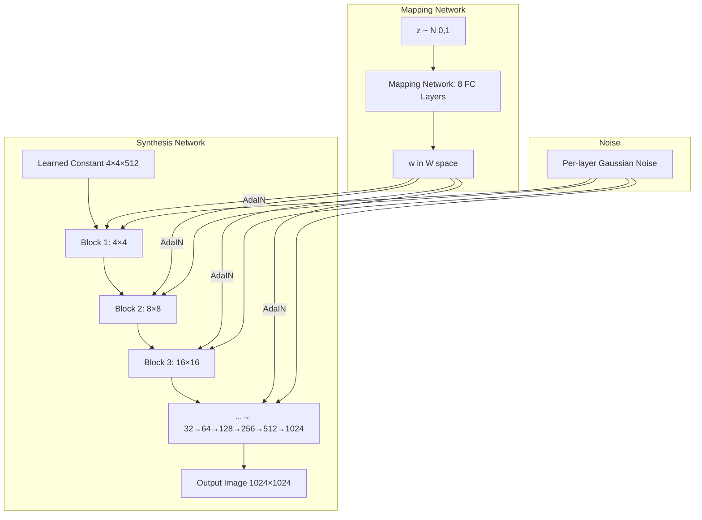
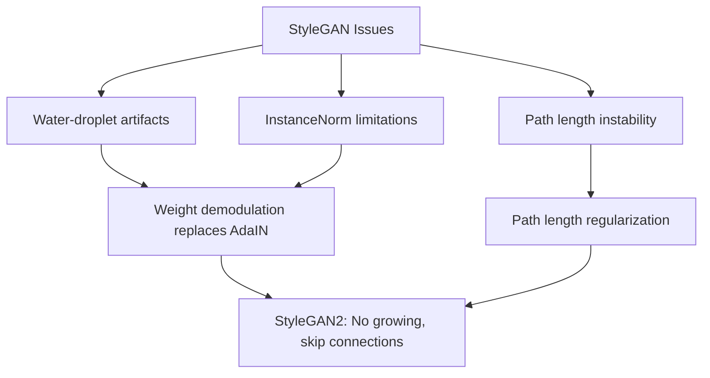

# StyleGAN

## Overview

StyleGAN (Style-based Generator Architecture for GANs), introduced by NVIDIA in 2018, fundamentally reimagined the generator architecture. Instead of feeding noise directly into the generator, StyleGAN uses a **mapping network** to transform the latent code into an intermediate latent space, then injects "styles" at each resolution via **Adaptive Instance Normalization (AdaIN)**. This produces remarkably high-quality, disentangled image synthesis and became the state-of-the-art for face generation.

## Architecture



### Key Differences from DCGAN

| Component | DCGAN | StyleGAN |
|-----------|-------|----------|
| Input | Noise z directly to conv layers | Learned constant + style modulation |
| Latent space | Single Z space | Z → Mapping → W space |
| Style control | None | Per-layer style via AdaIN |
| Noise | Only at input | Added at each resolution |
| Upsampling | Transposed conv | Bilinear upsample + conv |

## Mapping Network

The mapping network transforms $z \in \mathcal{Z}$ to $w \in \mathcal{W}$ through 8 fully-connected layers:

```python
class MappingNetwork(nn.Module):
    def __init__(self, z_dim=512, w_dim=512, num_layers=8):
        super().__init__()
        layers = []
        for i in range(num_layers):
            layers.extend([
                nn.Linear(z_dim if i == 0 else w_dim, w_dim),
                nn.LeakyReLU(0.2)
            ])
        self.net = nn.Sequential(*layers)

    def forward(self, z):
        # Normalize z
        z = z / (z.norm(dim=1, keepdim=True) + 1e-8)
        return self.net(z)
```

The W space is **disentangled** — individual dimensions correspond to interpretable attributes (age, gender, hair color, etc.).

## Adaptive Instance Normalization (AdaIN)

AdaIN applies the style to each feature map:

\\[\text{AdaIN}(x_i, y) = y_{s,i} \frac{x_i - \mu(x_i)}{\sigma(x_i)} + y_{b,i}\\]

where $y_s$ and $y_b$ are learned from $w$ via a **style modulator** (affine transformation).

```python
class AdaIN(nn.Module):
    def __init__(self, w_dim, num_features):
        super().__init__()
        self.norm = nn.InstanceNorm2d(num_features)
        self.style_scale = nn.Linear(w_dim, num_features)
        self.style_bias = nn.Linear(w_dim, num_features)

    def forward(self, x, w):
        normalized = self.norm(x)
        scale = self.style_scale(w).unsqueeze(-1).unsqueeze(-1)
        bias = self.style_bias(w).unsqueeze(-1).unsqueeze(-1)
        return scale * normalized + bias
```

## Noise Injection

Per-pixel noise is added after each convolution, before AdaIN:

```python
class NoiseInjection(nn.Module):
    def __init__(self):
        super().__init__()
        self.weight = nn.Parameter(torch.zeros(1))

    def forward(self, x, noise=None):
        if noise is None:
            noise = torch.randn(x.size(0), 1, x.size(2), x.size(3), device=x.device)
        return x + self.weight * noise
```

Noise controls **stochastic details** — freckles, hair strands, background texture — while styles control **global structure**.

## StyleGAN2 Improvements

StyleGAN2 (2019) addressed several issues:



### Weight Demodulation

Instead of AdaIN (which can cause artifacts), StyleGAN2 modulates convolution weights directly:

\\[w'_{ijk} = s_i \cdot w_{ijk} \cdot \frac{1}{\sqrt{\sum_{i,k} (s_i \cdot w_{ijk})^2 + \epsilon}}\\]

### Path Length Regularization

Encourages smooth mapping from W to images:

\\[L_{pl} = \mathbb{E}_w \left\| J_w^T J_w \mathbf{1} - 1 \right\|^2\\]

## Style Mixing

A unique capability: use different $w$ vectors for different layers.

```python
def style_mixing(generator, w1, w2, crossover_layer=4):
    """Mix styles: low layers from w1, high layers from w2"""
    styles = []
    for i in range(generator.num_layers):
        if i < crossover_layer:
            styles.append(w1)
        else:
            styles.append(w2)
    return generator.synthesis(styles)
```

This produces images where coarse structure (pose, face shape) comes from one source and fine details (hair, skin) from another.

## Truncation Trick

Control quality vs diversity trade-off:

\\[w' = \bar{w} + \psi(w - \bar{w})\\]

- $\psi = 1$: Full diversity, some low-quality outputs
- $\psi = 0$: Average face, highest quality
- $\psi = 0.5-0.7$: Good balance

## Interview Questions

1. **What problem does StyleGAN solve over DCGAN?** — DCGAN feeds noise directly into convolutions, entangling all factors of variation. StyleGAN's mapping network + per-layer AdaIN produces a disentangled latent space with per-resolution style control.

2. **What is the difference between Z space and W space?** — Z is the standard normal input; W is the output of the mapping network. W space is more disentangled because the mapping network learns to "unwrap" the Z distribution.

3. **How does StyleGAN2 fix the water-droplet artifact?** — By replacing Instance Normalization (AdaIN) with weight demodulation, which modulates convolution weights instead of feature maps.

4. **What does the truncation trick do?** — It interpolates between the mean latent code and a sampled code, trading diversity for quality. Lower ψ produces more average, higher-quality images.

5. **What is the role of noise in StyleGAN?** — Noise controls stochastic details (texture, freckles, individual hair strands) while the style vector controls global structure (pose, identity, hair style).

## Common Mistakes

- Confusing Z space and W space when performing latent space operations
- Not applying truncation during evaluation (produces artifacts)
- Using the same noise seed across layers (defeats stochastic variation)
- Forgetting that the mapping network normalizes z first

## Summary

StyleGAN introduced a paradigm shift in GAN architecture by replacing direct noise input with a mapping network and style-based synthesis. The disentangled W space enables fine-grained control over generated images. StyleGAN2 and 3 further refined the architecture, achieving photorealistic face generation. Despite diffusion models now dominating generative AI, StyleGAN's architectural innovations remain influential.

## Cross-References

- [GAN Architecture](./architecture.md) — DCGAN and foundational designs
- [Training GANs](./training.md) — Stabilization techniques
- [Conditional GANs](./conditional.md) — Adding control to generation
- [Batch Normalization](../deep-learning/batch-norm.md) — InstanceNorm vs BatchNorm
- [Diffusion Models](../../llm/vision/diffusion.md) — Modern alternative
