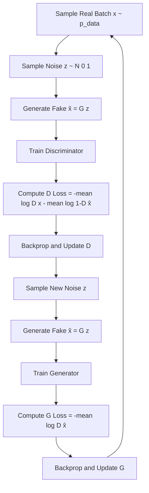
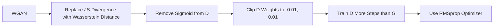
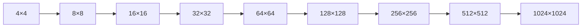

# Training GANs

## Overview

Training GANs is notoriously difficult compared to standard supervised learning. The minimax optimization creates a dynamic system where both networks must improve in balance. Poor training manifests as mode collapse, vanishing gradients, oscillating losses, or failure to converge. Understanding training dynamics, loss formulations, and stabilization techniques is critical for building working GANs.

## The Training Loop



```python
def train_step(real_data, generator, discriminator, opt_G, opt_D, latent_dim):
    batch_size = real_data.size(0)
    real_label = torch.ones(batch_size)
    fake_label = torch.zeros(batch_size)

    # --- Train Discriminator ---
    opt_D.zero_grad()
    # Real data
    output_real = discriminator(real_data)
    loss_D_real = criterion(output_real, real_label)
    # Fake data
    z = torch.randn(batch_size, latent_dim)
    fake = generator(z).detach()  # detach to avoid training G
    output_fake = discriminator(fake)
    loss_D_fake = criterion(output_fake, fake_label)
    # Total D loss
    loss_D = (loss_D_real + loss_D_fake) / 2
    loss_D.backward()
    opt_D.step()

    # --- Train Generator ---
    opt_G.zero_grad()
    z = torch.randn(batch_size, latent_dim)
    fake = generator(z)
    output = discriminator(fake)
    loss_G = criterion(output, real_label)  # G wants D to say "real"
    loss_G.backward()
    opt_G.step()

    return loss_D.item(), loss_G.item()
```

## Loss Functions

### Original GAN Loss (Minimax)

\\[L_D = -\mathbb{E}[\log D(x)] - \mathbb{E}[\log(1 - D(G(z)))]\\]
\\[L_G = -\mathbb{E}[\log D(G(z))]\\]

**Problem**: When the discriminator is strong, $\log(1 - D(G(z)))$ saturates and gradients vanish.

### Non-Saturating Loss

\\[L_G = -\mathbb{E}[\log D(G(z))]\\]

Instead of minimizing $\log(1 - D(G(z)))$, maximize $\log D(G(z))$. This provides stronger gradients early in training.

### Wasserstein Loss (WGAN)

\\[L_D = -\mathbb{E}[D(x)] + \mathbb{E}[D(G(z))]\\]
\\[L_G = -\mathbb{E}[D(G(z))]\\]

The discriminator (called "critic") outputs unbounded scores instead of probabilities.

### Hinge Loss

\\[L_D = -\mathbb{E}[\min(0, -1 + D(x))] - \mathbb{E}[\min(0, -1 - D(G(z)))]\\]
\\[L_G = -\mathbb{E}[D(G(z))]\\]

Used in SAGAN and BigGAN; empirically more stable.

## Stabilization Techniques

### 1. Wasserstein GAN (WGAN)



**Weight Clipping**: Enforces the Lipschitz constraint by clamping weights to [-0.01, 0.01].

### 2. WGAN-GP (Gradient Penalty)

Instead of weight clipping, enforce the Lipschitz constraint via a gradient penalty:

\\[L_{GP} = \lambda \mathbb{E}_{\hat{x}}[(\|\nabla_{\hat{x}} D(\hat{x})\|_2 - 1)^2]\\]

where $\hat{x}$ is a random interpolation between real and fake samples.

```python
def gradient_penalty(discriminator, real, fake, device):
    batch_size = real.size(0)
    alpha = torch.rand(batch_size, 1, 1, 1, device=device)
    interpolated = (alpha * real + (1 - alpha) * fake).requires_grad_(True)
    d_interpolated = discriminator(interpolated)
    gradients = torch.autograd.grad(
        outputs=d_interpolated,
        inputs=interpolated,
        grad_outputs=torch.ones_like(d_interpolated),
        create_graph=True,
        retain_graph=True
    )[0]
    gradients = gradients.view(batch_size, -1)
    penalty = ((gradients.norm(2, dim=1) - 1) ** 2).mean()
    return penalty
```

### 3. Spectral Normalization

Normalizes the weight matrices by their spectral norm (largest singular value), enforcing Lipschitz constraint directly on the discriminator:

\\[\bar{W} = \frac{W}{\sigma(W)}\\]

```python
# PyTorch built-in
discriminator = nn.Sequential(
    spectral_norm(nn.Conv2d(3, 64, 4, 2, 1)),
    nn.LeakyReLU(0.2),
    spectral_norm(nn.Conv2d(64, 128, 4, 2, 1)),
    nn.LeakyReLU(0.2),
    # ...
)
```

### 4. Two-Timescale Update Rule (TTUR)

Train the discriminator with a higher learning rate than the generator:

- D learning rate: 4e-4
- G learning rate: 1e-4

This ensures D converges faster, providing a stable gradient signal to G.

### 5. Progressive Training

Start training at low resolution (4×4) and progressively add layers to increase resolution:



### 6. Label Smoothing

Use soft labels instead of hard 0/1:
- Real labels: 0.9 instead of 1.0
- Fake labels: 0.1 instead of 0.0

Prevents the discriminator from becoming too confident.

### 7. Instance Noise

Add Gaussian noise to both real and fake images fed to the discriminator. Noise is annealed to 0 during training. This smooths the loss landscape.

## Mode Collapse Detection

```python
def detect_mode_collapse(generated_samples, threshold=0.1):
    """Check if generated samples have low diversity"""
    # Compute pairwise distances
    from scipy.spatial.distance import pdist
    distances = pdist(generated_samples.reshape(len(generated_samples), -1))
    avg_distance = distances.mean()
    min_distance = distances.min()

    if avg_distance < threshold:
        print(f"⚠️ Potential mode collapse: avg distance = {avg_distance:.4f}")
    return avg_distance
```

## Hyperparameter Guide

| Hyperparameter | Typical Value | Notes |
|---------------|---------------|-------|
| Learning rate (G) | 1e-4 to 2e-4 | Lower than D's in TTUR |
| Learning rate (D) | 2e-4 to 4e-4 | Higher than G's in TTUR |
| D steps per G step | 1-5 | WGAN: 5, Standard: 1-2 |
| Batch size | 64-512 | Larger = more stable |
| Latent dimension | 64-512 | Task dependent |
| Beta1 (Adam) | 0.0-0.5 | GAN: 0.0, Standard: 0.5 |
| Beta2 (Adam) | 0.999 | Default works well |
| Gradient penalty λ | 10 | WGAN-GP default |

## Interview Questions

1. **Why is training GANs harder than training classifiers?** — It's a minimax game with non-convex objectives; both networks must improve in balance; gradients can vanish when D is too strong; there's no explicit loss convergence metric.

2. **What is the difference between WGAN and standard GAN loss?** — WGAN uses Wasserstein distance instead of Jensen-Shannon divergence, providing meaningful gradients even when distributions don't overlap. The critic outputs scores, not probabilities.

3. **Explain gradient penalty vs weight clipping** — Weight clipping restricts critic capacity and can cause exploding/vanishing gradients. Gradient penalty softly enforces the Lipschitz constraint on interpolated samples, leading to more stable training.

4. **How does spectral normalization work?** — It divides each weight matrix by its spectral norm (largest singular value), ensuring the Lipschitz constant of each layer is at most 1, without requiring an extra loss term.

5. **What is two-timescale update rule and why does it help?** — Training D with a higher learning rate than G ensures D provides a stable, accurate gradient signal to G, preventing oscillation.

## Common Mistakes

- Training D and G equally (D should be slightly stronger)
- Using standard Adam betas (β₁=0.9 causes momentum issues; use 0.0-0.5)
- Not monitoring both D and G losses (only watching one)
- Applying BatchNorm with small batch sizes (use GroupNorm or LayerNorm)
- Using MSE loss instead of BCE (wrong for probability-based GANs)

## Summary

Training GANs requires balancing the discriminator and generator through careful hyperparameter tuning, appropriate loss functions (Wasserstein, hinge), and stabilization techniques (gradient penalty, spectral normalization, progressive training). Modern best practices include using WGAN-GP or hinge loss with spectral normalization, two-timescale updates, and progressive training for high-resolution generation.

## Cross-References

- [GAN Architecture](./architecture.md) — Network design choices
- [Optimization](../foundations/optimization.md) — Adam, SGD fundamentals
- [Loss Functions](../foundations/loss-functions.md) — BCE, MSE details
- [Batch Normalization](../deep-learning/batch-norm.md) — BN in GANs
- [Conditional GANs](./conditional.md) — Conditional training strategies
