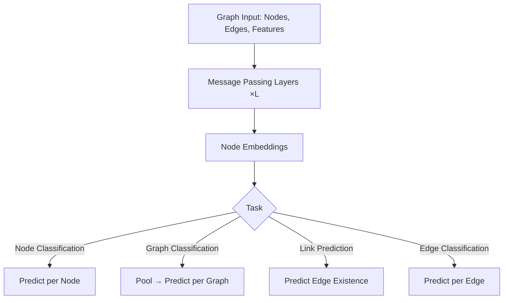
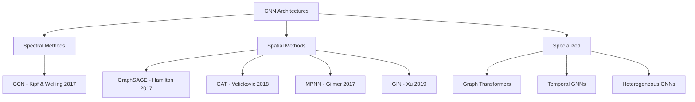

# Graph Neural Networks (GNNs)

## Overview

Graph Neural Networks (GNNs) are a class of deep learning models designed to operate on **graph-structured data** — data where entities (nodes) are connected by relationships (edges). Unlike images (grid) or sequences (chain), graphs have arbitrary topology. GNNs learn by aggregating information from a node's neighborhood, enabling them to capture relational and structural patterns in data.

## Why Graphs?

Many real-world systems are naturally represented as graphs:

| Domain | Nodes | Edges |
|--------|-------|-------|
| Social Networks | Users | Friendships, follows |
| Molecules | Atoms | Chemical bonds |
| Knowledge Graphs | Entities | Relations |
| Recommendation | Users + Items | Interactions |
| Traffic | Intersections | Roads |
| Citation Networks | Papers | Citations |
| Code | Functions/Classes | Call/import relationships |

## The GNN Paradigm

### Message Passing Framework

All GNNs follow a common **message passing** paradigm:

$$h_v^{(l+1)} = \text{UPDATE}^{(l)}\left(h_v^{(l)}, \text{AGGREGATE}^{(l)}\left(\{h_u^{(l)} : u \in \mathcal{N}(v)\}\right)\right)$$

1. **Message**: Each neighbor $u$ computes a message $m_u = \text{MSG}(h_u)$
2. **Aggregate**: Combine messages from all neighbors $\bar{m}_v = \text{AGG}(\{m_u\})$
3. **Update**: Update node representation $h_v = \text{UPD}(h_v, \bar{m}_v)$

## GNN Variants Overview

## Key Applications

- **Node classification**: Classify users in social networks (fraud detection, community detection)
- **Link prediction**: Predict missing connections (friend recommendations, knowledge graph completion)
- **Graph classification**: Classify molecules (drug discovery, toxicity prediction)
- **Graph generation**: Generate new molecules with desired properties
- **Combinatorial optimization**: TSP, vehicle routing

## Common Challenges

| Challenge | Description | Solution |
|-----------|-------------|----------|
| Over-smoothing | Deep GNNs make all node embeddings similar | Residual connections, JumpingKnowledge |
| Over-squashing | Bottleneck in message passing | Graph transformers, wider receptive fields |
| Scalability | Full-batch training on large graphs | Mini-batch sampling (GraphSAGE) |
| Heterogeneous graphs | Different node/edge types | HAN, R-GCN |
| Expressiveness | WL test limits | GIN (provably powerful) |

## Interview Questions

1. **What is the Weisfeiler-Leman (WL) test and why does it matter for GNNs?** — The WL test is a graph isomorphism heuristic. Standard message-passing GNNs are at most as powerful as the 1-WL test. GIN is designed to match 1-WL expressiveness.

2. **Why can't we use regular neural networks for graphs?** — Graphs have no fixed ordering of nodes, variable-sized neighborhoods, and non-Euclidean structure. Regular NNs require fixed-size, ordered inputs.

3. **What is over-smoothing in GNNs?** — As layers increase, node embeddings converge to the same value, losing discriminative power. Caused by repeated averaging over neighborhoods.

4. **How do GNNs handle directed graphs?** — Separate weight matrices for incoming/outgoing messages, or use edge features to encode directionality. Some architectures (R-GCN) handle this explicitly.

5. **Compare GCN, GraphSAGE, and GAT** — GCN: spectral-based, full-batch, normalized Laplacian. GraphSAGE: sampled neighborhoods, inductive. GAT: attention-weighted aggregation.

## Common Mistakes

- Adding too many layers (over-smoothing, typically 2-3 is optimal)
- Not normalizing adjacency matrices properly
- Ignoring edge features when they carry important information
- Applying GNNs to disconnected graphs without considering components
- Using node features without proper normalization

## Summary

GNNs extend deep learning to graph-structured data through message passing. The core variants — GCN, GraphSAGE, and GAT — differ in how they aggregate neighbor information. Understanding the message passing framework, expressiveness limitations (WL test), and practical challenges (over-smoothing, scalability) is essential for ML interviews.

## Cross-References

- [Neural Network Basics](../deep-learning/nn-basics.md) — Foundation for GNN layers
- [Attention Mechanism](../deep-learning/attention.md) — Attention used in GAT
- [CNNs](../deep-learning/cnn.md) — Comparison with grid-based convolutions
- [Transformers](../transformers/README.md) — Graph Transformers
- [Recommendation System](../system-design/recommendation.md) — GNNs for recommendations
