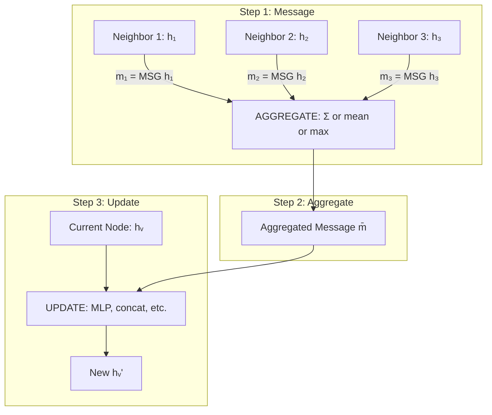
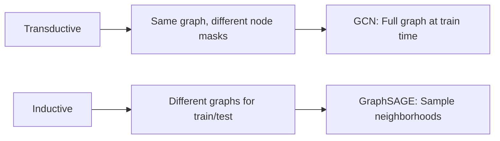
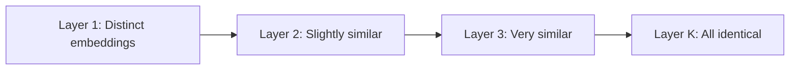

# GNN Basics

## Overview

Graph Neural Networks operate on graph-structured data by learning representations (embeddings) for nodes, edges, or entire graphs. The fundamental operation is **message passing** — each node aggregates information from its neighbors to update its representation. This chapter covers graph representations, the message passing framework, pooling operations, and training paradigms.

## Graph Representation

A graph $G = (V, E)$ consists of:
- **Nodes (vertices)** $V = \{v_1, ..., v_N\}$ — entities
- **Edges** $E \subseteq V \times V$ — relationships
- **Node features** $X \in \mathbb{R}^{N \times d}$ — feature vector per node
- **Edge features** $E_{feat} \in \mathbb{R}^{|E| \times d_e}$ — optional edge attributes
- **Adjacency matrix** $A \in \{0,1\}^{N \times N}$ — $A_{ij} = 1$ if edge $(i,j)$ exists

```python
import torch
import torch_geometric
from torch_geometric.data import Data

# Create a simple graph
# 4 nodes, 5 edges
edge_index = torch.tensor([
    [0, 1, 1, 2, 3],  # source nodes
    [1, 0, 2, 1, 1]   # target nodes
], dtype=torch.long)

# Node features (4 nodes, 3 features each)
x = torch.randn(4, 3)

# Node labels
y = torch.tensor([0, 1, 1, 0])

graph = Data(x=x, edge_index=edge_index, y=y)
print(graph)
# Data(x=[4, 3], edge_index=[2, 5], y=[4])
```

## Adjacency Matrix Representations

```python
import numpy as np

# Dense adjacency (wasteful for sparse graphs)
A = np.array([
    [0, 1, 0, 0],
    [1, 0, 1, 1],
    [0, 1, 0, 0],
    [0, 1, 0, 0]
])

# Sparse representation (COO format - used by PyG)
# edge_index = [[source nodes], [target nodes]]
# More memory efficient for real-world sparse graphs
```

### Normalized Adjacency

For GNN propagation, we use the **symmetric normalized Laplacian**:

\\[\hat{A} = D^{-1/2} A D^{-1/2}\\]

where $D$ is the diagonal degree matrix $D_{ii} = \sum_j A_{ij}$.

```python
def normalize_adjacency(A):
    """Compute symmetric normalized adjacency"""
    A_hat = A + np.eye(A.shape[0])  # Add self-loops
    D = np.diag(A_hat.sum(axis=1))
    D_inv_sqrt = np.diag(1.0 / np.sqrt(D.diagonal()))
    return D_inv_sqrt @ A_hat @ D_inv_sqrt
```

## The Message Passing Framework



### Generic Implementation

```python
class MessagePassingLayer(nn.Module):
    def __init__(self, in_dim, out_dim):
        super().__init__()
        self.message_fn = nn.Linear(in_dim, out_dim)  # Transform neighbor features
        self.update_fn = nn.Linear(in_dim + out_dim, out_dim)  # Combine

    def forward(self, x, edge_index):
        src, dst = edge_index  # source and destination node indices

        # Step 1: Compute messages
        messages = self.message_fn(x[src])  # Transform source node features

        # Step 2: Aggregate messages per destination node
        aggregated = torch.zeros_like(x)
        # Scatter add: sum messages for each destination
        aggregated.scatter_add_(0, dst.unsqueeze(1).expand_as(messages), messages)

        # Step 3: Update
        updated = self.update_fn(torch.cat([x, aggregated], dim=-1))
        return updated
```

## Graph-Level Readout (Pooling)

For graph-level tasks (graph classification), we need to go from node embeddings to a single graph embedding:

| Method | Formula | Pros/Cons |
|--------|---------|-----------|
| Sum | $h_G = \sum_{v} h_v$ | Captures size info |
| Mean | $h_G = \frac{1}{N}\sum_{v} h_v$ | Size-invariant |
| Max | $h_G = \max_v h_v$ | Captures salient features |
| Set2Set | Attention-based pooling | More expressive |
| DiffPool | Learnable hierarchical pooling | Most powerful, expensive |

```python
def global_mean_pool(x, batch):
    """Average node features per graph in a batch"""
    # batch: tensor mapping each node to its graph index
    num_graphs = batch.max().item() + 1
    return torch_geometric.nn.global_mean_pool(x, batch)
```

## Training Paradigms

### Transductive Learning
- Train and test on the **same graph**
- Example: Classify nodes in a citation network
- Cannot generalize to new nodes/graphs

### Inductive Learning
- Train on one set of graphs, test on **unseen graphs**
- Example: GraphSAGE for dynamic social networks
- Must learn generalizable aggregation functions



## Over-Smoothing Problem

As GNN depth increases, node embeddings converge:



**Why**: Repeated averaging over expanding neighborhoods makes all nodes "see" the entire graph.

**Solutions**:
1. **Residual connections**: $h^{(l+1)} = h^{(l)} + \text{GNN}^{(l)}(h^{(l)})$
2. **JumpingKnowledge**: Concatenate embeddings from all layers
3. **DropEdge**: Randomly remove edges during training
4. **PairNorm**: Normalize pairwise distances between embeddings

```python
class ResidualGNNLayer(nn.Module):
    def __init__(self, dim):
        super().__init__()
        self.gnn = GNNLayer(dim, dim)
        self.norm = nn.LayerNorm(dim)

    def forward(self, x, edge_index):
        return self.norm(x + F.relu(self.gnn(x, edge_index)))
```

## Interview Questions

1. **Why do GNNs add self-loops to the adjacency matrix?** — So a node includes its own features in the aggregation step. Without self-loops, the node's representation depends only on neighbors, losing its own information.

2. **What is the difference between inductive and transductive learning in GNNs?** — Transductive uses the same graph for train/test (GCN). Inductive learns aggregation functions that generalize to unseen nodes/graphs (GraphSAGE).

3. **Why is over-smoothing a problem?** — Deep GNNs make all node embeddings identical, destroying discriminative information. Typically 2-3 layers work best.

4. **How do you handle graphs with different sizes in a batch?** — Use a batch vector mapping nodes to graphs, and use global pooling to get fixed-size graph representations. PyG's DataLoader handles this automatically.

5. **What is the Weisfeiler-Leman test?** — A graph isomorphism test that iteratively refines node labels by aggregating neighbor labels. 1-WL is the upper bound on expressiveness for standard message-passing GNNs.

## Common Mistakes

- Forgetting to add self-loops (node loses its own features)
- Not normalizing the adjacency matrix (unstable training)
- Using too many layers (over-smoothing)
- Ignoring edge features/weights
- Not using mini-batch sampling for large graphs (memory explosion)

## Summary

GNN basics revolve around the message passing framework: nodes aggregate neighbor information to update their representations. Key concepts include graph representation (adjacency matrix, node features), normalization, pooling for graph-level tasks, and the over-smoothing problem. Understanding these fundamentals is essential before diving into specific GNN architectures.

## Cross-References

- [GCN](./gcn.md) — Spectral-based GNN
- [GraphSAGE](./graphsage.md) — Inductive GNN with sampling
- [GAT](./gat.md) — Attention-based GNN
- [Attention Mechanism](../deep-learning/attention.md) — Attention fundamentals
- [Neural Network Basics](../deep-learning/nn-basics.md) — MLP building blocks
