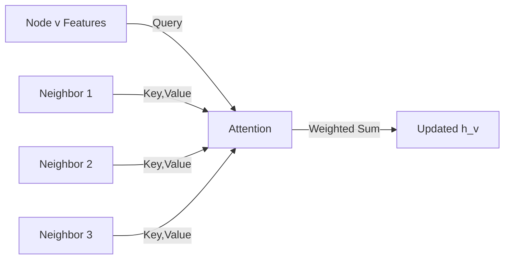

# Graph Attention Networks (GAT)

## Overview

Graph Attention Networks (GATs), introduced by Veličković et al. (2018), replace the fixed aggregation weights (degree-based normalization in GCN) with **learned attention weights**. Each node computes attention scores to its neighbors, determining how much to weight each neighbor's features. This allows the model to learn which neighbors are more important for the task, adapting to graph structure dynamically.

## Attention Mechanism on Graphs



### Attention Coefficients

For each edge $(i, j)$, compute:

$$e_{ij} = \text{LeakyReLU}\left(\vec{a}^T [Wh_i \| Wh_j]\right)$$

where:
- $W$ is a shared linear transformation
- $\vec{a}$ is a learnable attention vector
- $\|$ denotes concatenation

Normalize with softmax over neighbors:

$$\alpha_{ij} = \frac{\exp(e_{ij})}{\sum_{k \in \mathcal{N}(i)} \exp(e_{ik})}$$

Update rule:

$$h_i' = \sigma\left(\sum_{j \in \mathcal{N}(i)} \alpha_{ij} Wh_j\right)$$

## Implementation

```python
import torch
import torch.nn as nn
import torch.nn.functional as F

class GATLayer(nn.Module):
    def __init__(self, in_features, out_features, num_heads=1, concat=True, dropout=0.6):
        super().__init__()
        self.num_heads = num_heads
        self.concat = concat
        self.out_features = out_features

        self.W = nn.Linear(in_features, out_features * num_heads, bias=False)
        self.a = nn.Parameter(torch.empty(num_heads, 2 * out_features))
        self.leaky_relu = nn.LeakyReLU(0.2)
        self.dropout = nn.Dropout(dropout)

        nn.init.xavier_uniform_(self.a)
        nn.init.xavier_uniform_(self.W.weight)

    def forward(self, x, edge_index):
        src, dst = edge_index
        N = x.size(0)

        # Linear transformation: (N, num_heads, out_features)
        Wh = self.W(x).view(N, self.num_heads, self.out_features)

        # Compute attention scores for all edges
        Wh_src = Wh[src]  # (E, num_heads, out_features)
        Wh_dst = Wh[dst]  # (E, num_heads, out_features)

        # Concatenate and compute attention: (E, num_heads)
        e = self.leaky_relu(
            (torch.cat([Wh_src, Wh_dst], dim=-1) * self.a).sum(dim=-1)
        )

        # Softmax per destination node (scatter softmax)
        alpha = self._scatter_softmax(e, dst, N)
        alpha = self.dropout(alpha)

        # Weighted aggregation
        if self.concat:
            out = torch.zeros(N, self.num_heads, self.out_features, device=x.device)
        else:
            out = torch.zeros(N, self.num_heads, self.out_features, device=x.device)

        # Scatter weighted sum
        weighted = Wh_src * alpha.unsqueeze(-1)  # (E, num_heads, out_features)
        out.scatter_add_(0, dst.unsqueeze(-1).unsqueeze(-1).expand_as(weighted), weighted)

        if self.concat:
            return F.elu(out.view(N, -1))  # Concatenate heads
        else:
            return F.elu(out.mean(dim=1))  # Average heads

    def _scatter_softmax(self, src, index, num_nodes):
        """Softmax over groups defined by index"""
        # Numerical stability: subtract max per group
        max_val = torch.zeros(num_nodes, src.size(1), device=src.device)
        max_val.scatter_reduce_(0, index.unsqueeze(-1).expand_as(src), src, reduce='amax')
        src = src - max_val[index]

        exp_src = src.exp()
        sum_exp = torch.zeros(num_nodes, src.size(1), device=src.device)
        sum_exp.scatter_add_(0, index.unsqueeze(-1).expand_as(exp_src), exp_src)

        return exp_src / (sum_exp[index] + 1e-16)
```

### Multi-Head Attention

```python
class MultiHeadGAT(nn.Module):
    def __init__(self, in_dim, hidden_dim, out_dim, num_heads=8):
        super().__init__()
        # Layer 1: Multiple heads with concatenation
        self.gat1 = GATLayer(in_dim, hidden_dim, num_heads=num_heads, concat=True)
        # Layer 2: Single head with averaging (output layer)
        self.gat2 = GATLayer(hidden_dim * num_heads, out_dim, num_heads=1, concat=False)

    def forward(self, x, edge_index):
        x = F.dropout(x, p=0.6, training=self.training)
        x = F.elu(self.gat1(x, edge_index))
        x = F.dropout(x, p=0.6, training=self.training)
        x = self.gat2(x, edge_index)
        return x
```

### PyTorch Geometric

```python
import torch_geometric.nn as gnn

class GAT_PyG(nn.Module):
    def __init__(self, in_dim, hidden_dim, out_dim, heads=8):
        super().__init__()
        self.conv1 = gnn.GATConv(in_dim, hidden_dim, heads=heads, dropout=0.6)
        self.conv2 = gnn.GATConv(hidden_dim * heads, out_dim, heads=1, concat=False, dropout=0.6)

    def forward(self, data):
        x, edge_index = data.x, data.edge_index
        x = F.elu(self.conv1(x, edge_index))
        x = self.conv2(x, edge_index)
        return F.log_softmax(x, dim=1)
```

## Attention Visualization

```python
def visualize_attention(model, graph):
    """Extract and visualize attention weights"""
    model.eval()
    with torch.no_grad():
        # Get attention coefficients from first layer
        _, attn_weights = model.gat1(graph.x, graph.edge_index, return_attention=True)

    # attn_weights: (num_edges, num_heads)
    # Plot attention distribution for a node
    node = 0
    edges = graph.edge_index[1] == node
    node_attn = attn_weights[edges].mean(dim=1)  # Average over heads

    print(f"Node {node} attention to neighbors:")
    neighbors = graph.edge_index[0][edges]
    for n, w in zip(neighbors, node_attn):
        print(f"  → Node {n.item()}: {w.item():.4f}")
```

## GAT vs GCN vs GraphSAGE

| Aspect | GCN | GraphSAGE | GAT |
|--------|-----|-----------|-----|
| Aggregation | Degree-normalized mean | Mean/LSTM/Pool | Attention-weighted |
| Weights | Fixed ($D^{-1/2}AD^{-1/2}$) | Fixed (sampled) | Learned per edge |
| Multi-head | No | No | Yes |
| Inductive | No | Yes | Yes |
| Interpretability | Low | Low | Attention weights |
| Computational cost | $O(|E|d)$ | $O(KNd)$ | $O(|E|d \cdot K)$ |

## GATv2 Improvements

GATv2 (Brody et al., 2022) fixes a limitation where static attention ranks are fixed regardless of the query:

$$e_{ij} = \vec{a}^T \text{LeakyReLU}(W [h_i \| h_j])$$

In GATv2, the nonlinearity is applied **after** the linear transformation, making attention dynamic:

```python
# GAT (static): a^T @ LeakyReLU(Wh_i || Wh_j) — fixed ranking
# GATv2 (dynamic): a^T @ LeakyReLU(W @ (h_i || h_j)) — query-dependent ranking
```

## Interview Questions

1. **How does GAT compute attention on graphs?** — For each edge (i,j), compute $e_{ij} = \text{LeakyReLU}(\vec{a}^T [Wh_i \| Wh_j])$, then normalize with softmax over node i's neighbors.

2. **What is multi-head attention in GAT and why use it?** — Multiple independent attention mechanisms compute separate embeddings, which are concatenated (hidden layers) or averaged (output layer). This stabilizes training and captures different relationship patterns.

3. **How does GAT differ from GCN?** — GCN uses fixed degree-based normalization. GAT learns task-specific attention weights, allowing it to focus on the most relevant neighbors. This is more expressive but more expensive.

4. **What is the difference between static and dynamic attention (GAT vs GATv2)?** — GAT computes $a^T[Wh_i \| Wh_j]$ where the projection happens before concatenation, making the ranking static. GATv2 applies the nonlinearity after concatenation, enabling query-dependent ranking.

5. **When would you choose GAT over GraphSAGE?** — When edge importance varies significantly and the model needs to learn which neighbors matter most. GraphSAGE is better when scalability is the primary concern.

## Common Mistakes

- Forgetting LeakyReLU (standard ReLU kills negative attention logits)
- Not applying dropout to attention coefficients (overfitting)
- Using too many heads on small graphs (overfitting)
- Applying softmax over all nodes instead of per-neighborhood

## Summary

GATs replace fixed aggregation with learned attention, allowing each node to dynamically weight its neighbors' importance. Multi-head attention provides representational stability and captures diverse relationship patterns. GATv2 improves on GAT by making attention rankings dynamic. GATs are particularly effective when edge importance is heterogeneous and task-dependent.

## Cross-References

- [GNN Basics](./basics.md) — Message passing framework
- [GCN](./gcn.md) — Fixed aggregation baseline
- [GraphSAGE](./graphsage.md) — Scalable alternative
- [Attention Mechanism](../deep-learning/attention.md) — Self-attention foundations
- [Transformers](../transformers/architecture.md) — Multi-head attention comparison
