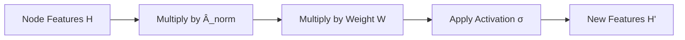
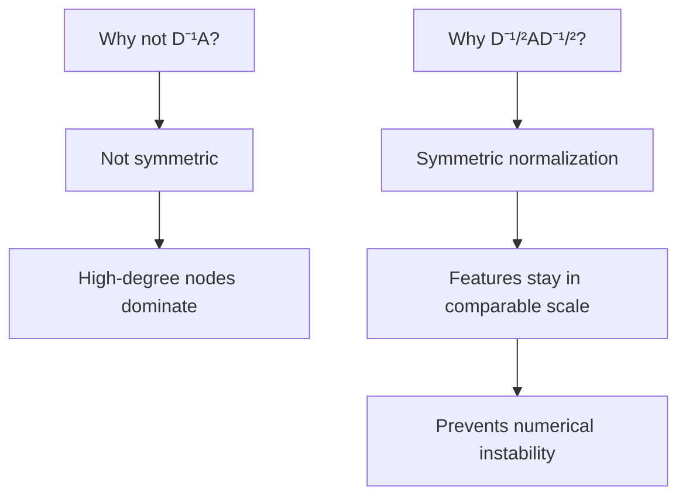
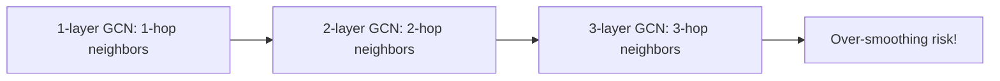

# Graph Convolutional Networks (GCN)

## Overview

Graph Convolutional Networks (GCNs), introduced by Kipf and Welling (2017), extend convolution to graph-structured data. GCNs perform a **spectral-inspired** convolution that aggregates normalized neighbor features. The key insight is a simple, scalable first-order approximation of spectral graph convolutions, resulting in the widely-used layer-wise propagation rule.

## The GCN Layer

### Propagation Rule

$$H^{(l+1)} = \sigma\left(\hat{D}^{-1/2} \hat{A} \hat{D}^{-1/2} H^{(l)} W^{(l)}\right)$$

where:
- $\hat{A} = A + I_N$ (adjacency matrix with self-loops)
- $\hat{D}_{ii} = \sum_j \hat{A}_{ij}$ (degree matrix of $\hat{A}$)
- $W^{(l)}$ is the learnable weight matrix
- $\sigma$ is an activation function (ReLU)



### Per-Node View

For each node $v$:

$$h_v^{(l+1)} = \sigma\left(W^{(l)} \sum_{u \in \mathcal{N}(v) \cup \{v\}} \frac{h_u^{(l)}}{\sqrt{\hat{d}_u \hat{d}_v}}\right)$$

Each node aggregates features from its neighbors (including itself), weighted by the inverse square root of degrees.

## Implementation

```python
import torch
import torch.nn as nn
import torch.nn.functional as F

class GCNLayer(nn.Module):
    def __init__(self, in_features, out_features, bias=True):
        super().__init__()
        self.weight = nn.Parameter(torch.FloatTensor(in_features, out_features))
        if bias:
            self.bias = nn.Parameter(torch.FloatTensor(out_features))
        else:
            self.register_parameter('bias', None)
        self.reset_parameters()

    def reset_parameters(self):
        nn.init.xavier_uniform_(self.weight)
        if self.bias is not None:
            nn.init.zeros_(self.bias)

    def forward(self, x, adj_norm):
        # adj_norm = D^{-1/2} A_hat D^{-1/2}
        support = x @ self.weight          # HW
        output = adj_norm @ support         # A_norm @ HW
        if self.bias is not None:
            output += self.bias
        return output


class GCN(nn.Module):
    def __init__(self, in_dim, hidden_dim, out_dim, dropout=0.5):
        super().__init__()
        self.gc1 = GCNLayer(in_dim, hidden_dim)
        self.gc2 = GCNLayer(hidden_dim, out_dim)
        self.dropout = dropout

    def forward(self, x, adj_norm):
        x = F.relu(self.gc1(x, adj_norm))
        x = F.dropout(x, self.dropout, training=self.training)
        x = self.gc2(x, adj_norm)
        return F.log_softmax(x, dim=1)
```

### Using PyTorch Geometric

```python
import torch_geometric.nn as gnn

class GCN_PyG(nn.Module):
    def __init__(self, in_dim, hidden_dim, out_dim):
        super().__init__()
        self.conv1 = gnn.GCNConv(in_dim, hidden_dim)
        self.conv2 = gnn.GCNConv(hidden_dim, out_dim)

    def forward(self, data):
        x, edge_index = data.x, data.edge_index
        x = F.relu(self.conv1(x, edge_index))
        x = F.dropout(x, p=0.5, training=self.training)
        x = self.conv2(x, edge_index)
        return F.log_softmax(x, dim=1)
```

## Why Symmetric Normalization?



Without normalization, high-degree nodes accumulate large feature values. The symmetric normalization ensures that features from both the source and destination degrees are accounted for.

## Receptive Field

A K-layer GCN has a receptive field of K hops:



## Limitations

1. **Over-smoothing**: Deep GCNs make all nodes identical (too much neighborhood mixing)
2. **Transductive**: Requires the full adjacency matrix at inference; cannot handle new nodes easily
3. **Fixed aggregation**: All neighbors weighted by degree; no learned importance
4. **Scalability**: Full-batch computation requires $O(N^2)$ memory for dense adjacency

## Comparison with CNNs

| Aspect | CNN | GCN |
|--------|-----|-----|
| Grid | Regular grid (images) | Irregular graph |
| Convolution | Fixed-size kernel | Variable-size neighborhood |
| Ordering | Spatial (left/right) | No natural ordering |
| Weight sharing | Same kernel everywhere | Same W for all nodes |
| Pooling | Spatial downsampling | Graph coarsening |

## Interview Questions

1. **Derive the GCN propagation rule from spectral convolutions** — Spectral convolution uses the graph Fourier transform: $g_\theta * x = U g_\theta(\Lambda) U^T x$, where $U$ is the eigenvector matrix of the Laplacian. This is $O(N^2)$. ChebNet approximates $g_\theta(\Lambda)$ with Chebyshev polynomials. GCN further simplifies to a first-order approximation: $g_\theta * x \approx \theta(I + D^{-1/2}AD^{-1/2})x$.

2. **Why add self-loops in GCN?** — Without self-loops, the aggregation only includes neighbors. Self-loops ensure the node's own features are preserved: $\hat{A} = A + I$.

3. **What happens with very deep GCNs?** — Over-smoothing: all node embeddings converge to the same value because each node aggregates from its entire connected component. Typically 2-3 layers work best.

4. **How does GCN differ from a standard MLP applied to each node?** — An MLP only uses the node's own features. GCN aggregates features from neighbors, capturing graph structure and relational information.

5. **What is the computational complexity of a GCN layer?** — $O(|E| \cdot d)$ where $|E|$ is the number of edges and $d$ is the feature dimension, since we only compute for connected pairs.

## Common Mistakes

- Not adding self-loops (node loses its own information)
- Using too many layers (over-smoothing beyond 2-3 layers)
- Not normalizing adjacency properly (numerical issues)
- Applying GCN to directed graphs without considering asymmetry
- Full-batch training on large graphs (use GraphSAGE-style sampling instead)

## Summary

GCNs provide a simple, effective way to perform graph convolutions by aggregating normalized neighbor features. The propagation rule $H' = \sigma(\hat{D}^{-1/2}\hat{A}\hat{D}^{-1/2}HW)$ is the foundation of modern GNNs. While limited by over-smoothing and transductive nature, GCN remains a critical baseline and interview topic.

## Cross-References

- [GNN Basics](./basics.md) — Message passing framework
- [GraphSAGE](./graphsage.md) — Inductive alternative with sampling
- [GAT](./gat.md) — Attention-weighted aggregation
- [CNNs](../deep-learning/cnn.md) — Grid-based convolution comparison
- [Spectral Methods](../foundations/linear-algebra.md) — Eigenvalues, Laplacian
