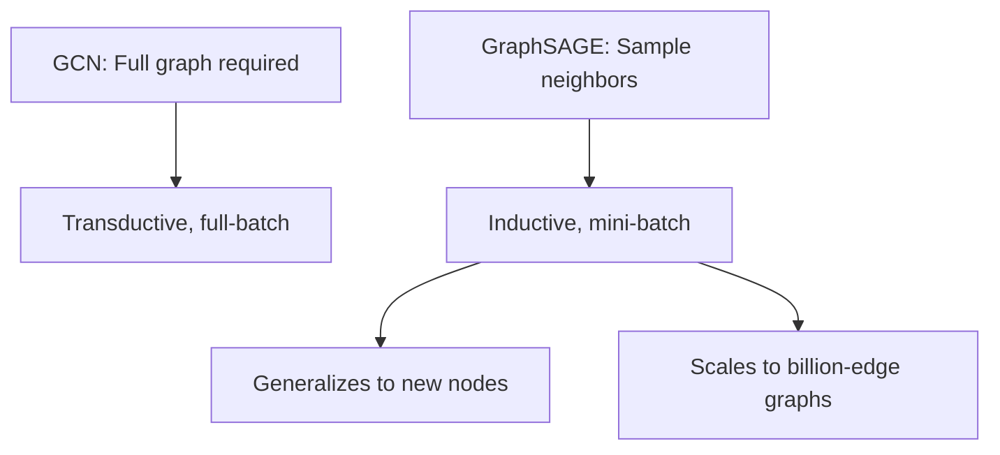
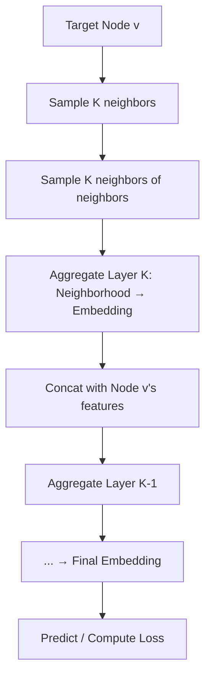

# GraphSAGE

## Overview

GraphSAGE (SAmple and aggrEGatE), introduced by Hamilton et al. (2017), addresses GCN's key limitations: **inductive learning** and **scalability**. Instead of using the full graph, GraphSAGE samples a fixed-size neighborhood for each node, aggregates neighbor features, and combines them with the node's own representation. This enables mini-batch training on massive graphs and generalization to unseen nodes.

## Key Innovation



## Algorithm

### Forward Pass (Training)



### Pseudocode

```python
def graphsage_forward(node_v, num_layers, sampler, aggregator):
    """GraphSAGE forward pass for a single node"""
    # Collect K-hop neighborhoods
    neighborhoods = []
    current_nodes = {node_v}
    for layer in range(num_layers):
        sampled = sampler.sample(current_nodes, k=10)  # Sample 10 neighbors
        neighborhoods.append(sampled)
        current_nodes = sampled

    # Bottom-up aggregation
    h = {}  # node embeddings
    for node in neighborhoods[-1]:  # Initialize leaf nodes
        h[node] = input_features[node]

    for layer in reversed(range(num_layers)):
        h_new = {}
        for node in neighborhoods[layer]:
            neighbor_feats = [h[n] for n in neighborhoods[layer + 1]
                            if n in neighbors(node)]
            aggregated = aggregator(neighbor_feats)
            h_new[node] = combine(h[node], aggregated)
        h = h_new

    return h[node_v]
```

## Aggregation Functions

GraphSAGE proposes several aggregators:

### 1. Mean Aggregator

$$h_v^{(l+1)} = \sigma\left(W \cdot \text{MEAN}\left(\{h_v^{(l)}\} \cup \{h_u^{(l)}, \forall u \in \mathcal{N}(v)\}\right)\right)$$

Simplest, similar to GCN.

### 2. LSTM Aggregator

$$h_v^{(l+1)} = \sigma\left(W \cdot \text{LSTM}\left(\{h_u^{(l)}, \forall u \in \pi(\mathcal{N}(v))\}\right)\right)$$

LSTM over randomly permuted neighbors. More expressive but requires ordering.

### 3. Pooling Aggregator

$$h_v^{(l+1)} = \sigma\left(W_1 h_v^{(l)} + W_2 \cdot \max\left(\{\sigma(W_3 h_u^{(l)}), \forall u \in \mathcal{N}(v)\}\right)\right)$$

Element-wise max of transformed neighbor features.

### 4. GCN Aggregator (GraphSAGE-GCN)

Uses the same mean aggregation as GCN but with sampled neighborhoods.

```python
class MeanAggregator(nn.Module):
    def __init__(self, in_dim, out_dim):
        super().__init__()
        self.linear = nn.Linear(in_dim * 2, out_dim)

    def forward(self, self_feats, neighbor_feats):
        # neighbor_feats: list of tensors from sampled neighbors
        if len(neighbor_feats) > 0:
            mean_neighbor = torch.stack(neighbor_feats).mean(dim=0)
        else:
            mean_neighbor = torch.zeros_like(self_feats)
        combined = torch.cat([self_feats, mean_neighbor], dim=-1)
        return F.relu(self.linear(combined))


class LSTMAggregator(nn.Module):
    def __init__(self, in_dim, out_dim):
        super().__init__()
        self.lstm = nn.LSTM(in_dim, in_dim, batch_first=True)
        self.linear = nn.Linear(in_dim * 2, out_dim)

    def forward(self, self_feats, neighbor_feats):
        if len(neighbor_feats) > 0:
            # Random permutation of neighbors
            perm = torch.randperm(len(neighbor_feats))
            ordered = torch.stack([neighbor_feats[i] for i in perm])
            ordered = ordered.unsqueeze(0)  # batch=1
            _, (hidden, _) = self.lstm(ordered)
            neighbor_embed = hidden.squeeze(0)
        else:
            neighbor_embed = torch.zeros_like(self_feats)
        combined = torch.cat([self_feats, neighbor_embed], dim=-1)
        return F.relu(self.linear(combined))
```

## Neighborhood Sampling

```python
class NeighborSampler:
    """Samples fixed-size neighborhoods for mini-batch training"""
    def __init__(self, adj_list, num_samples):
        self.adj_list = adj_list  # Dict: node -> list of neighbors
        self.num_samples = num_samples

    def sample(self, nodes):
        """Sample num_samples neighbors for each node"""
        sampled = {}
        for node in nodes:
            neighbors = self.adj_list[node]
            if len(neighbors) >= self.num_samples:
                sampled[node] = np.random.choice(
                    neighbors, self.num_samples, replace=False
                ).tolist()
            else:
                # Sample with replacement if not enough neighbors
                sampled[node] = np.random.choice(
                    neighbors, self.num_samples, replace=True
                ).tolist()
        return sampled
```

### Mini-Batch Training

```python
def train_minibatch(model, target_nodes, labels, sampler, optimizer):
    """Mini-batch GraphSAGE training"""
    # 1. Sample K-hop neighborhoods
    all_nodes, adj_matrices = sampler.sample_subgraph(target_nodes)

    # 2. Forward pass on subgraph
    embeddings = model(all_nodes, adj_matrices)

    # 3. Compute loss only on target nodes
    target_embeddings = embeddings[target_nodes]
    loss = F.cross_entropy(target_embeddings, labels)

    # 4. Backprop
    optimizer.zero_grad()
    loss.backward()
    optimizer.step()
    return loss.item()
```

## vs GCN

| Feature | GCN | GraphSAGE |
|---------|-----|-----------|
| Training | Full-batch | Mini-batch |
| Inductive | No (transductive) | Yes |
| Scalability | Limited by graph size | Scales to large graphs |
| Aggregation | Fixed (normalized mean) | Learnable (mean/LSTM/pool) |
| Neighborhood | All neighbors | Sampled subset |
| New nodes | Requires retraining | Can handle directly |

## Interview Questions

1. **How does GraphSAGE achieve inductive learning?** — It learns aggregation functions (parameters W) rather than fixed node embeddings. At inference, it can embed unseen nodes by sampling their neighborhoods and applying the learned aggregators.

2. **Why sample neighborhoods instead of using all neighbors?** — Computational complexity: full neighborhoods can be huge (Facebook has billions of edges). Sampling caps the computation per node, enabling mini-batch SGD.

3. **What is the effect of sample size on performance?** — Larger samples capture more neighborhood information but increase computation. Typically K=10-25 per layer works well. Diminishing returns beyond that.

4. **Compare the four aggregators** — Mean: simple, fast. LSTM: more expressive, needs ordering. Pool: captures salient features, permutation-invariant. GCN: similar to mean but without self-concatenation.

5. **How does GraphSAGE handle feature-less nodes?** — Use one-hot node IDs, degree features, or structural features (clustering coefficient, PageRank) as initial features.

## Common Mistakes

- Sampling too few neighbors (underfitting) or too many (no speedup)
- Not including the target node itself in the aggregation
- Using the same sampler for train and test (test should be deterministic)
- Forgetting to normalize features before aggregation

## Summary

GraphSAGE enables scalable, inductive graph learning by sampling fixed-size neighborhoods and applying learnable aggregators. It generalizes to unseen nodes without retraining, making it practical for dynamic, large-scale graphs. The choice of aggregator (mean, LSTM, pool) trades off simplicity for expressiveness.

## Cross-References

- [GNN Basics](./basics.md) — Message passing framework
- [GCN](./gcn.md) — Full-batch spectral approach
- [GAT](./gat.md) — Attention-based aggregation
- [Recommendation System](../system-design/recommendation.md) — GraphSAGE in production
- [Optimization](../foundations/optimization.md) — Mini-batch SGD
