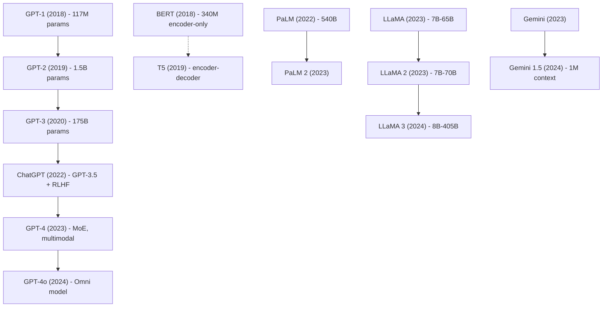
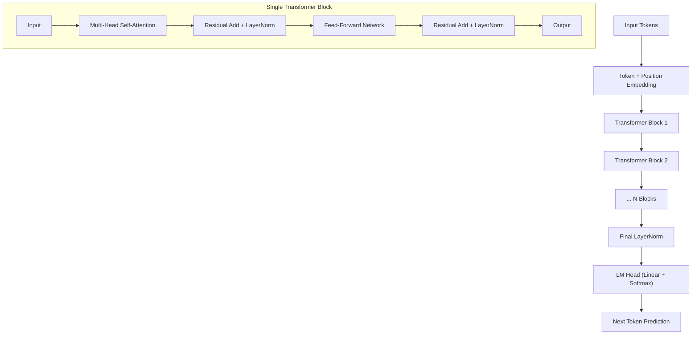

# Large Language Models (LLMs)

## Table of Contents
- [What is an LLM?](#what-is-an-llm)
- [Scaling Laws](#scaling-laws)
- [Emergent Abilities](#emergent-abilities)
- [Timeline of Major LLMs](#timeline-of-major-llms)
- [Key Capabilities](#key-capabilities)
- [Architecture Overview](#architecture-overview)
- [References](#references)

---

## What is an LLM?

A **Large Language Model (LLM)** is a deep neural network — typically a Transformer — trained on massive text corpora to predict the next token in a sequence. The "large" refers to both the **parameter count** (billions to trillions) and the **training data** (hundreds of billions to trillions of tokens).

At its core, an LLM models the conditional probability of the next token given all previous tokens:

$$P(x_t \mid x_1, x_2, \ldots, x_{t-1}; \theta)$$

where $\theta$ represents the model's learnable parameters. The training objective is to minimize the negative log-likelihood (cross-entropy loss):

$$\mathcal{L} = -\frac{1}{T} \sum_{t=1}^{T} \log P(x_t \mid x_{<t}; \theta)$$

Modern LLMs are **autoregressive** — they generate tokens one at a time, feeding each generated token back as input for the next prediction.

## Scaling Laws

### Chinchilla Scaling Laws

The landmark paper by Hoffmann et al. (2022) established that for a **fixed compute budget** $C$, the optimal model size $N$ and training data size $D$ should scale roughly equally:

$$N_{\text{opt}} \propto C^{0.5}, \quad D_{\text{opt}} \propto C^{0.5}$$

This means if you double your compute budget, you should roughly double both model parameters **and** training tokens.

### Kaplan Scaling Laws (OpenAI, 2020)

Earlier work by Kaplan et al. showed that model performance (loss) follows power laws:

$$L(N) \approx \left(\frac{N_c}{N}\right)^{\alpha_N}, \quad L(D) \approx \left(\frac{D_c}{D}\right)^{\alpha_D}, \quad L(C) \approx \left(\frac{C_c}{C}\right)^{\alpha_C}$$

where $\alpha_N \approx 0.076$, $\alpha_D \approx 0.095$, and $\alpha_C \approx 0.050$.

### Key Takeaway

Scaling laws suggest that **bigger models trained on more data perform predictably better**, and there is no sign of plateauing within current scales. This has driven the race toward ever-larger models.

## Emergent Abilities

**Emergence** refers to abilities that appear in larger models but are absent in smaller ones — a phase transition in capability.

| Ability | Description | Emerges Around |
|---------|-------------|----------------|
| Arithmetic | Multi-digit addition/subtraction | ~13B params |
| Chain-of-thought reasoning | Step-by-step problem solving | ~60-100B params |
| Code generation | Writing functional programs | ~6-13B params |
| Instruction following | Following complex multi-step instructions | ~10-60B params |
| Theory of mind | Modeling others' beliefs/intentions | ~100B+ params |

Wei et al. (2022) formally studied emergence, showing that on many benchmarks, model performance is near random until a critical scale is reached, then improves rapidly.

> **Debate:** Schaeffer et al. (2023) argue that emergence may be partly an artifact of metric choice — using continuous metrics (e.g., Brier score instead of accuracy) often shows smooth improvement without sharp transitions.

## Timeline of Major LLMs

### Detailed Timeline

| Year | Model | Parameters | Key Innovation |
|------|-------|------------|----------------|
| 2018 | GPT-1 | 117M | Generative pre-training + fine-tuning |
| 2018 | BERT | 340M | Bidirectional encoding, masked LM |
| 2019 | GPT-2 | 1.5B | Zero-shot task transfer |
| 2019 | T5 | 11B | Text-to-text framework |
| 2020 | GPT-3 | 175B | In-context learning, few-shot prompting |
| 2022 | PaLM | 540B | Pathways system, 6144 TPU chips |
| 2022 | ChatGPT | ~175B | RLHF alignment, conversational |
| 2023 | LLaMA | 7-65B | Open-weight, Chinchilla-optimal |
| 2023 | GPT-4 | ~1.8T (est.) | MoE, multimodal input |
| 2024 | LLaMA 3 | 8-405B | 128K context, open weights |
| 2024 | GPT-4o | - | Omni (text+vision+audio) |

## Key Capabilities

### In-Context Learning (ICL)
LLMs can perform tasks given only a few examples in the prompt — **no gradient updates**. This was first demonstrated at scale by GPT-3 and is hypothesized to work because the model implicitly performs gradient-descent-like updates in its forward pass (Akyürek et al., 2023).

### Instruction Following
After instruction tuning (SFT), models can follow complex, multi-step instructions: "Summarize this document in 3 bullet points, focusing on financial metrics, and write it in formal tone."

### Reasoning
With techniques like chain-of-thought (CoT) prompting, LLMs can solve multi-step reasoning problems in math, logic, and coding.

### Tool Use
LLMs can generate structured outputs (e.g., JSON, function calls) to invoke external tools — calculators, search engines, APIs — extending their capabilities beyond pure language.

### Multimodal Understanding
Modern LLMs (GPT-4V, Gemini) can process images, audio, and video alongside text, enabling tasks like visual question answering and document understanding.

## Architecture Overview

Modern LLMs are overwhelmingly based on the **decoder-only Transformer**:

The self-attention mechanism computes:

$$\text{Attention}(Q, K, V) = \text{softmax}\left(\frac{QK^T}{\sqrt{d_k}} + M\right)V$$

where $M$ is a causal mask ensuring tokens only attend to previous positions (autoregressive property).

## References

1. Vaswani et al., "Attention Is All You Need" (2017)
2. Radford et al., "Language Models are Unsupervised Multitask Learners" (GPT-2, 2019)
3. Brown et al., "Language Models are Few-Shot Learners" (GPT-3, 2020)
4. Hoffmann et al., "Training Compute-Optimal Large Language Models" (Chinchilla, 2022)
5. Wei et al., "Emergent Abilities of Large Language Models" (2022)
6. Touvron et al., "LLaMA: Open and Efficient Foundation Language Models" (2023)
7. OpenAI, "GPT-4 Technical Report" (2023)
