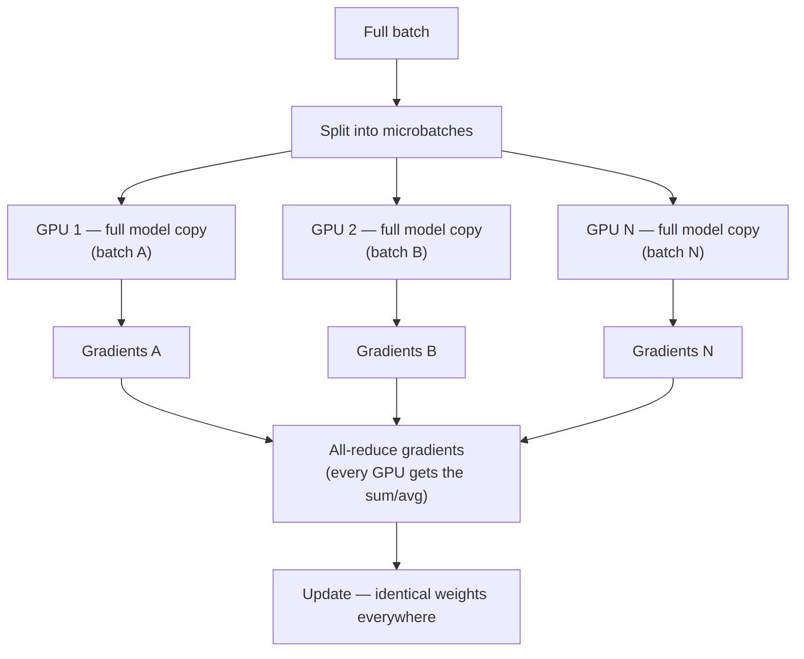
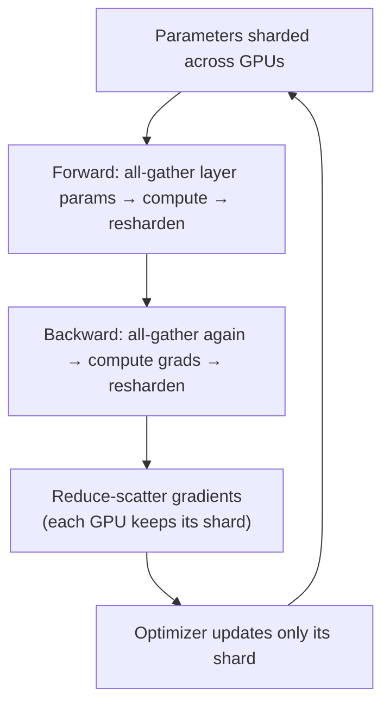
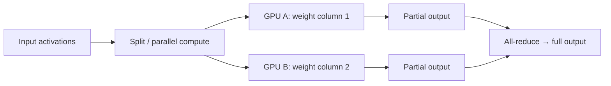
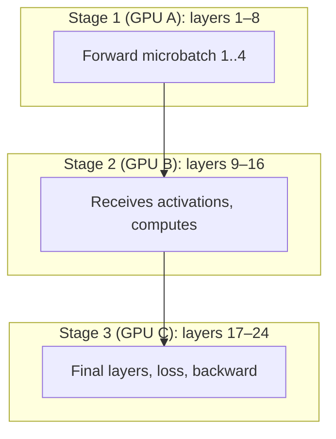

# Distributed Training

## Overview

Modern LLMs (7B–400B+ parameters) do not fit on one GPU — and even when they do, training on one device would take months. **Distributed training** spreads the workload across many GPUs/nodes using a combination of **parallelism strategies** and **memory-optimization techniques**.

This page covers the four core strategies — **data parallelism (DDP)**, **sharded data parallelism (ZeRO/FSDP)**, **tensor parallelism**, and **pipeline parallelism** — and how they combine for large-scale training.

## The Core Problem

A 70B-parameter model in **BF16** needs ~140 GB just for parameters; add gradients (+140 GB) and Adam optimizer states (+280 GB) and you need ~560 GB+ of GPU memory before a single batch. One H100 has 80 GB. The two levers:

1. **Parallelize compute** — split data, layers, or tensors across devices.
2. **Shard/offload memory** — don't keep full copies everywhere.

## Strategy 1: Data Parallelism (DDP)



- Every GPU has a **full copy** of the model and optimizer, processes a **different microbatch**, then **all-reduces** gradients.
- **Simple, scales well** for throughput (more GPUs → more data per step), but **memory is not reduced** — the model still must fit in one GPU.

## Strategy 2: Sharded Data Parallelism (ZeRO / FSDP)

**ZeRO (Zero Redundancy Optimizer, DeepSpeed, 2020)** and **PyTorch FSDP** shard what DDP duplicates:

| ZeRO stage | What is sharded | Memory saved |
|---|---|---|
| **1** | Optimizer states | ~4× optimizer memory |
| **2** | Optimizer states + gradients | ~8× |
| **3** | + Parameters (gathered on demand) | Scales with GPU count |

**FSDP** (Fully Sharded Data Parallel) is PyTorch's native implementation, roughly ZeRO-3: parameters, gradients, and optimizer states are **sharded across the DP mesh** and **all-gathered** only for the layers currently computing, then **resharded**.



- **Use FSDP/ZeRO-3 when the model barely doesn't fit** (e.g., 70B on 8×80 GB).
- **ZeRO-Infinity** adds CPU/NVMe offload for the largest experiments.
- Cost: **communication** — every forward/backward layer does an all-gather (mitigated by overlapped communication and sharding within a node on fast fabric).

## Strategy 3: Tensor Parallelism (TP)

Individual **layer weight matrices are split** across GPUs; the layer's forward/backward is computed collaboratively.



- **Megatron-LM's** signature technique: split attention heads and FFN columns across GPUs within a node (needs fast intra-node interconnect — NVLink).
- Very **communication-intensive** (synchronous collectives inside every layer) — TP is kept **within a node** (TP=8 on 8×H100), never across slow links.
- Essential when a single layer is too large for one GPU.

## Strategy 4: Pipeline Parallelism (PP)

**Different layers** live on different GPUs; microbatches flow through the pipeline.



- GPUs work **concurrently on different microbatches** (streaming), but there's an inherent **bubble** of idle time during pipeline fill/drain.
- **Interleaved/virtual pipeline scheduling** (e.g., `virtual_pipeline_model_parallel_size`) reduces the bubble at the cost of more communication.
- PP is used **across nodes** (unlike TP) because per-stage communication is only activations, not per-layer synchrony.

## Putting It Together: 3D Parallelism

Production large-model training (Megatron-Core, Megatron-DeepSpeed) combines all of them:

```text
        DP × TP × PP
        ├── TP within a node (fast NVLink)
        ├── PP across nodes (activation passing)
        └── DP across the remaining dimension (data throughput)
```

Example configs (Megatron-Core, 2026-era):

| Model | GPUs | TP | PP | DP | Notes |
|---|---|---|---|---|---|
| 70B | 64× H100 | 8 | 4 | 2 | TP inside node, PP across nodes |
| 405B | 256× H100 | 8 | 8 | 2 | + CP=2 for 32K+ sequences |

**Context parallelism (CP)** additionally splits the sequence dimension for long-context training; **expert parallelism (EP)** shards experts for MoE models (see [MoE](../../llm/moe/README.md)).

## Communication Primitives

| Collective | What it does | Where used |
|---|---|---|
| **All-reduce** | Sum/avg across ranks, result everywhere | DDP gradient sync |
| **All-gather** | Concatenate each rank's shard to everyone | FSDP forward/backward |
| **Reduce-scatter** | Reduce, then each rank keeps a slice | FSDP gradient sync |
| **Send/Recv (P2P)** | Direct rank-to-rank transfer | Pipeline stages |
| **All-to-all** | Every rank exchanges with every rank | Expert parallelism, MoE routing |

Backends: **NCCL** (NVIDIA GPUs), **GLOO** (CPU), **oneCCL** (Intel). Latency/bandwidth of the fabric (NVLink vs InfiniBand vs Ethernet) is the dominant performance constraint.

## Choosing a Strategy (decision guide)

| Model size / GPU VRAM | Strategy |
|---|---|
| Fits on one GPU | Plain training |
| < 7B on 40 GB | DDP or ZeRO-1 (throughput, no sharding needed) |
| 7–13B on 80 GB | FSDP2 / ZeRO-2 (+ gradient checkpointing) |
| 30–70B on 8×80 GB | FSDP2 / ZeRO-3 (shard everything) |
| 70B+ multi-node | Megatron-Core TP+PP (or ZeRO-3 + DP) |
| 400B+ | Megatron 3D + ZeRO-1, MoE → expert parallelism |

**Rule of thumb**: use **DP to raise throughput**, **sharding (FSDP/ZeRO) to fit memory**, **TP for layers too large for one GPU**, **PP for multi-node model-parallel scale**.

## Complementary Memory Techniques

- **Mixed precision (BF16/FP16 + FP8)** — halve/quarter memory (see [Quantization](../../llm/llm-serving/quantization.md)).
- **Gradient/activation checkpointing** — recompute activations in backward instead of storing them (trade compute for memory).
- **Optimizer memory reduction** — AdamW states dominate; ZeRO/FSDP shard them, offload to CPU (ZeRO-Offload), or use memory-efficient optimizers.
- **Gradient accumulation** — simulate large batches with small microbatches.

## Frameworks

| Framework | Strengths |
|---|---|
| **PyTorch DDP / FSDP2** | Native, easy; FSDP2 (PyTorch 2.6+) improves flexibility (`reshard_after_forward` control) |
| **DeepSpeed** | ZeRO stages 1–3, ZeRO-Infinity offload, MoE support, config-driven |
| **Megatron-LM / Megatron-Core** | Best-in-class TP, PP, sequence parallelism, FP8 via TransformerEngine, 3D parallelism |
| **Torchtitan, Nanotron, MaxText** | Research/TPU-focused training frameworks |
| **Colossal-AI** | 1D/2D/2.5D/3D parallelism, heterogeneous hardware |

## Interview Questions

### Q: What is the difference between data parallelism and model parallelism?

Data parallelism replicates the model on every GPU and splits the **data** (gradients are synchronized via all-reduce) — it scales throughput but doesn't reduce per-GPU memory. Model parallelism splits the **model** itself: tensor parallelism splits individual layers' weights across GPUs, pipeline parallelism splits layers across stages — both reduce per-GPU memory at the cost of communication/complexity.

### Q: What does FSDP shard and why?

FSDP shards parameters, gradients, and optimizer states across the data-parallel mesh (≈ ZeRO-3). For each layer, the parameters are all-gathered just-in-time for forward/backward, then resharded — so peak memory holds only the current layer's full weights, and the optimizer state is stored only as the per-rank shard. This lets models many times larger than a single GPU's memory train on a node of GPUs.

### Q: Why is tensor parallelism kept within a node?

TP performs synchronous all-reduce collectives **inside every layer** — the communication volume is proportional to activations × layers and happens on the critical path. Over a slow interconnect (Ethernet) this would dominate compute; over NVLink within a node it's acceptable. Pipeline parallelism (activation passing only between stages) is what crosses node boundaries.

### Q: What is the pipeline bubble and how do you reduce it?

With naive pipeline parallelism, GPUs idle while the pipeline fills/drains — the "bubble." Scheduling **multiple microbatches** keeps all stages busy, and **interleaved (virtual) pipeline stages** reduce the bubble size further by round-robin-scheduling layer chunks across stages (at the cost of more communication). Larger batch counts shrink the bubble relative to total work.

### Q: When would you choose DeepSpeed ZeRO-3 over FSDP?

Both are ≈ ZeRO-3 sharded data parallelism. Choose DeepSpeed when you need **ZeRO-Infinity** (CPU/NVMe offload for models that still don't fit), MoE training features, or a config-driven setup. Choose FSDP when you want native PyTorch with no extra dependency, simpler debugging, and tight framework integration. For the very largest frontier runs, Megatron-Core's TP+PP+DP combination is the production choice.

## References

- Rajbhandari et al., *ZeRO: Memory Optimizations Toward Training Trillion Parameter Models* (2020) — https://arxiv.org/abs/1910.02054
- Narayanan et al., *Efficient Large-Scale Language Model Training on GPU Clusters Using Megatron-LM* (2021) — https://arxiv.org/abs/2104.04473
- Shoeybi et al., *Megatron-LM: Training Multi-Billion Parameter Language Models Using Model Parallelism* (2020) — https://arxiv.org/abs/1909.08053
- PyTorch FSDP documentation — https://pytorch.org/tutorials/intermediate/FSDP_tutorial.html
- DeepSpeed documentation (ZeRO) — https://www.deepspeed.ai/docs/config-json/

## Related Topics

- [GPU Architecture](../../arch/parallelism/gpu.md) — SM, warps, memory hierarchy
- [MoE Architecture](../../llm/moe/README.md) — expert parallelism
- [Quantization](../../llm/llm-serving/quantization.md) — FP8/BF16 memory reduction
- [LLM Training Pipeline](./training-pipeline.md) — the overall pretraining flow
- [vLLM and Serving](../../llm/llm-serving/vllm.md) — how trained models are served
