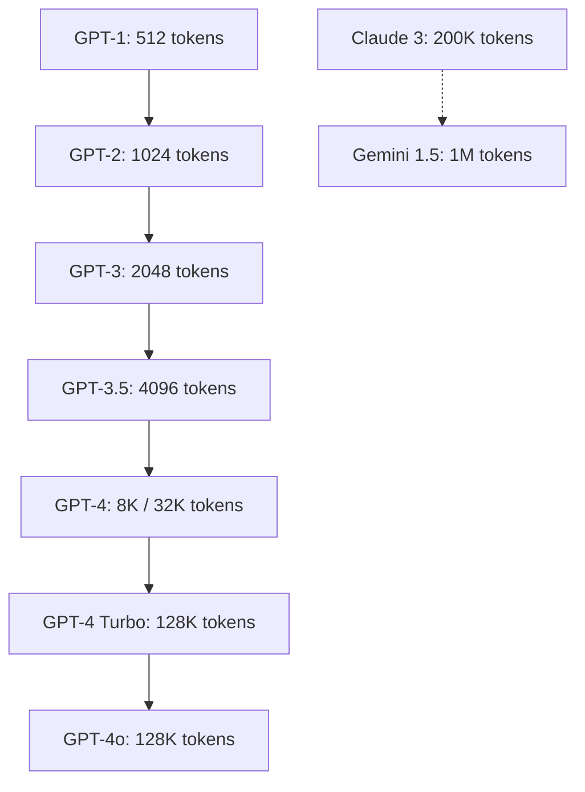
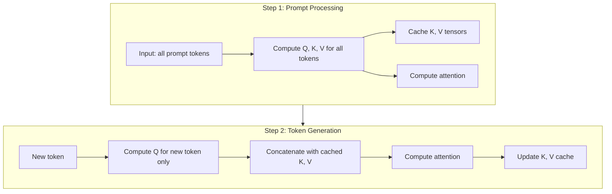
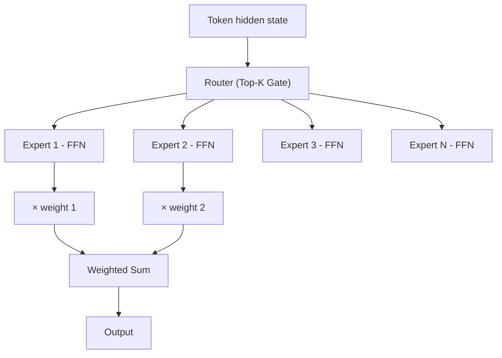

# GPT Architecture Deep Dive

## Table of Contents
- [GPT-2 Architecture](#gpt-2-architecture)
- [GPT-3 Architecture](#gpt-3-architecture)
- [GPT-4 Architecture](#gpt-4-architecture)
- [Context Windows](#context-windows)
- [KV Cache](#kv-cache)
- [Mixture of Experts (MoE)](#mixture-of-experts-moe)
- [PyTorch Implementation](#pytorch-implementation)
- [Interview Tips](#interview-tips)

---

## GPT-2 Architecture

GPT-2 (2019) was a scaled-up decoder-only Transformer that demonstrated zero-shot task transfer.

### Specifications

| Variant | Layers | Hidden Dim | Heads | Parameters | Context |
|---------|--------|------------|-------|------------|---------|
| Small | 12 | 768 | 12 | 117M | 1024 |
| Medium | 24 | 1024 | 16 | 345M | 1024 |
| Large | 36 | 1280 | 20 | 774M | 1024 |
| XL | 48 | 1600 | 25 | 1.5B | 1024 |

### Key Design Choices

1. **Pre-normalization (LayerNorm before attention):** Unlike the original Transformer which applies LayerNorm after the sublayer, GPT-2 applies it **before**:
   $$\text{output} = x + \text{Sublayer}(\text{LayerNorm}(x))$$
   This "Pre-LN" formulation stabilizes training for deep models.

2. **Learned positional embeddings:** GPT-2 uses learned absolute position embeddings instead of sinusoidal encodings.

3. **Modified initialization:** Weights of residual layers are scaled by $\frac{1}{\sqrt{N}}$ where $N$ is the number of residual layers, preventing activation magnitude from growing with depth.

4. **Byte-Pair Encoding (BPE) tokenizer** with a vocabulary of 50,257 tokens.

### Parameter Count Calculation

For a Transformer with $L$ layers, hidden dimension $d$, vocabulary size $V$, and context length $T$:

- **Embedding layer:** $V \times d + T \times d$ (token + position embeddings)
- **Per layer:**
  - Self-attention: $4d^2$ (Q, K, V projections + output projection) + $4d$ biases
  - FFN: $2 \times (4d \times d) = 8d^2$ (GPT-2 uses a 4x expansion in FFN) + $5d$ biases
  - LayerNorm: $4d$ (2 LayerNorms, each with weight + bias)
- **Total per layer:** $\approx 12d^2 + 13d$
- **Total model:** $L \times 12d^2 + V \times d + T \times d$

For GPT-2 XL: $48 \times 12 \times 1600^2 \approx 1.47B$ + embeddings $\approx 1.5B$ ✓

## GPT-3 Architecture

GPT-3 (2020) scaled the GPT-2 design to 175B parameters, demonstrating that in-context learning emerges at scale.

### Specifications

| Configuration | Layers | Hidden Dim | Heads | Parameters | Context |
|---------------|--------|------------|-------|------------|---------|
| Small | 12 | 768 | 12 | 125M | 2048 |
| Medium | 24 | 1024 | 16 | 350M | 2048 |
| Large | 24 | 1536 | 16 | 760M | 2048 |
| XL | 24 | 2048 | 32 | 1.3B | 2048 |
| 2.7B | 32 | 2560 | 32 | 2.7B | 2048 |
| 6.7B | 32 | 4096 | 32 | 6.7B | 2048 |
| 13B | 40 | 5140 | 40 | 13B | 2048 |
| **175B** | **96** | **12288** | **96** | **175B** | **2048** |

### Key Differences from GPT-2

1. **Alternating dense and sparse attention layers:** GPT-3 uses alternating dense and locally banded sparse attention (similar to Sparse Transformer) for efficiency.

2. **2048 context window** (doubled from GPT-2's 1024).

3. **No changes to the fundamental architecture** — it's essentially GPT-2 scaled up with more data and compute.

### Training

- **Data:** ~300B tokens (Common Crawl, WebText2, Books, Wikipedia)
- **Compute:** ~3640 PF-days on V100 GPUs
- **Batch size:** 3.2M tokens (gradually increased during training)
- **Optimizer:** Adam with $\beta_1 = 0.9$, $\beta_2 = 0.95$, $\epsilon = 10^{-8}$
- **Learning rate:** Cosine decay from $6 \times 10^{-5}$ to $6 \times 10^{-6}$

## GPT-4 Architecture

GPT-4 (2023) was not fully detailed publicly, but leaks and analysis suggest:

### Key Architectural Changes

1. **Mixture of Experts (MoE):** GPT-4 reportedly uses **8 experts** with ~220B parameters each, for a total of ~1.8T parameters. At inference, only 2 experts are active per token, so effective parameters per forward pass ≈ ~280B.

2. **Multimodal:** Accepts both text and image inputs (GPT-4V).

3. **Longer context:** Initially 8K, extended to 32K, then 128K for GPT-4 Turbo.

4. **Improved alignment:** Better RLHF and safety training.

### Estimated Architecture

```
Total parameters: ~1.8T (8 experts × ~220B each)
Active parameters per token: ~280B (2 experts active)
Context window: 8K → 128K
Training data: ~13T tokens
Training compute: ~2.15 × 10^25 FLOPs
```

## Context Windows

The context window determines how many tokens the model can process in a single forward pass.



### Why Context Length Matters

- **Longer context** → more information available for each prediction
- **Quadratic cost:** Self-attention is $O(n^2)$ in sequence length — doubling context quadruples compute
- Solutions: Sparse attention, linear attention, sliding window, RoPE scaling

### Positional Encoding and Context Extension

Modern LLMs use **Rotary Position Embeddings (RoPE)**:

$$\text{RoPE}(x, m) = x \cdot e^{im\theta}$$

where $m$ is the position and $\theta$ is a frequency parameter. RoPE naturally extends to longer sequences with techniques like:

- **NTK-aware scaling:** Adjust frequency base
- **YaRN (Yet another RoPE extensioN):** Combines NTK scaling with temperature adjustment
- **Position interpolation:** Linearly scale positions to fit the new context window

## KV Cache

During autoregressive generation, the **Key-Value (KV) cache** stores previously computed K and V tensors to avoid recomputation.

### How It Works

Without KV cache, generating $T$ tokens requires $O(T^2 \cdot d)$ computation. With KV cache:

- **Step 1:** Compute Q, K, V for all input tokens; cache K, V
- **Step 2+:** Compute Q for only the new token; concatenate cached K, V; compute attention



### KV Cache Memory

For a model with $L$ layers, hidden dim $d$, $H$ heads, context length $n$, and precision $b$ bytes:

$$\text{KV Cache Size} = 2 \times L \times n \times H \times d_H \times b$$

where $d_H = d/H$ is the head dimension.

For GPT-3 175B ($L=96$, $d=12288$, $H=96$, $d_H=128$):
- Per token: $2 \times 96 \times 96 \times 128 \times 2 \text{ bytes} = 4.7 \text{ MB}$ (FP16)
- 2048 context: $\approx 9.6 \text{ GB}$
- 128K context: $\approx 600 \text{ GB}$ → requires optimization (MQA, GQA)

### Multi-Query Attention (MQA) and Grouped-Query Attention (GQA)

To reduce KV cache size:

- **MQA:** All heads share a single K and V head → KV cache reduced by factor of $H$
- **GQA:** Groups of heads share K and V → tradeoff between MQA and MHA

| Method | KV Heads | Cache Size | Quality |
|--------|----------|------------|---------|
| MHA | $H$ | $2 \times L \times n \times H \times d_H$ | Best |
| GQA | $H/G$ | $2 \times L \times n \times (H/G) \times d_H$ | Good |
| MQA | 1 | $2 \times L \times n \times d_H$ | Slight degradation |

LLaMA 2 70B uses GQA with 8 KV heads (vs 64 Q heads).

## Mixture of Experts (MoE)

MoE layers replace the dense FFN with multiple "expert" FFNs, where only a subset is activated per token.

### Architecture



The router computes a sparse distribution over experts:

$$G(x) = \text{TopK}(\text{softmax}(W_g \cdot x))$$

$$y = \sum_{i \in \text{TopK}} G(x)_i \cdot E_i(x)$$

### Load Balancing

A critical challenge is **expert collapse** — where the router sends all tokens to a few experts. Solutions:

- **Auxiliary loss:** Add a load-balancing term to the training loss:
  $$\mathcal{L}_{\text{aux}} = \alpha \cdot N \sum_{i=1}^{N} f_i \cdot P_i$$
  where $f_i$ is the fraction of tokens assigned to expert $i$ and $P_i$ is the mean routing probability for expert $i$.

### Notable MoE Models

| Model | Total Params | Active Params | Experts | Top-K |
|-------|-------------|---------------|---------|-------|
| Switch Transformer | 1.6T | ~1.6B | 128 | 1 |
| Mixtral 8x7B | 46.7B | 12.9B | 8 | 2 |
| GPT-4 (est.) | 1.8T | ~280B | 8 | 2 |
| DeepSeek-V2 | 236B | 21B | 160 | 6 |

## PyTorch Implementation

### GPT-2 Style Transformer Block

```python
import torch
import torch.nn as nn
import torch.nn.functional as F
import math

class MultiHeadSelfAttention(nn.Module):
    def __init__(self, d_model: int, n_heads: int, max_seq_len: int):
        super().__init__()
        self.n_heads = n_heads
        self.d_head = d_model // n_heads
        self.d_model = d_model
        
        # Q, K, V, and output projections
        self.q_proj = nn.Linear(d_model, d_model)
        self.k_proj = nn.Linear(d_model, d_model)
        self.v_proj = nn.Linear(d_model, d_model)
        self.out_proj = nn.Linear(d_model, d_model)
        
        # Causal mask
        self.register_buffer(
            "causal_mask",
            torch.triu(torch.ones(max_seq_len, max_seq_len), diagonal=1).bool()
        )
    
    def forward(self, x, kv_cache=None):
        B, T, C = x.shape
        
        # Project to Q, K, V
        q = self.q_proj(x).view(B, T, self.n_heads, self.d_head).transpose(1, 2)
        k = self.k_proj(x).view(B, T, self.n_heads, self.d_head).transpose(1, 2)
        v = self.v_proj(x).view(B, T, self.n_heads, self.d_head).transpose(1, 2)
        
        # Handle KV cache
        if kv_cache is not None:
            cached_k, cached_v = kv_cache
            k = torch.cat([cached_k, k], dim=2)
            v = torch.cat([cached_v, v], dim=2)
        
        new_cache = (k, v)
        
        # Scaled dot-product attention
        scale = math.sqrt(self.d_head)
        attn_scores = torch.matmul(q, k.transpose(-2, -1)) / scale
        
        # Apply causal mask
        seq_len_k = k.size(2)
        attn_scores = attn_scores.masked_fill(
            self.causal_mask[:T, :seq_len_k].unsqueeze(0).unsqueeze(0),
            float('-inf')
        )
        
        attn_weights = F.softmax(attn_scores, dim=-1)
        attn_output = torch.matmul(attn_weights, v)
        
        # Reshape and project
        attn_output = attn_output.transpose(1, 2).contiguous().view(B, T, C)
        return self.out_proj(attn_output), new_cache


class FeedForward(nn.Module):
    def __init__(self, d_model: int, d_ff: int = None):
        super().__init__()
        d_ff = d_ff or 4 * d_model
        self.fc1 = nn.Linear(d_model, d_ff)
        self.fc2 = nn.Linear(d_ff, d_model)
        self.gelu = nn.GELU()
    
    def forward(self, x):
        return self.fc2(self.gelu(self.fc1(x)))


class TransformerBlock(nn.Module):
    def __init__(self, d_model: int, n_heads: int, max_seq_len: int):
        super().__init__()
        self.ln1 = nn.LayerNorm(d_model)
        self.attn = MultiHeadSelfAttention(d_model, n_heads, max_seq_len)
        self.ln2 = nn.LayerNorm(d_model)
        self.ffn = FeedForward(d_model)
    
    def forward(self, x, kv_cache=None):
        # Pre-LayerNorm (GPT-2 style)
        residual = x
        x_norm = self.ln1(x)
        attn_out, new_cache = self.attn(x_norm, kv_cache)
        x = residual + attn_out
        
        residual = x
        x = residual + self.ffn(self.ln2(x))
        return x, new_cache


class GPT2(nn.Module):
    def __init__(
        self,
        vocab_size: int = 50257,
        d_model: int = 768,
        n_layers: int = 12,
        n_heads: int = 12,
        max_seq_len: int = 1024,
    ):
        super().__init__()
        self.token_emb = nn.Embedding(vocab_size, d_model)
        self.pos_emb = nn.Embedding(max_seq_len, d_model)
        self.blocks = nn.ModuleList([
            TransformerBlock(d_model, n_heads, max_seq_len)
            for _ in range(n_layers)
        ])
        self.ln_final = nn.LayerNorm(d_model)
        self.lm_head = nn.Linear(d_model, vocab_size, bias=False)
        
        # Weight tying
        self.lm_head.weight = self.token_emb.weight
    
    def forward(self, input_ids, kv_caches=None):
        B, T = input_ids.shape
        device = input_ids.device
        
        # Token + position embeddings
        positions = torch.arange(T, device=device).unsqueeze(0)
        x = self.token_emb(input_ids) + self.pos_emb(positions)
        
        # Process through blocks
        new_caches = []
        for i, block in enumerate(self.blocks):
            cache = kv_caches[i] if kv_caches else None
            x, new_cache = block(x, cache)
            new_caches.append(new_cache)
        
        x = self.ln_final(x)
        logits = self.lm_head(x)
        return logits, new_caches
    
    @torch.no_grad()
    def generate(self, input_ids, max_new_tokens=100, temperature=1.0):
        """Autoregressive generation with KV cache."""
        self.eval()
        kv_caches = None
        
        for _ in range(max_new_tokens):
            # Use only the last token if we have KV cache
            if kv_caches is not None:
                input_ids = input_ids[:, -1:]
            
            logits, kv_caches = self.forward(input_ids, kv_caches)
            logits = logits[:, -1, :] / temperature
            
            probs = F.softmax(logits, dim=-1)
            next_token = torch.multinomial(probs, num_samples=1)
            input_ids = torch.cat([input_ids, next_token], dim=1)
        
        return input_ids


# Model size configurations
def gpt2_small():
    return GPT2(d_model=768, n_layers=12, n_heads=12)

def gpt2_medium():
    return GPT2(d_model=1024, n_layers=24, n_heads=16)

def gpt2_large():
    return GPT2(d_model=1280, n_layers=36, n_heads=20)

def gpt2_xl():
    return GPT2(d_model=1600, n_layers=48, n_heads=25)

# Count parameters
def count_params(model):
    return sum(p.numel() for p in model.parameters() if p.requires_grad)
```

## Interview Tips

1. **"Why Pre-LN instead of Post-LN?"** — Pre-LN stabilizes gradients in deep models. With Post-LN, gradient magnitude grows with depth, requiring careful learning rate warmup. Pre-LN allows stable training without warmup.

2. **"What is weight tying?"** — Sharing the embedding and output projection matrices reduces parameters and often improves performance, since the task is symmetric (mapping tokens to/from the same vocabulary space).

3. **"Why does MoE help?"** — MoE increases model capacity (total parameters) while keeping per-token compute constant. This allows scaling knowledge without proportionally scaling inference cost.

4. **"Explain KV cache memory vs compute tradeoff."** — KV cache trades memory for compute — storing past K/V tensors avoids recomputing them, reducing generation from $O(n^2)$ to $O(n)$ per token, but requires $O(n \cdot L \cdot d)$ memory.
